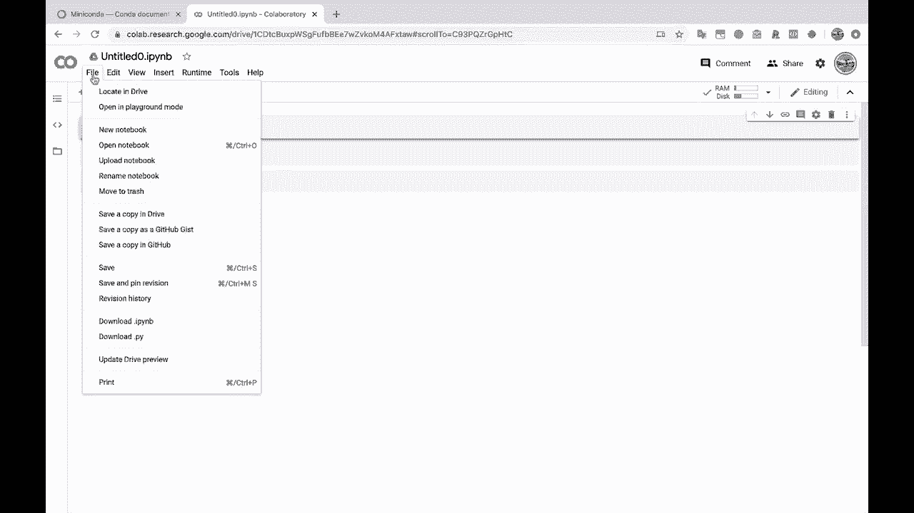

# 【双语字幕+资料下载】绘图必备Matplotlib，Python数据可视化工具包！150分钟超详细教程，从此轻松驾驭图表！＜实战教程系列＞ - P3：3）使用 conda 虚拟环境（或 Google Colab）设置我们的 Python 环境 - ShowMeAI - BV14g411F7f9

this。Now we get to the part where we need to set up our Python environment。 We need Python。 We need mappl Lib。 In this case， we're going to need pandas to read in the data。And we're going to need Jupiter for our Jupiter notebooks here。So there are two different options。 Number one， I'm going to be creating a Conda virtual environment using the Conda creates。

Command here， if you want to go this route as well。 then I suggest if you don't already have miniconda or Ananaconda installed。Go over here to the mini condoda page。Conda is a virtual environment manager and installer for Python。 so we are going to use Conda to manage our virtual environments and if you don't know what virtual environments are feel free to do a little bit of research there。

 but essentially it's just it's a best practice for wrapping up our python coding environment into a single directory so that we don't you know screw up our computer and etc cetera。 And so we don't have conflicting packages as well when we try to install things。

 So if you want to go this route， install mini Conda and we will install everything that we need into a folder and you know it just takes a second here。If you don't have Python on your machine and you don't want to go through this installation process。

 which I do recommend if you're interested in data science or data analysis， you know。 having Python on your computer is very helpful so that you can actually run some Python and stuff。

But。But you can also go to Google coab， coab。 So coab。These are essentially Jupiter notebooks。Run by Google in the cloud here through your browser。 So with these。 you would not have to install anything。 You can just come here to coabab。 You can create new notebook。

This is going to create a notebook for you。 And it's going to have everything that you need installed。 So it's going have。Maapplot Lib。It's going to have。Pandndas， etc cetera。 So if you want a nice。 easy way to get started here， you can just go to coabab and use a notebook in the cloud。 So that's pretty cool。 I'm gonna go ahead and move this to the trashca I'm gonna be doing this on Jupyter notebooks on my computer。

😊。

Leave this site。 All right， we got this miniconda here。 So let's come over here to Conda create。 And I'm going to create a new virtual environment。 I'm going to call it Matpl Lib tutorial。😊。

And so that's this dash in flag here is the name， the name of the virtual environment we're creating。 the Conda virtual environment。And now I'm going to install the Python packages， Jupiter。Matt plot。 let's go and full screen this。 Why don't we。Mat plot， Lib， pandas， numpy。 I think that that should be it。And if we click run here。This is going to spin for just a second。

 It's going to look。At it's going to look at all these packages that we're trying to install。 figure out if we can install them。 And then we will hit the letter Y right here。 So this is going to tell us everything that Conda needs to install in order to install the four different packages that we want to install in this virtual environment。 So I type a little Y for yes， hit enter。This is going to download and extract these packages。

And we will give it just a minute to finish。Perfect。 so we've just created a Conda virtual environment called Matplotlib tutorial。 everything finished installing just fine。 So a one way to see which virtual environment you're using。 or rather which version of Python you're using is if you're in a terminal here on Linux or Mac O。

 this command is gonna to be a little bit different on Windows。 I believe it's called where if you're in CMD， the command command prompt in Powerhell。 it might be a little bit different like where do EX E or something like that。 But so you type which Python。😊，And this is going to show you if I were to run Python right now。

 So I run Python。 This is the executable that's getting called when I run Python。 So Ananaconda 3。 bin， Python。

And you'll notice that this is Python 3。7。3， et cetera， et cetera。I have access to all of the packages that are installed in my base。Python installation through Anaconda。 Now， if I exit out。And iconconda activate。Mat plot Lib tutorial， just like it says to do up here to activate the environment。

You'll notice that this changes over here on the left to show us that we're in a different environment now。 and your terminal might not have that。 That's okay。 I have the terminal Z， S H Zish。 which does some fancy stuff like this for me。 But that's fine if yours does not。 Now I type which Python。And you'll notice that we point to a different location。

 So Anaconda 3 ins mapplotlib tutorial bin Python。 This shows that we are now inside of our wrapped up virtual environment。 and we only have access to the packages that we explicitly said we wanted to install in addition to the standard Python packages。

 So I type Python here， you'll notice that we're actually running a different version of Python in here。 3。8。3， because Conda， whenever you create a new virtual environment。 I think it just pulls the latest version of Python， the latest stable version。So we're actually running a newer version of Python。If I import pandas。

 we installed that so pandas can import just fine， but we did not install。Cborn。 which is another data visualization library。 So Cborn is installed in my base installation。 but it's not installed in my virtual environment because we are using a totally separate Python installation。 We're using totally separate packages here。

Alright。