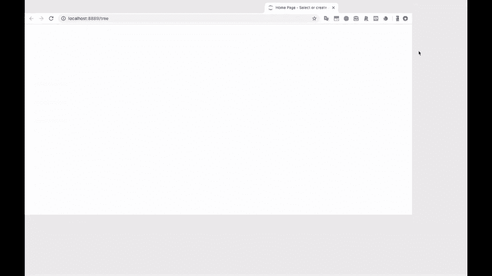
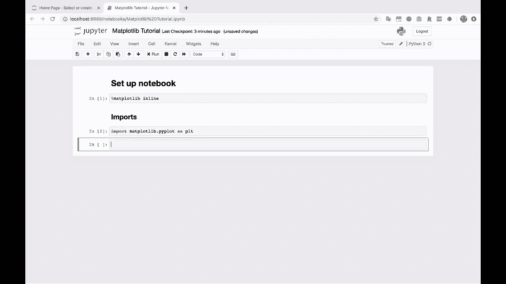

# 【双语字幕+资料下载】绘图必备Matplotlib，Python数据可视化工具包！150分钟超详细教程，从此轻松驾驭图表！＜实战教程系列＞ - P4：4）启动 Jupyter notebook 并设置我们的 notebook - ShowMeAI - BV14g411F7f9

So what I'm going to do now is I'm in my Maplot Lib tutorial folder。 I'm going to run Jupiter notebook， and， and we're going to do the rest of this Maplotlib tutorial。

Inside of our Jupiter notebook here。 So let's go ahead and close out of this other Chrome window。

So this is our Jupyter notebook interface。 I'm going to， to open up a new Python 3。Newebook。Let's name it Maplot Lib tutorial up here。And we are good to go。 The first thing we're going to do here is I'm going to create a mark down cell by typing the letter M。 And I'm going get into here and make a header1。 And I'm going to say， set up notebook。😊。

So the first thing that I like to do in a notebook。 whenever I'm doing data visualization using Mapl Lib is you do this。Percent sign， mappl Lib。Inline。So。We don't have to spend too much time on this right here。 but essentially there are different ways that you can run data visualization in Maplotlib。

 and in Jupiter notebooks， Mapllootlib in line is going to be one of your most popular。 most common choices。 I would just set this up， put it as one of the first cells in the notebook and then kind of forget about it。So let's， let's let's get closer to diving into some actual data visualization here because the thing about mapplot Lib。That you will very quickly learn。There is so much power that it can be overwhelming and there are so many options that it can be extremely overwhelming。

I'm going to try to start you off with some of the simplest stuff that we can do。 And then we're going to add on complexity there， but I definitely want you to。Limit the number of things you're thinking about originally。 So let's go ahead and get started。 So import matpllib do Pipl。 And this is the main plotting submodule here that we're going to use。

 Matpl Lib has various other submods， which you can see by typing tab by hitting the tab key。 And then you can see all of these different submods that Matpllib has。 there's a ton of stuff here。 But anyways， Pi plot。And then we import it as PLT。And this is going to be the way that you're pretty much always going to import mat plot Lib here。

 So let's go ahead and。