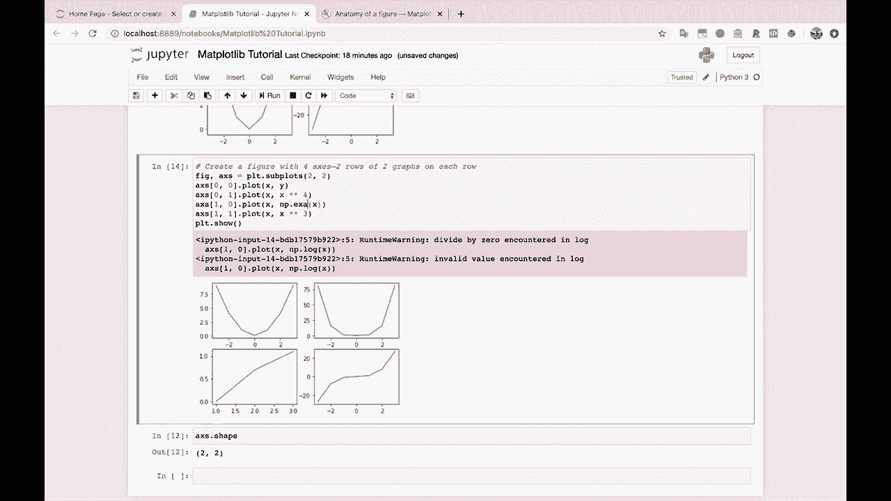

# 【双语字幕+资料下载】绘图必备Matplotlib，Python数据可视化工具包！150分钟超详细教程，从此轻松驾驭图表！＜实战教程系列＞ - P5：5）Matplotlib 图形的组成部分 - ShowMeAI - BV14g411F7f9

Run this。 Now， I'm going to create a new markdown cell here with a new heading 1。 and I'm going to say section number one。Pieces of a matte plot lib。Graph。To start off with。 I want to be nice and explicit here that we， so that we see exactly what we're plotting。 So I'm going to say x， let's just create some data to plot。 So I'm going to say x equals。

 and I'm going to create a list here。 negative 3， negative 2， negative 1，0，1，2，3。 We could also do this with a range function in Python。 That's totally fine。 And I'm going to import。😊，Numpy as in P while we're at it， because matpl Lib usually expects a nuy array and a nuy array。 if you haven't worked with nuumpy much before。Is， you know。

 you can basically think about it like a list or a matrix。 So you can have a one dimensional array。 which is just a list， or you can have a two dimensional array。 which is more like a matrix with rows and columns。 and you can have three dimensional arrays and things like that so。

I'm going to create x equals in P dot array， negative 3 up to positive 3。And now， let's， for our why。Let's create x squared。 So we're just going to do a simple。X and y squared thing here。 So if we look at x， we have our array， negative 3 up to positive 3。 And if we look at y， well。 we just squared every single number here。 So 9，4，1，0，1，4，9， etc ceter。

So to create a plot in Mapllootlib。This is the basic formula that I am going to recommend。 You always use when your when you're starting out， there are other ways to do it。 but we're not going to talk about those right now。 We're just going to give you。 I'm going to give you a formula。That you can use to plot。

 And I recommend that you always do it this way for now。 So to start off with。You're going to say fig and x equals PLT。 subplots。And then you're going to do all of your plotting code here。 So do your plotting code here。You know dot dot dot， so this is where you're actually going to say what you want to plot。

 And at the very end， do PLT dot show。

So this is the formula。 This is your your plotting formula here。 So I'm to even create a little section 3 header down here and say your。Plodding formula。

All right。So what we're going to do is we're going to say fig x， and this stands for figure and as。 aes， not ais， but aes。 this is kind of a confusing thing we'll talk about in just a minute。 Fig x equals PLT subplots。We'll do PlT。how and now our plotting。A code that we're going to do first is just x dot plot， X and y。

And here we go。 Our first mapte plot Lib graph。 beautifuliful， isn't it。 It's actually kind of a little choppy。 It's actually， you know， kind of ugly。 But with this just a little bit of code here， we're able to produce graphs。 And this is pretty cool。 And from here， we're going to add on complexity layer by layer。😊。

But this is the foundation of plotting and mapplotlib。 You always instantiate your figure and your axes。 You always want to end it with Plt。 show unless you're saving out saving out a file rather than displaying it here。 And then in the middle， this is where you're gonna to do all your plotting。 And you can have。

 you know， you could have one line here to plot this or you you could have 100 lines to do all kinds of crazy formatting。So this is a good place to tell you， what do these terms actually mean， And to do that。 we're going to go to the handy dandy， Matt plot Lib。

Parts of a figure。Anatomy of a figure。 Let's see。 Here we go。 This is exactly what I wanted to look at。

So this is what a matte plot lib。Graph is or a map plotlib figure。 And if you understand what it is。 this is going to help you with plotting。So let's talk about the main pieces here。The figure。 the figure。 So you know， it this circle here pointing to just what looks like a blank patch of nothingness。That's because the figure， the maplalib figure is this whole graph。

 So it doesn't matter how complex your graph is。 It doesn't matter how many different lines you have in here and how many different points。 And you can have， you can actually have lots of little different graphs in here as well。 The whole thing is called the figure。Now， within a figure， you'll notice right beside it here， aes。 A X， E， aes。This is。What we might think of as being the graph itself。

 So the figure is where you're going to put all of your graphs。And then the a Cs。Is going to be kind of the plot itself with an X axis and a y axis and some lines and some points and all this kind of stuff。

To make this a little bit more clear。Let's come back over here。And I'm going to show you now。What it looks like to have a single figure。A single figure with two axes。 So subpls。And in this case。 I am going to do one row。Of two columns of axes。And I'll explain this in just a second。But。

Here we go。So， now。We have a single figure。 Now， a figure being just like this image here。 You see how I can kind of click and drag that image。 So this is like a single image file that you could download here。 That whole thing is your figure。Now， your axes， A X， E， S。This is going to be this plot。 So this plot right here is one axes。

This plot over here is another axes。 So we have two axes。 and this is what I created here。 I created one， which is the number of rows of axes that I wanted。And two。 which is the number of columns of axes that I wanted。And then I took each one of those axes。 and I plotted on it。And this is why， up here。

We had one axes。And we plotted on that single axes。X and y。 So x versus y， negative 3， negative 2。 negative 1。 That's your x。 and then 0。

Up to0，1，4，9， et cetera。 that's your y。

So down here， we have a single figure still， but now we have two axes。All right。Now。 within each a Cs with an ES， and this is very confusing。 they probably could have done a better job naming things here。

You have your ex axis。And your y axis。 So this might be what we typically think of as an axis。And then for each access there， you can have an access label。 you have access tick marks。You have grid lines on that axis。And then same thing for your Y axis up here。 And then you have your actual plots so you can have a line plot。

 You can have markers for like a scatter plot。So in our case， over here。

We have。X ses1， which has its own X axis and its own y axis。 And maybe to make this clear。 let's plot x cubed on the second one here。So x cubed is now going to be in this axes over here。So you see that each one has its own x axis， x axis and its own y axis。Each one has its own lines。 its own line objects in here。And this is all wrapped up in a single figure。 Alright。

 so I hope that that's helpful。 We create。 first off， we create the figure。And we create the axes。 and then we plot things on the axes themselves， and then finally， whenever we're done。 getting all of our stuff to plot， we show it， we show the graph。Okay， so hopefully。 this is somewhat clear for you， at least I think that people honestly use Matplotlib for years without ever looking at this figure here and seeing what all the different pieces are。

 So remember that the graph， the whole thing is called a figure within each figure。 you can have multiple axes which are where you actually do the graphing。

Each one of those axes has an x axis and a y axis， and then that's where you're going to do your line plots。 your scatter plots with your markers， etc and just to really， really drive this home。

So。I'm going to copy this down here， and instead of making a one by two grid of subplots。I'm going to make a two by two grid of subplots。 And let's just plot this。 Let's show this before we do any plotting on the axes themselves。 So I'm going to create a comment here and just see say， create a figure。With four axes。嗯。2。

Let's see。 Two rows of two graphs。On each。Ro。

And here we go。 You'll see that we have a single figure。 So if I want to drag this， you know。 you see that that's kind of just like a single image there。And we have four different axes。 We have a two by two grid of axes。 Each one of those axes has its own x axis and its own y axis。 and we can plot whatever we want。On these axes。 and this object。

 the AX S that it returns in this case， since we have a two by2 grid is actually also going to be a2 by2 nuy array for us to plot on So to plots。 I'm going to use kind of two dimensional indexing in here。 to show you how we。

Can plot things on these graphs。 So I'm plotting things on the the zeroth row， the zeroth column。 So this one， and then the first row and the first column， this one over here。We could also plot things on。0，1。And。1，0。 And I'm doing all of this， by the way。So let's。 let's maybe do an x to the fourth。 And what do you think like a。

 like a log of x or something like that。 Let's， let's try this。 Okay， we。 we got to divide by 0 in the log。

Let's do it。 Let's do an exponential。 Maybe here we go。

So you see， we've got four different graphs now。In four different axes。 and they're all inside of a single figure。So。Everything inside of a single。Figure。Alright。 so the reason why I'm really， I'm really trying to drive this home right now is because everything else。 everything else that you do in Mattpl Lib。Is going to rely on you understanding these axes objects and the fact that you're plotting on these axes objects。

If you want to plot。Some， you know， two images side by side。Well。 you now understand that these are two different axes on a single figure。If you want to plot two different graphs。On the same axes， well， now， you know。 even though we haven't done this yet， you might be thinking to yourself， okay。

 I know I'm going to use that same axes to do that plotting。 And this is something that we're actually going to get to in just a minute。So before we move on。 I want to show you one last thing while we're here。 And that's。 that's the fact that you might notice that these graphs are pretty choppy， right， You're like， oh。

 well， this doesn't look like a very pretty parabola。 It's kind of choppy or all the graphs going to be this ugly。 And the answer is， no。 the answer is that the graphs are choppy because these are the only points we gave to plot to matpl lib。To， to plot。So to make this to make this very clear。

 I'm going to introduce something that we haven't looked at yet。And that is the scatter plot。 That's the scatter plot。So with the scatter plot， you can really see it now that we have only defined x and y points。 Remember， we've only defined x and y points x。And y 4，7 data points total。 So we've got3 in the negative。 We have 0， and then we have  three in the positive。

So that's why we have so few data points。 And then when you connect these points with a line。

Well， then you end up getting a kind of choppy looking graph here。 So to show that。 let's see what it would take to create a smooth line and to create a smooth line。 I'm going to use the nuy。

The nuy method or the the object here， a range。 and if you've never used a range。 you can use one of my favorite Python tricks， the question mark here to get the documentation。

So N P dot a range， here's the do， here's the dock string。 You give it a start， You give it a stop。 and you give it a step， and then it returns。

Evenly spaced values within a given interval。

So the start number， the stop number。And then the spacing between values。 So let's， for example。Create a range from negative 5 to 5。 And let's space them out by 0。01。 And if I run this。 you will see boom， wow， tons of values。 That is a lot of values。 How many values is that。

Well， that is 1000 values。 perfect。 So let's create this as our X instead。And now let's do the same thing that we did before。 Y equals x squared。

Now。If we plot。

X versus y， like we did before。Now， you see， we have a very smooth graph。 And why is that， Well。 that's because。

That is because， if we plot。

The scatter plot， again of x versus Y。 you see each one of these is a point。 So we now have 1000 data points here defining this graph rather than a measly7。

This can be something that confuses people whenever they first start using Mat plot Lib。 You know。 they're like， hey， why does my graph look the way that it does。 And well， it's because of this。 It's because of how many points。You passed a map plotlib asking it to plot。 So in this case。 we're only passing 7 points。 In this case， we're passing 1000 points。

 And we get this really beautiful graph here。 Actually， I'll show you。😊。

Let me show you。Let's create a why。Let's create a Y damped。Damped ocillation， I spell oscillation。 I think that is ocill。Leicn。You always forget your spelling and things like this。 dampamped oscillation。 So I'm just doing this because it's fun and it's pretty。 So I'm going to show you really quickly what a nice。😊，Pretty graph looks like。

So we do the E to the negative x times cosine of the N dot pi， whatever。 You don't have to know any of this。 By the way， this is just for fun。So we greater our y。 Now let's do fig Ax equals Pl T dot subplots。Let's do AX dot Plate。X versus Y， damped oscillation。PL D dot show。And look at that， Isn't that pretty， Isn't that nice。

 And we have 1000 data points here that are helping to show this graph。 which is why it looks so nice and smooth。😊。

All right。 that's enough of the introduction。 I think。 I hope that you have gotten a better sense of the pieces of a map plot Lib graph。 I'm going to copy this under the section header。

Just as a nice little reference， let's save our Jupiter notebook， and let's move on。