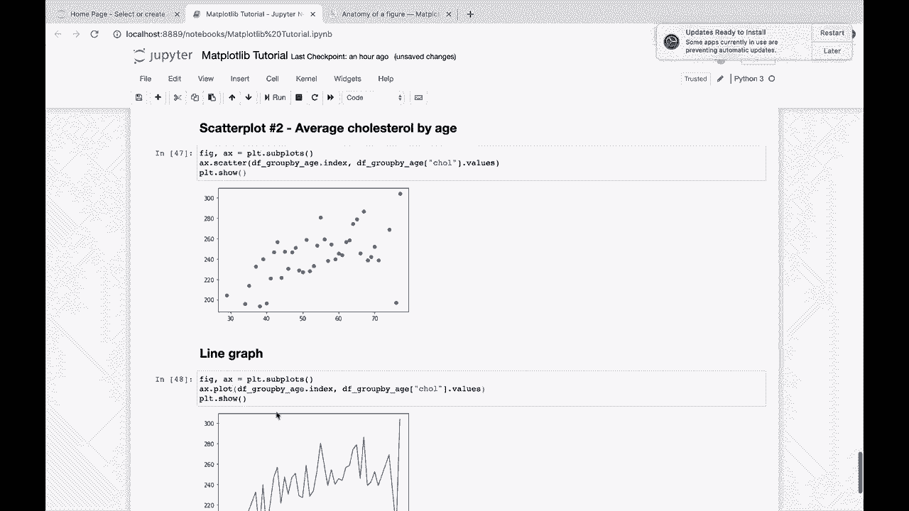

# 【双语字幕+资料下载】绘图必备Matplotlib，Python数据可视化工具包！150分钟超详细教程，从此轻松驾驭图表！＜实战教程系列＞ - P6：6）Matplotlib中的基本图形 - ShowMeAI - BV14g411F7f9

我将在Markdown中创建一个章节标题。我将称之为章节号。我想现在是章节号2，不是吗？章节号2。基本图形，好的。那么让我们做一些你可能想在这里使用的基本图形。实际上，你知道吗，我们还没有开始使用我们的心脏病数据，对吧。

所以让我们实际上向上滚动到顶部。

我将在这里创建另一个标题，称之为加载我们的数据。好的，我们将使用pandas加载数据。如果你以前没有使用过pandas，如果你没有见过项目数据科学，Padas mega教程，那将向你介绍几乎所有你需要知道的关于pandas的内容。

所以我强烈建议你在某个时候观看。但让我们继续导入pandas为PD D。我们将使用pandas加载数据。所以让我们输入LS，它非常方便，Jupyter笔记本将其转换为shell命令，或者在这里使用shell命令。

它列出了当前目录中的文件。因此，我们看到我们的心脏病U I数据集。接下来，我将加载这个P D点读取CSV。放入数据框中。现在让我们读取它。如果我们查看DF.head，这将给我们数据中的前五行，因此我们看到我们的年龄性别。

我们有一个名为CP的列，ettera，et cea，et cea。然后目标是这个人是否患有心脏病。

如果我们查看DF点形状，这将告诉我们有多少行和多少列。如果我们查看DF点描述。

Df点，描述。这将告诉我们每列的一些描述性统计。例如，这个数据集的平均年龄是54岁。如果我们查看目标，平均值。

心脏病的患病率约为54%。因此，这个数据集中的大多数人确实患有心脏病。

最后，如果我们查看DF点信息，这将告诉我们非空行的数量。因此在这种情况下，我们有303行。看起来我们所有的列都没有任何空值，且所有列都是数值数据类型。其中一列是浮点型，其他都是。

这里是ints，整数。好的，所以我们已经加载了数据。我们现在准备开始使用这些数据进行绘图。因此我们回到我们的章节号2，章节2，基本图形。让我们开始。

从散点图开始，我们先看一个散点图。如果我们查看我们的数据框。也许我们想看看这两列之间的散点图。那么也许我们会感兴趣。年龄与胆固醇水平之间是否存在关系。

所以这是我们想要回答的问题。所以我会在这里输入。年龄与胆固醇之间是否存在关系。胆固醇水平。所以如果我们查看这里的 DF 年龄。这将返回一个 pandas 系列。我们有一堆值。我们可以将其转换为在绘制 mapplotlib 中使用的 numpy 数组。实际上。

我认为 mapplotlib 也可以接受 pandas 系列。但是，你知道，先转换成 numpy 数组总是没错的。然后让我们看看这里的前 10 个值。我们 numpy 数组的前 10 个值。我们还来看一下胆固醇。看一下胆固醇。前 10 个值。好的。

所以我们想要制作一个散点图，遵循我在上面告诉你的公式。绘制 mat plototlib 的公式。让我们做 fig，x 轴 = PL T 点 subplots。我们将做 AX 点。我们一直在做 AX 点 plot。但我们要做的只是将其更改为 AX 点 scatter。所以我们现在将做一个散点图，而不是线图。

然后我们将传入我们想要的 x。x 将是年龄。然后我们将传入我们想要的 y。所以 y 将是我们的胆固醇。最后，P，L T 点 show。

好了。这是我们年龄与胆固醇的散点图。一眼看去，似乎没有太强的关系。这里可能有微弱的正相关。但是没有什么会让我们惊讶的。所以我们可能会感兴趣的并不是。我们数据集中所有的数据点。

也许我们对按年龄计算的平均值感兴趣。这实际上也会给我们更少的点可以使用。所以我要创建一个数据框。

这是按年龄分组的。所以，基本上，我们要做的就是。Df。点分组。我们将按年龄分组。然后取所有其他值的平均值。如果我这样做，你知道，我在 pandas 教程视频中有更详细的解释。但基本上，这里的事情是我们按年龄对所有数据进行分组。

然后，你知道，对于，假设40岁的人。让我们看看，或许对于像45岁的人。我们将有10个不同的数据点。所以我们将取这10个数据点的平均值来获得每一个值。因此这个胆固醇值，而不是一个单独个体的胆固醇。现在将是所有45岁人的平均胆固醇。

所以让我们来获取这个组！

我们将其设为按年龄分组的DF。我们就叫它，这样我们就可以使用它。然后如果我们再次查看这些数据并问自己，好的。

现在我们想绘制年龄与胆固醇的关系。我们的年龄现在是左侧的索引。这是pandas数据框的一个特殊功能。然后我们的胆固醇仍然只是一个列。所以如果我们查看按年龄分组的DF，这里是我们所有的年龄。这将是我们的新X。

如果我们查看按年龄分组的DF胆固醇。

点。值，我们将只查看其中的前10个。

好吧，也许我们可以查看索引的前10个。好的。那么让我们创建第二个散点图。

所以我们会说散点图编号2。平均。😔。

按年龄分组的胆固醇。好的。因此我们可以使用完全相同的散点图公式。我们将把它放在这里。现在，代替DF，我们将有按年龄分组的DF。按年龄分组的DF，而不是调用年龄列。

对于这一点，我们将传入索引和这个数据框。

调用将保持不变。所以让我们绘制这个，看看，给你。所以现在我们每个年龄只有一个数据点。我们得到的东西实际上看起来更像是一个正相关。因此，这就是散点图的要点，A X点散点。

我们将随着进展深入探讨所有这些图表。但我们从基本问题开始，如何绘制一些基本图表。所以首先是散点图。

现在，让我们谈谈折线图。如果我们想要在这里绘制相同的图。但不是绘制散点图，而是想连接这些点。我们想绘制类似于上面y=x²的折线图。

好吧，我们可以在这里复制这个。并且不再是A X点散点。

我们之前做过，A X dot plot。

到底是否合理以这种方式表示数据，你知道，这是你自己的判断，但。绘制线图时，你只需调用AX dot plot。好的，那么我们继续。我们做一个柱状图。如果你想把这个绘制成柱状图，许多东西看起来非常适合做柱状图。

在柱状图中，很容易区分不同类别之间的关系。所以这是一种非常常见的图表，我们在Matplotlib中如何做到这一点？再一次，先复制我们绘图的公式。创建图形，使用PL T dot subplots创建轴。现在，而不是A X dot plot。

我们只需调用A X dot bar。因此，你可以看到通过更改我们在轴对象上调用的方法，我们正在改变图的类型。我们在这里有我们的轴，想要绘制某些内容。然后要实际绘制某些东西，我们必须在其上调用某种方法。要绘制散点图，你调用dot scatter。要绘制线图，只需调用dot plot。

顺便说一下，点图更强大。实际上，你对每种方法都有很多不同的选择，但我们现在只是走过基本方法。然后对于柱状图，你只需调用dot bar，而你这里的第一个值将始终是x。

而你的第二个值将是y。

这在水平柱状图中会稍有变化，我们接下来要做这个。所以让我们做一个，做一个水平的。

这里的柱状图，所以， вместо调用。Bar，现在我们调用bar。

H，所以我们称之为bar H。现在这有点混淆。你要传入的第一个参数，知道吗？这里调用的方式是完全相同的。但现在你传入的第一个参数技术上是Y轴，第二个参数是X轴。

现在你可能在想，好的，嘿，我怎么知道可以在这个轴对象上调用多少种方法。如果你去新单元格。

我相信我们仍然有来自前一个单元的A X对象。如果我们做A X，输入dot，然后按tab。这将显示我们可以在轴对象上调用的所有不同属性和方法。你会看到实际上有很多。因此，这里是bar。这里是bar H。

你可以看到我们这里有一个箱线图。你可以看到我们有各种处理标签和缩放的选项。😊我们这里有误差条。所以你有各种不同的东西，这部分我就是在浏览这个庞大的列表。这部分是我在开始视频时提到的，matplotlib可能会让人感到不知所措。

有这么多选项，因为你可以调整这个图表，让它看起来像你想要的那样。所以这里有很多选项。这就是为什么我们开始得很简单。随着我们继续增加复杂性。视频结束后仍然有很多要学习的东西。所以，这完全是关于你想要图表看起来怎样。

那么你如何让Matplotlib做到这一点呢？让我们继续简单类型的图表。这是我们最后一个图，直方图，对于直方图，你只需要一个变量。所以你知道，直方图将你的数据分成不同的箱子，然后显示你的数据行有多少落入每个箱子。所以在这种情况下，也许我们想看看。让我们去复制我们的。

我们这里的绘图公式。也许我们想查看我们的年龄分布。那么我们的数据中有多少人落入哪个年龄范围。所以在这种情况下。我们只需调用Ax.dot.hist。这里的.dot hist是我们要调用的直方图方法。

顺便说一下，如果我们想查看那个。

如果我们想查看它的文档，我们只需在后面加上问号。我们运行那个单元。然后你会看到，好的，我们在这里传入什么。好吧，我们传入X，X是唯一的必需项，而所有其他参数都是可选的。它们都有默认值，所以。箱子数。

是我们可以使用的参数之一。我们可以绘制直方图，好的。计算并绘制直方图，等等。这里是该参数的描述。所以如果你想做类似绘制直方图的事情，并想要更多的控制。你知道，在这里加上这个问号，运行这个单元。

获取文档，看看你所有的选项。在你首次绘制直方图时，你可以设置其中一些选项。

好吧，我们想查看我们的年龄直方图。所以在这种情况下。我们将回到原始数据框中，该框中有每个人的每一行数据。让我们获取这里的numpy数组值。

好了，来看看。这里是我们数据集中每个年龄类别的人数直方图。所以你可以看到，我们的数据中大多数人都落在这个聚集区。实际上，我们有两个大聚集区。一个是从大约 53 到 67 或者类似的。

然后另一个组，来自于大约 30 多岁到 50、53 岁，早期 50 岁。大约是这样的。这就是你如何做直方图。由此可见，我们有多种不同的图表类型，你可以通过调用这些不同的方法轻松访问。如果你还记得。

向上滚动到。

这四个不同的子图，这四个不同的坐标轴。如果你想在每一个中绘制不同类型的图，你可以。而且，你知道，我我。我可以现在就给你展示一下那是什么样子。实际上，如果我们把 X 改为第四个。改为散点图。看，这样就好了。那么，我们这里有很多数据点。哦。

这是因为我们改变了我们的 x 和 y。我们改变了我们的 x 和 y 来拥有。

这里有很多不同的点，下面有 1000 个不同的点。所以这就是为什么这个图现在看起来。

这很不同，这可能实际上对接下来的几种图形不太好。但我们还是来试试吧。让我们尝试一个条形图。所以这将尝试做一个有一千个不同条形的条形图。嗯，虽然不是最好的，但就是这样。这就是你如何在不同的子图中绘制不同类型的图形。

这就像改变你调用的方法一样简单。

O。所以这就总结了这些简单图形。我们有散点图。

我们有折线图、条形图、水平条形图和直方图。凭借这些图形，我认为你将能够绘制大多数你想要的图形，特别是当你开始混合这些并学习如何使用颜色等时。那么，让我们现在继续。

到下一个部分。
