# 【双语字幕+资料下载】绘图必备Matplotlib，Python数据可视化工具包！150分钟超详细教程，从此轻松驾驭图表！＜实战教程系列＞ - P7：7）在同一轴上绘制多个图形 - ShowMeAI - BV14g411F7f9

So let's create a new section right now。 Let's call it section number 3， section number 3。 And so for this section， we're going to look at plotting multiple graphs on the same axes。 So the same axes。 So remember。

Fig A X equals Pl T dot subplots。 and then PL T dot show。 This is gonna give us one figure。 So one image， you know， and one axes。 So A X E S there。 So one place where we're gonna plot something。 So for this one。 we're gonna look at multiple graphs on the same axes。

 So we're not going be looking we're not going to be looking at multiple axes like this„ÄÇ we're going be plotting on the same axes„ÄÇ okay„ÄÇ

So， let's try。A simple plot， first。Let's go back to our simple mathematical equations that we were using earlier。 So we'll do Ax dot plot。And let's take a look at our x。 So our x is still there。Our why is still there。Let's take a look at x and Y here。 What is this， This is a parabola。 Allright。 beautiful。Now， if we want to plot another thing on here， let's do A X dot plot。

 Let's go back to our damped。Let's see why damped oscillation， remember。And there you go。 So our parabola got very squished here。 You can see because our， our y axis suddenly got very big。 So what if instead of， instead of a parabola here， what if we do like x。😊，Cubed， let's try that。 Alright， so that looks a little bit better， little bit better there， but。Either way。

 you can now see that we have two graphs on the same axes， we have y equals x cubed。 and then we have our damped oscillation graph here。And mat plotot Li went ahead and plotted these in two separate colors for us。 Now。 whenever you start plotting things on the same axes， you very often want to add labels。

 And this is very easy。 You just add a label parameter inside of your graph here。 And so we can say。 you know， for this one， maybe this is just x cubed。And maybe the label for this one is damped oscillation。So we add labels， but if we run this。 nothing else happens。 So this is where our handy dandy Ax dot legend method comes in。

 So this is something that you'll probably use all the time„ÄÇ Anytime you add labels to your graphs„ÄÇ And then you want to show those labels in the graphs„ÄÇ Just add this A X dot legend„ÄÇ We run this mapplotlib automatically puts a legend down here for us with the color„ÄÇüòä„ÄÇ

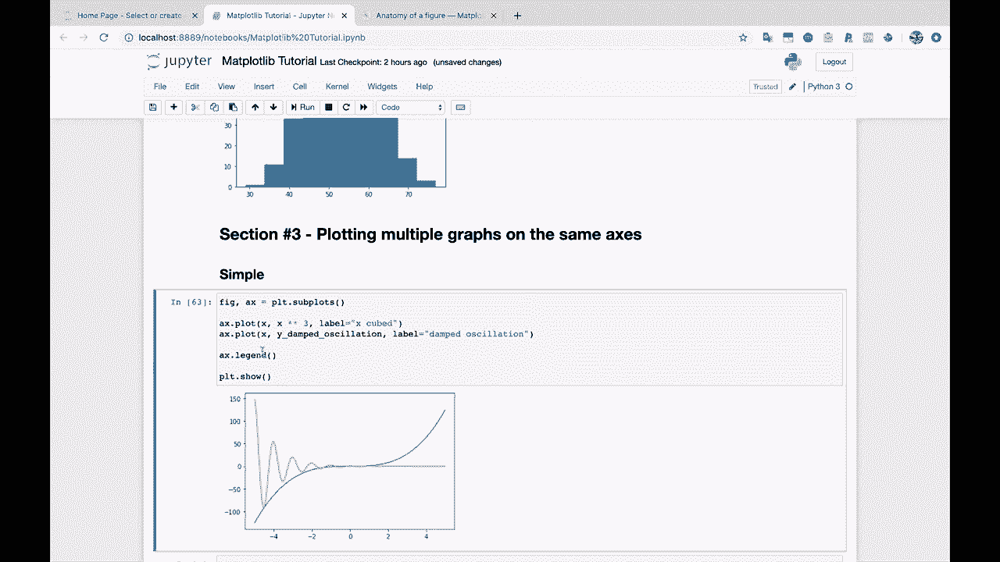

And。It'll put the style of the graph， too。 So， you know， if this was a scatter plot。 these would be little dots rather than lines。 And we see that our blue plot here is X cubed。 and our orange plot is the damped oscillation。 So that's a simple overview of how you use the same axes object。To call the plot method multiple times， you call it multiple times with different data。

 and that plots your data on the same axes here。Now， let's go back to our heart disease data。 And let's say that we want to have a scatter plot。 We want to go back to a scatter plot of plotting one numeric variable against another to look for a relationship。 but we also。Want to color。

By labels， we want to color by labels。 So why might we want to do this， Well。 let's say that we want to look at the relationship。Of let's go back。 Let's go back to our data frame。

Let's。Say we want to look at the relationship between T rest， BPS。 which if we go back to our cagggle data here， back to our Cale data。

T rest， B P， this is the resting blood pressure。 So this is the resting blood pressure。 and then cholesterol。 This is the serum cholesterol in was this milligrams per decilier or something like that。

So let's say that we want to look at the relationship between the resting blood pressure„ÄÇAnd the cholesterol„ÄÇ

And we want to see if there's any difference in the that relationship„ÄÇ as far as people who have heart disease and people who don't„ÄÇ So we want to color by people who have heart disease„ÄÇ Let's„ÄÇ let's take a look at kind of what we mean here and how we might do that„ÄÇ

 So we'll start with our basic formula。So we've got our subplots here， we're creating our figure。 creating our axes at the very end， we call Plt。 show to show that plot。And now if we just wanted to do this normal scatter plot。If we just wanted to do a normal scatter plot， we might say， you know。Df。T rest BPS。 values。

And we want to plot that against cholesterol dot values„ÄÇ

And here is our plot„ÄÇ We've got that resting blood pressure„ÄÇOn the X axis„ÄÇ we have our cholesterol and the y axis„ÄÇBut we want to color this„ÄÇ We want to color this by if the person has heart disease or not„ÄÇ So looking at our original data here„ÄÇ

You can see target。So target of1， and let's just go back to our data to verify。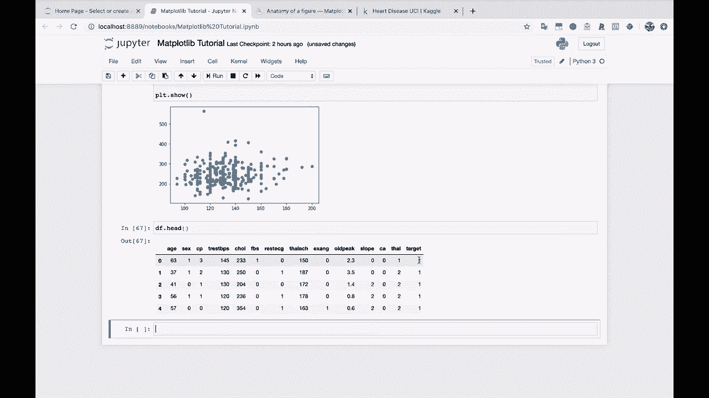

A target„ÄÇ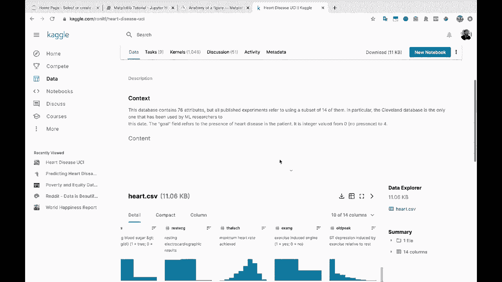

da da da， let's see。

All right， experiments with the Cleveland database。So values 1，2，3。4 all indicate heart disease and a value of 0 indicates no heart disease， I think in our data here。

We just have„ÄÇ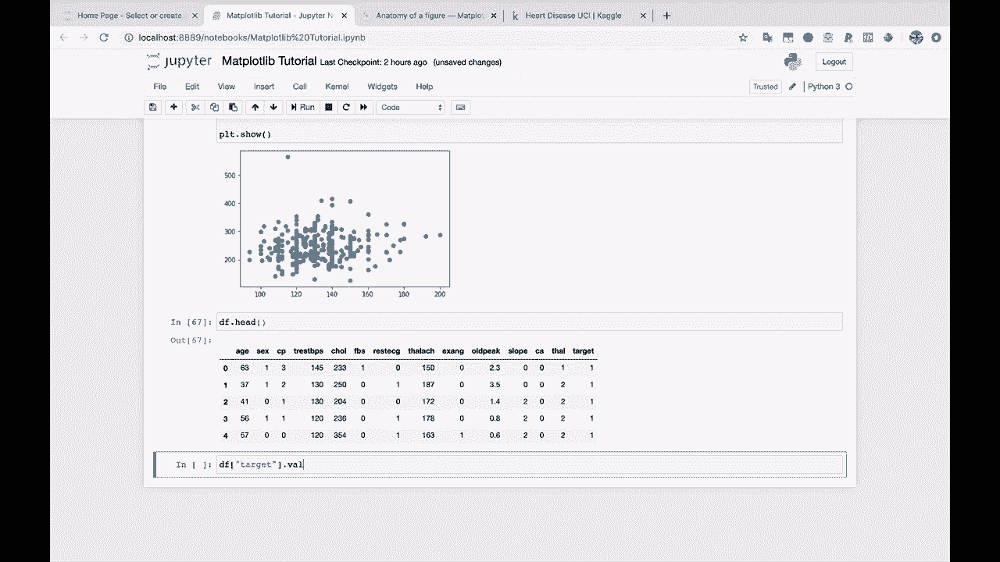

Ope， sorry， value。Counts。Yeah， we just have ones and zeros in our data here。 So one indicates presence of heart disease。0 indicates absence of heart disease。 So we want to color。By this column， we want to color each point by whether it's heart disease or not。

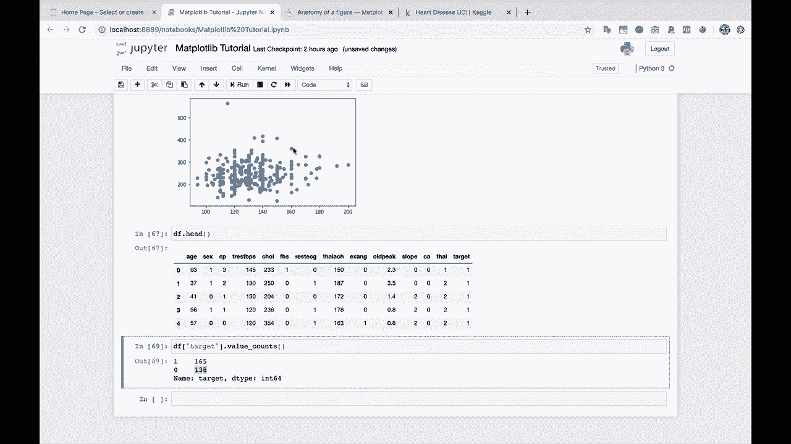

So using this， we can use the same principle of plotting multiple graphs on the same axes。 So in this case。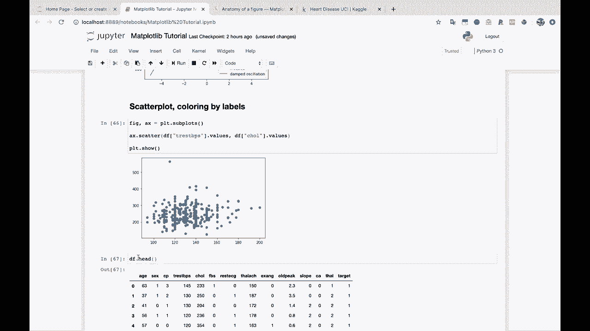

Let's say， let's， let's take a look。At our targets。Let's say we want to get only the rows。Where this equals 0。So we set this equal to  zero， that creates a Boolean mask here。 so essentially you know it does this row equals 0 and it says false or true。We pass this Boolean mask back into our data frame in order to index down to just these rows here。

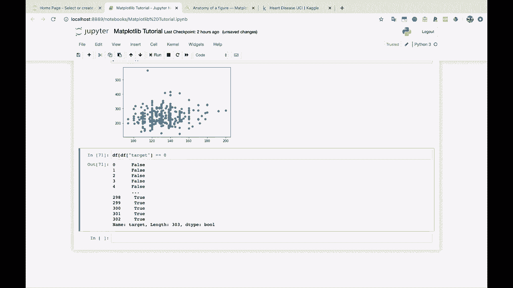

And then we could call this， you know， we could call this like our DF subset or something like that。

So， let's。

Let's try to go through this whole thing up here。 So D F subset。Equals this。 And now。 rather than passing in the whole Df， maybe we just want to pass it in this subset。 So these are just going to be the rows。Where the person does not have heart disease。

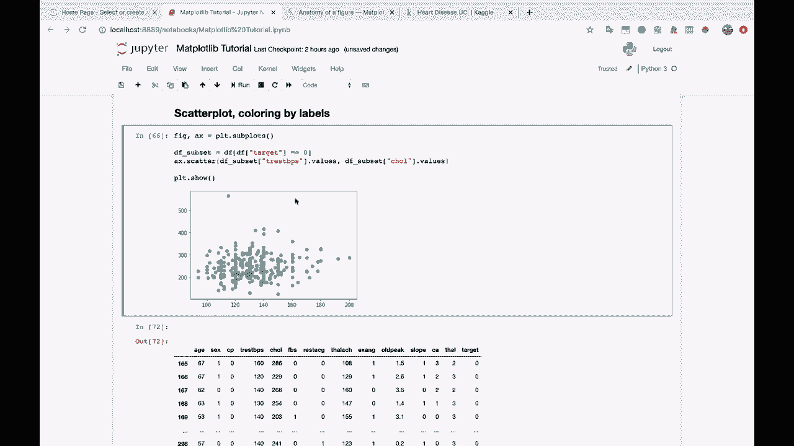

So let's say first plot the data where the individual does not have heart disease„ÄÇSo let's do this scatter plot first„ÄÇ And there there you go„ÄÇ You see that the scatter plot thinned out pretty nicely there„ÄÇ So we're only plotting about half of our points now„ÄÇ

 We're only plotting about half of our data points„ÄÇ

So let's copy this whole thing。Let's copy this whole thing and go down。 and now maybe we set DF subset equal to where the person does have heart disease。And then。 we can plot。Again， so second。Second， plot the data where the individual does have heart disease。

And look at that matplot Lib„ÄÇAlready colors these points differently based on whether or not the person has heart disease or not„ÄÇ And now all we have to do is like we did before„ÄÇ let's add a label„ÄÇ So let's say label equals„ÄÇ we'll call this maybe healthy„ÄÇ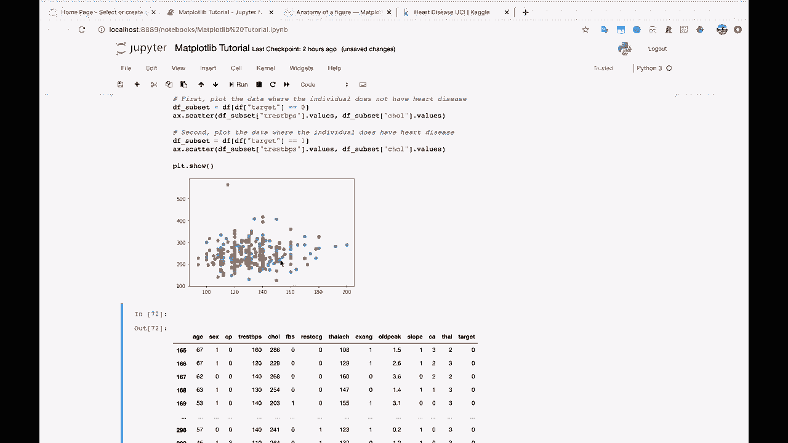

And this label will say， heart disease。

And remember that we need to add our handy dandy AX do legend down here。And there you go。So essentially， what we've done here is we've plotted two different scatter plots on the same axes。 the first one。These are the X values， and these are the Y values of the healthy patients。 The second one， these are the X values， and these are the y values of the patients with heart disease。

 matpllib automatically does the coloring for us， and we add a label， and we add a legend。

And there you go。 We now have a scatter plot where we're coloring by labels。 That's pretty cool。😊。Now， let's say that we had a lot of values here。 and we。 we wanted to do this same kind of coloring scatter plot for a lot of different values。 Well。 this is a lot of redundant code here。 And it is very clear because we're explicitly spelling out。

 hey， you know， plot this first and then plot this second。 but there is another way that we could do it。 And I want to show you that really quick。 So I'm going to copy this down to the second cell。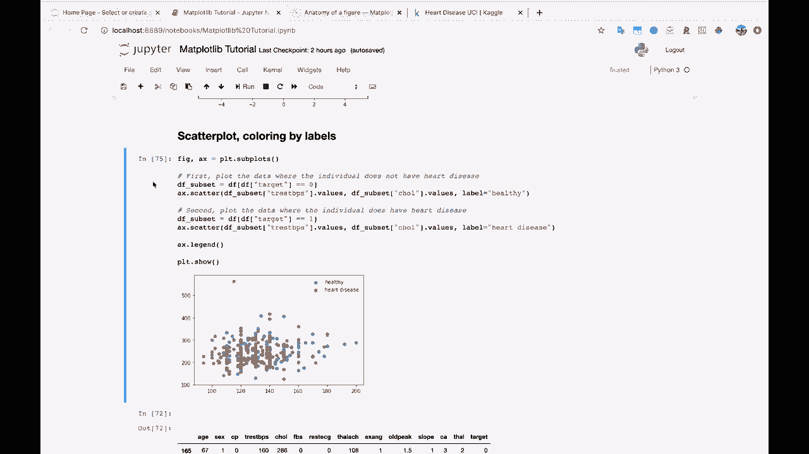

So in this case， we're going to loop through our different values。 so basically the only thing that changes in this code other than the label that we set。Is the way that we filter our data down based on the value of target here。 So if we look at Df target again。

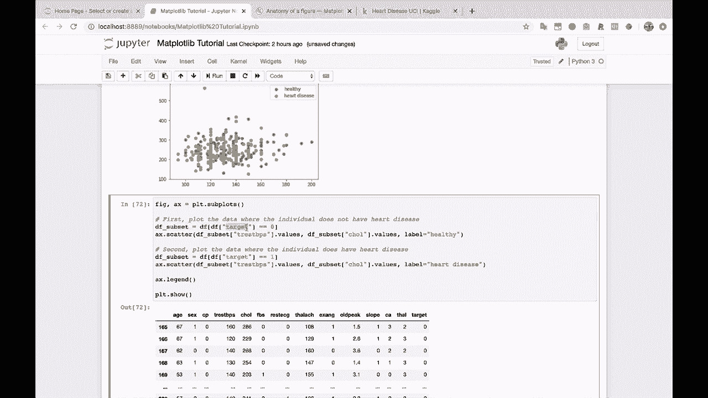

DF target， if we want to get the unique values in this series， then we just do dot unique。

And this shows us that we only have two unique values，0 and 1， and then we can iterate through these。

What does that look like， Well we can say4。Target value。In Df target dot unique。So we're going to loop， DF target dot， there we go。Dot unique。 so we're going to loop through each target value through 0 and1。Let's go ahead and indent this。And now， rather than setting this equal to 0 explicitly。

 we're going to set this equal to the target value that we're iterating through„ÄÇ and I'll delete this comment„ÄÇ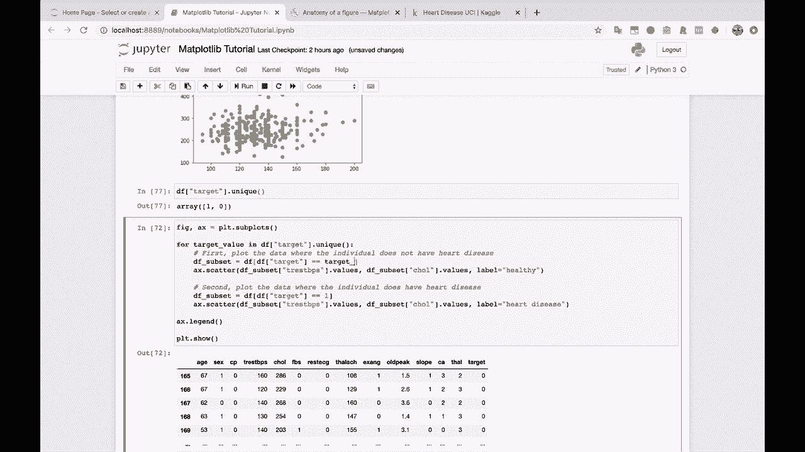

And while we're at it， I'm going to remove this label for right now。And we can delete this second plot here。So let's and then maybe maybe actually I will pass in。 I'll pass in label equals。Target。Target value， and then we'll keep the legend here。

And there you go„ÄÇ So we just did the exact same plot„ÄÇ except you'll see that now map plot lib because of this DF target dot unique„ÄÇ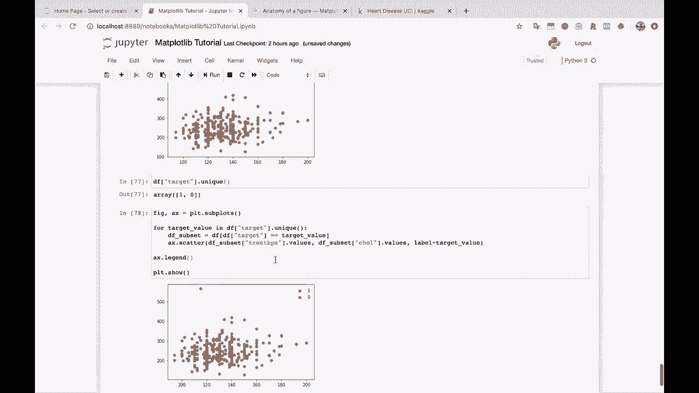

It has switched the order that we're plotting， which means that the colors are flipped here。 so0。 you know or healthy is now orange and heart disease is now one just because of the ordering that these values come out of DF target do unique。

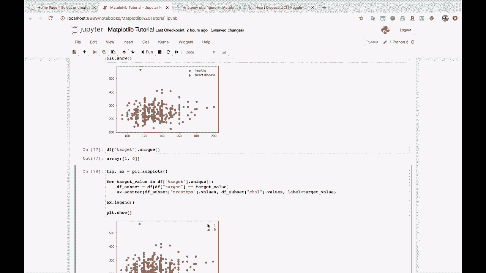

And our label is now just this target value„ÄÇSo if we wanted to have a more descriptive label here„ÄÇ this is where you could start doing something like this„ÄÇ So maybe we have a dictionary„ÄÇ maybe we have a dictionary called label mapping or something like that„ÄÇ And we want to map a label value or a target value of 0„ÄÇToo healthy„ÄÇ

And we want to map a target value of one。Qiu。heart disease。And now。 rather than our label equaling the target value， we'll have our label equal label mapping。

Of the target value。 So I run this cell so that we get our dictionary。And now if I run this again。 you'll see that we're passing in our label， which is mapped from this dictionary。

And this is a kind of trick that you can use in a lot of different situations。 could we could have a we could have a color mapping dictionary here where maybe。 you know if the label is 0， we want that to be blue。And if the label is one。 we want that to be red or something like that。 So you can do all different kinds of mapping tricks with dictionaries like that like this。

 But this is an example of how you could take two explicit calls if you wanted and turn them into one„ÄÇ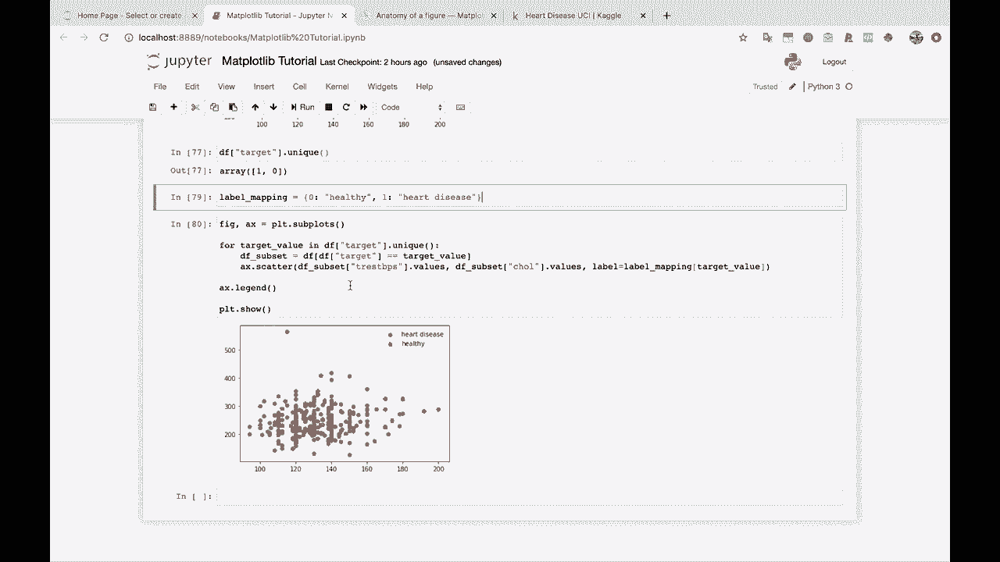

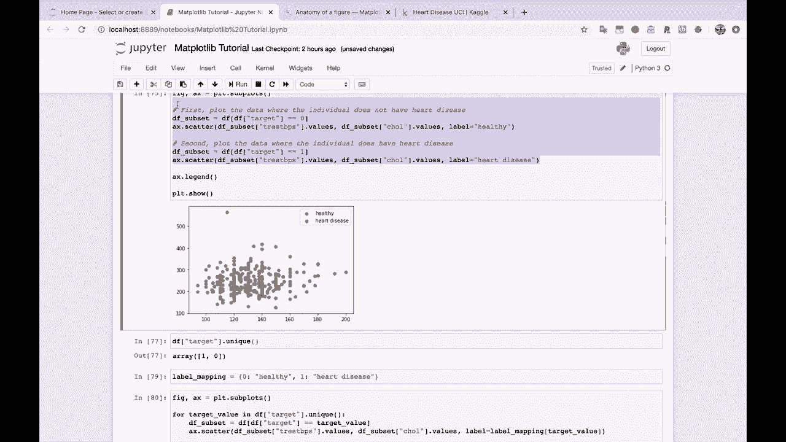

For loop call that iterates all over all of the unique values。 Now， while we're on this scatter plot。 let's say that we have one specific point that we want to call out somewhere in this scatter plot。

This is something you might want to do for various reasons„ÄÇ maybe you want to call out a single bar in a bar chart or you want to call out a single point in a scatter plot„ÄÇThis is a pretty common thing to want to do„ÄÇ So let's talk about how to do it with this scatter plot„ÄÇ So I will say„ÄÇScatter plot„ÄÇCalling out a single point„ÄÇ In this case„ÄÇ

 the way that we're going to call it out is using color„ÄÇ So if we do A X„ÄÇ

Dot scatter question mark。 Let's see what options we have here。 So in addition to passing in X and Y。 which we've been doing， we have an S parameter， A C parameter。 We got a bunch of other parameters here。嗯。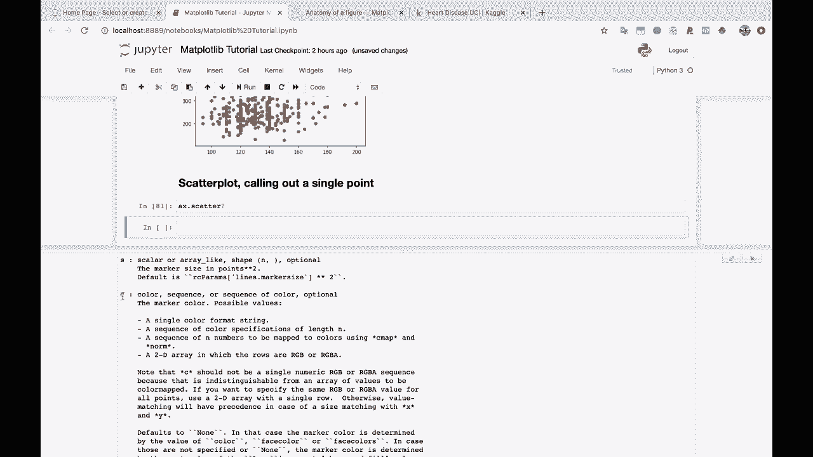

So S is going to be the size„ÄÇThe marker size here and C is going to be the marker color„ÄÇ So we're going to take advantage of that marker color in just a second„ÄÇ So let's start with our normal„ÄÇ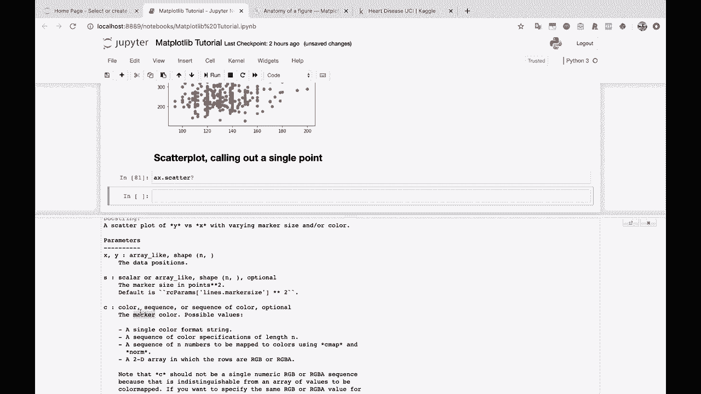

Start with our normal„ÄÇ

Template here， Plt。splots。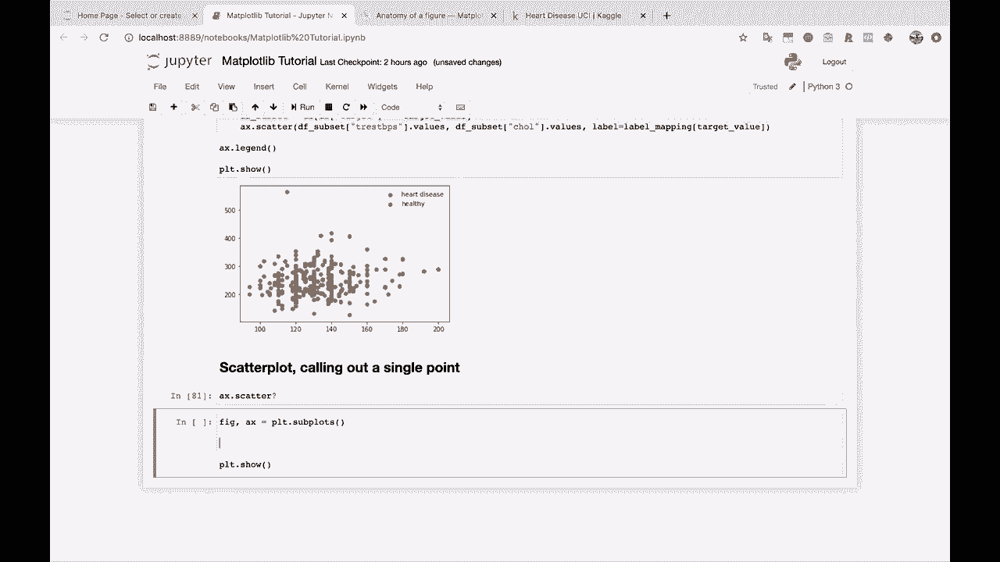

Let's do A X dot scatter„ÄÇ

And da da„ÄÇ

Let's do。A dot scatter。And we're going to do all of the points here。 So let's do D F。T S， B，PS。 DF cholesterol。 Let's take a look at this。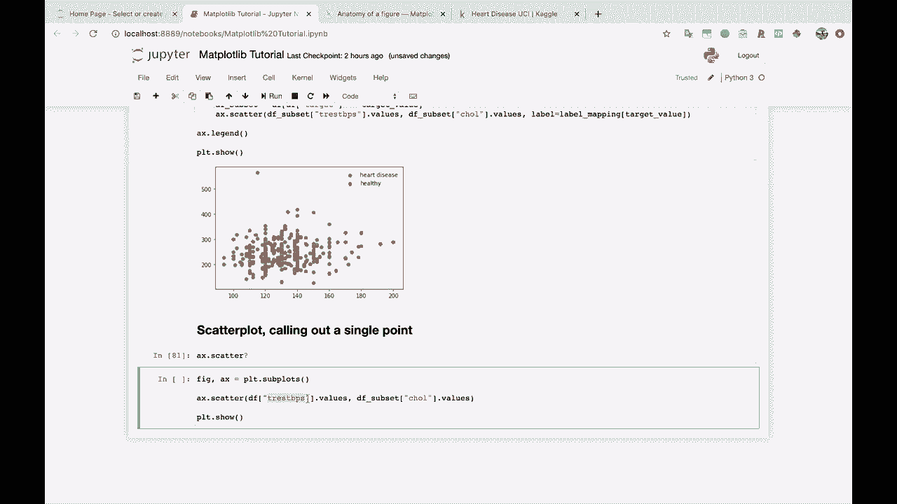

Alright， now， let's say that we want to call out a single value。 So first off， let's。 let's put all these other values as kind of a light gray。 So I'm going to use the C parameter。 C equals light。Gi。So c equals like ray。 So we just turned all of these points like ray。 now we want to call out a single point here and maybe maybe the point that we want to call out is just the first patient in this data。

So what we can do。Is we can just have a scatter plot。Of， and actually。 I'm just gonna copy this whole line down。Let's have a scatter plot of just the zeroth index person。So just the first just the first point in our data here。And now let's change the color to red。And there you go。You see now that we plot all of our points in a light gray color。

 and then we just take the first point。 We just take that first point， the zeroth index here。And we plot that specific point in red。 So this is a very nice way。 And you can do this with bar graphs。 You can do this with other types of graphs。This is a very nice way to call out specific points in a graph is you just， you know。

 just plot another scatter plot right on top of it。 Do it in a different color。 whatever color you want。Okay， so our last example in this section is going to be。Let's do a。 Let's do a bar chart。With a。Line graph。And maybe a。

Horizontal line as well。 So we'll start off with our same template， PL T dot subplots。And PLt。 show down here。So what data do we want to plot， Well， maybe I want to plot。Let's see。 Maybe I want to plot a line graph of let's go back to our group by age。Our group by H。 so let's plot age along the X axis， and maybe。Once plot are cholesterol levels。

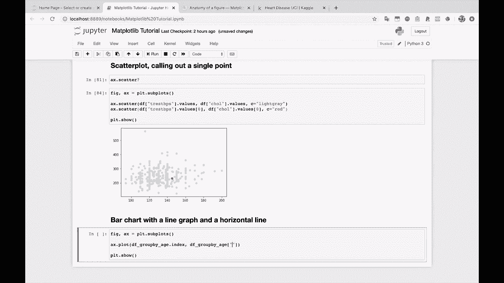

Along the Y axis。So here's a nice line graph showing your age and your average cholesterol per age group。So now， maybe I want to add a bar graph。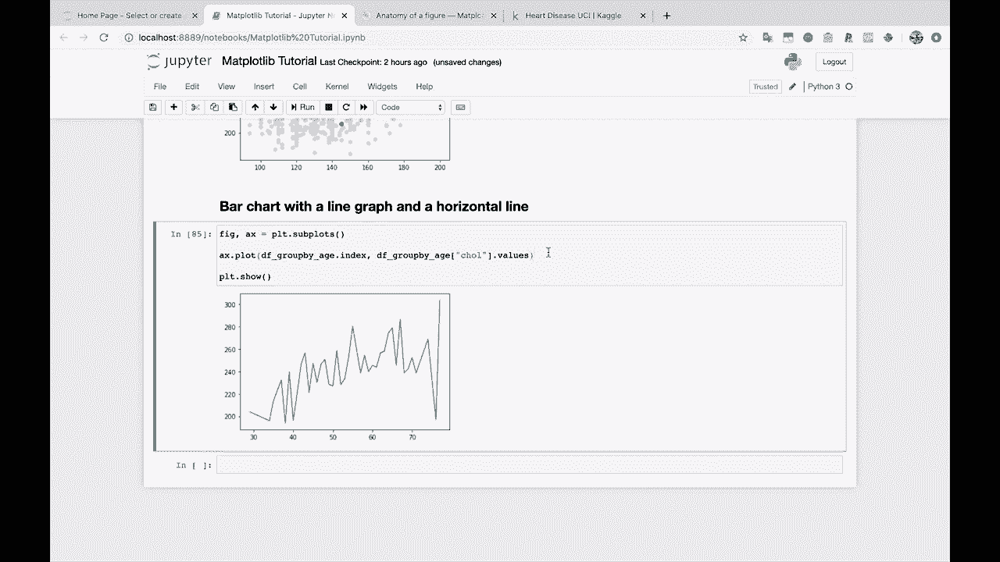

On this axes here， and I want to show the TR Bps， the resting blood pressure。

So now let's do A X。Dot bar。 And once again， you know， just to kind of reiterate。 we're using the same A X object here。 So we're taking the same object。 calling different methods on it here so that we are plotting different plots on the same graph。 the same axes。 So we'll also use。The age as our x axis。And now let's do the T rest B。

 P as our values。And there you go， look at that。We now have this bar graph。 which represents one value and the cholesterol， which represents another value。So that's not explicitly called out here。 so we could change the color。Of these different graphs here。 So maybe I'll pass in a C equals。 Let's try orange。And we'll。

 we can leave。This color， the same。 Let's pass in a label and see what that does。 So this will be。Coholesterol。And this label will be T rest。Bps。And remember that we need to call AX dot legend in order to get that legend to show up。And so there you go。 This is what I was talking about earlier。 as far as the。 the graphs will show up as different。They'll show up as different shapes to indicate what you're looking at here。

 So this is a bar graph。 that's telling us this is the resting blood pressure。 And the orange line is this line graph， And that's the cholesterol that we're looking at here。 Allright， that's looking pretty good。