# 【双语字幕+资料下载】绘图必备Matplotlib，Python数据可视化工具包！150分钟超详细教程，从此轻松驾驭图表！＜实战教程系列＞ - P9：9）在 Matplotlib 中使用子图 - ShowMeAI - BV14g411F7f9

Alright， so let's get to our last section here before we get into common questions。 and like I said。 we're gonna get back to text here quite a bit in the common questions。 So we're going to look at things like changing these ticks and rotating the X axis and y axis labels and changing the font size and all of that good stuff in the common questions。 but let's do one more section first of basic functionality before we get into some of the nitty gritty here。

 So section number5 using。

Subpls。

So I've already showed you this up earlier， earlier in the Jupyter notebook here。 but I want to make it explicit and spend a little bit more time on it。You know how we usually do P l T do subpls。And then we do Plt。s。

And that creates a single axes here。That we can plot things on。Well， if we pass in。A number。 so number of rows， number of columns。Then we get multiple graphs here and。Let's go over again。 So let's let's take a look at a two by2。

A2 by two here。And remember that this actually usually usually will change this to AXS if this has multiple axes in it。 and if we look at AXS。

This is a two dimensional numpy array。 so notice that here we have a list of two mapplotlib axes。 here we have a list of two mapplotlib axes， and these are both wrapped inside in outer list。 and we can just look at the dot shape here。

And see that we have two by two， which matches what we asked for and also matches the graph that we are getting。So then to plot on each one of these。Essentially， what you do is you do AX S。 and then you you can specify the coordinates within this AXS object or the indices， the index。Of where you want to plot。 So let's plot something in the first row， the0 throw and column 1。

 Let's try that。And maybe we want。To plot here， let's take a look at our our group by age again。 So maybe maybe we'll do all of these as looking at our age。And let's go back to looking at our cholesterol values。And here you go。 you can see that we now have a line graph in the first row， second column。Of。

Our average cholesterol。By age。Now， what if we want to look at in this first one。 maybe we want to look at the So 0，0 for the0， throw，0th column。Dot。 maybe want to look at a bar graph。Of the average。Resting。What was this resting blood pressure。 right？Let's do a bar graph there。So now youll see that we have a bar graph。In that first plot there。

And this is something that's going to come up in the common questions as well。 but I'm going to go ahead and make the figure bigger。 So remember that the figure。 the figure is this whole image right？ And so now we're trying to plot four different graphs。Inside the same image， whereas before we were only plotting one。

 So that's why this looks pretty small。 So let's change the fig size here。 Let's change the fig size。 and maybe we'll make this。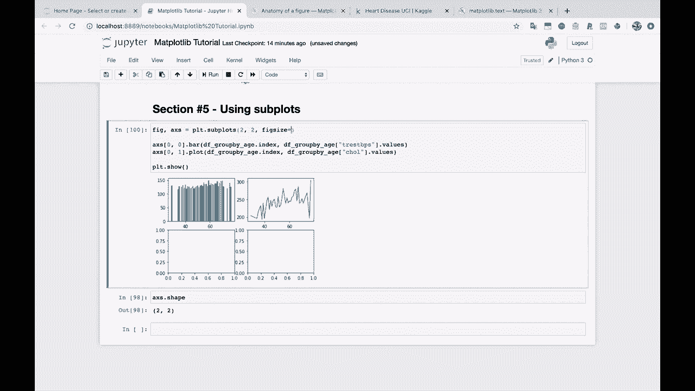

Let's just pass in a 10 by 10。

And see what that does。 Or maybe， you know， maybe let's try， let's try 12 by 8。

There we go。 It looks a little bit more proportionate。So now you'll notice that the figure here。 this is still just a single image， but the single image is now bigger。 so we have more space for each axes that we're plotting on。I plotting on。Okay， let's take this。 Let's create two more of these。 So we need to plot something。Down there in that second row。

 first column and something in the second row， second column。 So maybe let's take a look at our group by。 Let's what columns do we have。

Let's take a look。At this one。For our third graph。 And maybe let's take a look at this。For our fourth， we got thalac here in old peak。 What are those。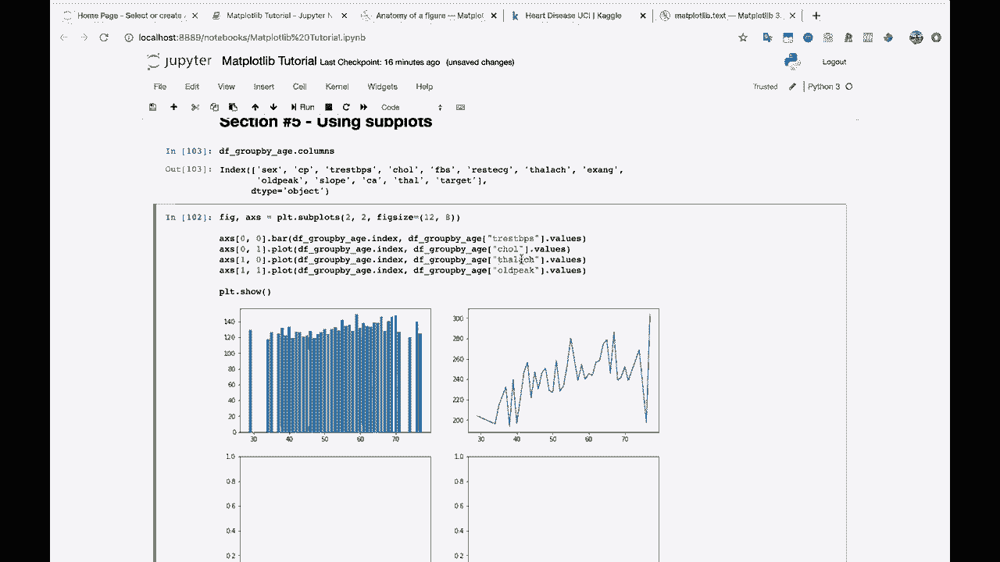

So this one， Talac， or however you' pronoun， says the maximum heart rate achieved。And old peak is the what is S T depression induced by exercise relative to rest。 I'm not entirely sure what that means， but if you do medicine。 you might know what that means or if you're in healthcare。

So let's make this third graph here。A scatter plot。And maybe we'll make the finalr， the final one。 a bar graph again。 So let's try this。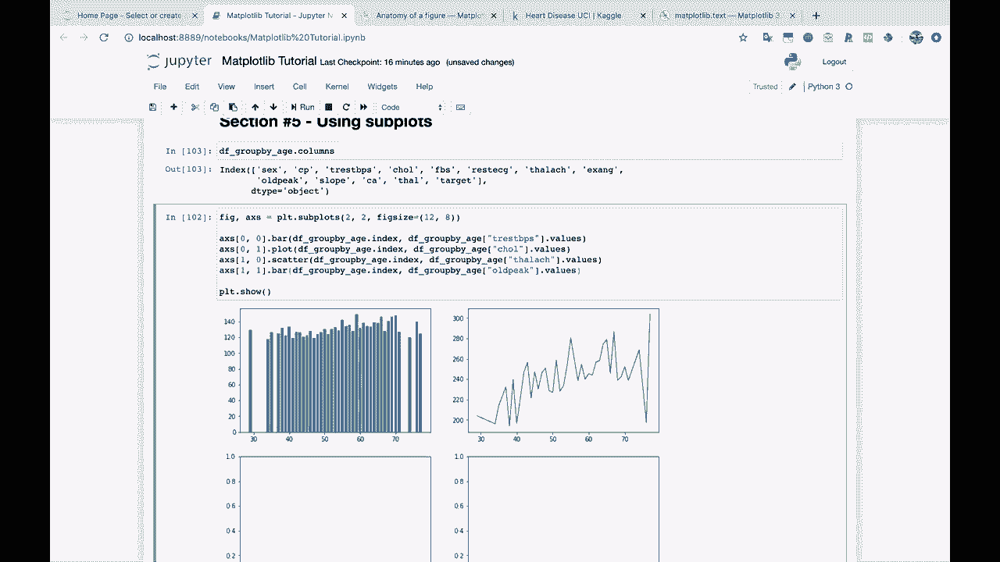

And here you go。 So you see that first we're plotting a bar graph and we can do anything that we want。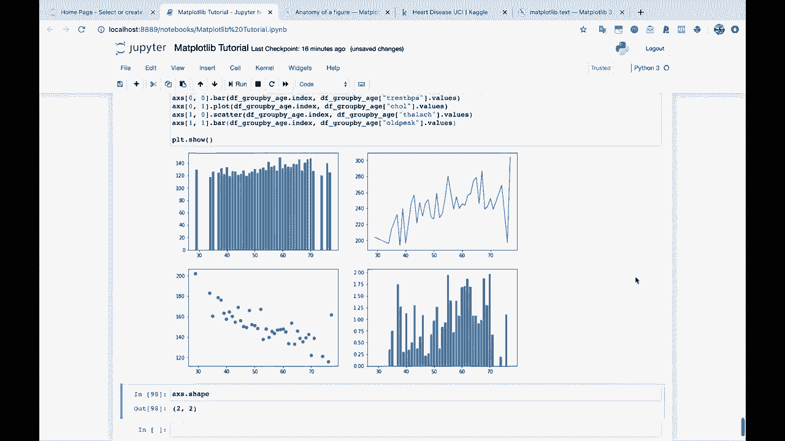

With this axes， just like we。Would with just a single axie so we can set the labels。 we can set the title， we can do all of that stuff。

The second one， we have a line graph。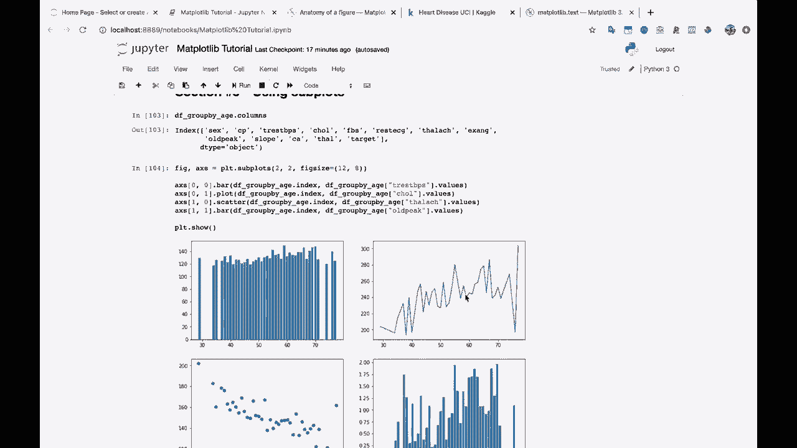

We have a scatter plot， and we finish it off with another bar graph here。 So let's actually。 let's take a minute。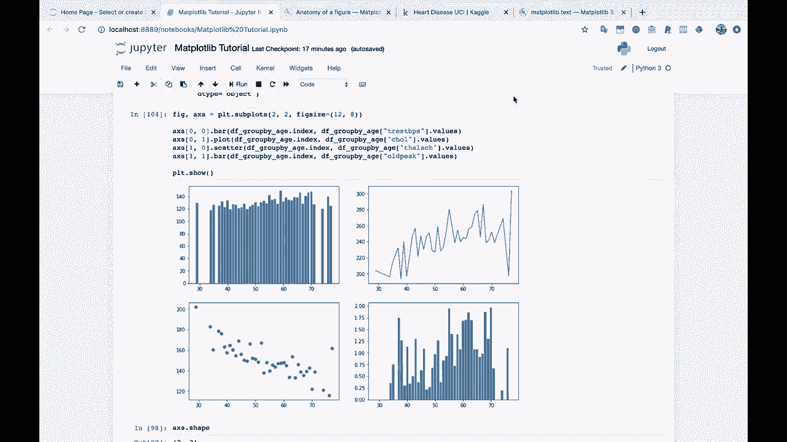

To just show you that you can， indeed。Set the X label and the y label and the title。 just like normal using this access object here。

Let's look at the first graph。And then we'll do the second graph。And。Here's the third graph。And here is the fourth graph。All right。So， and we， we maybe don't need to set everything for all of these。 but。

So rather than AX， I'm just changing it to the axes location inside of this Numpy array here。

And the x label， well， this is going to be age。The y label， this is going to be average。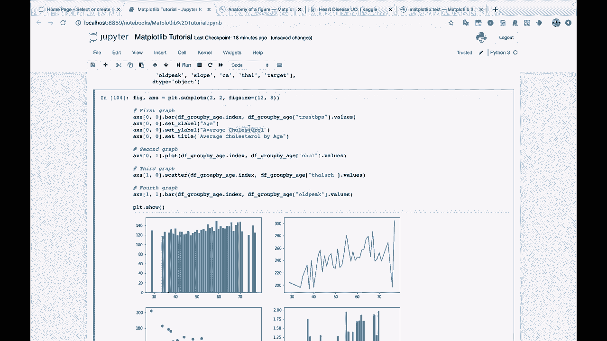

What was this as was your resting。Blood pressure， right， So average。

Resting。Blood pressure。

And if we want to set a title here， we can say average。Resting blood pressure。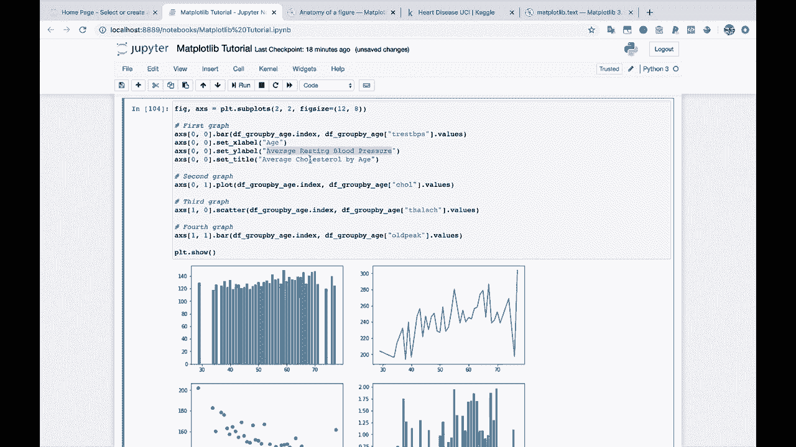

By age， let's take a look at this and see how that looks。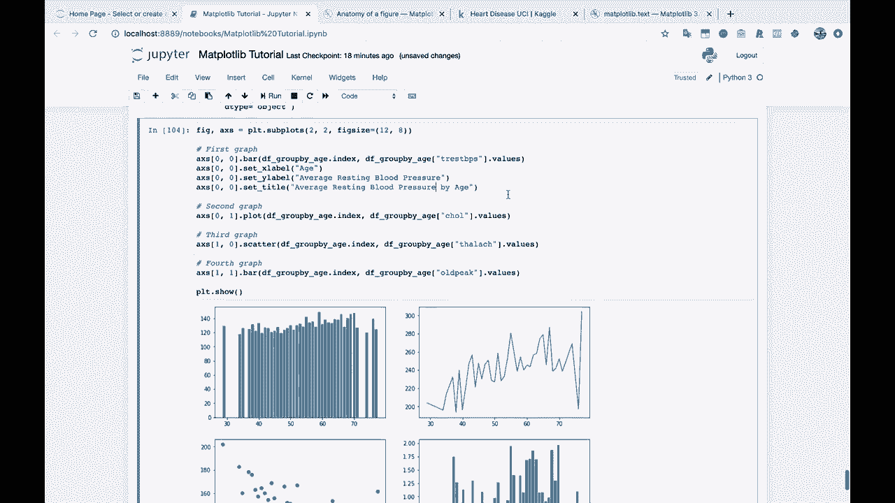

All right。So our our graphs are getting kind of tight here。Which， you know。 getting your graphs to look exactly the way that you want them to definitely take some time。 depending on what you're trying to do， But notice that we do have an X axis label， a Y axis label。 and a title just for this graph。 So and we did that just by using this same axes object here。

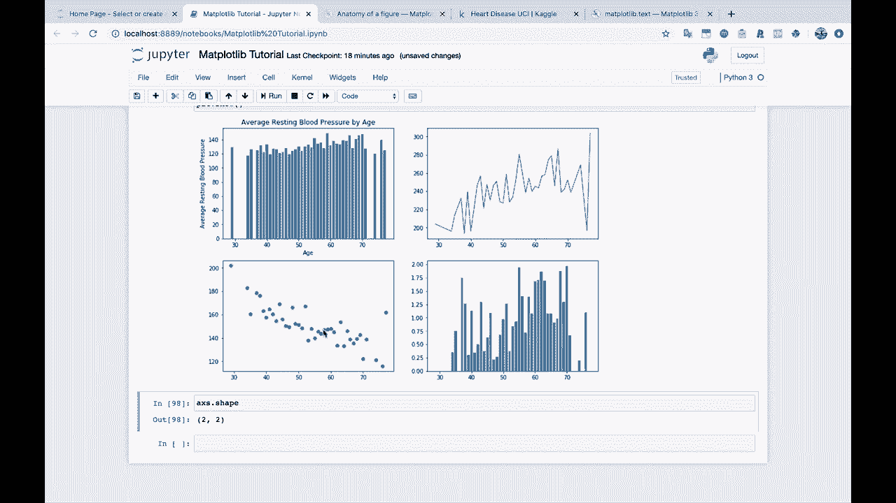

Now let's say that you had taken the time to populate all of these graphs with their appropriate labels。 so I'm going to go through and just change， make sure that this is indexing into the correct axes object here。

So let's say that， you know， we're just going to leave all these as the same for right now。 but let's say you took the time and went through。

And， you know， maybe I'll change cholesterol。

And let's see， what was this one again。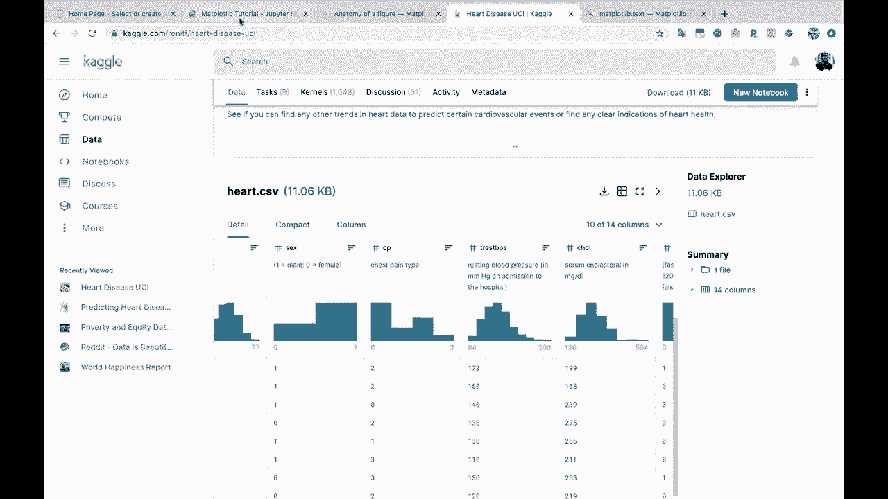

This one was heart rate achieved average。Maximum heart rate achieved。 And remember。 this is the average of all these because we're looking at the。 we're looking at the data grouped by age and then averaged。

And then old peak。 Well， this was the ST depression induced by exercise。 So we'll just say average old peak here。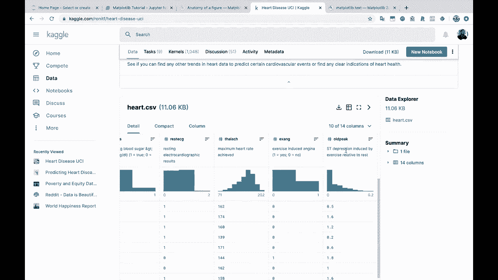

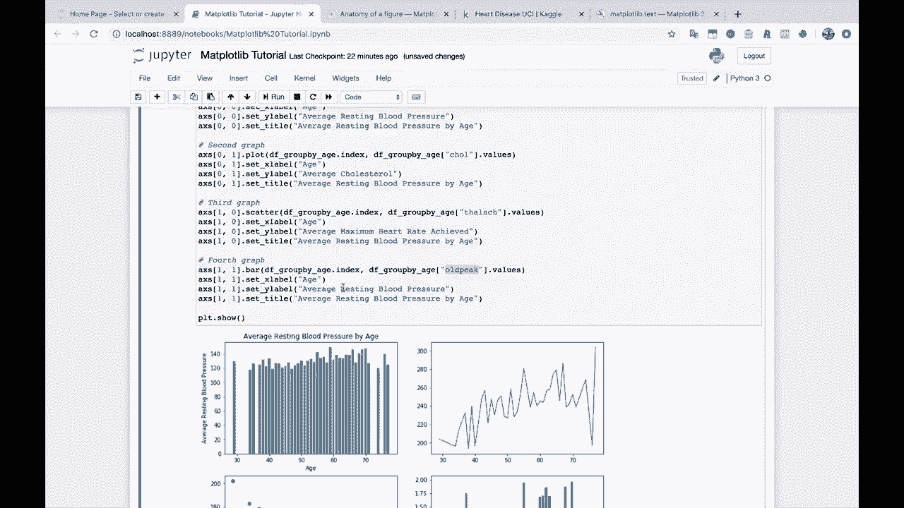

Alright， so let's say that you took the time to plot all of these。 Well。 just like I was saying a second ago。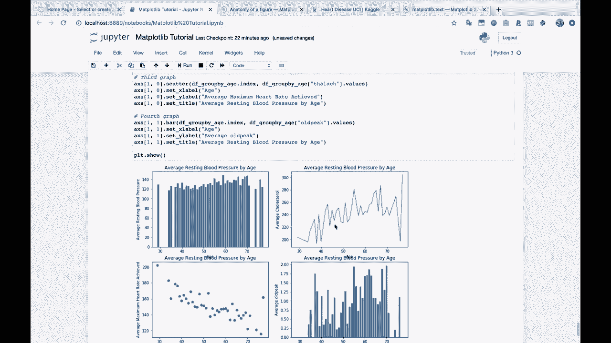

The age。The age X axis label and the title here。A are too close， they're overlapping。 and this doesn't look good and you can't read it and you don't know what that says。 and so we need to fix this somehow。

So there are ways of moving the text up and down and moving the graphs up and down。 But there's also this very handy dandy。

PLT dot tight layout function。And this is not， it's not a magic bullet， you know。 it's not always going to work exactly how you want it to。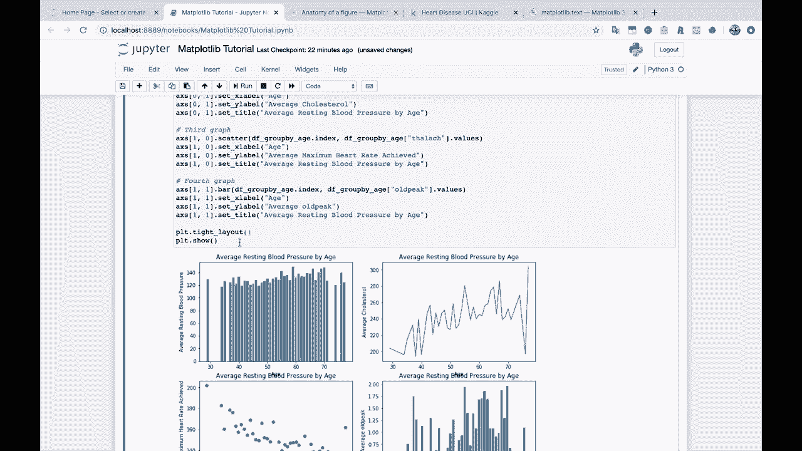

But if you call this tight layout right before PL T dot show。 then Matplotlib tries to do its best to make sure that things are not overlapping。 And so you'll see here that the X axis label and the title of the graph below are now not overlapping。 and everything looks pretty good。

Okay， so I think that that's it for section number5 using subplots。 it really is just this easy。 You create however many subplots you want， and then you do any kind of graphs that you want on each subplot on each axes there。

Finally， you call PLt。 showhow and if things are overlapping， try Plt。tight layout。 try this and see if that works， and if not you might need to do some manual tinkering with the positions of things。 but hopefully this works for you。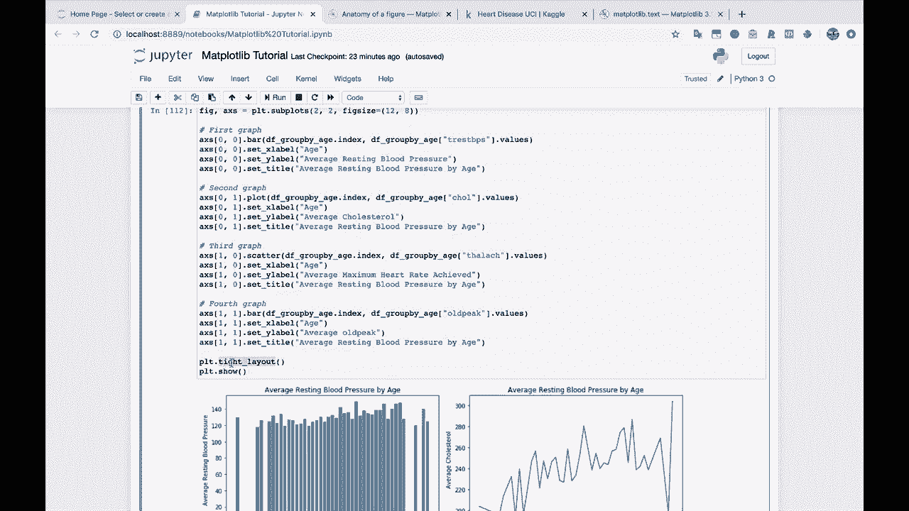

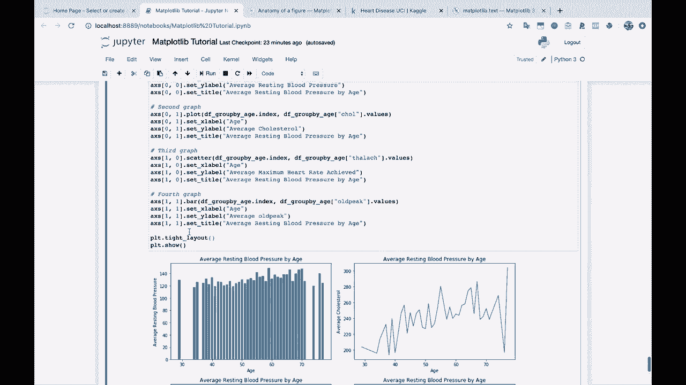

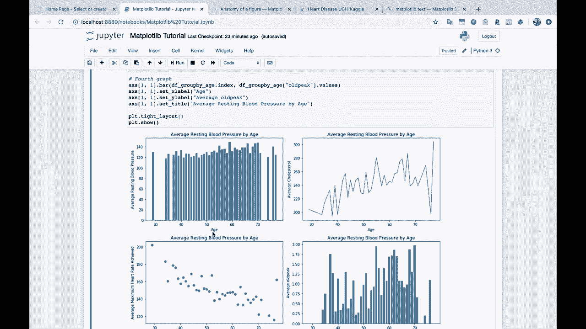