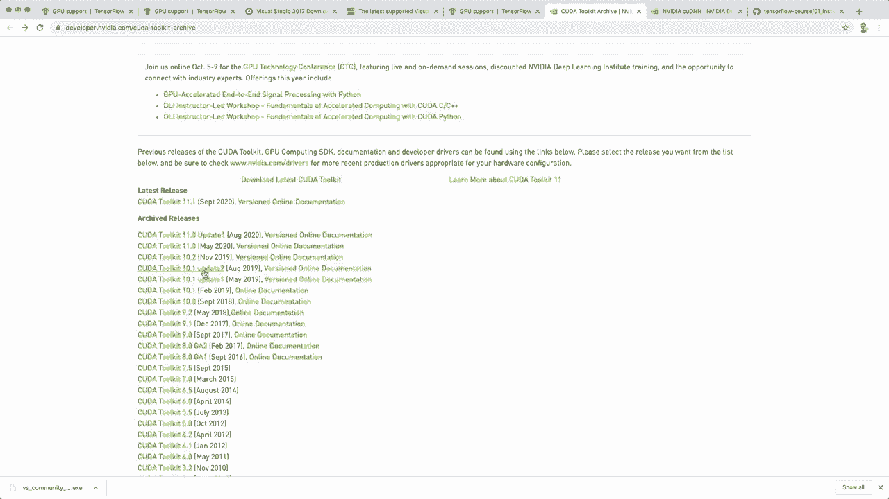

# 【双语字幕+资料下载】面向初学者的 TensorFlow 教程，理论知识、代码思路和应用案例，真正从零开始讲明白！＜快速入门系列＞ - P1：L1- 安装与环境配置 - ShowMeAI - BV1TT4y1m7Xg

🎼，Hey， guys， and welcome to my Tensorflow beginner course。 In this course。 I teach you all the things you need to get started with this framework。 and we're going to build some nice example projects along the way。 So Tensorflowlow is an end to end open source platform for machine learning and deep learning。

 It's developed by Google。 and it's one of the most popular deep learning frameworks out there。 So in this first episode， I show you how to install Tensorflowlow on your machine。 And by the way。 all the course material will be available on Github。 So I created a new Rapo Tensorflowlow course。 and I already uploaded the first installation guide。

 So you can check this out and read the guide here if you want。😊。And now let me show you what you must do to install Tensorflow。 So you go to the official site。 Tensofflow dot org and then click on install。 And here you have the requirements。 So you need Python 3。5 or newer。 And I assume that you already have this installed on your machine。

 And then it's supported for Mac， Uuntu and Windows。And the installation command is very simple。 So you need Pip version greater than version 19。 And then you just say Pip install Tensorflow。And so I show you how I do that in a couple of minutes。 But first of all。 let me also show you how what you must do to install it on Windows and to get GPU support。

 So on Windows， you additionally need to install Vis Studio 2017。 So you get this for free。 So you only need to install the free community edition。 And you also need。The C plus plus redistributable。 so you can click on this link， and this will lead you to this side。 and then you download the version and install this as well。 And if you have this。

 then you can also just say Pip install Tensorflow on Windows， and this works。And now。 if you have GPU support， then I also show you what you must do。 so you can skip this part if you don't have a Nvidia GPU on your machine anyway。 So let's click on this link here and the installation command will be the same later。

 But first of all， we need to have some more things。 So。 of course you need to have a Nvidia GPU on your machine and necessary drivers。And if you have this。 then you can install or you have to install the Kuda toolkit and the Couddi and N tool SDK。 And it's important to get the right the correct version。 So for Kuda toolkit， you need version 10。1。

 So let's click on this link。 This will lead you to this site。 And here you have all the archived releases。 And then you select the latest 10。1 toolkit and download it for your operating system。 So for Windows。 and install this。

And once you have installed this， you also need the CoudD and N SDK。 So this is the Kuda Deep neural network library。 And on this side， you click on download。 And again here it's again， important to get the correct version。 So you need version 7 because right now I think the latest version is version 8。

 So then you click on download。 And for this， you need a account so you can create this for free and then download this。

And now once you downloaded this， I show you what you must do。 So here I made some screenshots from my other machine where I have windows。 So first of all。 after the installation of the Kuda toolkit， you probably have the somewhere on C program files and Vdia GPU computing toolkit kuda and then the version 10。1， this is your installation directory and then when you downloaded the codi and N SDK。

 then you can go into this downloaded folder and there you have a bin directory and include directory and a lip directory。 For example， in the bin directory we have one DL。 So now you have to grab all of these files and then go back to your Kuda toolkit installation directory and there you also have the bin that include and。

Lip directory。 So you have to copy all of these files in the corresponding files in your Kuda toolkit directory。 And after you've done that， you also have to modify the environment variables。 So one thing you need is you need to create a variable kuda path and then put in the installation path。And then you also have to modify the actual path variables。 So in here。

 you have to add these additional paths。 So this is the installation folder with the bin folder and the lip and。VvP folder。 So you need to put these in your path variables on Windows。 And now this is all you need。 So these are all this steps required on Windows。 And now we can go ahead and just install our Tensofflow。 So now what we do is first， I recommend to use a virtual environment。 And for this， I'm using Conda。

 So I create a new environment with Conda create。 Then minus n and the name。 I say T F for Tensorflow。 And I say Python equals 3。8。

And if you don't know how to use Conda， then I have a whole tutorial that explains this。 so I will put the link in the description as well。 And so by the way， you don't need Connda。 you can also just use the virtual end from Python。 This works as well。Alright。 so now we created this and now I activate it with Conda activate T F。And now for the installation。

 we use Pip install Tensorflow。 So there is also a Conda install command available。 but I actually do not recommend to use the Conda install command because this is not officially supported and there might be some performance issues。 So let's just use Pip install Tensorflow and hit enter。 And now this might take a few seconds。 Alright， so this was successful。 So let's test this and see if the installation was actually successful。

 So let's start our Python shell。 And let's import Tensorflow S T F。 And now if everything work correctly， then this should work without errors。 Yeah， so this worked。 we didn't see any errors。 So now we have Tenorflow and for example。 we can print the version Tensorflow underscore。Underre version and we see I have the latest version 2。

3。1 and then if you have the GPU support installed。 you can also test this by saying physicalical devices equals Tf。 config do list dot physicalical underscore devices and then the GP U string and this was an error sorry。T F dot config dot list， underscore physical devices。 And here in my case。

 this is just an empty list。 But if you have the cheap your support。 then it should put in your Kuda device in here， so you can test this with this command。 And yeah。 so for now， you know how to install Tensorflow。 And I hope you enjoyed this。 And if you like this then please hit the like button and subscribe to the channel。

 And then I hope to see you in the next video bye。