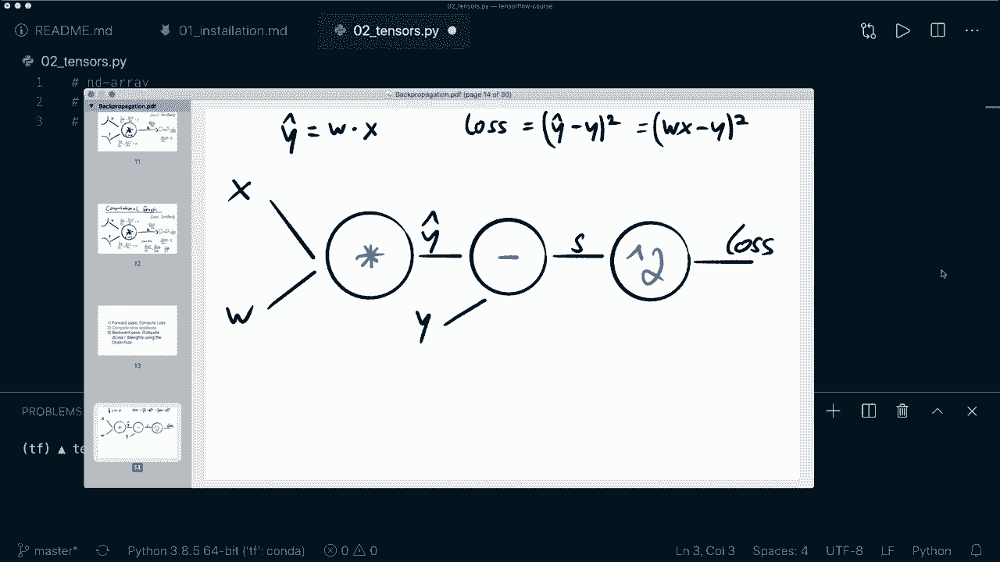

# 【双语字幕+资料下载】面向初学者的 TensorFlow 教程，理论知识、代码思路和应用案例，真正从零开始讲明白！＜快速入门系列＞ - P2：L2- 张量基础 - ShowMeAI - BV1TT4y1m7Xg

🎼，Hey， guys， welcome to the second tutorial of the Tensorflow beginner course。 Today。 we learn the Tensor basics。 A Tensor is the central object in the Tensorflowlow libraries。 So all operations are based on Tensors， and a tensor is kind of like a nuy and D array。 So you can represent 1 D，2 D or 3 D arrays or arrays of even higher dimensions。😊。

But so let's write this down。 So let's say we represent N D arrays。 but a tenor is also designed so that it has GP U support。 So we have GP U support。

And a tensor is also designed so that we can build a so called computational graph and then later track the compute the back propagation。 So for here， for example， we multiply two tensors with each other。 and then we build the so called computational graph。 and then the next operation is a subtraction。 So this is also a operation in our computational graph。 And then later。

 we can use this to calculate the gradients。

So it's used to build a computational graph and to compute the back propagation later。 And I already have a tutorial about this in my Pytorch beginner course。 But the same concepts apply here， too。 So if you're interested in this。 Then check out the video。 I will put the link in the description。And then what's also important about tenszos is that they are immutable。

This means that we can never update the contents of a tenzor。 We can only create a new one。 So now let's start creating some Tzor。 So， first of all， of course。 we want to import our Tor library S T F。😊，And then in order to create a tenor。 we use the T F dot constant function。 So we say x equals T F dot constant。

 And then we can give it a value， for example， only a single scala value。 And then let's print our tenzor。 and。Let's run this file and see how it looks like。And then we also get a warning， which we shouldn't care about so we can silence this by saying import O S and then set O do environ。 And then the variable is called TFCPP Min lock。Level。Equals， and then as a string， a2。 So now。

 if we run this again， then this warning should go away。Yes。 so now we see it only printed the tensor。 So this is a tensor with only one single scala value。 and we can also specify the shape by giving the shape argument。 And this is a tuple。 So in this case， we can say it's one by one。 and then we also can， for example， give it a data type。

 And here we can say T F dot float 32。 So now if we run this again。Then we should see the difference here。So now， yes， we also see we have the shape 1 by one。 So now it's not only a scalar value， but a matrix， and we have a different data type。 This is with only a single value。 Of course， we can also put in a list in here。 So we can say。

 for example，1 and 2 and 3。 And now we have a 1 D tenor。So here we see the shape is 3。 And in this case， we say this is a so called rank 1 tenzor。And， of course。 we can also put in a list of lists。 So let's create another lists。 And the first one is this one。 And now let's create another list。 And this has to well use 4，5 and 6。 And now in this case。

 this is a rank to tenzor。 So now let's print this again。 And let's have a look at the shape。😊。So here we see our tensor， and we see the shape is 2 by3。 So this means we have two rows and three columns。So now in this case。 we created the values manually， but there are also some methods to fill our tensor with some values。

 For example， we can say our tensor is T F dot once。 and then we can give it the shape as tuples。 So let's say three by3。 and this is a3 by3 tensor filled only with once。So here we have it。 and we see that the default data type here is the float 32。 If we don't specify any。 So similar to onces， we can also use zeros。 This will do the same thing except that it fills our tenor with zeros。

So here we see our0 tenor。 Then there is also a method that is called Tf dot I。 and this only takes a single value。 So in this case， let's put in a three。 So this will create the identity matrix。 where the diagonal matrix or the diagonal is filled with once and the rest is filled with zeros。 So this is the I function。 Then there are also methods to initialize our tenor with random values。

 So for this， we can， for example， say Tf dot random and then draw some values from the normal distribution。 So normal。 And then here， again， we need the shape。 So let's use3 by3。 and here we can specify the mean。 So by default， this is 0 and the standard deviation by default is one。So let's print our random tenzor。So here we can see the random values which are somewhere around0 and we can also instead of the normal distribution。

 we can draw values from the uniform distribution by saying Tf do random dot uniform。 and then again。 we need the shape。 and here we can specify the minve。 So let's say this equals0 and the max value equals 1。 So this means all of our values are between 0 and1 and they are uniformly distributed。

So here we have our new random tensor。So now we can also use the T F dot range function。 This is similar to the normal Python range function。 So now we have values between 0 and 9。 Oh。 of course， I have to print it。So let's clear this and run this again。So yeah。 this is our range tenor。 And now let's see by default。 in this case， this is data type in 32。

 So let's say we want to change this。 So we want to cast our tensor。 and we can do this by saying X equals T F dot cast。 And then again， the tensor， we want to cast。 and then the data type equals， let's use T F dot。Float 32。 and let's print our new tenor。 and again。 notice that I assign it again to the new value because the original tensor is immutable。So。

 let's run this。And then we see we get the same tensor， but now with a different data type。 So this is how we can cast tensrs。 And now let's talk about operations on tenoros。 and what is important here is that all operations are element y。 So let's create two tens x equals Tf dot constant and then a list 1，2，3。

 and let's use the same with a new tenor Y， and it gets the values4，5，6。 So now， for example。 we can do a elementwise addition by saying we have a new tensor C equals。 and then we can use T F dot at X and y。 And now if we print our C。 then let's clear this and run this。Oh here I have a typo constant， of course。 So again。

 let's clear this and run this。Then we see heres our new tensor 5，7 and 9。 And this is because we here we did 1 plus 4 equals 5，2 plus 5 equals 7 and 3 plus 6 equals 9。 So all the operations are executed element Y。 So this is important here。 So instead of using this at function， we can also just use C equals x plus y。

 So this is doing the same thing。 So now if we print this， then we should see the same result。Then instead of the sub addition， we can also use subtraction by calling T F dot subtract or just saying x minus Y。 again， this is doing the same thing。Then we can do element wise division by saying T F dot divide。 or again， we can just use this operator here to divide our Tszor。

Then we can do element wise multiplication by calling T F dot multiply or again。 use the star operator。Then we can compute the dot product by calling T F dots。Tensor。Dot and then x and y。 And here we have to specify the x equals one in this case。 So let's clear this and run this。 And now I have to remove this， of course。So， let's run this again。

So this is producing a single value。 So what we are doing here is we compute the product of these values and then some overall values。 So one times 4 plus  two times 5 plus  three times 6。 So this is a single value。 Then we can do a element wise exponential product with the double asterisk operator。 So we can say C equals x star star 3， for example。 So let's run this。

So here we get one times1 times 1 equals1，2 times 2 times 2 equals 8， and3 to the power of 3 is 27。 So this is the elementwise exponential product。 then let's do matrix multiplication。 So for this let's create two new tenzos with the random functions。 So in this case。 let's use random normal and the shape 2 by 2 and let's use the same for our y。

 and then to do elementwise matrix multiplication。 we can say C equals Tf dot mapmal and then X and y。 and let's print this again。And then here we see we get the matrix multiplication result。 And in this case， we must be careful。 So here， the shapes must match。 So the number of the columns of our first tenzor must match the number of the rows of our second vector。

 So this dimension， for example， if we use a three here。 must also match this dimension。 So here we can use a three by4， for example， the only thing that is important is that these two numbers here match。 So now let's run this again and see if this is working。So yeah， here we have a result。 and the resulting shape is 2 by 4。 So these two numbers stay basically。

 So this is matrix multiplication， And we can also overload this with the at symbols。 So we can say x at y。 and this is doing the same thing。Then let's talk about slicing。 slicing and indexing。 So this is the same with nuy arrays or Python list so we can access them in different ways。 So let's create a。Constant tenzor with a， with two dimensions。 So a list of lists， let's say 1，2，3。

 and 4， and another list 5，6，7，8。 And now， for example， we want to access only the first row。 So we get this by saying x， and then the index 0。 So let's clear this and run this。And then we see we only get 1，2，3， and 4。 Then we can also use a colon here， and then a commas。 So this means in the first dimension， we want everything。 So we want all the rows。

 but only column 0。 So let's print this。And we see we get one and 5。 and we can also do it the other way around。 So we can say only column。Only row 0 and all the columns。 So this is basically the same。 If we are only using a 0 here。 then we should get 1，2，3， and 4。So yeah， here we have the result。 And again。

 here we can specify the start and stop index。 So by default。 it's going from all the way from the start to the end。 But of course， we can also specify the start。 So let's say one。 and let's say3。 So the last one is not included。 So now this is only using index 1 and index 2。 So we should get only2 and 3。So yeah， this works。

 So here we get only2 and 3。 And now， if we put in two single values in here。 then we access a specific element。 So here， let's say we are in row 0 and we want column 1。 So this should be the value 2。 So let's print this。Alright， so here we see value 2。 So this worked。 So this is how we can apply indexing and slicing。 And now let's talk about reshaping of tens。

 So again， let's。Create a random tenzor with， let's say， T F dot random dot uniform。 And all let's use the normal distribution。 and the shape should be 2 by3。 So let's print our x first。 So let's clear this and run this。Then we see our shape is 2 by 3。 so let's reshape our tenor。 So we can say our new x should be T F dot reshape。

 And then the original tensor is， again， our x。 And then the new shape is 3 by 2 in this case。 And let's print our x。And then this should work。 Oh， I forgot the X here。 So again， let's run this。 And， of course， we can only use shapes here that are。Matching so that can be applied out of these original shapes。 So in this case， it worked。

 We can also， for example， just use a single shape with six values。 So two times 3 equals 6。 This is why 6 is working as well here。So now we have a tensor width the shape 6。 So only a 1 D array。 And you can also use a-1 here。 For example， if we say a -1 and then a 2。 then it will automatically determine the correct shape for you。 So in this case。

 this should be a 3 by 2 again。So here we see the shape 3 by 2。 So this worked。 So， yeah。 and as I said， in the beginning a。Tensor is kind of like a numpy array。 so you can convert a tensor to a numpy array and vice versa。 So let's see how we can convert to a nuumpy array。 And this is very easy。 So you just say our X。

 or let's say， in this case。Yeah， let's use X equals x and then call the numpy function。 So now if we print our x， then it should look the same。 And if we print the type of X。 then we should see that this is a， indeed， a nuy array。 So let's run this。So yeah。 we see our x has the same values as the tenor， but now we see it is a nuy array。

 and to convert it back， we can say x equals Tf dot convert and then underscore to tenor and then again。 we put in the numpy array。 And now if we print the type of this one print type of X again。 then we should see this should again be a tenor。 So yeah， this worked。 And so we see this is a tenor flow eager tenor。 And you shouldn't worry about this now。

 So what eager tensor means is that it evaluates the operations immediately without building this computational graph that I mentioned in the beginning。😊，So， but yeah， as I said， you shouldn't worry about this now， Just know that this is a tenor。 And this is not only because I use this convert to Tor functions。 So all of these constant values。 So if I use T F dot random normal or if I use T F dot constant。And then a value here。

 So all of these are E tenzo us。So here again， we see a eager tenor for this one as well。 So yeah。 these are。All the functions that I wanted to show you。 And now。 a couple more things that I want to mention。 So instead of using numbers here， we can also。 for example， use a string and get a string Tenzoa。 So let's print。Our new string ten on。

 and let's clear this and run this。So here we see we get a tensor with the data type string。 And again， here we can use a list and produce a1d as string tensor。 So， for example。 we can use another name and another name， Max and me。 and now if we run this。 then we see we have a string tensor with a different shape with multiple values。

So this is working as well。 And then one more thing that I want to mention。 So here， as I said。 we used constant tensor， so they are immutable， but there is also a different kind of tensor。 and this is a tensor flow variable。 So instead of using， for example， let's use 1。2 and 3 with this constant function。 We can do the same thing with T F dot with a capital V and then variable。

 And now if we print this。So now we see it looks the same。 but we also get the hint that this is a tensorflow variable and a variable should be used when you want to modify its value。 So， for example， a tensorflow variable is used to store the model parameters that we are then updating during training。 but you don't need to worry about this now， because we're going to use a higher level API。

 and this is the Kas API。 And this is doing all of this stuff for us。 So we don't need to worry about using a variable and then updating the weights。 So but you should know that this exists。 And this is different than a tenorflow constant。 And yeah。 I think that's all I wanted to show you about the tensors。

 And I hope that you enjoyed this tutorial。 If you enjoyed it。 then please hit the like button and consider subscribing to the channel。 And I hope to see you in the next video by。😊。