# 【双语字幕+资料下载】面向初学者的 TensorFlow 教程，理论知识、代码思路和应用案例，真正从零开始讲明白！＜快速入门系列＞ - P3：L3- 第一个神经网络(训练、评估和预测) - ShowMeAI - BV1TT4y1m7Xg

🎼，Hey， guys， welcomee to the third Tens offlow tutorial。 Today。

 we're going to build our first neural network。 I will not explain the theory here and instead focus on the implementation。

 but I will provide some links in the description。 If you want to learn more about this。

 And I will also provide the slides， as well as the code in my Github reportpo。

 So we implement a neural network that will look like this。 Our neural network has multiple layers。

 and it gets an input image， and then it processes this image， and at the end。

 it produces a probability for each class。😊，So we have a multi class classification problem here。

 And this means that at the end， we use a soft max layer to get the probabilities。

So this is what we are going to code。 And I promise that the final code will look relatively easy because Tensorflow takes care of a lot of things for us。

 So even beginners should be able to build a neural network like this。

 and Tensorflow provides two different kind of APIs， the Kaas sequential API and the subclassing API。

 The Kaas API abstracts away a lot of things and makes implementing the algorithms much easier。

 So they say here that this one is for beginners and the other one is for experts。

 So I don't think that this is a good description， because I think that Kaas is good not just for beginners。

 but it's also a good fit for experience programmers。

 So this is a great API here and you can implement a lot of things。

 And then only when you need more flexibility you can or should switch over to the subclassing API。😊。

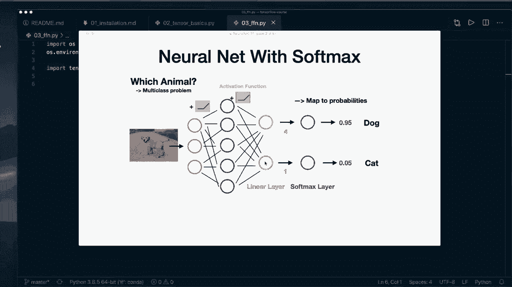

So in this beginner course， we concentrate on the Kaa sequential API。

 but I will also cover the subclassing API in later episodes。

 So for now let's use the sequential API and let's jump to the code。

 So I already imported Tenofflow and I silenced some warnings like in the last episode so you don't need to worry about this。

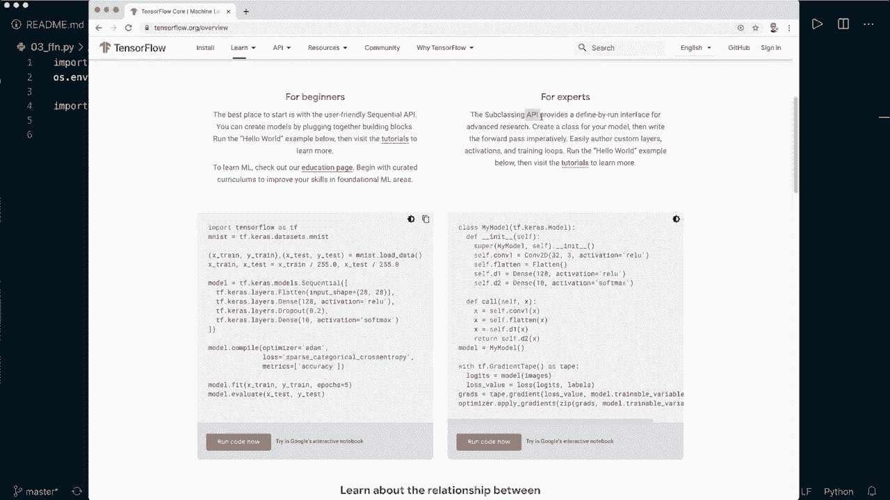

And now let's start implementing our network with the Kaas API。 So we also say from Tensflow。

 we want to import Kaas。 And since Tensorflowlow 2， this is included。

 So before it was a separate API。 But now it is fully integrated。

So then we also import nuy S N P and we import matplot Li do pi plot S PLT because I want to show you a plot。

And now let's get our data set first。 And in this tutorial， we use the Mnis data set。

 So the famous data set for handwritten diit classification。

 And this is included in Kas do data sets do Mni。 And then we get training and testing sets by saying x train and Y train。

 and then comma and then another tuple and then x test and y test。 And this is Mist dot load data。

 So we have to use two tuples here because this is what the load data returns。And then， for example。

 let's print X train dot shape。And let's also print Y train dot shape。

 So now let's open our terminal。 And here I' am already inside the virtual environment with Tensorflow installed。

 So let's run this file。So this is this file here。 And let's have a look at the shape。

So we see our xtrain has this shape， so we have 60000 training images。

 and each image has the size 28 by 28， and then we have 60000 labels corresponding to the data here and by the way。

 this is a nuy and D right now， so this is not a tens of load tensor。

 but we can still use it for our model then。 So the first thing I want to do is I want to normalize the data because right now。

 the images have values between0 and 20055。 and we want to normalize this so that the values are between 0 and1。

 So we say x strain and x test equals and then we say x strain divided by 255 as float。

And the second one X tests divided by 255。 So we can do this in one line for both data sets。

And now let me copy and paste some code in here。 So I want to plot the data。

 So we just say P T I to plot6 different images。 So the first six digits。

 So let's run this and have a look at the plot。 Allright， so this is what the plot looks like。

 So here we see the handwritten diits。 So very simple。 And this is what we are going to classify。

 So let's remove this。 and let's build our model。 So let's build our model。 And as I said。

 we are using the sequential API。 So we set model equals。 And this is a ks dot model dot sequential。

 And here we pass in a list with all the different layers。 So similar like here。

 we want to have different fully connected layers。

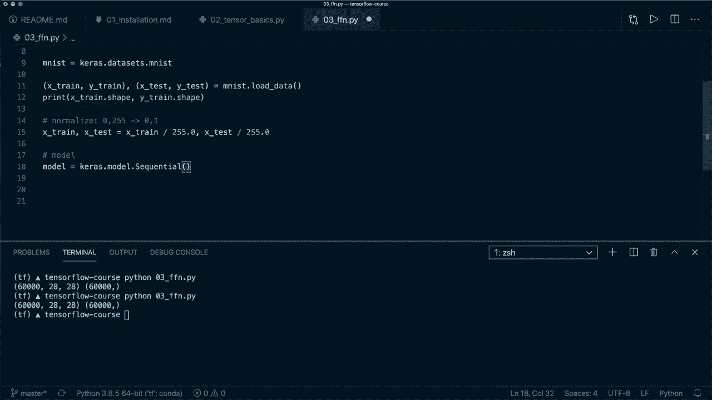

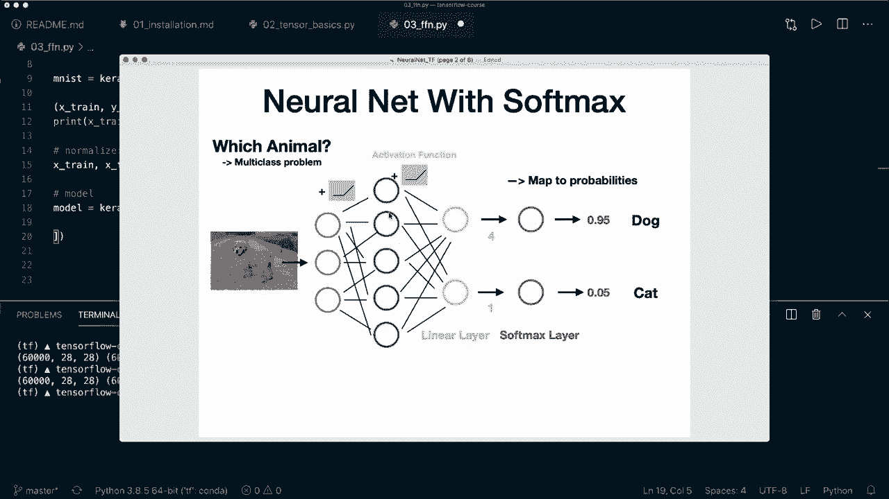

So let's start with ks dot layers dot flatten。 So this just flattens our image to be to reduce one dimension of this 28 times 28。

And then we are going to use our first real fully connected layer。 So we say ks dot layers dot dense。

 So the dense layer is the fully connected layer in the Kaas API。

 And here we have to specify the output。 So this is a hidden size that we can specify。

 So I am going to use 128， but you can use a different one here。😊。

And then we also say activation equals reus。 So we're going to use the reou activation function。

 So if you have a look again， at this plot， then usually all these layers are followed by activation functions。

 So I have a full tutorial about activation functions in the pytorch beginner course。

 but the same concept applies here too。 So I will put the link in the description。

 and you can check it out。 But basically what you should know is that it introduces nonlineity。

 and it improves the training。 So it makes our model better。

 So we should use a activation function after each of these layers。

 and then so let's use just one in the middle。 and then let's use our final layers。 So this is again。

 a dense layer。😊。

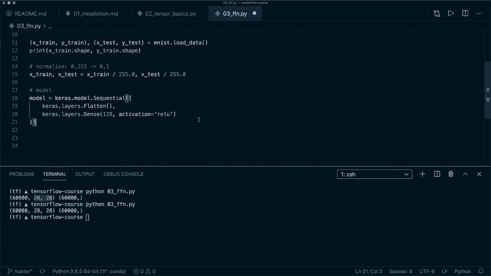

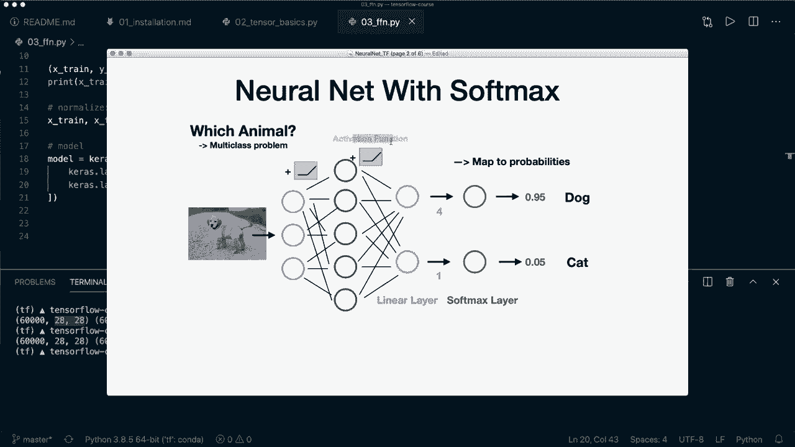

And now we need to specify 10 outputs。 So we want to have。 so we do have 10 different classes。

 And for each class， we need one output。 So So in this simple example。

 we only have two different classes doc and cat。 And that's why we only need two output layers。

 but in our example， we have 10 classes。 So that's why this must be 10。 So this has to be 10。

 but you can play around with this size。 And then as I said， we want to get the probabilities。

 So that's why we need a soft marks layer。 So we could。

 we could include this here by saying ks dot layers dot soft marks。

 But actually in the tens of load docs， they say that this is not recommend it。

 but instead you should。

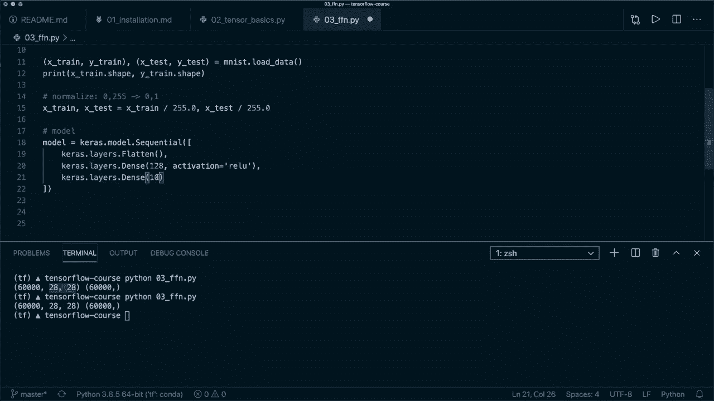

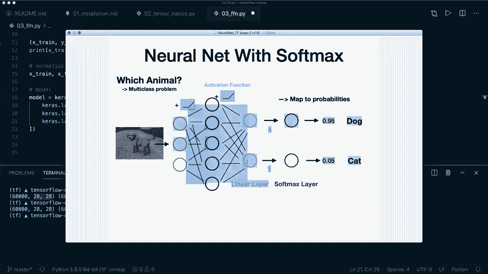

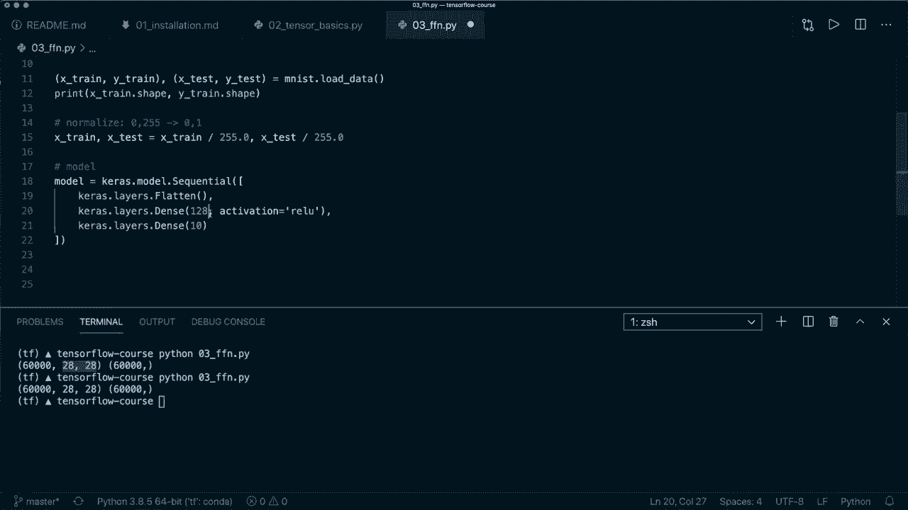

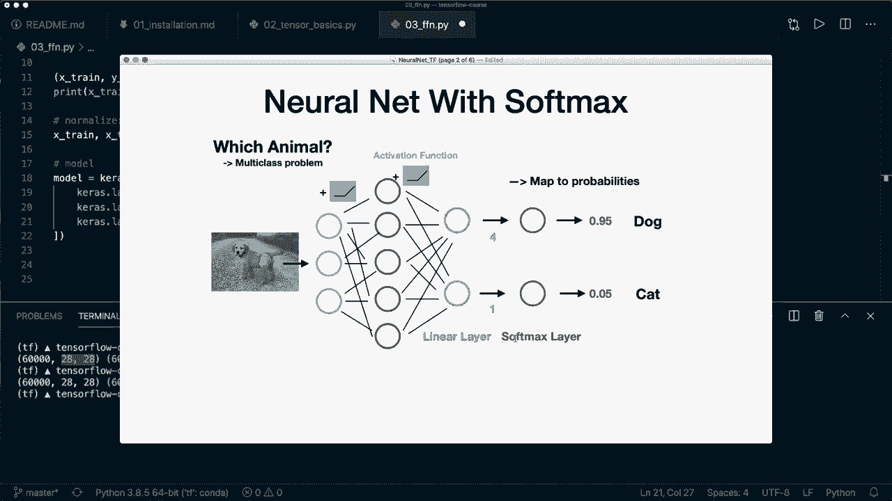

Included in your loss function later。 So we leave this out for now。

 So now this is all that we need for our model and our model can automatically determine the correct input sizes。

 we only need to specify the output sizes。 but let's say after we create this。

 we want to call model dot summary and we want to print this。 So right now this doesn't work。

 But if we specify the first input size。 So here we can say input shape equals and then 28 by 28。

Then this works。 But you don't have to do this。 You can also。

 it can also figure this out when you fit it to the training data later。

 but then you can only print this after you compile your model。

 So it's a good practice to include this here。 So now let's save this and run this again。

 and then we will print the model summary。 And here I forgot to include an S。

 So it's called Kara dot model dot sequential。Alright， so here this is the printed summaries。

 So it prints all the different layers。 So here we see our first flattening layer。

 and this is the shape 784。 So this is 28 times 28。 It reduces it to one dimension。

 And this is not an actual layer that we have to train。 So it doesn't have parameters。

 And we have our first dense layer with 128 output shape。 And this is the number of parameters。

 and then our second dense layer with 10 outputs。 And here， the first one is just none。

 So this is the number of samples that we don't know yet。😊。

And then we also see the total parameterss and the trainable parameterss。So， yeah。

 so now we already have our model。 And by the way， so I think you can already see how simple it is with this sequential API。

 And there's also a second way to do it with the sequential API so you can set up your model like this。

 And then at each layer separately。 So you can call model dot at。 And then you use this layer。

 and then you see， say， model dot at。 And then you use this layer。😊。

Model dot at and the second layer and then model dot at。 and the last layer。

 So this is doing the same thing。 But this is the advantage that now you could print model summary after each operation and figure out how your training looks。

 So， yeah， keep that in mind that you can do it like this as well。

 So we're just going to use the first one。And comment this out again。

 So now we have our model and now the next thing we need is we need the loss and optimizer。

 So in a multiclass classification problem。 typicallyy we use the categorical cross entropy。

 So we say loss equals and then we say ks dot losses。

 And then here this is actually called sparse categorical cross entropy。

 And this is because our y is an integer class label。 So it's 0，1，2，3 or something like that。

 And that's why we use this sometimes the label is also encoded as one hot。

 So a one for the class 0 and then90s for the。Other classes。 So in this case。

 we just use the categorical cross entropy， but in our case， we use this one。

 And we also say from logics equals true。 And this is because here at the end。

 we didn't include the soft marks。 So we still have the raw numbers， the raw las。

 So we have to use this， Otherwise it won't train very well。And then we need to create an optimizer。

 So we say Kas dot optimizers。 And then here， let's use the Adamom optimizer。

 a very popular optimizer。 and we need to give it a learning rate。 So we say this is 0001。

 So this is the one of the most important socalled hyperpar that you should tweak in the beginning to get a good result。

 So play around with this。 And then we also define some metrics that we want to track。

 So in this case， and this should be a list。 And here we only want to track the accuracy metric。

So when we have this， then we call model dot compile。

 So this is what we do with the Tensorflow framework。 And then we say our loss equals the loss。

 our optimizer equals the optimizer and the metrics equals the metrics。

 So this will configure the model for training and after that we can start the training。

 So let's define the batch size and set this to 64 and set the number of epochs for our training。

 So here I only use5 epochs and then we can simply call model dot fit and we want to fit the x train and the Y train。

 So our training data and we specify the batch size equal。The batch size。

And the epoch equals the epoch。And then we said shuffle equals true。 So this is the default。

 but I want to stress this that you should always do this during training。

 And then let's set ver equals 2。 So this is just for logging0 means no output 1 means a progress bar and two means normal logging。

 So this is all that we have to do to train our model。 So again。

 we build our model with the sequential API。 Then we define the loss and the optr and optional sum metrics。

 So we don't have to use this here。 but we can。 And then start the training with model dot fit。

 And now we can already start training this。So， let's run this。

So now we see that it's starting the training and after each epoch， it prints the somesymmetric。

 so it prints the loss and the accuracy because we specified this。And we see that after five epochs。

 we already have a very low loss。 So this decreased and our accuracy is 98 per cent。

 So our simple neural network is already very good for this task。So， now。That we trained it。

 What we want to do then is want to evaluate our model。

 and we can also very simply do this with by saying model equal model dot evaluate and then we use our test data。

 So we use X test and y test。 And again， here we use the or can use the batch size and set this to our batch size。

 and I also set ver both equals true equals2 for some logging。 So this is how we evaluate it。

 and so the batch size means that it takes some batches and performs the computations on the batches。

 So this can make the training and evaluation faster and even and also improve the training。

 So let's。Let's run this again。 So for now， I didn't save the model。

 So now I have to train it again and then evaluate it。 So let's run it。 And in later episodes。

 we learn how we save our model after the training。 Alright， so training a done So again。

 we see the five different epochs。 and then we have one print statement for the evaluation。

 So we see that it's。Slightly lowered the accuracy for the test set， but it's still very good。

 So now we already have a very good training to classify the amnes digits。

And now let's see how we can do some predictions with our model。

 So there we have several different options。 and again。

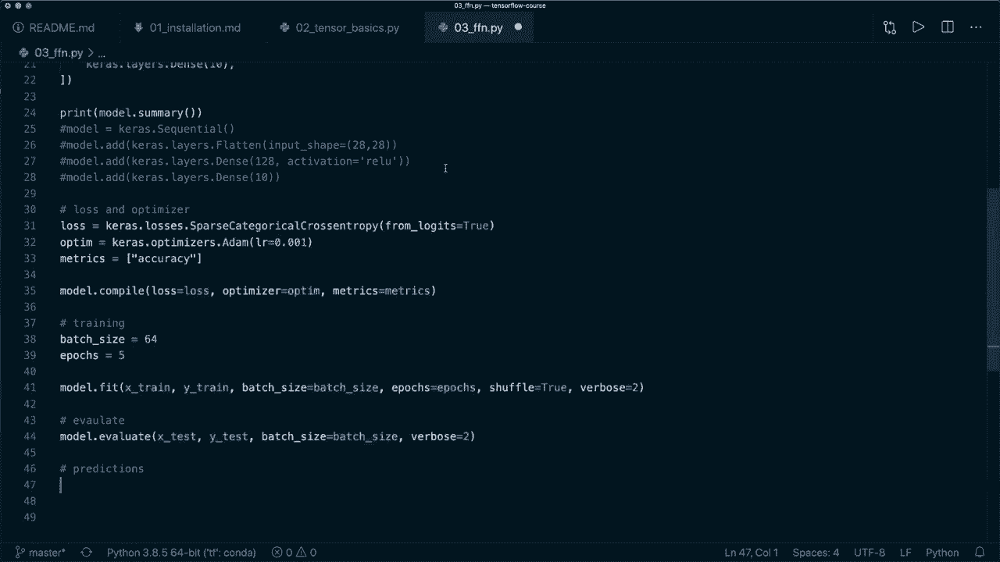

For the predictions， we need the soft max layer to call the probabilities。 So we didn't。

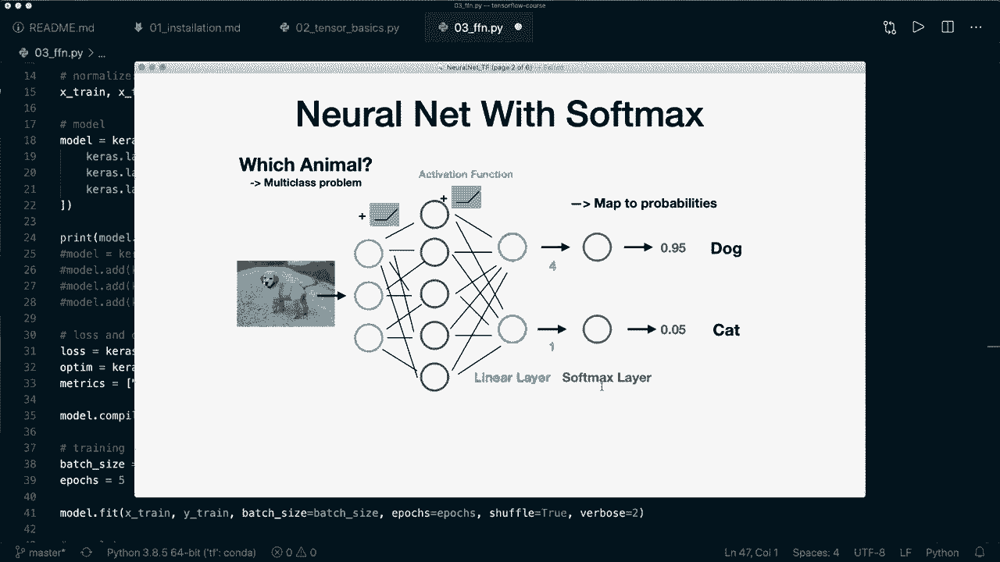

Put this in here as the last layer， but it was automatically included here during the training。

 but now we need it。 So our first option is to create a new new model。

 So let's call this probability model。 And this is also a Kaas dot model dot C sequential model。

 And here this is one new thing that I want to show you。 we can pass a whole model into this。

 So we can put in our original model。 So now it has all of the layers of this model。

 And now we use the kra dot layers dot softms layer。

 And now we that we have this we can call this probability model。

 So we say predictions equals probability model and then pass。In the X test data， so。

Now we have this。 we can， for example， get the first prediction by saying this is the predictions index0。

 And let's print this here。 So print prediction 0。 And then this is the probability。

 So now we want to choose the class with the highest probability。

 So we can do this by calling the arc max function。 So we say label 0 equals nuy dot arc max。

 and then of this prediction pre 0 and then print the label 0。 So now let's save this。

 And now I run the training and evaluation again and then print this for you。 Allright， so it's done。

 And here it it prints the prediction 0。 So for。

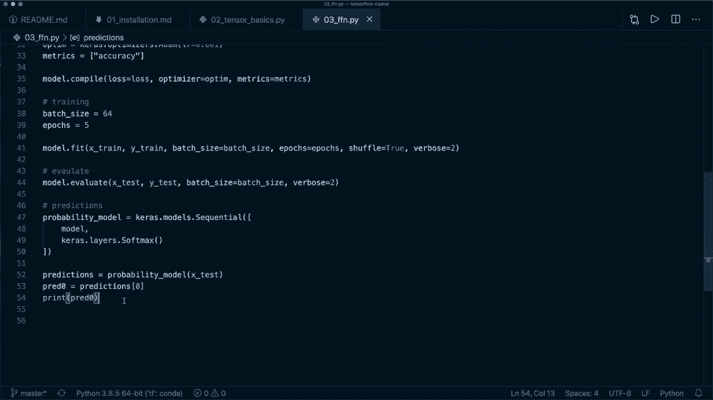

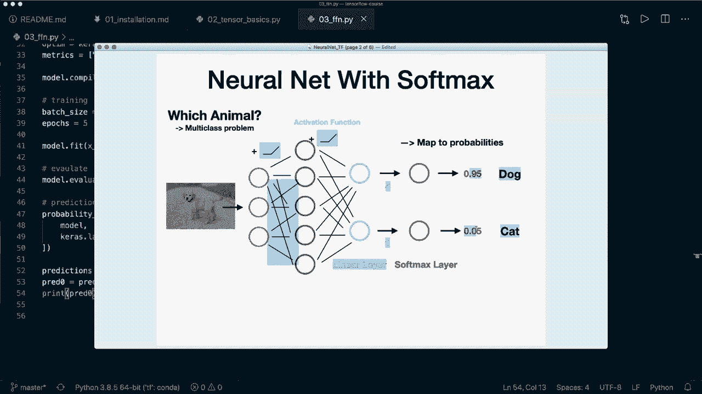

Each class， it has a probability。 and then we take the label or the index with the highest probabilities。

 This is index 7 in this case。 So I think it's。This one。 So 9。49。 This is the highest one。 So yeah。

 this works。 So this is the first way to do it。 The second way is to use our original model plus the soft marks separately。

 So we can say the same as we are doing here predictions equals。

 And then we call the original model and pass an x test。

 And then we apply the soft marks for ourselves。 So we say predictions equals Tens offlow dot N N dot soft maxs。

 And then here we put in the predictions。 And now we have the same as we have here。

 So let's print this one。😊，And then when we run this and print this。

 then we should see the exact exact same numbers。Oh， sorry， I stopped this for now。

 So here I forgot to get the prediction 0 so that we see this is the same here。

So let's clear this and run it again。 Alright， so again， our training is done。

 And here you can see that it prints the exact same numbers and the same class label。

 So you can do it like this。 And then as a third option instead of calling model and model like this。

 you can also call model dot predict。 and then the data。

 And here you can also specify the batch size equals the batch size。

 then it computes it for each each batch。 So this is also what you can do。 and again。

 the numbers should be the same。And now let's not only get one single prediction。

 So let's say we have two or five different predictions。 So let's call the 0，5s。

 And then we get this by saying predictions and use slicing from index 0 to index 5。

And now let's print the pre0，5 dot shape first for you。 And now if we call the arc max for this。

 So now let's say our label 0，5s equals， and then if we get the predictions。

 if we call the nuy dot arc max， with this5 predictions。 then we also have to specify the x。

 and in this case， we want to compute it along xs 1。And now we should get five different labels。

 So print label 50s。And now let's clear this and run it one more time and hope that this works。

 Alright， so again， this is done。 we see that again， with this model predict。

 We get the same numbers。 And then this is our shape。

 So 5 by 10 So  five different samples and or predictions。

 and for each prediction10 different probabilities like here。 And if we call the arcms along X 1。

 then we get five different labels。 So again， the first label is label 7 like here。

 And these are the next predictions。 Yeah， so this is how you can predict it。

 And I think this is all you should know to build your first neural network。 So again。

 you build your sequential model， then you set up loss and optimizer， Then you compile the model。

Then you call model fit and model evaluate。 And then when you want to predict。

 you can call model predict。 But yeah， don't forget to call the soft marks if you want the actual probabilities。

 And yeah， I think that's all for now。 And I hope you enjoyed this tutorial。

 Please hit the like button and consider subscribing to the channel。

 And I hope to see you in the next video by。😊。

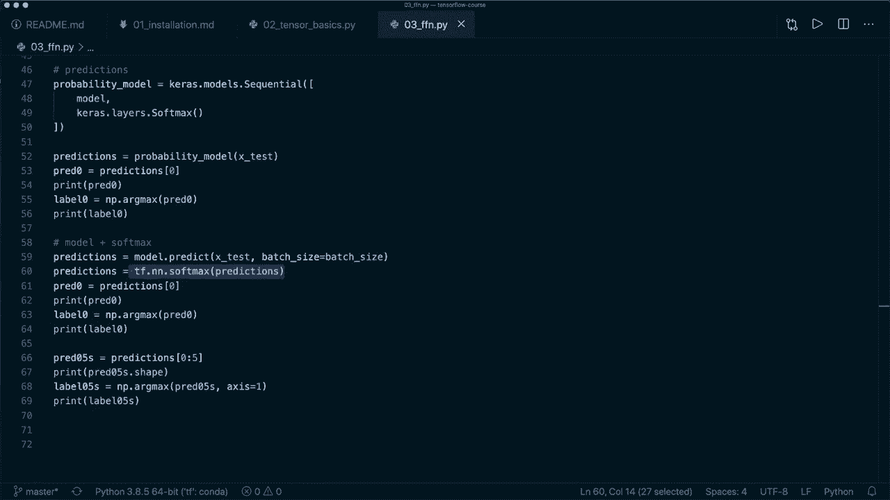