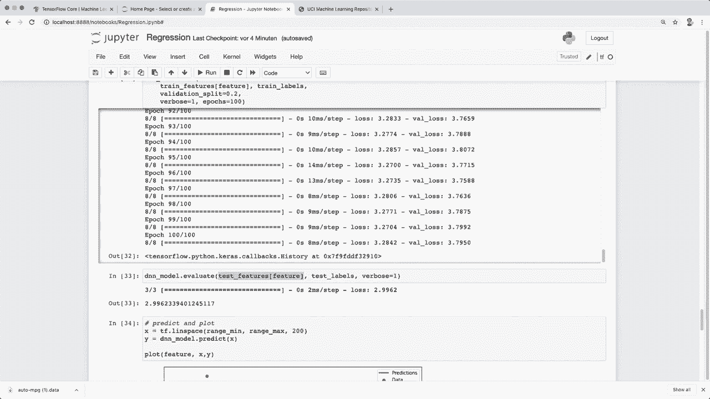

# 【双语字幕+资料下载】面向初学者的 TensorFlow 教程，理论知识、代码思路和应用案例，真正从零开始讲明白！＜快速入门系列＞ - P4：L4- 线性回归  完整项目演练 - ShowMeAI - BV1TT4y1m7Xg

🎼，Hey， guys， welcome to the next Tensorlow tutorial。 In the last video。 we learned how to create a neural network and then train and evaluate the model and make predictions。😊，Now in this tutorial， we implement our first real world project。 so we deal with a regression problem， and we learn how we load the data。

 analyze the data and apply some pre processing。And yeah， as I said last time。 we already used a deep neural network。 and here we first take a step back and apply only a linear regression model。 So only one layer。 But at the end， we extend this to again， a deep neural network。 And with this。 you should get a better understanding of the Keerra stance layer。

 and also of activationctuaation functions。 So here I am in a twopyter notebook。 And you don't need to worry about this， this just makes life a little bit easier for me to explain the code to you and show you the different steps。 But you can code all of this in a normal python file。 So let's start and first。 we import the things we need。 So again， here， I silence some warnings。 Then we import mappllip nuy。

 and then this is new。 So now we use pandas。 and you can install this with Pip install pandas。😊。So this makes it very easy to work with data sets and analyze them and modify them。And then here I set some print options to make the outputs a little bit nicer。And then we import the things from Tenofflow。 So again， we import Tensofflow STf。 Then we import Kas。

 So the last time I told you about the Kaas API and we already use the ks layers。 And now this is new。 So we also import from Tenorflowlow ks layers do experimental。 we import preprocessing to apply a preprocessing layer to our data。 So these are the imports we need。 And now for the data set。

 So we are going to use this autompg data set。So this is a data set from the year 1983。 and here we have different features and with this we predict thempg for a car。 So how many miles a car can travel using one gallon of fuel and so here this is a very popular website where you find a lot of machine learning data sets。 And now if you click on the data folder then here you get the link to the actual data。

 So now here in the twopiter notebook， this is the exact same URL。 and I already wrote the different column names up here and then with pandas we can say pandas do read CSv So the ending here is not do csv but it's still in the CSv form。So we can use this and you can also use this method if you have a Csv file on your disk。 So this works as well。 So now let's load our data and then we can call data dot tail So this prints the last five columns So here we see thempg value that we want to predict and the different features。

 So for example， we have the number of cylinders， the displacement， the horsepower。 the weight acceleration model year and or written。 So yeah。 this is our data sets and now we clean our data set。 So in here we have some missing numbers and we can very simply exclude them by saying data dot drop and a and then we also change this last column here because。

This is actually a categorical value， and all of the other ones are numerical values。 So this might confuse our model。 So we want to change this in a one hot encoded data。 so we can call data set dot pop or written to remove this。And here in the origin。 we have the different countries， USA， Europe and Japan。 So we can add them like this。So now， again。

 if we have a look at our tail， then we see we removed the origin value and instead included one hot labels。 So here for label 1。 our it's the USA for label 2， it's Europe。 Then again， label 1。 So again。 USA has the one and so on。 So now we have this。And now we want to split our data into training and test sets。 and we can do this by calling dot sample and then use a fraction here。 So use 80% for training。

And we again， drop the samples。 So all of the samples。 all of that we specify here are not included in the test set。And then yeah。 let's print print the shape and let's also describe our dataset set so we can very easily do this with pandas as well by calling the dot describe function。 And then here we see we have our whole data set has 392 samples and then 10 different columns for now。

 And then our test data， our training data is 80% so 314 and the rest is for testing。And now if we call the describe function， then it analyze some statistics like the number of samples。 the mean， the standard deviation， the min and max。So this might be useful to analyze it。 And first of all， now what we want to do is we want to split the features from the labels。

 So we want to this is our label that we predict MP。 So first we make a copy。 So we say these are our training features and our test features。 And then we simply pop the MP G column from the training and testing data。 And when we pop this。 then this also returns the data。 So this is now our training and testing labels。

 So now we have this。Then here's a simple function to plot the data with mappl lip。 and now let's simply plot one feature。 So let's plot the horsepower feature。 And we plot this against thempg value。 So we see the more horsepower our car has also the less is the value of MPg。 and this makes sense because the more power our gas has the more fuel it needs。

 So the less is the MPg。 And so then we also let's plot the weight feature。 and this should have a similar distribution。 So again， the higher the weight of a car。 the more fuel uses it， and the less is the number of the MPg value。So， yeah。So this is how our data looks like。 And now if we go back to the describe function and have a look at the different mean values。

 then we see these all have different ranges and this is again。 a very important issue that we have to consider。 So this these different ranges if if we leave it like this。 then it might confuse our model。 So it's recommend to normalize the data first and to normalize。 So let's print again， let's describe our training data set and only the but let's print only the mean and the standard deviation。

 So if we run this again then here we see the different means。And now to normalize it。 we used this normalization layer from the pre processingces module。 So this one here that we imported。So let's code this。 So here we create a normalization layer。 So we say normalizer equals pre processing dot。Normalization。

 so this is a kas layer for the sequential API。 And to call this。 we have to adapt it to our to the data。 So here we say， normalizer dot adapt。 And then we want to adapt it to the training features。 And right now。 this is a panda data set so we can convert this to a nuy array。 and then call the train fee。Cers。

So what this is doing for now， this simply store calculates the mean and the variance of this training features and then stores them in the layers。 So now， for example， we can say print and then normalr dot mean dot nuy。 and then if we run this。Then we see here this。 These are our mean values， and these are the exact same numbers as we see here if we go this first column down。So this simply stores it。 And now whenever we apply this layer to our data。

 then it normalizes the features such that it computes this this formula。 So it subtracts the mean and then divides by the standard deviation。 and this means that our output has a zero mean and unit variance。 So here let's get some example。 So the first data from the training features。Then， let's print this one。

So this is the first data unized。 And then we also want to print the normalized one。 So。 let's print nor。Maized。 And then here we have to call this layer normalr with our data。 So first。 and then convert it to numpy。 So this is how we convert from a tensor flow tensor to a nuy array。 So let's run this。 And then we see we have the。The first layer with different scales and ranges。

 and now our normalized data。 So they are all somewhere around0 with a unit standard deviation。 So this is how we apply a normalizer preprocessing layer。 And now let's tackle our regression problem。 So in regression。 So we somewhere we have this distribution that we know from the training data。

 and now when we get a new data， we want to so for example。 here we get a new weight sample and then we want to predict how muchmpT we have for this car。 and for this， we fit a function So a linear function with this formula so we can approximate it withmp times x plus B。 So this is a。Basically a line equation and we use this with the layers with the dense layer。

 Sos better understand this。 Now， first， let's not use all of the different training features that we have。 So all of these so let's just use one so that we can stay in the 2D case so in this case。 for example， its let's use the horsepower So here let's define our feature and this should be the horse power label so I will implement it like this so then you can just change the feature here and then you can try out different features so we can also for example。

 use weight here so all of these names you can use here as a feature and now let's get the single feature or the single data so let's。Call this single feature equals Ny array。 And then from our training features。 and then we can access it with the feature。 This will only return the horsepower feature。So let's print this。 Let's print single fee。Feature dot shape。 And let's print train。

 features dot shape。So now， if we run this。嗯。Here I have a typo array。Let's run it again。 Then we see our single feature only has one feature。 And in the whole training data。 we have 9 different features。 So then up here we。Created this preproces or normalization layer and then adapted it to all of the features。 So basically we have to do the same thing， but now adapt it only to the horse power feature。

 So let's call this single feature normalizer then again， our single feature normalizer。 we call the adapt data and adapt it to the single feature single underscore feature。 So now we have this and can run this code and here I have one parentheses too much。 So again。 So now we have this single feature。 and now we create our sequential model as the last time。

 So this is very easy with the Kaas API。嗯。So， we say， our single。Feature。Model equals。 And then we say， Kas dot。Models dot sequential。 And then here we use a list with all the different layers。 So we use this as a first layer。 So the single feature normalizer。 And then we only use one layer。 So one dense layer。 and the output or also called units number of units is only one。

 So this is all that we need to build a linear regression model。 So this is a linear regression or linear。Model that applies exactly this formula。 So it has some weights and multiplies it with our input。 And it also has a bias。So this is all that we are doing here。 So let's run this。 and let's print the model summary。

 And then we see we have our normalization layer and our dense layer and only five parameterss。5 parameters。 So it's very simple。 And now as a next step。 the same as last time we define a loss and a optr。 So for the loss， we use ks dot losses。 And in the case of a linear regression， we can use the mean absolutearrow。

 So this is one possibility， we could also use the mean squaredarrow。 So you can try out both。😊。And so this is simply this one is doing the so the prediction y prediction minus the actual y。 and then the absolute value and then sum it up over all samples and calculate the mean value and the mean square error is the same。 except that it's using the square here and not the absolute value。

 So yeah try that out for yourself。And now the optimizer equals。 So the same as last time Kaas dot optimizers dot。 Let's use the Adamom optimizer。 and we have to give it a learning rate。 Let's try out point1。And then after we have this。 then we compile our model。 So single feature model dot compile， compile。And here we give it。

 The optr equals the optimizer and。Optim and the loss equals the loss。 And yeah。 last time we also gave it the metrics that we want to track So the accuracy。 but the accuracy doesn't make sense here for the regression。 So we leave it away。 And then we simply see the loss later。 So let's run this。And now to train the model。

 we simply have to call model dot fit like the last time with our training features and here we only want the single feature that we define so the horse power in this case。 but we still include all the training labels then we define the epochs then here I set verbose to one to see some logging and we can also define a validation split so this automatically takes 20% of the training data and then uses it for the validation data to tweak the hyperparameter。

So let's train our model。And now， training is done。 And now we see that the loss decreased。 and we also see the validation loss decreasing。And at the end， we have a training loss of 3。8 and a validation loss of slightly more 4。1。 So it's not very bad。 and by the way。 if we call model fit， then this returns the history， where it stores both of these losses。

 So we can assign it to a variable， which I call history here。 and then I simply plot the history。 So then we can access these two losses by calling history dot history and then access the loss and the validation loss。So let's plot this and then we see that our losses decreased， so it's， it looks very good here。And then to evaluate our model， we simply， like last time。

 call model dot evaluate with our test features only with horsepower and the test labels。So let's run this。 And this was very fast。 So here we see。 we have a final loss for the test data of 3。6。 So not very bad。 And now let's predict some samples。 So in this case， I simply create。Test data。 So all the values between。

The min value and the max value and increase the range a little bit。 You could also just use a hard coded number here， like from0 to 250。 But I want to be it like a little bit more suited for the used feature。 So we use this。 And then to predict， we call model dot predict。 And then our new test data that we want to predict。

 And then we plot it with our function from the beginning。And this is the same plot as in the beginning。 So we plot the horsepower against the MP7 value。 And then these are our new x values that we predict。 and we see that our prediction。 So here we plot a line。 and this is a linear line since we use a linear regression model。

 And we see that it's not too bad。 So we see the same trend。 So the more horsepower our car has the lower the MP is。 but for example， here in this area。 it's staying the same except that our horsepower is further increasing。 So yeah。 in this area and also maybe in this area area， it's not perfect。 So but in the rest。

 it looks it looks okay。So， yeah， so this is how we apply a linear model。 and again。 we only need the one dense layer with one output unit。 and we also apply this normal normalization layer。 So this is all we need to use linear regression。 And now let's extend this to a deep neural network。 So as I said， with only one dense layer。

 we can only use a or only get a linear linear function here like this， which is not perfect。 So to further improve this， we can introduce more layers here and convert this to a fully feet forward neural net。So we simply， we still use the normalization layer and the dense layer at the end。 But in the middle。 we use some more dense layers。 So let's say， layers dot dense。

 And then here you can try out different values for the hidden size。 And as I said in the last time。 we also apply activation functions for these layers in the middle。😊，So let's yeah。 let's use the relu again， like last time。 And then let's use the same one again。And yeah。 and then at the end， we use our dense layer with one output。 And now this is all we need。

 And now we converted our linear regression model to a deep neural network model。 So let's use this。 And then again， we compile it with the loss and again。 a atom optimizer and call the summary to see the different layers again。 And then we see there is a lot more parameters that we have to train now。 So now again。

 let's call model fit with our horsepower feature and start the training。😊，And training is done。 And we see the final model or final loss is slightly better now。 so slightly lower than before。 So let's evaluate our model。 And now it's below three。 So it's definitely better。 And now again。 let's make some predictions and plot this。 And now we see a new plot。

 And now we see that our function is no longer only linear。 But here we also have some nonlinear areas。😊，And this is the effects of the activation functions that we used。 And that's why this is such an important thing in neural networks to apply activation functions。 So here again， we have this only our linear regression model with one dense layer。

 So here we can only predict a linear function。 And now with a deep neural network。 we can get a non nonlinearar function as prediction。 So yeah。 I think that's all and now so we only used one feature for now so that we can stay in this 2D case。 but of course， we can include all of the features and we do it the same。

 So we don't have to change anything actually。 So we use this normalizer that we adapt it to all the。Maining features。 And here we have only our single dense layer。 Then we compile this。And then we fit it here to the all of the training features and train it and。And now。 training is done。 And we see that the loss is also below 3。 So training on all features makes it。

Further， better。 And now let's evaluate it as this last thing。 And then we see we get the final loss。So yeah， so you see you don't the code is actually the same。 We just use all of the training features here and also for the normalizer。 we adapted it to all of the training features。 So yeah。

 I think now you learned a lot in this tutorial how we can download and load CSv data and how we analyze it and preprocess it with the pandas framework and then how we use the normalization layer to normalize our data and then how we set up a a single linear regression model with this dense layer。

And then again， training and evaluation is the same like last time。 And yeah， and we also。 you learned about the effect of the activation functions in a deep neural network。And yeah。 that's it for today。 I hope you enjoyed this tutorial。 And if you liked it。 then please hit the like button and consider subscribing to the channel。

 And I hope to see you in the next video， bye。😊。