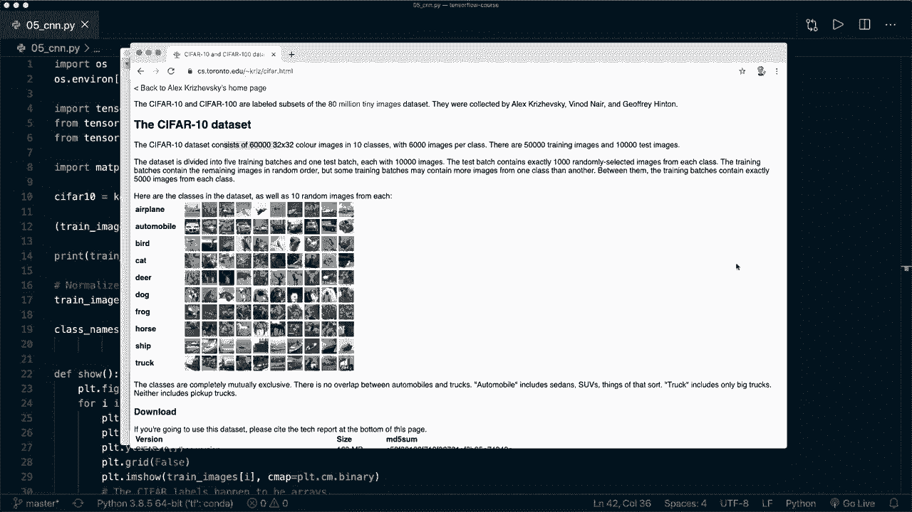
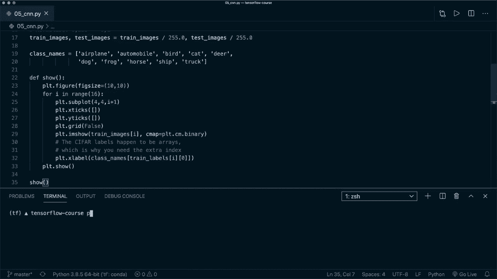
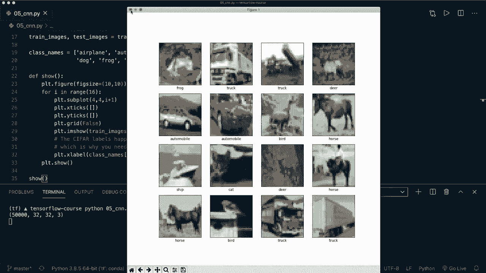
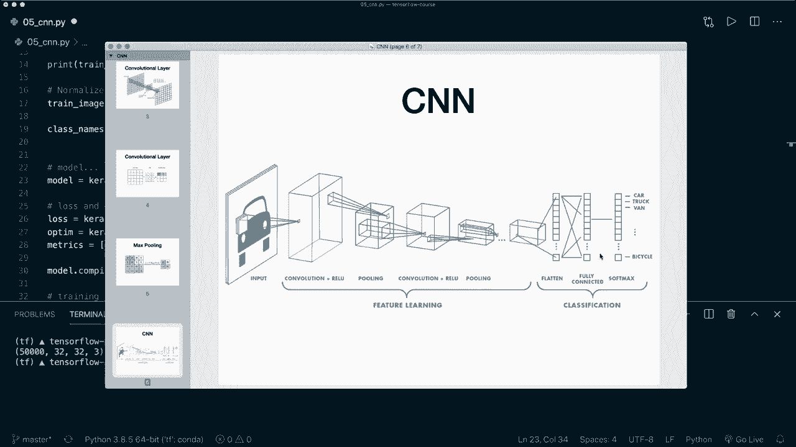
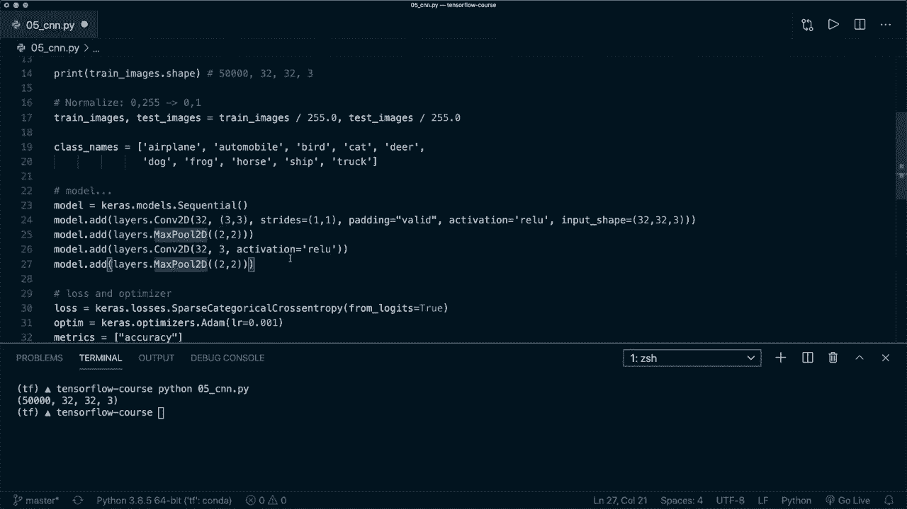
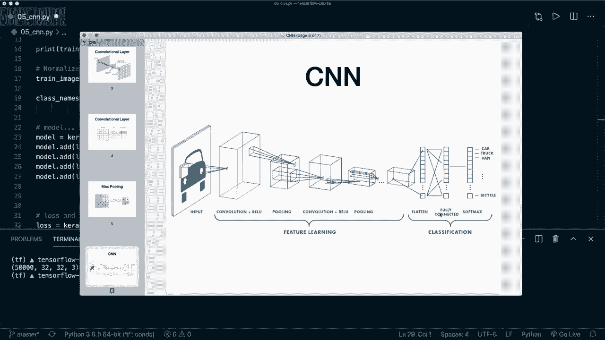
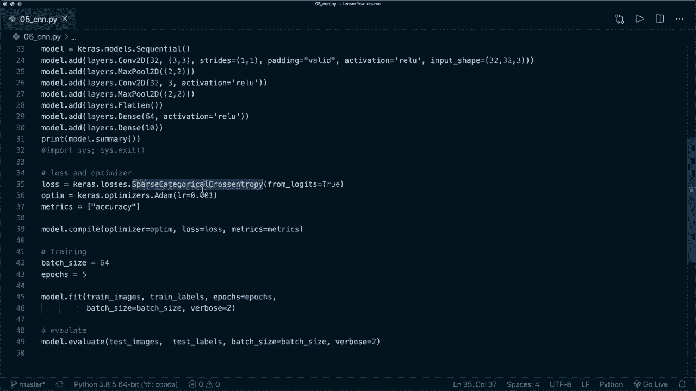

# 【双语字幕+资料下载】面向初学者的 TensorFlow 教程，理论知识、代码思路和应用案例，真正从零开始讲明白！＜快速入门系列＞ - P5：L5- 卷积神经网络(CNN) - ShowMeAI - BV1TT4y1m7Xg

🎼，Hey， guys， welcome to another Tensorflow tutorial。 Today。 we are going to implement our first convolutional neural net。 So a convolutional neural net looks similar to our feet forward neural net from lesson number 3。 The main difference now is that we use convolutional filters instead of just dense layers。

 So here's a typical architecture of a confnet。 We have our input image。 and then we apply different convolutional layers with activationation functions like here， the relo。 And we also apply pooling layers to reduce the size of our image。 And then at the end。 we do classification。 And this means that we use a fully connected layer at the end。

 Also known as the dense layer。 with an output for each class that we have。 So our convolutional layer uses convolutional filters and the filter slides over the image and then。😊，Calculates a new value and writes it into the output image。 so I will not go into detail here。 but I will provide some links if you want to learn more about the theory here。

 So here's another image of a convolutional filter。 So at first we put it at the rat position and then we calculate the convolution and write the output in here and then we slide it to the next position。 So the green one and do the same and then we slide it to the blue position and do the same。 And this is how we calculate the convolutions。 And then we also apply max pooling。

 which is also just a filter， for example， here， a two by two filter and we put it at the first position and calculate just the maximum value like here。 the 20 and write it to the output。 and then we slide it to the next position and do the same and so on。

 So this reduces。The size of our image。 And this is all the concepts that we're going to apply。 So here again is an image of the architecture that we are going to implement。 So we have the input image then we apply convolution plus the reo activationation function plus pooling。 then we do the same thing again。 And at the end we do we flatten the image to squeeze it into one dimension and use a fully connected dense layer with the softmax activationation function and then do the classification。

 So this step at the end is the exact same that we used in tutorial number3。 So I recommend that you watch this one first。 if you haven't already And now we can jump to the code。 So in this example， we are going to use the scipher 10 dataset set。 This is a image data set of 60032 by 32 color images and we have0。

1 different classes that we see here， for example， airplane， a car， bird cat and so on。 And this is what were going to classify。 So now let's jump to the code。 Alright。 so here I've already written some code。 So this is similar to the code and tutorial number 3 So again。 we import the things we need like Tensorflow and ks and layers。 Then I import matpllip。

 Then we use the ci for 10 data set， which is integrated in Kara data sets and we can split this into training images and test images。 And now if you print the shape， we see， for example。 that this is the training images has 50000 samples and each image has the site 32 by 32 by 3 because it has three color channels。

Then we normalize our data。 So we want it to be in the range from 0 to 1。 Then here I have the different class names。 and I written I've written a helper function to show you some example images。 So let's run it up until here。 So now if I say Python。 and then the name of this file。 Then we see some example images here。 and the images are very blur because our dimensions are very small。

 but that's okay。 So now let's stop this。 and now I can remove this code for plotting。 So we don't need this anymore。

And now here we define our Kaa sequential model like the last time。 And now this is what we have to implement。 And then the code after that is exactly the same as in tutorial number 3。 So again， we define our loss and the optimizer。 So here we want the sparse categorical cross entropy and say from logics equals true。 So that it applies the softm。 So this is important here。

 Then we define some metrics that we want to track。 And then we have to call model compile。 and after that， we start our training by simply calling model dot fit with our training images and training labels。 And then we can evaluate it by calling model dot evaluate with the test images and the test labels。 So yeah， that's the whole code。 And now the only thing left to do here is to define our model。

 So now let's have a look again。 So again， we want to apply。

Convolutional layers with an activation function and a pooling layer。 And then the same thing again。 And at the end， we want to flatten it and apply the fully connected layer。 So let's do this。 So first， let's add a convolution layer。 So we can do this by saying model dot at。 And then we use a layer from ks dot layers。 And then this is the con2D layer。

 So a 2D convolutional layer。 And now first， we have to specify the filters。 So this is the number of output filters after this convolution。 So here we say 32。 Then we have to specify the kernel size。 So here let's use a filter kernel of size 3 by3。 Then I also write the strides and。

Heading here for you。 So strides equals， let's say 1 and one。 This is just the default。 How much we want to slide， how far we want to slide it over the image。And padding equals valet。 So you have the option to say validale or same。 These are basically two different rules。 How the padding is applied。 So let's say valid here。 And then， as I said。

 we want to use an activationation。 So we say activationation equals Relu。 And for our first layer。 we also specify the input shape。 And this is 32 by 32 by 3。And now we have this。 So now， after that。 we want to apply a pooling layer。 So we say model dot at。 And then again， layers dot maxs。Poulling 2D。 And then here also we can define the pool size。 So here。

 let's just use two by two as default。 or I can again write it for you so that it's clearer so we use a two by2 max pooling layer And then we do the same thing again。 So let's copy and paste this。 And here we remove the input shape so we don't need this anymore。

And let's also remove this because this is just the default。 And then here I want to show you that you can specify a value for each dimension。 or you can just specify a single integer value。 And then it's using this for each dimension。 So this is the same as this。And then again， a another max pooling layer。And now we want to。

 let's have a look again。 Now we want to flatten it and then apply the fully connected layer。 So now we add a model dot add and then layers dot flatten。

So we squeeze it into one dimension， and then we say model dot add。 And we want to add a dense layer。 So layers dot。Dense， and then here let's use a hidden size of 64。 and also an activation。 And here again， we use relu。 And then let's do the same thing at the end。 So model dot at a dense layer。 And now we have to specify 10 output classes。

 And here we don't want an activation function because we say from Los equals true for our loss。And now this is all that we need。 So this is our first convolutional neural network。 And now。 for example， we can call print and then print the model dot summary。 And now。So for now。 let's stop here。 So I say import cis and cis dot exit。

 So it stops here and then don't start the training。 So let's run it again and see if it works。Alright， so now this works。 So here it prints the summary。 And then again。 we can inspect our different layers and the output shapes of each layers and the number of parameters that we have for training。 So yeah， this is basically an overview of our convolutional neural net。 And now we can remove this。

 And then the same as last time we compile the model and fit it and evaluate it。 So let's run it。 So let's clear this and run the training。 Alright， so training is done。 And we see that the loss decreased and the accuracy improve with with each epoch。 and then we have a final evaluation accuracy。 So it's not perfect yet。 It's only an accuracy of 65%。

 But we also only train it for 5 epoch。 So I'm sure that this will get better if we train it。Longer。 so， yeah， now you see that our con is working。 and you know how you define and set up your model。 And now you can， for example， play around with the learning rate or play around with different architectures here。 And then you can further improve the accuracy。 So， yeah。

 I hope you enjoyed this tutorial and please hit the like button and consider subscribing to the channel。 And I hope to see you in the next video by。