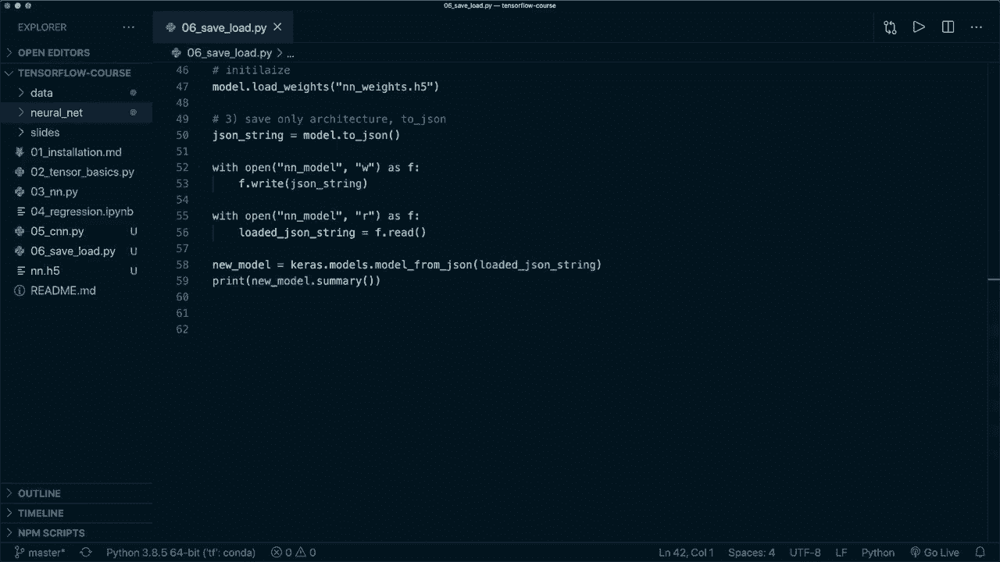

# 【双语字幕+资料下载】面向初学者的 TensorFlow 教程，理论知识、代码思路和应用案例，真正从零开始讲明白！＜快速入门系列＞ - P6：L6- 保存和加载模型 - ShowMeAI - BV1TT4y1m7Xg

🎼，Hey， guys， welcome to the next Tensorflow tutorial。 In this episode。

 I want to show you how we can save and load our model。 This is very simple with the Tensorflow API。

 So let's have a look at how we do that。 And here I have the same code as in tutorial number 3。

 where we implement a simple feed forward neural nets and use it for the Mnes data set。😊。

So after we define our model， we compile it and fit it。

 so we start the training and then we evaluate it。 and after that we want to save our model and here we have three different options and I want to show you all three so we can save and load a whole model。

 we can save only the weights or we can save only the architecture So let's start with the whole model and this is super simple so we can just say model do save and then specify a file name and here we have two different possible formats that we can use so we can use the Tensorflow saved model format or we can use the HDf5 format and this depends on the ending that we use So for example。

 if we just use NN for neural network。File name without an ending。 then it's using this format。

 And if we specify the ending H5， then it's using this format。

 So both work fine in the Tensorflow docs， they recommend to use this format。

 but I think this one works as well。 So you can use both。

 So let's use both formats here to demonstrate you the difference。

 So let's use another one neural let's call this neural net without an ending。

 And now if we run this， then it starts the training and after the training。

 it should save the model with in both formats。 So let's say。Python， and then the name of this file。

 So this is tutorial number 6。Alright， so training is done and it's saved our model。

 So we see the H 5 file。 And for the other one， where we simply use neural nets。

 And then it's using the saved model format。 And for this。

 it creates a whole folder with the files in it。 So both work fine。 And then in order to load it。

 let's use a new model。 And we can load this by saying new model equals Kaas dot model dot load model and then the same file name。

 So let's use an N dot H 5。 And now we have it and can do the same thing。

 So now if I say new model dot evaluate。 then this should produce the exact same results。

 So now we could delete all of this。 So I leave this here so that it。😊。

the first evaluation and the second one so that we can see that this is the same。

 And here I want to mention that so last time for metrics， we just use the name accuracy。

 And in the current Tensorflow version 2。3， there is a buck。 So if you use the string。

 then after loading with this specific loss。 it will not produce the same results。

 So you should use this kas matrix object here。 and then it works fine。

 But this will be fixed in the version 2。4。 So let's run it。

 And then we should see the exact same evaluation results for our original model and our loaded model。

Alright， so here we have it。 So here we have the evaluation of the original model。

 And then after loading， we have this one。 So this is exactly the same。

 and don't worry about this warning。 So this appears if we use the saved model format。

 But I think this is also a back and should be fixed in the next version。 So yeah。

 I think we now we see how we can save and load our model。 So it's that simple。

 we only use model dot save and then can call Kara models load model again。

 And then we have the exact say model。 So this is how we save the whole model。

 And now if we want to save only the weights。 we can do it very simple as well。

 So we can save model dot save weights and then the let's call this and and dot weights。Start H 5。

 And again here we have both options。 So with an file name， ending or without。 And then again。

 if we want to load the weights。Then。We would have to set up our model like here。

 And then without training， we can simply say model dot load weights。 And then this file name。 So N。

 N dot weights dot H 5。 So here again， here， we would have to in it， initialize our model。And now。

 as a last option， if we only want to save the architecture。

 we can get the architecture as a cha string by saying our cha string equals。

 and then we use model to。Chasson， and this saves the architecture of our model， as Chason string。

And then， for example， we can save this so we can say with open and then our file name。

 So N and model， and we want to open it in right mode and then S F。

 and then we say F dot right our Cha string and then the same thing when we load it。 So for loading。

 we do the same thing， we say with open and then the same name and end dot model and then here in read mode as F。

 And then we can say our loaded Cha string equals。 and here we say F dot read so we don't need to import the Cha module here。

 this is already implemented it in the Tensorflow API。 And then when we have our loaded Cha string。

 we can set up our。Model by saying new model equals Kas dot model dot model and then underscore from Jason。

 And then hear the loaded。Jason string。And now here， then this will only load the architecture。

 So if we say print new model dot summary， then it would look look the same。

 But here it does not have the weights yet。 So then we would still have to train it。 But yeah。

 now you have all the three different options。 And I think the first one is the simplest one。

 But it's also the most expensive ones。 So sometimes you just want to save the weights or only the architecture。

 And yeah， so now you know how simples it is with the tens offlow API。

 And then you can start saving and loading your model。 And yeah， that's it for now。

 I hope you enjoyed this tutorial。 Please hit the like button and consider subscribing to the channel。

 And I hope to see it in the next video by。

