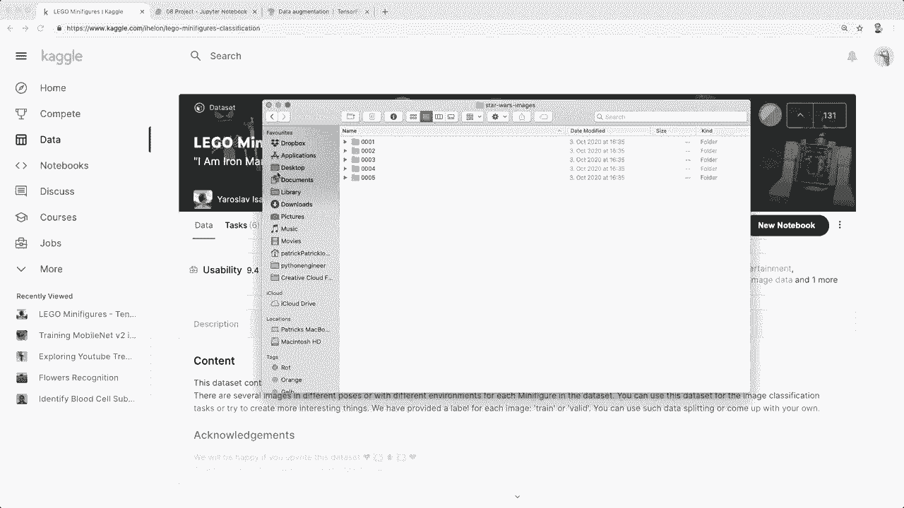
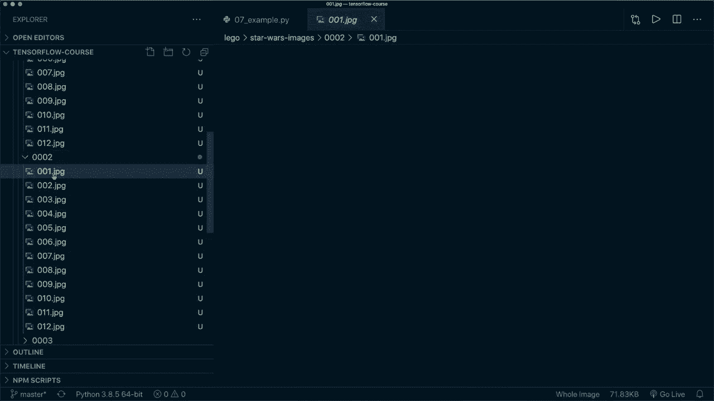
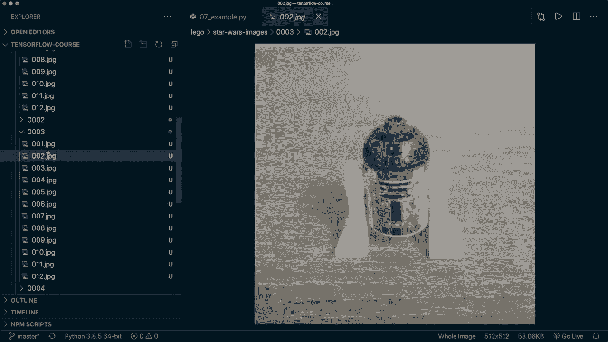
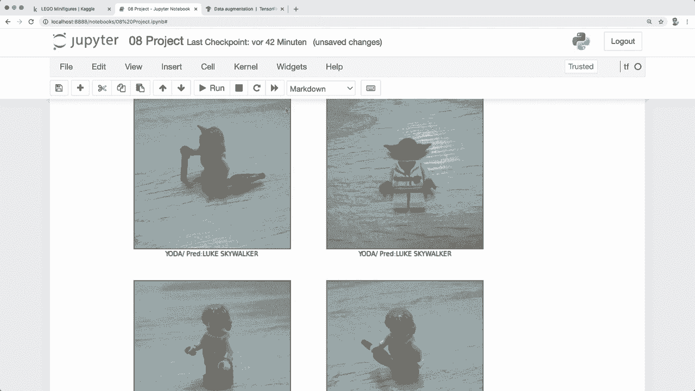

# 【双语字幕+资料下载】面向初学者的 TensorFlow 教程，理论知识、代码思路和应用案例，真正从零开始讲明白！＜快速入门系列＞ - P7：L8- 乐高星球大战小人仔分类任务  完整项目流程 - ShowMeAI - BV1TT4y1m7Xg

🎼，Hey， guys， welcome to another Tensorflow tutorial Today， I'll do another full project walkthrough。

 And I think this project is going to be real fun because we're going use a real image data set from Kaaggle with Lego Star Wars minifis。

 And we're trying to classify the characters。 So along the way。

 we will learn how we download and organize our data and how we load the images into Tensorflow and preprocessed them。

 Then we set up a convolutional neural net， train it and save our model。 And along the way。

 I'll also introduce some new concepts like image augmentation and Kara callbes。

 So I hope you stay until the end and we'll find out if we can correctly identify Luke Skywalker。

 So here is the image data set that's available on Cagel。 and I will put the link in a description。

 and then you can just click on download and download the data。

 So I already did this and copied it in。😊，to my project directory。 So here this Lego folder。

 And we have some different categories like Harry Potter and Jurasic World。

 But now I'm only going to use the Star Wars figures to make it simpler and easier to follow for you。

 So let's make a copy of this folder so that we have a backup because we are going to reorganize the data a little bit。

 So let's rename this to Star Wars images。 And then inside here， we have 10 different classes。

 but right now I'm only going to use the first five。 So again， to make it simpler for you。

 And now let's have a look at these images。 So now in this Star Wars images folder。 We have。

 for example， class1。 This is Yoda。

Class two is Luke Skywalker。

Then we also have R2 D2， then we also have Macce window。 and as last character。

 we use general grievs。 So these are the characters that we want to identify and right now the first thing I want to do is to reorganize this folder structure a little bit。

 So you could load it like this and you also have some met data with the information for each directory so can you can load it with this。

 So I want to make it a little bit simpler so that we can easily load it with the tens of low image and loader。

 So I want to separate the data set into training images validation images and test images。

 So we create three folders in here and then in。

Each of the folders， we again create images for each character。 For example。

 we have a training folder， and then in the subfold， we have a folder for Yoda。

 Luke Skywalker and so on。 So this is the first thing we are going to do。

 So here I'm in a twopyter notebook。 And here we import the things that we need。

Then here I named the base directory where we have the images and then I hardcoded the names of each character。

 So these five and I'm also setting a random seat to make it a little bit more reproducible and now the first thing we want to do is to create our different folders。

 So we can of course automate this with Python。 So now if I run this code and we have a look then here in here it created these three new folders and then inside of each it created a folder for each character that we have。

 So right now these are empty and now we're going to take the images from in here and then copy them into here and so we。

We have about 12 or 12 to 14 different images for each character。I know this is not a big amount。

 especially not for deep learning， but it's enough for this tutorial and I show you at the end that we get a pretty good accuracy。

So yeah， now we want to take about 60% for training。

 then 25% for validation and the rest for testing and then copy them into these folders。

 So if I run this。Then it prints the total number of images in each directory and then the number of training samples。

 validation samples and test samples。 So now if we go back in here。

 then each of these folders here are empty so we can actually delete them so now move to trash and now in the training folder。

 for example， we should have the images， so we have training images for each one testing images for each one and validation images for each character。

So again， this is what your structure should look like。

 and this makes it very easy for the Tensorflow image data loader。

So now we can go ahead and set up our image data generator so we can get this from Kras preprocessing dot image do image data generator and in here you can pass in your own preprocessing function for example。

 you can write a function that normalizes the data。

 but in the special case that we only want to normalize it。

 we can also pass in the rescale argument and then here we use one divided by 255 so we want to have our image in the range between0 and1 like we did in the examples before。

And then we have to call this with this generator， we call the flow from directory function。

 and then in here we pass in the directory for training。

 So this is in Lego Star Wars images and then train and then we can specify the target size。

 So right now I think the images have to dimension 512 by 512 and we can specify a target size and Tensorflow automatically does the resizing for us。

Then I specify the class mode because I want to have the labels as a single integer value。

 So you can also， for example， use one hot encoding here。Then you can use the batch size。

 Then for our training images， we say shuffle equals true。 Then we specify that we have RGB images。

 So again， you can， you can check out the arguments in the documentation。

 and then we specify the class names that I hard coded up here。

And then we do the same thing for the validation and test。

Images and the only difference here is that we use so for training， we use shuffle equals true。

 and for validation， we say this is false。 And so here it doesn't really matter。

 but especially for testing， you want shuffle equals false。 So now if we run this。

 then Tensorflow automatically loads this for us。 So for example， we have let's print the。

Shapes of the test batch。 So we said we only have batch size of four。

 So this is why we have four different。Labels here。And if we have a look at the very first batch。

 then this is four because we have four samples and then each image has the size 256 by 256 by3 because here we specified this image size and we have three color channels so let's for example。

 plot some images with Matpllip so here for example it prints the first four images of the test batch so here we have Yoda and Duke Skywalker and here we have we print four images of the training batch So yeah and now one more thing that I want to show you what we can very easily do with this image data generator is to use image augmentation so if we have a look at tens of flow。

Then data augmentation is a technique to increase the diversity of your training set by applying random transformations such as image rotation or flipping。

So this is very useful to have a better generalization of your model。

 and we can very easily get this with this data generator。

 So the only thing we have to pass in here are some more arguments。 And then if we want to have this。

 then we only do this for the training data set。 So here， for example。

 we can specify the rotation range。 we can specify a random horizontal flip and we can also specify the a high shift and a width shift and also shearing and zooming。

So now if we use this。 So let me apply all these and。Then again。

 you only want to do this for your training data and not for these。

 And there are several different ways。 So， of course。

 you can also write your own functions to do this。 But this image data generator makes it very simple。

 So now let's run this again with an image augmentation。 So let's run this and this。

 and this one again。 and yeah， so here we see， for example。

 we have a slight rotation and probably also a different zoom factor and maybe some shearing effects here。

 So yeah， let's run it again。 So let's take another random pick from the batches。And again。

 let's have a look。And yeah， I think you can definitely see that it's doing something with the images。

 So again， this one is rotated here。 So yeah， this is a very nice technique that you can easily apply here。

 So I'm going to remove this again for now， So because we don't have so many images。

 And in this case， its it actually might confuse our model and make the accuracy worse。

 So in this example， I'm going to leave this out。 but keep in mind that you can easily do this here。

 So let's use run this and this and this again， and then we should not see the augmentation anymore。

 So yeah， I think these are the normal images without rotation or any other effects。

And now we set up our convolutional model。 So this is the same as in tutorial number 5。

 a simple convolutional neural net with different convolutional layers and max pooling and activation functions in between。

And then at the end， we use a dense layer。 And this very last layer is important。

 So here we are only using five outputs because we have five different classes。

 So let's run this and print the summary of our model。 So here we can inspect the architecture。

And now we set up the loss and the optimizer and the metrics and compile our model。 So this is。

 again， the same as the last time。 So what's important here is to set from Lo it equals true because we don't use the activation function here as last layer。

 So let's compile it。And then we can easily call model fit to train our model。

 And now here I want to show you another new thing。 So I want to。Talk about Karas callbacks。

 So with callbacks， a callback is a function that is applied after each training epoch。

 So here you can， for example， safe checkpoints or use different things。

 And what I want to do here is to use a early stopping callback。

 So we can very easily use this because this one is implemented in Kas dot callbacks。

 And then we say early stopping。And we want to monitor the validation loss and have a patience of five。

And this means that if the validation laws does not improve for the next five epochs。

 then it will automatically do an early stopping of our training。 So， and then when we have this。

 we can specify this argument。 So we can say callbacks equals。

 And then this is a list because we can pass in more callbacks， if we want。

 And then we say early and then stopping。And then we used the rest of the arguments。

 And now let's train this and see what happens。Alright， so training is done。

 So we actually said we want to have 30 epochs， but then it stopped after epoch 10 because our validation loss didn't improve。

 So here we have a our lowest value or here， And then it didn't get better in the next 5 epoch。

 So that's why it stopped here。 And what we can see here is if we have a look at the accuracy of our training data Then here。

 for example， we have 100。 and 97 in the last epoch。 So this is very good。

 But now if we have a look at the validation accuracy。

 then we see that this one was the best and then it's actually getting worse。

 and our validation accuracy is not very good at all。 So this is a。

Clear indicator that we have an overfitting problem to our training data。 In this case。

 it's a little bit due to the problem that we don't have so many images available and especially not very much images for the validation set。

 So this can be one problem。But yeah， I think in this case， it's very nice to have this call back。

 And then we can stop and try to improve this model。 So I leave this for you as homework。 You can。

 for example， try to use the image augmentation that I showed you or play around with the learning rate or per also try to change the architecture of our model a little bit。

 So yeah， this is one thing that we can do。😊，And in the next tutorial。

 I also show you another very powerful technique with which we can achieve a very high validation accuracy。

 even on the small data set。 So I hope you also watch the next tutorial。 So for now。

 what I also want to do。 So we can easily save our model， this is one thing I already showed you。

 So we can save it like this。 And then if we have a look at this folder， then it should be here。

 So yeah， there it is。😊，And then let's plot some data。So here we see the loss。

 the training loss decrease trees very nicely， but the validation loss not so much。

And the same with the training accuracy for the training， it's very good。 but full of validation。

 it isn't。 So， again， this can be an indicator that we have overfitting here。 And yeah。

 And so now let's evaluate it on the test data。 And again。

 here we see that our accuracy is not very good on this test data。

And then if we try to do predictions， we call model predict。

 then we also have to apply the soft marks here because we didn't use it in our model layers as the last layer。

 and then to get the actual labels， we have to call the artrc max along axis 1。

 So now if we print the。Actual labels and the predicted labels。 Then we see we have。

 it's only 50% correct in this case。 So now again， let's print some。New images and predictions。

 So yeah， so here our prediction is Luke Skywalker again， So Luke Skywalker。 this was not very good。

So yeah， but now I think you should know how we can apply a full project with a real world image data set。

And we even achieved a high accuracy on the training data set with the techniques that we used。

But yeah， we still have to improve it so that it's also good on the validation data set and for new data for the test data set。

 So in the next tutorial， were going to learn about transfer learning。 And with this， we。

 I think we will achieve a pretty good accuracy。 So I hope to see you in the next video。

 and if you enjoyed the tutorial， please hit the like button and consider subscribing to the channel and see you next time。

 bye。😊。

