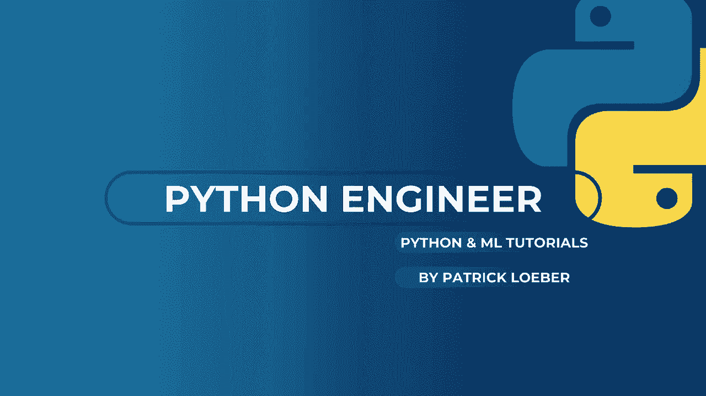

# 【双语字幕+资料下载】面向初学者的 TensorFlow 教程，理论知识、代码思路和应用案例，真正从零开始讲明白！＜快速入门系列＞ - P8：L9- 迁移学习 - ShowMeAI - BV1TT4y1m7Xg

🎼，大家好，欢迎来到新的 Tensorflowlow 教程。今天，我们将继续上次的内容，一起应用迁移学习，获得一个良好表现的模型。😊，所以如果你还没有看过上一个教程，我强烈推荐你先去看一下。作为快速回顾，我们使用了来自 Kegle 的一个数据集，包含乐高星球大战 Minfi。

我们应用了自己的卷积神经网络。然后我们遇到的问题是，在训练中，我们得到了非常好的准确率。接近 100%。但在验证数据集上的表现不好，在最终测试数据集的评估中，我们的准确率只有 40%。这不是很好。

现在我们要做的是应用迁移学习来改善我们的模型。😊。迁移学习是一种非常好的，简单但非常强大的技术。其概念是，我们使用一个已经训练好的模型，这个模型可能是一个具有许多特征并且在大量数据上训练的非常好的模型。现在我们所做的就是，取这个模型，然后只修改最后的层，剪掉它们，然后在最后应用我们自己的分类层，并只训练这些层。这样，我们的训练可以非常快速，同时也能利用已经预训练的神经网络的其他部分。所以这就是迁移学习的整个概念，接下来我将向你展示如何使用 Keras 实现这一点，所以第一步。

我们要做的是加载一个预训练模型。Keras 中已经有一些模型可用。例如，流行的 Vgg16 模型。通过说 Tensorflow keras applications 和我们的模型名称，你可以获取这个。如果我们调用它，系统会下载该模型并将其保存在你的文件夹中。让我们运行它并打印摘要。这里是。架构。

所以你可以看看这个。现在我们要做的是，如我所说，我们想要。

删除最后一层。你可以只删除最后一层，或者也可以删除更多层，然后应用你自己的。所以在这个例子中，我们只删除最后一层，密集层，然后应用我们自己的具有五个不同输出的密集层，因为在我们的例子中，我们有五个不同的类别。现在。

这是一个 Keras 功能模型。我已经谈到了功能 API。如果你还没有看过，我也建议你先看这个，我会把链接放在描述中。但我也说过，我们可以轻松地将其转换为序贯模型。我们可以通过设置一个新模型并说这是一个序贯模型来做到这一点。

然后我们遍历所有层，除了最后一层。因此最后一层不包括在内，称为模型和层。现在让我们运行这个并打印摘要。然后，它应该是相同的，除了你看不到这一层。哦，对不起。所以这里，这是原始摘要。这里我们有作为最后一层的10个输出。

现在在我们的案例中，这应该是最后一层。那么我们来看一下。是的，这就是最后一层。现在我们要做的是将所有这些层的可训练属性设置为`false`。因为我们不需要重新训练它们。我们只需要训练我们的新分类层。所以我们遍历所有层，并将层的可训练属性设置为`false`。

例如，这里你可以看到可训练参数和不可训练参数。现在如果我们这样做并再次打印摘要，我们会发现现在所有的参数都是不可训练的。现在我们添加最后一个密集层。默认情况下，这又是可训练的。然后再一次。

我们设置损失函数和优化器并编译我们的模型。上次我告诉你们如何使用这个图像数据生成器，然后调用这个`flow from directory`函数。这很简单地从目录加载图像。我们也可以在这里应用预处理、重缩放，甚至图像增强。所以上次我们在这里应用了重缩放。这次我们想做的是，应用与基础模型相同的预处理函数。在这个`weci G net`中。因此，我们也可以通过说这个在`tensorflow.keras`应用程序中可用，后面接我们模型的名称和`preprocess_input`来获取。

这是我们的预处理函数，然后我们可以将其提供给我们的图像数据生成器，作为预处理函数的参数。这对于我们的训练、验证和测试集都是一样的。然后我们为每个数据集调用`flow from directory`。这些参数与上次相同。现在我们正在从不同的模型加载图像。

我没有运行这个单元。所以我们来运行这个和这个。现在我们完成了。再一次。这和上次是一样的。所以我们训练了我们的模型，并应用了提前停止的回调。如果我们的验证损失在5个周期内没有增加或改善，那么就会提前停止。所以我们再在这里应用一次。现在让我们来拟合我们的数据。

这出现了一个错误。你必须在训练和测试之前编译你的模型。我想我在这个单元中已经做过了。所以我们再运行一次。运行这个和这个，现在是我们的训练。现在它工作了。我想我第一次没有运行这个单元。现在让我们看看我们的迁移学习模型表现如何。

好的。现在我们的训练完成了。我们再次进行了早期停止。所以我们看到测试数据集上的准确率是 100%。完美。而验证准确率几乎是 94%。所以，我认为这现在非常好。这比上次好多了。现在我们设置了 30 个周期。

但是我们的验证损失在这里是最低的值。然后在接下来的五个周期内没有改善。所以我们设置了患者值为 5。这就是早期停止的原因。因此我们在第二个周期时已经获得了 100% 的验证准确率。但这可能是因为我们的验证数据集中可用的图像不多。

所以我认为这个结果不是很可靠。但我认为我们可以看到迁移学习是多么强大。因为上次我们遇到了过拟合的问题，以至于我们在训练数据上有良好的准确率，但在验证数据和测试数据上却没有。

现在，通过迁移学习技术，我们在仅仅两个周期后就得到了这个结果，即使在这个例子中我们没有那么多可用的图像。这是非常好的。那么现在让我们在测试数据集上评估我们的模型。我们看到在这种情况下，测试数据的准确率为 100%。所以我想这次我有点幸运。但也确实如此。

我们再次看到这种技术是多么强大，以及它是多么简单。所以你加载一个预训练的模型。😊。然后，我们在这种情况下将其转换为顺序模型。所以你不必这样做，但这样对你来说会简单一些，因为我知道顺序 API 更容易理解。然后我们排除了最后一层，添加了我们自己的密集层。

然后我们还将层的可训练性设置为 false，除了最后的密集层。然后我们进行了新的训练。作为家庭作业，你可以尝试其他预训练的网络。所以，比如说，移动网络版本 2 是另一个非常受欢迎的网络。你可以访问这个链接，在这里你可以找到所有不同的可用网络。

所以这是我们的 V G16，你也可以使用 G19。你有移动网络和移动网络版本 2 以及 ResNet。所以，试试它们。我可以告诉你，当你尝试将模型转换为顺序模型时，可能会遇到问题，因为这仅在模型架构是线性时有效。

如果你不知道如何操作，如果你的架构不是线性的，那么你可以观看我关于功能 API 的教程，因为我在最后给了你一个提示，并展示了如何在功能模型中进行迁移学习。所以，看看这个，如果你也能获得 100% 的准确率，请告诉我，然后希望在下一个视频中见到你。如果你喜欢这个视频，请点击赞，并考虑订阅频道，再见。

