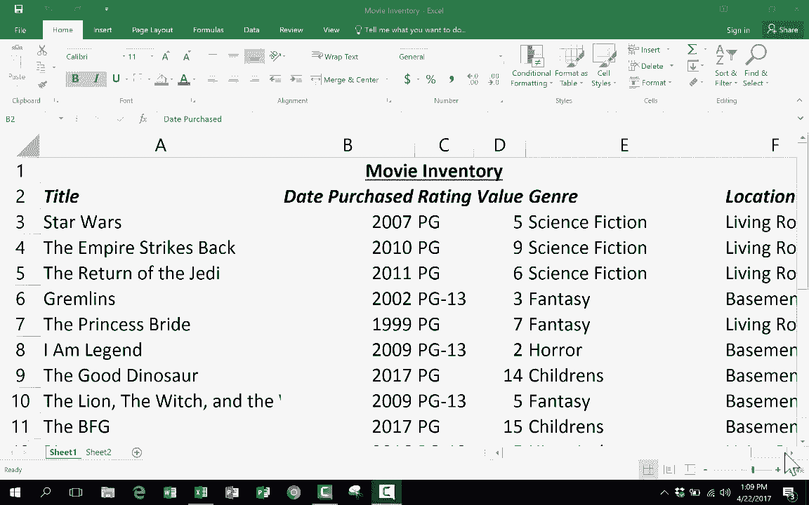
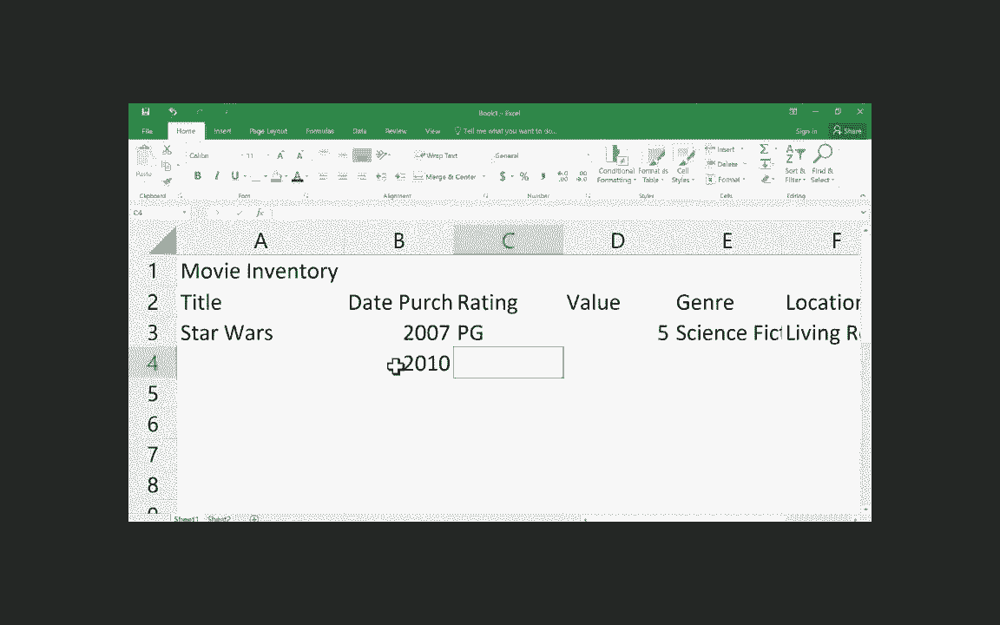

# 【双语字幕+速查表下载】Excel中级教程！(持续更新中) - P1：1）中级 Excel 技能教程 - ShowMeAI - BV1uL411s7bt

In this video tutorial， we're going to take a look at the intermediate skills。 tips and tricks that you need to know in order to use Excel properly and efficiently。 If you haven't already watched my other Excel video it's called the beginner's guide to Excel。 and I highly recommend that you start with that video before watching this one So one of the last things that I showed in that beginner's guide video was how to do some formatting how to change let's say the column widths how to do italics and things like that Well。

 in this video we're gonna to start off by looking at a couple of advanced formatting options then I'll show you a data entry shortcut that's fantastic called the autofill handle then we'll take a look at how to do formulas and functions in Excel and then we'll finish with a few more intermediate and advanced tips and tricks。

 So here I am in the spreadsheet I started in the beginners tutorial It's a list of movies that I own and I'm putting in some data about those movies。 Well I want to show you a couple of short。

As you're trying to format the data that's in a spreadsheet。 these tricks will save you a lot of time The first is called the format painter and you can find it here on the home tab Home ribbon in the clipboard group and it looks like a paintbrush the format painter is what it is and the way it works is let's say that part of your spreadsheet has a format that you wish other parts of your spreadsheet had all you have to do is click on the good example that you would like click here on the format painter and that copied it it didn't copy the content rather it copied the format of this cell So now all I need to do is move my mouse to the place where I want to copy that format to and I can click and if I release the mouse click it will copy the format but let's say you would like the entire range this range of five or six cells to have that layout you can just click and drag holding the click and then release and you can see now they've all been painted with that format。

that's not at all what I want so I'm going to undo it with this arrow up here in the upper left and it takes me back Now another more advanced formatting option that is pretty exciting。 at least to me is what they call conditional formatting so it's up here at the top on the home tab home ribbon here it is in the styles group conditional formatting and the way this works is you select a column or a row either way I'm going to select the column D so I just click on it and the entire column is selected now I simply go up here to conditional formatting and click and it gives me some options it mentions rules several times basically we're going set up some rules for the content of these cells and the formatting of these cells and the easiest example I can think of is color scales so let's just look at that but I want you to explore this in more detail if you're interested in conditional formatting because it's really an exciting tool so I'm going to go into color scales and I want the color of each cell to change。

To adjust depending on how valuable the movie is Now to do this。 I would select probably this color scale here。 It looks like it has green at the top and red at the bottom So the idea the more green it is the more valuable it is the redder it is the more worthless it is if you want to reverse that you can and there are all of these other options as well with different color schemes but I'm going go with that first one I'll just click on it and what this does is it evaluates the entire column it looks for the highest numbers and gives them the greenest background and then the lowest numbers get the darkest red background and then everything else in between is adjusted accordingly So that easily I can just glance at this spreadsheet and I can see where the most valuable movies are if you like that please investigate conditional formatting more there's great ways to display the data in a conditional way you can use data bars you can say if the highlighted cell is greater than 10 then make the background。

Green or put the text in bold。 if it's less than five then format it with a background of red。 there's all of these。 if then statements that you can use with these highlight sales rules。 there's top bottom rules top 10% bottom 10% icon sets where you can show arrows going up down left or right and just some really exciting formatting options that you have here before we leave formatting and move on to a few other things。 I want to show you that because these numbers represent currency。

 I probably should format them a little differently so I can click here on D and everything in column D that's a number will get formatted differently right now everything in here is formatted in a general way which is to say that there's nothing special about the way they're formatted at least the numbers themselves。

 However if I go up here I can change that from general to any one of these other things and there's even more beyond that there's also some shortcuts like this I just want to click on the dollar sign now they。S up as accounting currency If you don't need it or want it to be accounting。

 you can just go down and do regular currency。 All that changes is where the dollar sign is located。 Okay， so this is awesome。 this spreadsheet is turning out great so far Next， let's look at formulas。 This is where the true power of Excel is found I believe so far in our spreadsheet all we've done is entertex or numbers and then also in some cases we've applied some formatting but other than that。 we haven't put anything special into the spreadsheet。 Well， let's change that。

 What I'd like to do next is put in some formulas that will help me know some things like what's the total value of my DVD collection what is the average value of the DVDvs that I own and what's the most expensive value and the least expensive stuff like that Allright。

 so let's figure that out down here at the bottom of the spreadsheet I'm going create a formula Now it doesn't have to be here。 I could put the formula anywhere。On this spreadsheet or another spreadsheet wherever I want to put this formula I can do it。

 but I'm going to do it here。 So I'll just click and whenever I do a formula in Excel。 I click on a cell and then I think to myself the phrase this cell so I click this cell equals and I want to find out the total amount that my collection is worth so I need to somehow add up all of those numbers。

 let me show you the hard way first the hard way would be to say okay we have a5 so I'll type in5 plus2 plus5 and I can just keep doing this plus6 plus9 and I can just keep doing that basically creating a formula and then all I have to do is tap return or enter and look it adds up those numbers the thing is that's way too tedious so instead of doing that what I can do is type in the word sum So this cell is equal to the sum of and then you put a left parenthesis and now I just。

NeedTo describe the cell or in this case， the range that I want it to add up。 that I want it to some。 Fortunatelyly， as I showed in the beginner's video， I can name a range。 Every range in Excel has a name。 and the name of this range is D3 through D22。 So I'll just type D3。 And if you remember from the beginner's video。 the word through is denoted with a colon and then D22。

 and then you're supposed to put another parenthesis， the end parentheses。 Now I'm going not do that just to show you that even though you're supposed to。 you don't have to you now hit enter。 And look what it's done。 It's added up all of those numbers。 the grand total worth of my DVD collection is $135。 Now， if you want to make sure that it worked。

 you can double click on it and look what it did。 It highlighted all of the numbers that it got that it included in the formula。Now let me show you an alternate way。 The way I just showed you is one of the nicest quickest ways to do it。 especially if you have a giant spreadsheet， but there are a couple of other ways。 In addition to typing in the range， I could just move my mouse up to the top click and drag with my mouse on the range that I would like it to add up and then just tap return and you get the same results。

 Now there's also yet another even faster and easier way to do it。 and I'm going to delete my formula in order to show you this properly。 What I would do is I would just click on the cell but instead of typing equals。 I can just go up here on the home ribbon and go to the editing group and here we have something called autos。

 It's this symbol here and you can just click on it and it will automatically look immediately above and it will add up everything in those cells so I can hit enter and I get the same results。So that's the fastest。 I will say that sometimes it gets it wrong。 Sometimes it gets the wrong data。

 So just watch out for it。 I usually use autos， but just be a little bit skeptical。 Sometimes it might include data that you don't want included。 Okay。 speaking of including data that you don't want。 notice what it did to my conditional formatting。 Now this is the only green value and everything else is small compared to it。

 right So I need to fix that with my conditional formatting。 I'll go in and highlight that entire column and I'm going to clear the rules。 so it gets it completely out。 and I just want to do conditional formatting with just those numbers。 not the total。 So now I go in conditional formatting color scales and look that's back to being useful。

 now I should go in and type total and maybe put these in bold just to show that this number is different。 It's special。 It's different than those other numbers。 next， I'd like to do an average formula and。Similar， I would just say to myself， this cell is equal to the average left parentheses and then I can click and drag or I can type in the range or notice that there is an auto average which again。 you should use it。 It's great， but just be a little skeptical of the results。

 I'm going double click between those cells to make it so you can see the word average Next I want to do one of what's the highest value and the lowest value for these。 the formula is a little different for highest the formula is this This cell is equal to the max or just max left parentheses click and drag on the range or type in the range it's up to you hit return So what it did is it looked through that range found the maximum number。

 the highest number and printed it here。 Next， I'll do lowest for lowest we do this cell is equal to min left。And the range I'll type it in this time D3 through D22 D3 through D22 hit enter and there's the lowest So you can see these formulas are pretty useful you can get some really good numbers out of them So those are probably the foremost common ones that I use some average max and min but just know that there are many。

 many more functions that you can use if you want to see pretty much an exhaustive list of all of the functions that you can use just type in equals and then look up here this is the formula bar is what we have here and it's an alternative to typing your formula right here in the cell。

 you could just go up to the formula bar and start typing and notice as you type you get some suggestions so it's recommending because I typed in it's recommending average average a average if there's four different average functions that I could draw from so it will give suggestions that's one thing to know about。

But also over here on the left， look what it does。 there's a click drop down where you get some pretty good suggestions about the functions that you might want。 There's also a formulas tab where you can go and a whole function library where you can get math and trig formulas look up and reference formulas text。

 logical these are great recently used financial formulas and if you really don't know which one you want to do。 just go here to insert function and you can get it on most of these dropdowns and then just type a brief description of what you want to do let's say I want to count the number of DVDvds that I have so I'll do a search for count and it brings up some options that I have and it tells me what exactly it's going do so use these tools that you have use the formula bar use the formulas tab and if you need to use the insert function button that gives you some additional options so you can also click。

Here， insert function。 So have fun playing around with formulas and functions。 they're very powerful。 Next， we're gonna to take a look at a few intermediate and maybe some advanced tips and tricks that you should know about。 one that is pretty well known is called the autofill handle。 And this is where you'll find it when you click on a cell。 look in the lower right corner。

 there's a little green square。 And if you put your mouse on that square。 it will become a plus sign。 Now it's already a plus sign， but it becomes a black plus sign。 Once you see that。 you know that you've got the autofill handle。 And what you can do with this is you can click and drag to copy what's in the cell。 So if I want to copy 2015。 I just click and drag it's 2015 again，2015 again。

 And I can just keep doing that。 I can even just click and drag and get a whole column of 2015。 So that's the autofill handle。 I'm going to undo that。 Now that also works with text not just with numbers So I can copy what's in a cell by using the autofill handle。And clicking and dragging。 Now， what's really cool is you can copy a pattern。 So right here。

 I just clicked and dragged to highlight 2016，2015。 Now， if I use the autofill handle。 look what it does， it figures out the pattern。 The pattern is-1 subtract1。 and it just repeated that pattern。 So if you will show the autofill handle。 the pattern that you would like for it to copy it will copy that pattern。

 you can also use the autofill handle to copy a formula。 Now， in this case。 the formula doesn't work too well。 This is the sum formula。 it's trying to add up all of these numbers。 when I use the autofill handle， dragged it over。 look what it did。 Now it's trying to sum up this column。 And so because those aren't numbers。

 it's not working real well。 But let me do it this direction。 You can see it is now adding up the years， it thinks that it's currency。 but that's okay。 it's adding up all of these years and coming up with a total。 So I just love the autofill handle。 It's especially good。For anything related to time So for example， dates。

 let's say I want to put in each of the months of the year with dates and times。 you don't even have to establish a pattern。 you can just type in the first thing that's related to date or time。 and then just go to the corner， click and drag and look it automatically knows what comes next。 same with days of the week， same with full dates。And it's also the same with times。

So this autofill handle is just a lifesaver， a time saver for sure。 So I'm gonna select all of that just by clicking on the column letters across the top。 clicking and holding and then I'll right click and choose clear contents。 and that clears it out。 But I wanted you to see that autofill handle。 Okay， next up。

 just three fast rapid fire tips that I think everyone needs to know if you're using Excel more than just at a beginning level。 And the first one is how to sort。 So I put my movies in just in random order。 but I would like to sort them alphabetically。 So what I'll do is I'll click on just the first cell of the first record。 So Star Wars。 I clicked on that cell。 Now either on the home tab or on the data tab either one you should be able to find sort and filter。

 I'm gonna go to the data tab。 Here's sort。 and I would like it to sort alphabetically A to Z。 So I click on it and look what it did。 Now all of the movies are alphabet。From A to Z。 Now。 the first time you do this， you're gonna be worried that you'll lose the integrity of your spreadsheet that maybe the dates won't match up now。 But if you notice they do go back， rewind the video if you want。

 but this used to say 2007 Now it says 2003。 So sorting is a really great feature in Excel。 What about filtering。 what is filtering。 Well filtering is a way to eliminate parts of your spreadsheet temporarily so that you can see the data you want to see to turn on filtering。

 what I like to do is click and drag across the column headings that I've created。 So location。 genre value， etc。 Once I've highlighted all of them。 I go up to the top and I click filter and notice they all now have a little dropdown arrow。 And so what I'm going to use this to do is I want to eliminate all of the Pg13 movies。

 Let's say we're gonna have a birthday party for a small child。 I don't want to show a movie that would be too scary。 I would go into ratings and click and right now it。howing everything so I want to deselect all and go down and I just want to choose Pg。

 That's the only1 I want selected。 Now if I had G movies I could select those two。 but I'll just stick with that， click okay and you can see it looks like it got rid of those additional records。 It really didn't get rid of them。 You can see here on the left。 it jumps from one to jumps to5。 and in Excel， you just cannot eliminate row numbers or column headings。 they always exist。

 they can be hidden and that's what's happened here， is they're hidden but they still exist。 All right， so isn't that pretty useful。 I love filtering even more really than sorting。 Now to get the data all showing again， I can just click here on what looks like a funnel。 it used to be the dropdown arrow。 Now it's a funnel。

 I just click on it and go to select all click okay and that takes the filter off。 I could do the same kind of filter for genre。 and I could say I only want to see comedy or children's movies。 things like that。 So filters are very powerful。The last more advanced tip that I want to share with you is called freeze panes This spreadsheet really is not that big。 Let's say I go buy 10 more DVDs then it's really gonna be a bigger spreadsheet and it's going to be harder to put in my data and even to look at it as your spreadsheet gets more vertical you can kind of lose track of what your column titles are so that's where freeze panes comes in what you do with freeze panes is you click underneath the row that you would like to freeze so I'm going click on three because that's underneath my column titles then I'm going to go to the view tab the view ribbon and notice there's an option in the window group called freeze panes and watch what happens when I click freezeze panes it first pops up with three options and I'm just gonna click freezeze panes so now as I browse down the page as I enter more records look what happens those first two rows stay visible to me and that's because I froze everything above。

Row3 So that's where I'm going to stop in reality， a comprehensive Excel tutorial would be 15，20。 25 hours long， and this is already too long of a video but I really believe that if you watch my beginner's guide to Excel video and this intermediate video that you will have what you need to get started using Excel effectively as you continue using and learning Excel I'd recommend that you use this resource here at the top tell me what you want to do you can just type in something that you're trying to do and it will give you some help and some guidance on how to do it thanks for watching this tutorial。

