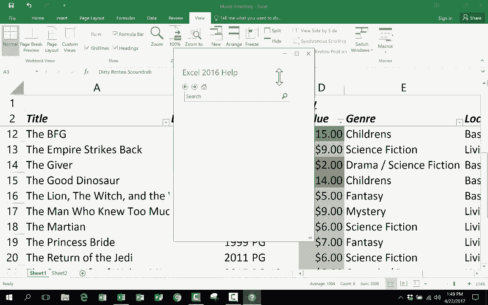

# 【双语字幕+速查表下载】Excel中级教程！(持续更新中) - P1：1）中级 Excel 技能教程 - ShowMeAI - BV1uL411s7bt

在这个视频教程中，我们将看看中级技能、技巧和窍门，这些都是你需要知道的，以便正确高效地使用 Excel。如果你还没有观看我其他的 Excel 视频，建议你先看一下《Excel 初学者指南》。我强烈推荐你在观看这个视频之前先观看那个视频。在初学者指南视频中，我展示的最后一件事是如何进行一些格式设置，比如如何更改列宽，如何使用斜体等等。

在这个视频中，我们将首先看看几个高级格式选项，然后我会向你展示一个很棒的数据输入快捷方式，叫做自动填充句柄，然后我们将看看如何在 Excel 中做公式和函数，最后再分享几个中级和高级的技巧和窍门。

所以我现在在初学者教程中开始的电子表格里，这是我拥有的电影列表，我正在填写一些关于这些电影的数据。好吧，我想给你展示几段短视频。

当你试图格式化电子表格中的数据时，这些技巧会为你节省很多时间。第一个叫做格式刷，你可以在主页选项卡的剪贴板组中找到它，它看起来像一把画刷。格式刷的作用就是这样，操作方式是，假设你的电子表格的一部分有你希望其他部分拥有的格式，你只需点击你想要的好例子，然后点击格式刷，它就会复制，而不是复制内容，而是复制这个单元格的格式。所以现在我只需将鼠标移动到我想要复制该格式的位置，点击一下，如果释放鼠标点击，它就会复制格式。但是假设你想让整个范围，这五六个单元格都有这种布局，你可以点击并拖动，保持点击，然后释放，你会看到它们现在都被涂上了该格式。

这完全不是我想要的，所以我将通过左上角的箭头撤销，这样就回到了之前的状态。现在，另一个更高级的格式选项，至少对我来说是非常令人兴奋的，被称为条件格式化。它在顶部的主页选项卡上，在样式组中的条件格式化。这种方式是选择一列或一行，我将选择D列，所以我只需点击它，整个列就被选中了。现在我只需上去点击条件格式化，它会给我一些选项，多次提到规则，基本上我们将为这些单元格的内容和格式设置一些规则。我能想到的最简单的例子是颜色比例，让我们看看，但我希望你能更详细地探索条件格式化，因为它真的是一个令人兴奋的工具，所以我将进入颜色比例，我希望每个单元格的颜色发生变化。

根据电影的价值进行调整。现在为此，我可能会选择这个颜色比例。看起来顶部是绿色，底部是红色。想法是越绿色，越有价值；越红色，越没有价值。如果你想反转，可以这么做，还有其他不同颜色方案的选项，但我会选择第一个。我点击它，这样它就会评估整列，寻找最高的数字，并给它们最绿色的背景，最低的数字则获得最深的红色背景，然后其他一切都相应调整。这样我可以轻松地查看这个电子表格，看到最有价值的电影。如果你喜欢这个，请进一步研究条件格式化，还有很多很棒的方式以条件方式展示数据，你可以使用数据条，假设如果高亮的单元格大于10，则背景会改变。

如果文本少于五个字，就将其**加粗**，如果少于五个字，则用红色背景格式化。所有这些都有。如果有条件语句，可以与这些高亮销售规则一起使用。有顶部和底部规则，顶部10%和底部10%的图标集，你可以显示箭头向上、向下、向左或向右，还有一些非常令人兴奋的格式选项，在我们离开格式化并转向其他一些内容之前，我想告诉你这些数字代表货币。

我可能应该用稍微不同的方式格式化它们，所以我可以在D列点击，D列中的所有数字将以不同的方式格式化。现在这里的所有内容都以常规方式格式化，这意味着它们的格式没有什么特别之处，至少数字本身没有。

不过，如果我在这里上移，我可以将其从一般设置更改为这些其他选项中的任何一个，甚至还有更多的选项，像这个，我只想点击美元符号，现在它们作为会计货币显示。如果你不需要它或者不想用作会计。

你可以继续做常规货币。唯一改变的是美元符号的位置。好的，这太棒了。这个电子表格到目前为止进展得很好。接下来，让我们看看公式。我相信这是 Excel 的真正力量所在，到目前为止，我们在电子表格中所做的只是输入文本或数字，然后在某些情况下应用了一些格式，但除此之外。我们还没有在电子表格中放入任何特别的内容。好吧，让我们改变这一点。

我接下来想做的是输入一些公式，帮助我了解一些事情，比如我 DVD 收藏的总价值是多少，我拥有的 DVD 的平均价值是多少，以及最贵和最便宜的东西等等，好吧。

那么让我们在电子表格底部弄清楚这一点，我要创建一个公式。现在它不必在这里。我可以将公式放在任何地方。在这个电子表格或其他电子表格中，无论我想把这个公式放在哪里，我都可以做到。

但我会在这里进行操作。所以我只需点击，每当我在 Excel 中做公式时。我点击一个单元格，然后心里想这个单元格，因此我点击这个单元格等于，我想知道我的收藏品总值，所以我需要以某种方式将所有这些数字相加。

让我先给你展示一个困难的方法，困难的方法是这样说的，好的，我们有 A5，所以我会输入 5 加 2 加 5，然后我可以继续这样做，+6 加 9，我可以基本上不断这样做，创建一个公式，然后我所要做的就是按回车或输入，看看它是如何将这些数字相加的，问题是这太繁琐了，所以我可以输入单词 sum。因此这个单元格等于 sum，然后你放一个左括号，现在我只是。

需要描述单元格，或者在这种情况下，我想要相加的范围。幸运的是，正如我在初学者视频中所展示的，我可以命名一个范围。Excel 中的每个范围都有一个名称。这个范围的名称是 D3 到 D22。所以我只需输入 D3。如果你还记得初学者视频，through 这个词用冒号表示，然后是 D22。

然后你应该再放一个右括号，结束括号。现在我不打算这样做，只是为了告诉你，尽管你应该这样做，但你并不需要这样做，现在按回车。看看它做了什么。它已经将所有这些数字相加。我 DVD 收藏的总价值是 $135。现在，如果你想确认它是否有效。

你可以双击它，看看它做了什么。它高亮显示了所有包含在公式中的数字。现在让我给你展示另一种方法。我刚刚展示的方式是最简单快捷的方法之一，特别是如果你有一个巨大的电子表格，但还有其他几种方法。除了输入范围，我可以直接将鼠标移动到顶部，点击并拖动我想要相加的范围，然后只需按回车，就能得到相同的结果。

现在还有一种更快更简单的方法。我将删除我的公式，以便正确向你展示。我会点击单元格，但不输入等号。我可以直接在主页功能区上找到编辑组，这里有一个叫做自动计算的东西。

这是这里的符号，你可以点击它，它会自动查看上方并将所有单元格中的内容相加，所以我可以按回车，得到相同的结果。所以这是最快的。我会说有时它会出错。有时它会获取错误的数据。

所以请留意这一点。我通常使用自动计算，但要稍微保持怀疑。有时它可能会包含你不想要的数据。好吧，提到不想包含的数据，注意它对我的条件格式化做了什么。现在这是唯一的绿色值，而其他所有值与之相比都很小。

对，所以我需要通过条件格式化来修复这个问题。我将高亮显示整个列，并清除规则。这样它就完全移除了。我只想对那些数字进行条件格式化，而不是总和。现在我进入条件格式化颜色刻度，看看，这又变得有用了。

现在我应该输入“总计”，并可能把这些数字加粗，只是为了表明这个数字是不同的。它是特殊的。它与其他数字不同。接下来，我想做一个平均值公式。类似地，我会告诉自己，这个单元格等于平均值左括号，然后我可以点击并拖动，或者我可以输入范围，注意还有一个自动平均值，虽然你应该使用它。它很棒，但对于结果要稍微保持怀疑。

我将在这些单元格之间双击，以便你能看到“平均值”这个词。接下来，我想要找出这些数值中的最高值和最低值。最高值的公式略有不同，公式是这个：这个单元格等于最大值，或者直接输入“max”左括号，点击并拖动范围或输入范围，随你选择，按回车。那么它的作用是查看该范围，找到最大数字。

我把最高的数字打印在这里。接下来，我会计算最低值，对于最低值，我们使用这个单元格等于`min`函数。范围我这次输入D3到D22，按回车，这就是最低值。所以你可以看到这些公式非常有用，你可以从中获得一些很好的数字。这些可能是我使用的最常见的公式，包括平均值、最大值和最小值，但要知道还有很多。

你可以使用更多的函数，如果你想查看几乎所有可用函数的详尽列表，只需输入“=”然后查看这里，这就是我们所说的公式栏，这是在单元格中输入公式的替代方式。

你可以直接上到公式栏开始输入，注意当你输入时，会出现一些建议。所以它会推荐，因为我输入了它，它推荐“average”、“average a”等等，可能有四种不同的平均函数可以选择。这是需要了解的一件事。

而且在左侧，这里也会显示它的功能。会有一个下拉菜单，你可以获得一些关于你可能需要的函数的很好的建议。还有一个公式选项卡，你可以在这里找到一个完整的函数库，包括数学、三角函数、查找和引用公式文本。

逻辑上这些是最近使用的**财务公式**，如果你真的不知道要用哪个，直接去这里插入函数，你可以在这些下拉菜单中找到大多数选项，然后简要描述你想做的事情，比如说我想统计我拥有的DVD数量，所以我搜索“count”，然后它会给我一些选项，并告诉我它将要做什么，所以利用你拥有的工具，使用公式栏和公式选项卡，如果需要的话，使用插入函数按钮，这样你会有更多的选项可以点击。

在这里，插入函数。玩转公式和函数非常有趣，它们非常强大。接下来，我们将看看一些中级和高级的小技巧和窍门。一个众所周知的功能是自动填充手柄。你点击单元格时，会在右下角找到它。

有一个小绿方块。如果你将鼠标放在那个方块上，它会变成一个加号。现在它已经是一个加号了，但会变成一个黑色的加号。一旦你看到这个，你就知道你得到了自动填充手柄。你可以点击并拖动来复制单元格中的内容。如果我想复制2015，我只需点击并拖动，得到的仍然是2015，再次是2015。

我可以一直这样做。我甚至可以点击并拖动，获取整列的 2015。所以这就是自动填充手柄。我将撤销这个操作。现在这也适用于文本，不仅仅是数字。因此，我可以通过使用自动填充手柄复制单元格中的内容，并进行点击和拖动。现在，真正酷的是你可以复制一个模式。所以就在这里。

我刚刚点击并拖动高亮了 2016 和 2015。现在，如果我使用自动填充手柄，看看它怎么做，它识别出了模式。这个模式是-1，减去1。它重复了这个模式。所以如果你展示自动填充手柄，想要复制的模式，它会复制那个模式。

你还可以使用自动填充手柄来复制公式。现在，在这种情况下，公式的效果不是很好。这是求和公式，它试图将所有这些数字相加。当我使用自动填充手柄，拖动过去，看看它做了什么。现在它试图求和这一列。所以因为这些不是数字。

这并不是很顺利。但让我换个方向做。你可以看到现在它在计算年份，它认为这是货币。但没关系，它正在将所有这些年份相加并得出总数。所以我真的很喜欢这个自动填充手柄。它尤其适合与时间相关的任何内容，例如日期。

假设我想在每个月中填入日期和时间。你甚至不需要建立模式。你只需输入与日期或时间相关的第一个内容。然后去到角落，点击并拖动，看看它自动知道接下来是什么。星期几也是一样，完整日期也是如此，时间也是如此。

这个自动填充手柄真是个救星，绝对是个节省时间的工具。所以我只需通过点击顶部的列字母来选择所有内容，点击并按住，然后右键单击选择清除内容。这就清空了。不过我想让你看到这个自动填充手柄。好吧，接下来。

我有三个快速的技巧，我认为如果你使用 Excel 的水平超过初学者，大家都需要知道。第一个是如何排序。我把我的电影随机放置，但我想按字母顺序排序。所以我会点击第一个记录的第一个单元格，也就是《星球大战》。我点击了那个单元格。现在在首页选项卡或数据选项卡上，你应该能够找到排序和筛选。

我将去数据选项卡。这里是排序。我想按字母顺序从 A 到 Z 排序。所以我点击它，看看它做了什么。现在所有的电影都是按字母排序，从 A 到 Z。第一次这样做时，你可能会担心会失去电子表格的完整性，可能日期不再匹配。但如果你注意到，它们确实回来了，如果需要可以倒回视频看。

但以前显示的是2007，现在显示的是2003。所以排序在Excel中是个很棒的功能。那么过滤呢？什么是过滤？过滤是一种临时消除电子表格中某些部分的方法，这样你就能看到想要查看的数据以启用过滤。

我喜欢点击并拖动我创建的列标题。所以位置、类型、价值等等。一旦我高亮显示了它们，我会回到顶部并点击过滤，注意它们现在都有一个小的下拉箭头。所以我将用这个来消除所有的Pg13电影。

假设我们要为一个小孩举办生日派对。我不想放一部太可怕的电影。我会进入评级并点击，现在它显示所有内容，所以我想取消选择所有，然后向下滚动，我只想选择Pg。

这是我想选择的唯一一个。如果我有G级电影，我可以选择那两个，但我就只选这个，点击确定，你会看到它似乎删除了那些额外的记录。实际上并没有删除。你可以在左边看到，它从1跳到5。在Excel中，你无法删除行号或列标题，它们始终存在。

它们可以被隐藏，这就是这里发生的事情，它们被隐藏但仍然存在。好吧，这不是很有用吗？我其实比排序更喜欢过滤。现在要让所有数据再次显示，我只需点击这里，看起来像一个漏斗。以前是下拉箭头，现在是漏斗。

我只需点击它，然后选择全部，点击确定，这样就取消了过滤。我可以为类型做同样的过滤，我可以说我只想看喜剧或儿童电影等等。所以过滤器非常强大。我想分享的最后一个更高级的技巧叫做“冻结窗格”。这个电子表格实际上并不大。假设我再买10部DVD，那它就会变得更大，而且输入数据和查看数据会更困难。随着电子表格变得更长，你可能会失去对列标题的追踪，这就是“冻结窗格”派上用场的地方。你需要点击你想冻结的行下方，所以我将点击第三行，因为那在我的列标题下方，然后我会去视图选项卡，视图功能区，并注意在窗口组中有一个叫做“冻结窗格”的选项，点击“冻结窗格”后会出现三个选项，我只需点击“冻结窗格”。现在，当我向下浏览页面，输入更多记录时，看看发生了什么，那前两行对我依然可见，因为我冻结了上面的所有内容。

Row3 所以我在这里要停止了，全面的 Excel 教程可能需要 15、20、25 个小时，而这段视频已经太长了，但我真的相信，如果你观看了我的初学者 Excel 视频和这个中级视频，你就会拥有有效使用 Excel 所需的基础。继续使用和学习 Excel 时，我建议你使用顶部的这个资源，告诉我你想做什么，你可以输入你尝试做的事情，它会给你一些帮助和指导。感谢观看本教程。

