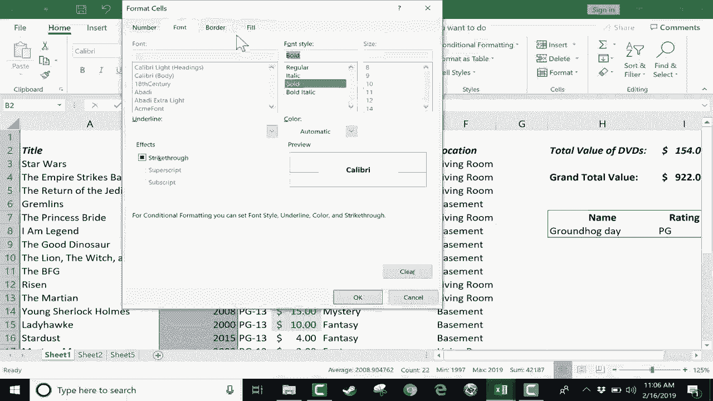

# Excel中级教程！(持续更新中) - P11：11）深入了解条件格式 - ShowMeAI - BV1uL411s7bt

在本教程中，我们将仔细研究Microsoft Excel中的条件格式。为了这个视频，我们将使用两个不同的电子表格。这是我在一些之前的视频中使用的电影库存电子表格，包括Microsoft Excel初学者指南。如果你还没有观看过。

你绝对应该。但这只是我拥有的一些电影的库存和相关信息。我还会使用这个电子表格。这是一个包含大量财务数据的电子表格，是许多企业常用的包含大量数据的巨大电子表格的一个很好的例子。那么，让我们直接进入条件格式，了解它是什么以及如何使用它。

在我的Microsoft Excel初学者指南中，我对条件格式做了简要介绍。我们来聊聊它是什么。条件格式是一个工具，它让我们有机会😊。更改电子表格中数据的外观。它根据某些条件格式化电子表格中的数据。这就是为什么它叫条件格式，你可以在主页选项卡上找到条件格式。

样式组中的主页选项卡。让我们看看它能为我们做些什么。假设我想要一个可视化的表示，显示当前价值最高的DVD。因此我可以查看D列的值。我可以直观地看到哪些DVD现在更有价值。当然，我也可以应用过滤器，从而筛选出便宜、价值较低的DVD。

但这会隐藏数据。如果我想能够看到所有的数据，但又能一眼看出哪些更有价值，该怎么做呢？方法就是选择D列。在这种情况下，前往“主页”选项卡，点击条件格式。

会出现几种不同的选项。这就是我们在这个视频中要讨论的内容。这些选项都能为我们做些什么？让我们首先从顶部选项开始，突出显示单元格规则。所以我想突出显示数字大于某个数字的单元格。我将数字设为9。9。😊，9，所以大于9，99。

我刚刚在这个框中输入了内容。接下来，它显示的是“浅红色填充，深红色文本”。因此，格式化大于999的单元格为红色，基本上。我想一般来说改变这个。我认为绿色在很多情况下代表金钱。所以我想说绿色填充，深绿色文本。

我点击那里。我可以预览它的外观，如果我喜欢，我点击“确定”。如果我不喜欢，我可以点击“取消”。但我会点击“确定”。所以你可以看到这有什么效果。它自动改变了这些特定单元格的格式，因为14大于9.99，15也是，10也是。所以这些都被高亮为绿色。

注意还有什么被高亮为绿色。“值”这个词。一些“值”大于9.99。这不是我想要的。我不想让“值”这个词变成绿色。那么我该如何修复呢？

嗯，我要做的是点击“值”这个词，去条件格式，然后从选定单元格清除规则。我可以从整个表格中清除它们，但那样我就会失去我希望保留的格式。所以我只会从选定单元格中清除规则。现在这正是我想要做的。

现在，有些人可能会想，为什么我不直接点击并拖动，而不在我应用条件格式的电子表格范围中包含“值”这个词。嗯，我不这样做的原因是，如果我输入新的数据，并不是说它会自动正确格式化，但如果我只是点击并拖动选择一个范围，那就不成立。这就是为什么在大多数情况下，点击整个列更好的原因。

或者如果你想应用条件格式到整行的信息。然后只需点击并清除选定单元格中的规则。希望这有意义。现在，在一个如此小的电子表格中，你可以看到这非常有用。它确实为我高亮了那些更有价值的项目，但想象一下一个更大的电子表格。

更大得多。在这些情况下，条件格式可以更有用。我认为我们可以尝试第二个使用条件格式的示例。我会去销售单位，点击整个E列，然后去条件格式。我想快速向你展示，除了大于，你还可以做小于，所以我可以突出显示数据少于这个数字的单元格。

而我可以更改那个数字。我还可以突出显示介于两个数字之间的数据。它等于一个特定的数字。我还可以突出显示包含某些信息的文本。所以例如，让我们回到我的电影库存。我会选择A列，选择条件格式，突出显示单元格规则，我想突出显示包含文本的单元格。

这个词是“星”。我想把它高亮为绿色。你可以看到它是如何工作的。现在，趁此机会，我想告诉你，你还可以设置自己的自定义格式。所以如果你对内置的格式选项不满意，你可以自己创建一个。例如，我可以去填充，然后我可以说我希望它填充为橙色。

我希望模式颜色稍微浅一些的橙色，模式样式。这个怎么样？我会加上一个边框。字体呢？我希望它是粗体，字体颜色我希望不要是自动的。也许我希望它是深绿色。然后就点击 O。如你所见。

你可以设计自己的个人自定义格式来改变屏幕上数据的显示方式。但在大多数情况下，我通常只使用这里的默认黄色、绿色和红色。好的。注意你也可以使用高亮单元格规则来查找发生的日期以及查找重复值。所以在这种情况下，它正在查找在这一列中其他地方重复的每个数字。

你也可以做类似的事情，但不是查找重复项，而是查找唯一值。如你所见，我刚刚去高亮单元格规则，更多规则。这里显示的是仅格式化唯一或重复值。然后，你将其从重复更改为唯一。你可以设置你希望的格式，然后点击确定。

这显示了在这一列中具有唯一信息的单元格。好的，所以这个条件格式高亮单元格规则类别有很多很好的选项，可以帮助我们按照想要的方式格式化数据。接下来，让我们看一下顶部底部规则。对此，我想切换到另一个电子表格。我想在这个电子表格中关注 E 列。所以我选择了 E 列。

我将转到条件格式。这次，我不想寻找高于、低于或在某些数字之间的数据。我只想让 Excel 显示这个列表中的顶部和底部。比如前 10 个项目。所以我点击它。这个单元格范围内的前 10 个值现在会用浅红色格式化。

让我们把颜色改成绿色。假设我点击。

好的，最开始并不明显有什么变化。但当我浏览页面时，我确实看到了一些高亮。所以那些是前 10 个值。现在，如果我想稍微改动一下，而不是前 10 条，可能我想要前 20 条或前 50 条。那么我可以再次选择 E 列。

转到条件格式设置的顶部底部规则。我可以应用另一个前 10 条规则。但如果你还记得，我已经有一个规则了。所以我将向下选择管理规则。它会弹出我已选择并创建的规则。我可以点击它，然后点击编辑规则。然后我可以把它从前 10 条改成前 60 条。

或者如果你愿意，你可以让它显示所选范围的顶部百分比。所以可能是前 10%。我就将其保留为前 60 个值。我点击 O，点击应用，确定。现在它应该显示更多的单元格高亮显示为绿色，确实如此。我将再次选择 E 列，返回条件格式。

我要从整个表格中清除规则。让我们看看我们还有哪些其他选项。除了前10个项目，你还可以做前10%。底部10个项目，底部10%。你可以显示高于平均值的值或低于平均值的值。这些都是很好的选项。现在我们来看看数据条。

数据条是一种优秀的视觉方式，同时也是展示数据的一种有趣方式。所以我将跳到H列的总销售额。我想在这里突出显示销售额最高的产品。所以我选择H列，点击条件格式按钮。我将选择数据条。在这里，你只需将鼠标悬停在不同选项的顶部。

基本上，我们所做的就是用视觉符号来表示数字。😊，在单元格中。在这种情况下，是数据条。所以数字越大，条形在单元格内看起来就越大。我们这里的选择基本上是颜色和样式选项。所以我们有渐变填充，左侧是实心绿色，右侧开始变成浅绿色。

我们还有实心填充，整个条形都是实心绿色。我喜欢这个选项。我将选择橙色和黄色，只是为了稍微变化一下。所以我点击那里，现在只需一眼，我就能看到这款产品在德国的销售情况如何。

我只需浏览这个电子表格，就可以知道这一点。当我再次向下浏览页面时，我可以看到其他突出表现的部分。所以数据条确实是格式化数据的一个很好的方式，使其更易读、更易理解。在我离开数据条之前，我想向下点击更多规则，向你展示这里有一些很好的选项。有一些高级选项，你可以在这里浏览。

我鼓励你去探索这些选项，看看你能用它们做些什么。但在这里我想让你知道，有一个有趣的选项可以只显示条形图。所以假设数字本身并不是那么重要，也许你是作为演示来展示这个内容，而你并不一定想让人们看到总的销售额。

但你只希望他们能看到一个产品的销售情况比另一个产品好多少。你可以直接去这里选择只显示条形图，然后点击O。我在这里犯了一个错误。我没有选择整个列。所以我将点击H列，重新尝试。条件格式数据条更多规则。

这次只显示条形图。我点击了O。与此同时，你可能注意到了，我把条形颜色改成了蓝色。所以我得注意这一点。如果这不是我想要的，我需要进去。😊，进行更改。但你可以看到结果。现在，数字被隐藏了，我们只有一条指示这些数字彼此比较的条形图。现在。

如果你点击一个单元格，单元格中的数字会在公式栏中显示。因此，数字仍在，只是暂时对我们隐藏。我们可以通过选择H列，进入条件格式，数据条更多规则，确保“仅显示条”未被勾选来恢复它。

这是我将颜色改回橙色的机会。然后我可以点击O。你可以看到现在数字和数据条出现了。好吧，让我们跳到这里，不是总销售额，而是销售。我将选择J列。这次，我们去条件格式和颜色刻度。

颜色刻度在某种程度上与数据条相似。你可以看到这里有一个从底部的深红色到顶部的深绿色的刻度。这一刻度是不同的。底部是深绿色，顶部是深红色。这一个从底部的深红色到顶部的白色。然后这个则全是绿色。

这个全是绿色的。底部是深绿色。这次，深绿色在顶部。所以这是我根据想要的数据外观选择合适的颜色方案的机会。我想要的是低数字为红色，而高数字为深绿色。现在我只需一眼看过去，最有利可图的项目都是深绿色的。

然后它们的颜色随着数字的降低而变为浅绿色。接着变成黄色。最低的数字则是深红色。这是格式化数据的绝妙可视化方式，帮助人们更好地阅读和理解数据。接下来，我会跳到利润部分，选择L列。这次我们来看条件格式图标集。

概念与颜色刻度和数据条类似。基本上，我是说我希望每个单元格中出现一个图标，取决于单元格中数据的值。我在这里选择的是符号类型。所以我有方向符号、形状、指示器、评级，你也可以进一步探索其他选项。

然后我还需要选择要处理的图标数量。所以这个有三个。这个有四个。这个有五个。这个有四个。这个有三个。你选择的图标数量很重要。因为你在特定列或行中的数据将会被划分，例如三等分、四等分、五等分。因此，你需要决定想要如何划分数据。

我会选择这三个箭头。所以我点击它。你可以看到它的效果。首先，为了适应。该图标在列中，Excel不得不把一些数字转成井号。因此我可以通过双击列L和列M之间的线来修复这个问题。双击后会提供适当的宽度，以便图标和数据都能适配，你可以看到结果。

我可以稍微看一下，看到这些数字在底部的三分之一。这一个在中间的三分之一，而顶部的三分之一在这里。好的，所以这个图标集，我觉得非常棒。我认为它运作得很好，但你也可以尝试其他图标集。你可以尝试交通信号灯，也可以使用旗帜，或者用勾号、星星这样的指示器。

数据条，还有更多。如果你进一步深入规则，你可以根据需要自定义更多。例如，注意你可以在这里更改截止值。所以按照自动设置，如果值达到，绿色的交通灯就会出现。

总金额中67%或更高的部分显示为黄色。如果少于67且大于或等于33。因此，如果我想的话，我可以调整为85%在这里，可能20%在这里，然后点击O。如果你不想用百分比，可以更改为具体值、数字或公式。

你拥有各种不同的选项。我将把它改为，如我所说的，85和20，我会点击O。你可能注意到，这些颜色根据我在高级选项中所做的决定而改变。所以这对Excel中的条件格式进行了相当深入的讲解。我希望你喜欢观看这个视频，并且它对你有所帮助。如果是的话。

请点击下面的点赞按钮。
