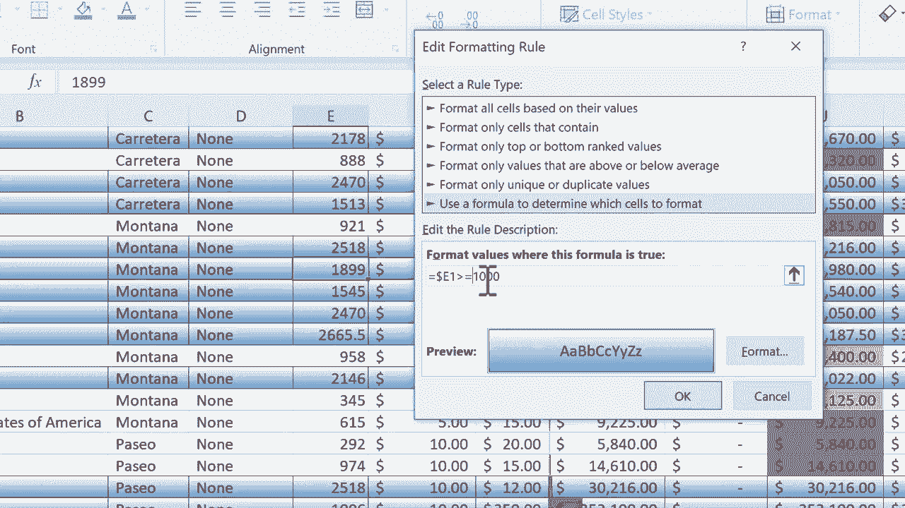

# 【双语字幕+速查表下载】Excel中级教程！(持续更新中) - P12：12）条件格式高级技巧 - ShowMeAI - BV1uL411s7bt

In this short Excel tutorial， I want to show you an advanced technique of how to do conditional formatting。 And if you haven't already watched my Excel conditional formatting in depth tutorial。 you should probably watch that in addition to this one in that in depth tutorial。 I showed many of the options that we have when we're using conditional formatting。

 I went through all of these。 but there's one advanced technique that I'd like to share in this short tutorial。 And that is instead of applying conditional formatting just to one column like I've done in these cases。 right， this column is formattted based on the higher the number， the more green the cell is。 the cells in this column are formatted in a different way。 the higher the number。

 the bigger this bar is。 And then I have these stoplight symbols here in column L。 But instead of just dealing with one column， what if you want an entire row to be highlighted based upon a certain number。 So， for example， in this spreadsheet， I would。

Like to highlight the rows of the products， etc ce that sold the most units。 And so it deals with column E。 But because I want to highlight the entire row。 I'm going have to select all of my data in this spreadsheet。 So I'm going to click here in the upper left on column a。

 and I'm holding the click and then I'm dragging across to highlight all of the data。 There we go。 a through Q。 and now I'm going browse back over here to the left。 My data is still selected。 but I just use this bar to move back to the left side of my spreadsheet。 Now I'm going to go into conditional formatting and I'm looking for an option that highlights not cells but rows。

 and the place that you're going to have to go for this is actually down here。 and it's in new rule。 So I click there on new rule。 and there's a bunch of advanced options here that you can choose from。 but I just want to create a formula to determine which cells to。Format now， the question is。 what is my formula formatmat values where this formula is true。

 So I'm going to click in this box to type a formula。 And this is going to be an absolute formula。 And this is kind of confusing。 but that's all you need to know is that it's an absolute formula。 Therefore， you're going have to use a dollar sign。 So I just typed in that box and equals sign。 So equals。 And then here comes dollar sign to make it an absolute formula。

 And then I need to select a column。 And this is a little bit tricky。 Which column do I pick。 Well。 it's the one that I'm gonna base the formatting on。 And that's column E。 Remember。 I want to base it on which products are sold the most。 So I type in E。 Now what about the row。 So E is the column。 The row。 and this is kind of tricky。 I don't know what I should pick here。

 Would it be E2。 that certainly could work。 But there's a downside。Doing it that way。 Instead。 I'm gonna go with whatever is here in the upper left。 This is the active cell right now。 A1 is the active cell。 And so that one is what I'm going to put here in my formula。 So E1 if E1 is greater than。 So I type in the greater than symbol。 1000。

 then I want some formatting to happen。 And just as an example， I'll click here on format。 and I'll pick a border style， How about an outline， I can also click a fill color， maybe dark green。 There's also more colors I could pick here。 and there are some fill effects。 And you can see what some of those different options are。 I'm just going to leave it as is click O。

 And then if I click O here， take a look at what happens。 I clicked O。 and Excel has analyzed the entire column E， and it's found the values that are higher than 1000。 And if they are。thanhan 100。 It's highlighted the entire column。 So the nice thing about this。 it just makes it easier to hone in on all of the data that meets certain criteria。 It can be easy。

 though， to forget which column it's based on。 if you do forget。 you can go here to conditional formatting manage rules and look， there's the rule。 And I can click on it， I can delete the rule if I don't want it anymore more。 I can edit the rule。 and there is something I would like to edit about it。

 notice that right now it's set for values that are greater than 1000。 And so what about the number 1000 itself。 Of course， that would not be included。 so I should put greater than or equal to 1000 or just as good and maybe better because it's more concise would be to say greater than 999。 So that would include 1000 and up。 and then I can just click okay and apply and then okay and that's now changed。

 It was a。

And it probably didn't really affect my conditional formatting in a real way， but that might come up。 So that is something to watch Thanks for this this advancedal formatt。 I hope that you found this tutorial to be helpful。 If you did， please click the。