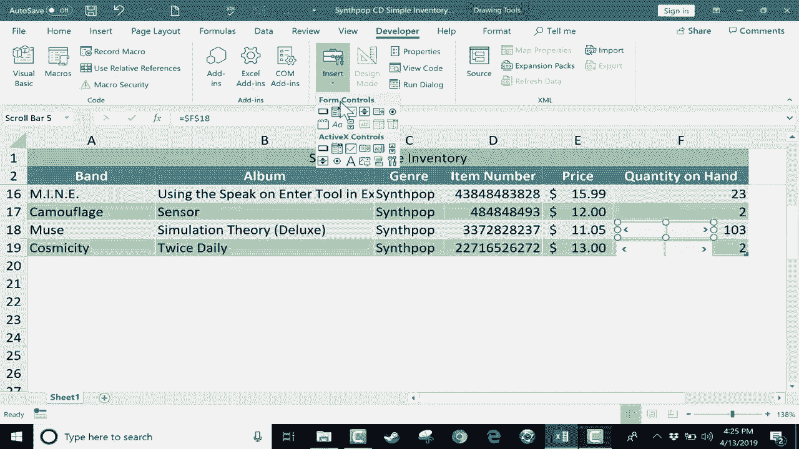

# 【双语字幕+速查表下载】Excel中级教程！(持续更新中) - P14：14）添加滚动条 - ShowMeAI - BV1uL411s7bt

在这个Excel教程中，我想向你展示如何添加一个表单控件，给你一个滚动条，帮助你调整Excel中的数字。如果你不熟悉表单控件，你真的应该了解一下。如果这个特定视频受到很大关注，我将制作另一个视频，涵盖更多表单控件。

如果你对此感兴趣，请告诉我。如你所见，这是一个简单的库存，供卖**合成流行**音乐的商店使用。这只是一个假设，但你可以在左侧看到一些这家商店所销售的乐队，包括最新的**Muse**专辑。

如果你熟悉**Muse**乐队，《模拟理论》是一张非常好的合成流行专辑。这只是跟踪乐队、专辑、流派以及一些其他信息，比如CD的价格和商店中现有的CD数量。现在，如果数量发生变化会怎样。

假设销售了一堆CD。我需要更改数量。也许商店出去采购一些CD。同样，这个数字需要更改。当然，你可以直接点击并在上面输入新数字，但让我们看看如何添加一个表单控件，可以在某些情况下帮助你更快地做到这一点。

现在，要添加一个表单控件，你需要确保在功能区上有开发者选项卡。我没看到它。那么我如何将其放到功能区上呢？基本上，你只需右键点击其中一个选项卡，并选择自定义功能区。这应该会弹出一个窗口，提供一系列你可以添加到功能区的不同选项。

这是开发者选项卡。所以我勾选了那个框。点击，现在我应该在功能区上有一个开发者选项卡。它花了一秒钟才出现，但现在它在那里。我可以点击它，寻找控件组。这里是你会找到各种有趣和令人兴奋的东西。

你可以添加到电子表格中的控件。我将去这里插入，并点击。这里是表单控件。我寻找的就是滚动条。这就是它。所以我会点击那里。一旦你点击那个小按钮，Excel现在给你机会基本上绘制你的滚动条。

所以我将把鼠标指针放在我希望滚动条的位置。就在这里。我将左键点击并拖动以绘制滚动条。我会把它放在这里，它就出现了。现在这个滚动条基本上是浮动在数据上方。所以如果它覆盖了你的数据，也不用担心，它不会破坏你的数据。

直到你正确设置它，它甚至不会影响你的数据。我希望这个滚动条影响这个 C 的数量。因此现在它在那里。我可以右键点击滚动条，我需要往下去格式控制。记住，这被视为一个表单控制。因此，我想格式化这个控制。

在我看来，这里最重要的选项是这个单元格链接。我需要将其移到左侧。我需要往下去单元格链接，点击并输入它链接的单元格。如果你愿意，可以点击这里的按钮，然后选择你想要连接的单元格。然后我可以回到这里，点击这个按钮回到选项中。

这里还有一个重要的选项你需要注意，那就是最小值和最大值。所以我将最小值设置为 0。现在最大值设置为 100。我将把它提高到 200。假设这个 C D 商店不想存放大量库存。我们将其限制在 200。

然后在这里你可以设置增量变化。每次我点击这个箭头时，这里的数字会增加一个，除非你希望它增加 2 或 5 或其他什么。因此我将其改回 1。好的，其余的我将保持不变。然后我会点击确定。现在让我们试试。这里是我的滚动条。

你可以看到有一条灰色的竖线，我可以点击并按住鼠标拖动这个滚动条，非常快速地将手头的数量增加到 200，如果我想的话。但假设它是 175。我可以点击并拖动以将其调整到 175。你也可以使用这些按钮。

我可以点击这个右侧按钮向上调高几个数字。因此，你有两种方式来调整数字：逐渐一个一个调整，或者使用滚动条。你可以更戏剧性地改变数字。所以现在，当然，我可以为每一个 C D 标题插入另一个滚动条。也许有更快的办法来做到这一点。

不过，可以简单地右键点击滚动条，并注意到这也给你提供了调整滚动条大小和移动它的选项。因此，你需要右键点击它才能获得这些选项。但是在这种情况下，我只想复制它，然后粘贴。所以我将按控制 V 粘贴。所以现在我有了一个副本，但记住我将这个滚动条连接到这个特定的单元格 F3。

所以这个新的副本也会影响单元格 F3，因此我需要右键点击，往下去格式控制，告诉这个第二个滚动条它应该影响 F4。现在让我们测试一下，真正地测试这些时，你应该在尝试使用它们之前先点击另一个单元格。所以现在我已经点击了其他地方。我可以回去，使用滚动条，看看它现在确实在影响正确的单元格。我将把这些复制粘贴到我想要的多个单元格中。

我知道我肯定需要更多的这些 muse 和 cosmicity Cs。所以我会直接跳下去为它们添加滚动条，以便增加它们的数量。但我再次需要确保右键点击格式，控制并链接到正确的单元格。就这样。谢谢观看。如果你有兴趣了解更多表单控件。

请在下面的描述中告诉我。但与此同时，我希望你觉得这个教程有帮助。如果有，请点击下面的点赞按钮。
