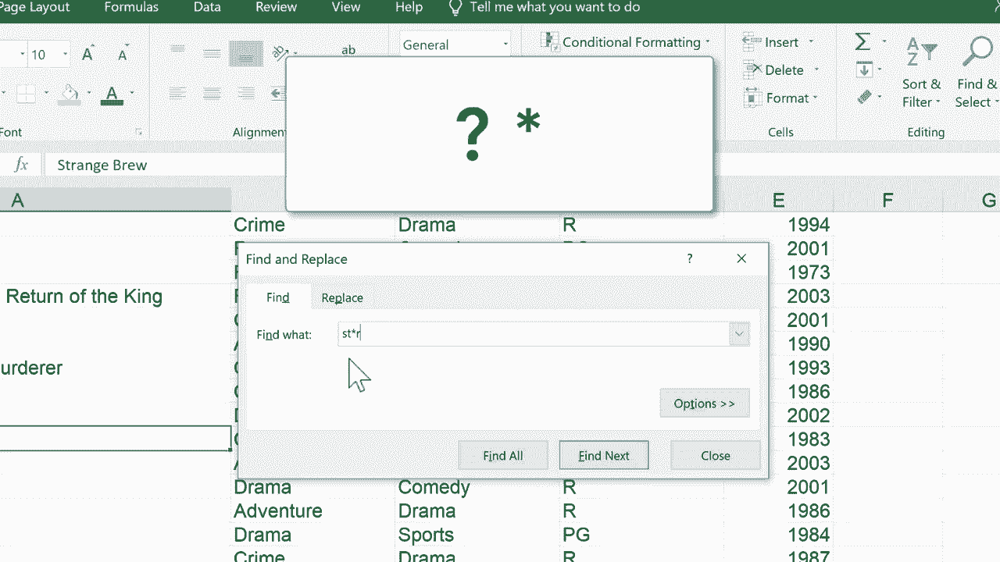

# Excel中级教程！(持续更新中) - P16：16）使用查找和替换以及通配符 - ShowMeAI - BV1uL411s7bt

在这个 Excel 教程中，我将向你展示如何使用 Excel 中的查找和替换功能来定位你的电子表格中的数据。所以这里我有一份电影标题及其相关信息的电子表格。但假设我想快速检查一下我是否包含某部特定电影。我所要做的就是按住控制键并按 F，它就会弹出查找和替换。

首先让我们看看查找功能。所以在选中查找标签的情况下，我可以输入我想定位的内容。比如说电影《黑暗骑士》。输入后，我只需在键盘上按回车或点击查找下一个，它就会定位到该数据。现在，如果这就是我所需的，仅仅是验证数据在那里，那我就完成了。

但有时我可能想用其他东西进行查找和替换。所以也许它应该被命名为黑暗骑士，而不仅仅是黑暗骑士。我可以输入这个，点击替换。如果这个问题有多个实例，我可以点击全部替换，它就会修复所有的。我点击，O。

所以这是一种很好的节省时间的方法。如果你犯了拼写错误或其他错误。你可以让 Excel找到所有该错误的实例，并将其替换为正确的数据。现在。如果你知道你在寻找某个东西，但不确定那是什么，你不太确定你犯了什么错误，但你知道你可能犯了一个。

或者假设你在 Excel 中寻找所有类似的数据。你可以使用 Excel 中的通配符字符。让我们看看通配符符号。我们有问号和星号。这是两个主要的通配符符号。所以假设我在寻找包含字母 S T 的电影。

但也许我不确定接下来是什么。所以在 S T 后，我可以放一个问号。这个问号是一个通配符。它可以代表任意一个字符。所以 S T 后跟任意字符，然后再跟一个 R。任何符合这一条件的示例在我点击查找下一个时应该被找到。所以让我们试试。

它找到了小丑，因为 S T E R，问号可以替代那个 E。让我们找下一个。Western，它找到了单词 Western，星际迷航 4 和星球大战。当我使用这个问号通配符时，每个都找到了，因为它可以替代任意一个字符。好的，让我们再试一次，但这次。

让我们使用星号通配符。所以 S T 星号 R。星号可以替代任意数量的字符。所以这应该能够找到这个电子表格中任何包含 S T 和任意数量字符的数据，后面跟着一个 R。让我们试试。它找到了 Western。它找到了星际迷航和星球大战。

但是它也发现了奇怪的酿造和法庭耶稣。所以它给了我们一个额外的搜索结果。圣酿。所以查找和替换是Excel内置的一个非常有用的工具。你可以用它来查找数据并替换数据。当你需要时，记得使用问号和星号。

这些是你的通配符，帮助你查找你可能不完全知道怎么拼写或是否拼写错误的数据，但你仍然想要能够找到它。感谢观看。我希望你觉得这个教程有帮助。如果你觉得有帮助，请点击下面的点赞按钮。

