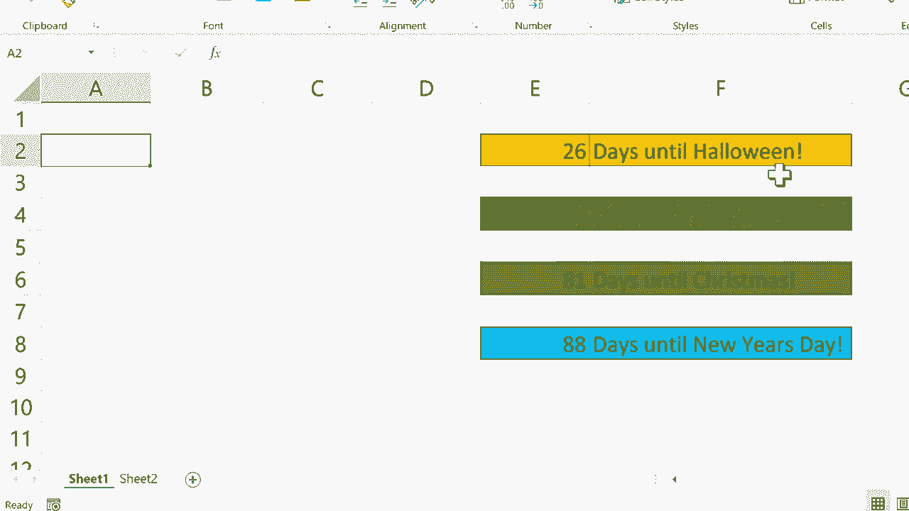

# 【双语字幕+速查表下载】Excel中级教程！(持续更新中) - P19：19）使用 Excel Today 函数设置目标日期 - ShowMeAI - BV1uL411s7bt

在这个教程中，我将向你展示一个Excel函数。这个函数是今天函数。让我们看看它是如何工作的。我这里有一个电子表格，我们稍后将使用它，但现在，我只是要去右下角，稍微放大一点。我希望放大到大约1070%。我会点击一个单元格，假设是单元格B3。

然后我会输入等号，所以这个单元格等于今天。然后你只需输入左括号和右括号。然后按下键盘上的回车键，它会给你今天的日期。考虑到这一点，这怎么会有用呢？也许你正在打印电子表格。

每次打印时，你想知道打印时是哪个日期。你想要有记录。你可以创建一个包含这个函数和公式的单元格，然后继续打印，日期总会打印在那。因此，这只是一个例子。有很多情况下，使用今天函数会很有用。但为了好玩，我在这里放入了一些假期。

我希望它能自动生成离这些假期还有多少天。现在，我希望你能看到你也可以把这个用于其他事情，也许有个即将到来的目标日期，一个团队期待或努力实现的事件，你也可以做同样的事情。所以我首先要做的是删除这个。我们不需要它。

假设这个电子表格上已经有各种其他数据。我不想干扰已经存在的数据。所以我将去左下角，点击加号以获取第二个工作表。然后，我会稍微放大一点。

然后我会在这里输入我的公式等于今天左括号和右括号。按下回车键。所以这总是会在我打开电子表格时生成今天的日期。然后我会在B列中点击，输入万圣节的日期。就这样，现在我所要做的就是回到Sheet1，点击单元格E2。

然后我会输入等号。所以这个单元格等于，然后我会点击左下角的sheet2。这等于这个日期，注意这里在公式栏中输入的内容。它只是引用了sheet 2的单元格。所以这个单元格。然后我会点击上面，输入减去这个单元格。

然后我会按下键盘上的回车键。离万圣节还有26天。现在我可以很容易地为感恩节、圣诞节和新年做同样的事情。至于我上面的公式，我只需点击它，然后点击右下角，使用自动填充手柄向下拖动，复制这个公式到4。但是现在我需要输入这三个额外假期的日期。

请给我一点时间来完成这个，然后我会继续视频。好的。你可以看到我已经输入了所有即将到来的假期的日期。现在我可以回到 sheet1，重复我在这里为万圣节所做的过程。只需点击输入等于，然后转到 sheet2。它等于感恩节减去今天的日期。

按下回车，圣诞节的日期也是如此。这个单元格等于 sheet2 的圣诞节日期。然后我到公式栏这里减去今天的日期，输入，元旦也是如此。这个单元格等于 sheet2 的元旦，减去今天的日期。按下回车。现在我有了一个内置的追踪器，告诉我距离某些激动人心的目标日期还有多少天。

我设置的这些目标日期在 sheet2 中。这样，它与我在这个电子表格中日常使用的数据是分开的。所以我希望你能找到可以利用这个的方法，也许可以将其添加到你的电子表格中，提醒你某些事项的截止日期。也许它可以作为提醒，告知何时需要发布某些数据或完成某些目标。

感谢观看。我希望你觉得这个教程有帮助。
