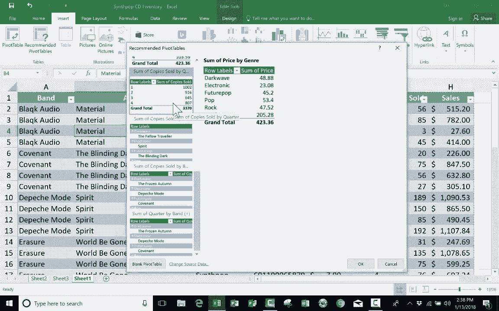

# Excel中级教程！(持续更新中) - P22：22）※使用“推荐的数据透视表” - ShowMeAI - BV1uL411s7bt

在这个简短的教程中，我将向你展示最简单的方法，将数据透视表添加到你的Excel电子表格中。这个功能叫做推荐的数据透视表，仅在较新的Excel版本中可用。所以你需要检查一下你的Excel版本是否支持。检查的地方在左上角，只需点击“插入”，你应该能看到“数据透视表”旁边的“推荐的数据透视表”。如果你还没有这样做。

你真的应该观看我之前的视频，专注于常规数据透视表，以及如何设置它们，如何排列数据以显示你想要的内容。因此，请在观看这个视频之前观看那个视频，或者至少在观看这个视频的同时观看。在之前的视频中，我使用了相同的电子表格，里面有乐队列表，电子表格应是一个假设的合成流行音乐商店的库存。

所以我们这里有一些惊人的😊流行乐队及其最新的C发行版的列表，它以一种典型的库存方式排列。你有项目编号、价格、季度、售出总数以及总销售额，换句话说，就是总收入。

但是如果我想从这个电子表格中提取特定数据并以新的方式查看它，我可以使用数据透视表工具来实现，但在数据透视表工具旁边有一个叫做推荐的数据透视表的选项，如果你点击推荐的数据透视表，你会看到一个弹出窗口，我看看能否将其展开一点。

推荐的数据透视表听起来就是字面意思。Excel在这里基于我在电子表格中的数据进行推荐。它推荐了可能的数据透视表，以便我能够生成按类型汇总价格的数据透视表。这将帮助我了解我在商店中每种类型的销售价格。

但这真的是我想知道的内容吗？我的意思是，这些是可能被售出的商品的价格总和，但它们并不一定已经被售出。所以我不知道这是否真的是我想要的。我认为不是，所以我会点击一些按类型销售的内容，这可能对我更有用。现在我可以查看并识别我假设的商店中哪种音乐类型在我的客户中表现最好，而我的假设客户有着惊人的音乐品味。所以你可以看到流行音乐，这是为我带来最多销售的类型。因此，这个推荐的透视表可能实际上对我很有用。接下来是按类型的商品编号总和、售出副本总和和季度总和，对我而言，这并不是很有帮助。我并不需要知道商品编号，也许售出副本的总和会有用，但我不喜欢这个，所以我会继续选择下一个。所以这个想法是，你可以向下滚动并选择这些推荐的透视表之一。

基本上，它已经为你完成了工作，你只需查看一下，哦，这对我有用吗？还是没有用呢？这里有一些由乐队售出的副本。这相当有用，我认为它还列出了与该乐队相关的音乐类型，所以这可能也很有用，还有乐队按季度的总和。所以它将季度相加，注意除了布兰登·弗劳尔斯，其他的都得到了相同的数字。

因为我只为一个季度放入他的CD。所以这是另一个透视表报告的例子。即使它是推荐的，但它实际上没有什么用，它并没有告诉我我想要或需要的信息。因此，在这个例子中，我将选择一些按乐队售出的副本。我点击它，点击确定，注意它为我添加了一个表格，在这里我可以看到这个透视表报告，并从中获取我想要的信息。如果我想调整这个报告。

如果我想要添加或以某种方式更改它，在右边，我有透视表字段面板，我可以进行调整。我可以将季度添加为列或进行其他修改。如果你有兴趣了解更多关于这如何运作的信息，可以观看我之前的视频，名为《高级Excel：透视表介绍》。我非常喜欢透视表，通常我会自己创建它们，我通常使用插入透视表，这就是我最常做的，因为我通常确切知道我想要在透视表报告中的内容，但有时我并不完全确定，因此我会插入推荐的透视表，然后看看，哦，我想知道这是否对我有帮助，我想知道那条信息是否对我有帮助。所以这是一种很好的方式，可以获取关于透视表如何为你带来好处的想法，并从你的数据中提取信息。谢谢观看，希望你发现这个视频对你有帮助。如果你觉得有帮助，请点击下面的赞按钮。

