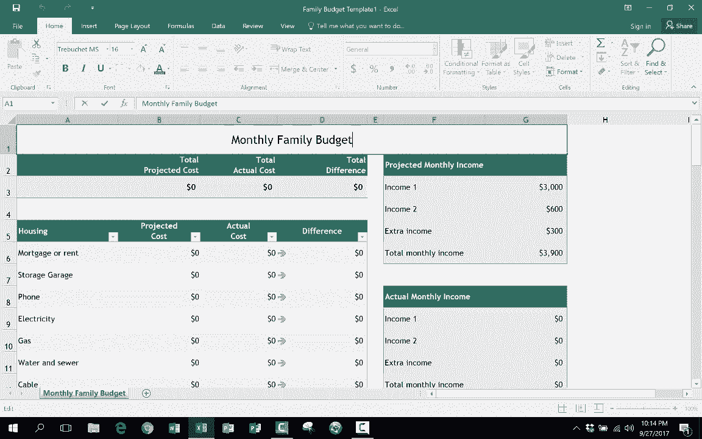

# 【双语字幕+速查表下载】Excel中级教程！(持续更新中) - P25：25）创建自己的 Excel 模板 - ShowMeAI - BV1uL411s7bt

In this short Excel tutorial， I want to show you how to create your own Excel templates。 And just so that you can see right away what I'm talking about。 let me show you what I mean Here I am in Excel in the info section。

And I'm just gonna go click on new。 So I click on new。 and it takes me to a page where I can create a completely blank workbook。 or I could open up one of these premade templates that other people have made and that Excel is making available to me so that I can easily just click to open up one of these templates。 And there's all sorts of templates that I can open up and use， And for the most part。

 they are wonderful。 But in addition to these。 notice what else I have。 I have a button here that says personal， And when I click on that。 I can get personal templates that I have made。 No one else can see these just me。 but I can click on these and open up quickly an Excel template that I can then adapt for my own needs and for my own uses。

 So let's look at how I did this。 How did I save this particular spreadsheet to be a personal template。 Well， to show you this， I'm going open up a spreadsheet that I've been working on。 This is a monthly family。😊，Budt that I'd like to use for my family。 And I actually found this online。 And I've gone in and changed some of the categories。

 some of the expenses and things like that that they had in here。 Most of these are relevant to me。 but there are a few that don't necessarily apply to me and my family。 and so I went in and change them。 So anyway， now that I've made a few changes here。 I want to save this so that on a monthly basis， I can just open up the template and start putting in the numbers for that month。

 And because it's a template， there won't be any danger of me over writing the last month's budget。 Okay， so to save this as a template。 What I need to do is go up to file。 choose save as And I'm going save this to this PC。 So I'll double click on that this PC。 it opened up a window here that I can use to look at my computer， the contents of my computer。

 In this case， my documents。 But I want to save this not as a typical Excel workbook。As an Excel template。 So I'm gonna select template。 and upon doing that。 notice that it opened up a folder that I wasn't aware of， or I hadn't even selected really。 it just automatically opened it up。 and I can see up here at the top what it is。

 It's in documents and it's called custom office template。 There's a folder called that。 And I just have one template in there right now。 But because I changed this save as type to be Excel template。 It automatically opened up this particular folder。 Now I can name this template family budget planner1。

 I want to change that probably and just call it family budget。 and maybe I should put the word template in there。 So family budget template。 I'll click save。 And so now I'm gonna X out of this。 And let's pretend like a few days later， I go into Excel。 I open it up。 and I would like to make a new monthly budget for this upcoming month。

 I don't have to open up last month and then change。The dates and change all the numbers and delete out the numbers that were there from last month。 Instead， I just open up Excel。 I go in and choose personal。 and there it is family budget template and I double click on it。

 It opens up everything is blank and now I can go in and click or double click and type in the next month in there。 and then I can start putting in the numbers that apply。 and I can change。 let's say the extra income for the month or whatever it might be。 But this way there's no need to open up last month and then delete all the numbers。

 change everything。 This will save you a lot of time a lot of work。 and one of the nicest things about it is you're not going to accidentally click save and erase last month。 let's say you opened up October's spreadsheet， change the numbers in preparation to do November family budget and then you accidentally click save。 It's gonna erase October's spreadsheet and over write。So using a template solves that problem。

 You're not going to accidentally overwrite last month's work。 Okay so let's pretend like I've put in all the numbers and this budget is done。 I'm gonna go up to file， save as this PC this time I'm not saving it as a template I'm just saving it as a workbook and all I have to do is take out the word template。 family budget November 2017 and click save And then just to reiterate next month I can go in。

 click personal， open up family budget again and it's the blank version of the budget again and this time I'll put in December so hopefully you get the idea and you see the advantage to doing it this way to using Excel template to create content that you need to generate on a monthly basis or maybe a quarterly basis or even a yearly basis but you don't want to have to recreate the will each time you want the template available in a partially blank format。

The numbers are zeroed out many of them。 and then you can just build from there for the current month or quarter or year。 So I hope you enjoyed watching this video。