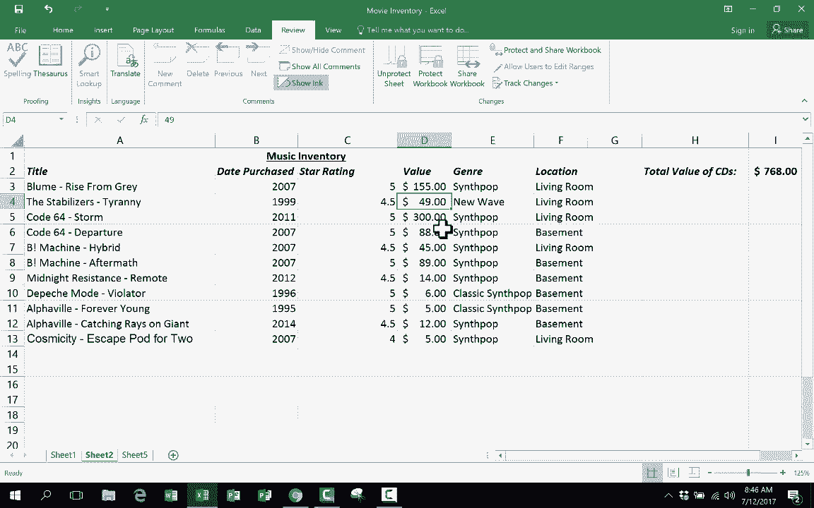

# Excel中级教程！(持续更新中) - P26：26）※保护工作表 - ShowMeAI - BV1uL411s7bt

在这个短视频教程中，我将向你展示一个高级Excel技巧，叫做Pro sheet。此时，我希望你已经观看了我的Excel初学者指南以及我的Excel中级技巧与窍门。对于高级内容，我只是制作短视频。因此，当你有时间时，请查看我其他的Excel高级视频。不过在这个视频中。

我们将看一下如何保护一个工作表。所以我这里有一个示例工作表，它非常小，但基本上是一个令人惊叹的音乐列表，其中一些你可能听说过，还有一些则是更为冷门或不太知名的音乐。如果你对了解这些惊人的音乐感兴趣。

我会在下面的描述中放一些链接，以便你可以点击并了解那些应该是世界知名的音乐，但并不总是如此。无论如何，假设我想把这个电子表格交给别人，也许我的儿子或女儿要进去，我希望他们更新我的CD收藏的值。当然，这只是这个收藏的小样本。无论如何。

假设我想让他们偶尔更新这些C的当前值，但我担心他们可能会意外删除一些数据。这些数据我花了一段时间才输入，我想保护它们，这样他们只能更改每个项目的当前值，而无法破坏整个记录。那么我该如何做到这一点呢？这有点棘手。

你几乎需要反向思考，以找出如何做到这一点。你需要做的是点击并拖动选择我希望可编辑的单元格。这些是我希望可编辑的单元格，其他所有的我希望被保护和锁定，但这些我希望是可编辑的，所以我选择那些单元格范围，当然我可以选得更远。

然后我去到主页选项卡的主页功能区和字体组的启动按钮。老实说，我可以选择任何一个启动按钮，但我点击了这个，字体启动按钮。它打开后有一些选项，其中一个是保护。有一个保护选项卡。所以我点击它，注意到我选择的那些单元格默认是锁定的。

Excel中的所有单元格都是锁定的。但它们似乎并没有被锁定，对吗？原因是为了真正激活这一点并让它们确实被锁定，你必须遵循这里列出的步骤。但在这个情况下，这是我不想锁定的范围。所以我将取消选中那个选项。点击确定。

现在这些设置为解锁状态。其他一切则设置为锁定状态。所以现在要实际激活它，为这张表添加保护层，以确保这些是解锁的，而其他所有内容都是锁定的。我需要做的就是再一步。我必须去“审阅”选项卡，查找“更改”组，注意到有一个保护工作表的选项。

所以只需点击一下。这将出现这个选项，保护工作表和锁定单元格的内容。如果我愿意，我可以设置密码保护，这样学生或其他人就不能随便去查看和取消保护工作表。我可以设置密码保护。我会点击确认。所以现在它是被保护的。这个工作表被保护了。注意当我尝试在“新波”这几个字上输入时会发生什么。

当我尝试在某些日期上输入时，它不让我输入。这些区域是锁定的。但我设置为解锁的部分，比如说某些CD的价值上涨，这种情况经常发生。我可以点击并更改这些，因为我将这些单元格从默认的锁定状态改为解锁。

所以这是一种保护工作表的方法，如果你有点担心可能与他人共享，并且害怕他们可能会错误地或故意更改错误的数据，而你又希望他们能够在表的某些区域工作。

