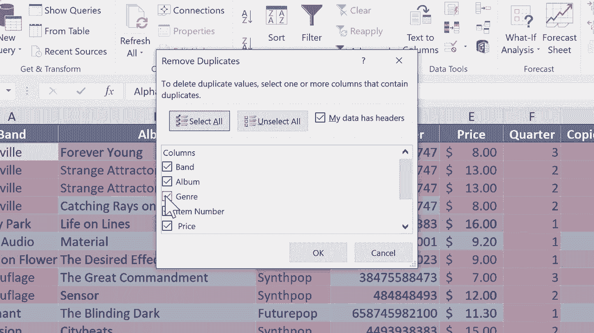

# 【双语字幕+速查表下载】Excel中级教程！(持续更新中) - P27：27）处理重复项并查找唯一数据 - ShowMeAI - BV1uL411s7bt

In this Excel tutorial， we're going to tackle the problem of duplicates。 So here in this spreadsheet。 I have an inventory for a hypothetical music Cd store， let's say。 And it specializes in the best music ever created， which is synth popop and 80s new wave。 I'm sure you knew that already。 But you can see here a list of some really wonderful bands。

 And there's other data here as well。 And this is great。 But somehow some duplicates have cropped into this spreadsheet。 So you can see here， Alphaville。 a German band that's famous for their song foreverever Young and also big in Japan。 They've recently come out with another album calledSt attractor。 And you can see here。

 for some reason， I have two records of that album。 And browsing down the spreadsheet a little bit。 I can see that there's a duplicate here from the most recent OM D C D。 And even the killers。😊。Wonderful。 So there's some duplicates going on here。 And maybe that's not a problem。 Maybe it is just depending on what the purpose of the spreadsheet is。 But in this case。

 I don't want the duplicates。 I want to get rid of them。 I'm just going to click and drag to highlight the range of data。 So everything that I have put in here， that's all selected。 and then I'm going go here to conditional formatting and I'll select highlight cells rules duplicate values。

 Now I'm going leave it just as the default here。 but if I wanted to。 I could switch from duplicate to unique。 that would highlight just the unique data。 but I'm going stick with duplicate。 and I'll leave it as it says here。 light red fill with dark red text。 but if I wanted to， I could change that to some other format。

 I'm going click okay。 And this identifies for me duplicates。 Now it's okay if the word synth pop is duplicated right。 there's lots of great synth pop music represented here。So it's okay that the word synynth pop is repeated。 I don't worry about that but if I see these first two columns highlighted in red。 that tells me that there's a duplicate somewhere okay so I have five or six。 maybe seven different albums that are duplicates so now at this point because it's only six or seven I could solve that just by selecting the row just by clicking on that row number。 in fact I'm going to right click on it。And choose delete。 So it deletes that duplicate。

 That was binary Park。 You can see now， because I deleted the duplicate。 binary Park does not show up in red。 So this is a great solution for duplicates。 It highlights those things that might be a problem。 They might be duplicate records。 and then you just delete the ones that you want to delete。

 But imagine instead of a spreadsheet with 3 to 31 records。 What if it had 5010000。 I wouldn't want to delete those duplicates one at a time。 So instead， I can go here to data。 And on the data ribbon， you'll see a data tools group。 And there's an option here to remove duplicates。 but notice that it's grayed out， I can't use it。

 The reason why is because I have a whole range selected。 I'm just going to click on one particular cell in this range。 It doesn't matter really where it is。 And now， look， remove duplicates is an option。 And I'll click on that。 to delete。Duplicate values select one or more columns that contain duplicates。

 So what is the duplicate that I care about， How about band and album， So the rest of these。 I'm going to uncheck， And then I'll click O，6 duplicate values found and removed 24 unique values remain。 And so you can see because I chose band and album， even though alphaville。 the band is duplicated and depe mode is duplicated， and the killers are duplicated。

 because the album names were not always duplicated。 It didn't get rid of records that I would like to keep。 So I have three different alphavilles listed to different erasures， two different depeche modes。 et cetera。

Let's try it again。 But this time， when I do remove duplicates， I'm just going to say band。 So I don't want any duplicate bands at all。 I click， O。Now， there are no duplicates。 but I got rid of some albums by some of these bands that I wanted to keep。 So hopefully that makes sense as to why I selected both band and album。

 So looking for duplicates in both。 All right， I'm going to undo that。 even though it's exactly what I wanted。 And for this last example。 let's assume that somebody calls up my new wave synth pop store and says。 I don't care about the albums of the bands that you have。

 I just want a list of all the bands whose music I could find in your store。 Could you give me that list。 So， of course， I could use that technique。 I just showed you。 I could use that and then copy paste the list， send it to the person。 But here's another way。 you can do the same thing。I'm just going to click in column A。 let's say on binary Park。

 this is a great new album by them。 And then on the data tab and ribbon， the sort and filter group。 And I'm going to click on advanced。 and it pops up with this window that I can use to do some things。And the first thing I'd like to do is I'd like to copy to another location。 I'd like to copy a list of the bands to another location。 let's say over here to the right。

 but it could be anywhere。 next， let's look at the list range that Excel chose for me。 It chose a1 through a 62。 So that sounds right。 It's column A Next， I could put in a criteria range。 but in this case， I don't want to do that。 I'm just going leave that blank。 and I'll say copy what I find to， and I'm going to click here on this button。

 and then I'll click where I want it to appear。 I would like it to copy that data to cell I2。 So I click there on that cell。 and that's where the new data will start。 and then I can click this button here。And click O。 actually， before I click O。 I need to check this box that says unique records only。 I click O。 and look what it did。

 Now it formatted it for me。 and I didn't necessarily want that to happen。 But that's okay。 I could highlight the column。 go to conditional formatting and clear the rules from the selected cells。 so that's more like what I was looking for。 But this produced for me a list of just the unique records in the column that I had clicked。 So I had clicked here anywhere in column a， I went to data。

 sort filter advanced and followed those other steps。 And now I've got a list of unique bands that I can copy paste。 send it to someone do whatever I need to do with it。 So those are some tips and techniques to help you with the problem of duplicates in Excel and getting a unique list of items。

 Thanks for watching。 I hope you found this tutorial to be helpful。 if you did。 Please click the like button。Below。