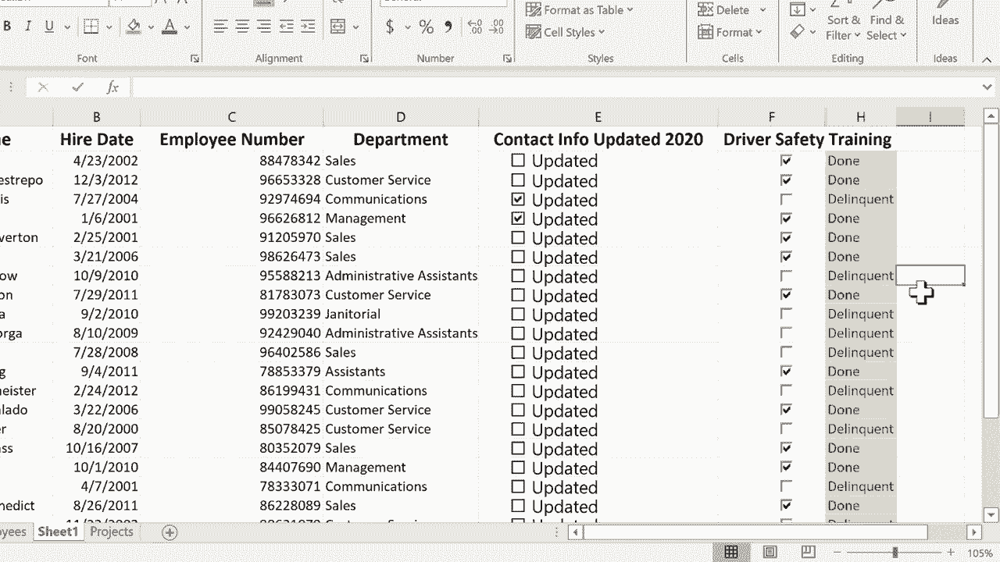

# 【双语字幕+速查表下载】Excel中级教程！(持续更新中) - P29：29）使用复选框2 - ShowMeAI - BV1uL411s7bt

This tutorial is a follow up to a previous tutorial called using check boxes in Excel。

 So in the previous video， which I hope you'll watch if you haven't already done so。

 I created two kinds of check boxes。 This is a simple checkbox that you can just click to mark something as being done or not done。

 in this case， it just means that the contact information has been updated。

 And then I showed how to set up a checkbox a little bit differently here in the driver's safety training area。

 I've set it up so that when you click the checkbox， yes， a check appears in the box。 but also。

 this cell is linked to the checkbox。 And so if it's checked。 it says true， if it's not checked。

 it says false。 So in this follow up video， I want to do a couple of interesting things with this true faults。

 The first thing I'd like to do。 instead of it saying true。

 I would like a more customized message to appear。 instead of just true or false。 to do this。

 I'm going to use the if function。 So I'm going to click here。On H2， and I'll just type equals。

 So this cell equals。 and then you put in the if function。

 You follow that up with a left parenthesis。 and Excel gives me a little helper message that appears here。

 if logical test， value of true value of faults。 So that should help me。 it's like a cheat sheet。

 So equals if left parenthesis。 Now I'm gonna to click on the cell that I want to test。

 So I want to test to see if G2 is equal to falses。 So I'll click on G2 is equal to faults。 Now。

 sometimes I'm tempted to put that word faults in quotation marks。 But you don't need to do it。

 in this case。 So don't now I'll put in a comma， and the comma basically represents then。

 So if G2 is equal to falses， then do something。 Now。

 if you want to learn more about the if then statements in Excel in more detail。

 watch my video tutorial that shows that in depth。But for now。

 I'm just going to put in the comma for then。 and I'll put in a space and then quotation marks。

 And then here I'm going type the word delinquent。 and follow that up with a closed quote。

 So let's review what this says。 if G2 is equal to falses。 then the quotation marks means print。

 So then print the word delinquent in H2。 Now， how do you say if not。

 notice that there's a comma here in the helper text that I'm given。 So I'll put another comma。

 So if not， and I'll put a space， but I don't think you have to then print done。

 and then close quote。 Now， I suppose I could have done this in the opposite order。

 I could have said if it is equal to true， then print done， If not， then print delinquent。

 It doesn't really matter one way or the other。 Now， at this point。

 I should put in the closed parenthesis and then tap enter on the keyboard。

 But you don't really have to。 So I'll just leave it blank and tap enter on the keyboard。

 And notice that now。It's generated the word done to let me know that employee number one Gina Puen。

 her driver safety training is completed。 Now， at this point。

 I hope I don't have to do that same formula again for row 3。 Fortunately， I don't have to。

 All I have to do is click here on done and use the autofill handle here at the lower right click and drag down and it will copy the formula that I've set up Here's the formula and it copies it all the way down but changes G2 to G3 to G4 etc ce。

 So now I've got a nice understandable text here that tells me whether they're done or not done。

 And notice when you check a box。 it changes both column G and column H Now。 So that's kind of nice。

 Now there's a couple of things I could do to make this look a little better。1 would be。

 I could click and drag on F1 through H1。 and then I could go here to merge and center。

 This is the merge center button。 I click on it。 And now it's centered over all three columns。

I think that just makes it look a little better。 It makes a little bit more sense。

 The other thing I could do is hide column G just by right clicking on G。

 I can go down and choose hide。 and even though it's hidden the formula still works。

 If I really wanted to I could make column F more narrow and again we're just making things look a little nicer I think that looks great actually the next technique I want to show you of how to change the look and feel of your data and of your spreadsheet based on check boxes is I want to show you how to use conditional formatting So here on the home tab home ribbon you should see in the Sts group conditional formatting and this is so useful if you haven't watched my tutorial on conditional formatting。

 you've got to do that I actually have a couple of different tutorials on it but I'm just going click here on column H and I'll go to conditional formatting highlight cells rules and I'll go down to text that contains So this is going to test to see if。

Any of the cells in column H have text that contains the word delinquent。 Now。

 if I hadn't hidden column G， I could have done this with column G。

 And I could have said if a cell contains the word faults， then format it。 But that's okay。

 I've hidden it。 So I'll just do the same thing with done and delinquent。

 So I'll just say format cells that contain the text delinquent with light red fill with dark red text。

 I think that makes total sense。 These are people that need to get in and do their driver's safety training。

 If you want， though， you can change it and have red border or you could have green fill， green text。

 you can also do some custom formats where you set it yourself。 the colors， the fonts。

 all of that kind of stuff。 But I'm going stick with light red fill with dark red text。

 click O Now I could click the same column again。 and do another highlight cells rule。

 text that contains。 and this time， the word done。 if it contains the word done。

 I'll highlight it in。enClick O， and there we go。 So now I have a very visual cu telling me whether they've done the driver safety training or not。

 Now， it is possible if you want for the entire row to be highlighted based on whether their safety training is done or not done。

 In this case， I don't think it makes sense。 But if you want to learn how to do that。

 you should watch my conditional formatting advanced technique tutorial that shows you how to do it。

