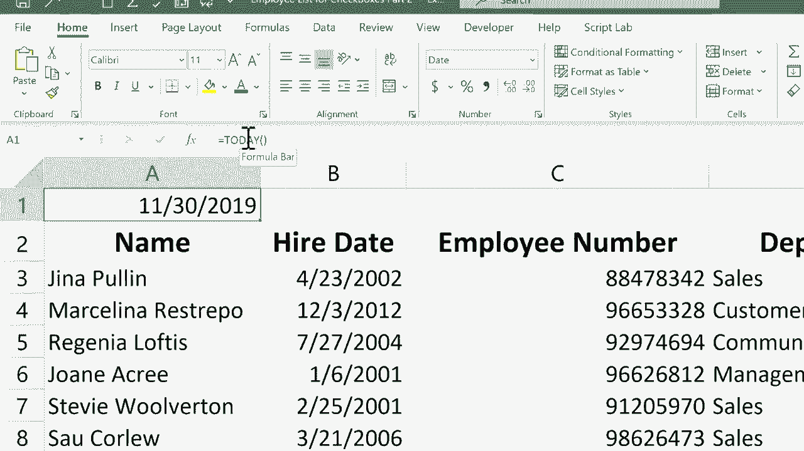

# 【双语字幕+速查表下载】Excel中级教程！(持续更新中) - P30：30）快速输入当前日期和时间 - ShowMeAI - BV1uL411s7bt

在这个简短的Excel教程中，我将向你展示如何快速将今天的日期和时间输入到你的电子表格中。在之前的教程中，我展示了每次打开电子表格时，当前日期如何被打印在特定单元格中。基本上，你只需要使用一个公式：`=today()`，然后按回车键。

每次你打开电子表格时，它应该显示当前日期。但有时候这不是你想要的。例如，在这个特定的员工电子表格中，我有一个员工及其入职日期的列表。我不希望入职日期每次打开时都改变。因此，每当有人被雇佣时，我必须手动进入B列，输入，比如说11月30日。

2019年，然后按回车。虽然这不是太糟，但确实有点耗时。似乎应该有更快的方法。告诉你，有几种更快的方式。稍微快一点的方法是，你可以点击一个特定的单元格，只输入月份，斜杠，然后输入日期，省略年份，然后在键盘上按回车。Excel会自动填入当前年份。但我想展示给你一个更快的方法。

你只需点击一个特定的单元格，按住控制键，然后按分号。当你这样做时，它会自动将今天的日期放入所选的单元格中。然后你可以在键盘上按回车，准备继续。所以控制加分号，我很快就得到了今天的日期。现在，如果杰弗娜被聘用的时间也很重要呢。

看起来似乎不应该是这样的。但是假设你希望当前的时间被记录在你的电子表格中。你只需按住控制键，按住Shift键，然后按分号，它就会输入当前时间。我会按回车。现在，重要的是要知道，当我关闭这个电子表格并在一周或10天后重新打开它时，这个日期和时间。

它仍然会显示11月30日，它仍然会显示九点37分。这些日期不会更新。除非你点击它们并重新输入，否则它们不会改变。这与上面的日期不同。这里使用的是今天函数。每次你打开电子表格时，如果是不同的日期。

它会更改这里打印的日期。如果你想了解更多关于今天函数的信息，可以观看我关于它的教程。但与此同时，我希望你觉得这个教程对你有帮助。
