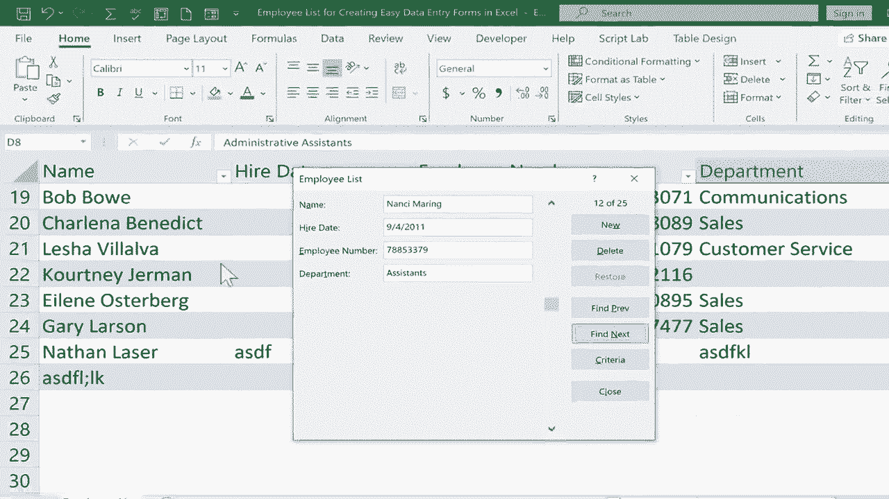

# Excel中级教程！(持续更新中) - P31：31）创建简单的数据输入表单 - ShowMeAI - BV1uL411s7bt

在本教程中，我将向你展示一种在Excel中创建数据输入表单的简单方法。这些表单使得在Excel中输入记录或数据变得容易得多。你可以在屏幕上看到，我有一个相当简单的电子表格。这是一个包含姓名、入职日期、员工编号和部门的员工名单。

假设一个企业决定要有一个员工表。这只是设置员工名单的开始。现在，想象一下为200名员工输入所有这些数据会多么耗时且痛苦。是的，你可以做到。你只需点击相应的单元格，输入并按Tab键继续输入。

但是以这种方式操作可能会导致更多错误。因此，让我们看看如何在Excel中设置一个简单的数据输入表单。我需要采取的第一步是上去点击快速访问工具栏。这是一个方便的工具栏，你可以在这里添加想要轻松快速访问的其他工具和功能。这就是为什么它叫快速访问工具栏。

如果你还没有观看我之前关于如何自定义快速访问工具栏的教程，请务必观看。但在本视频中，我只会点击这个按钮，这是自定义快速访问工具栏的按钮。点击后，它会给你提供一些可以添加或移除到快速访问工具栏的项目列表，但如果你查看这个弹出菜单的底部。

有一个更多命令的选项。我将点击它，这将带我到一个流行Excel命令的列表中。但在这种情况下，我们寻找的并不一定是流行的，所以我将下滑到“所有命令”或“未在功能区中的命令”。我会选择“未在功能区中的命令”，我寻找的是表单。

这就是我想要创建的快速简单数据输入表单。所以我将向下浏览，寻找表单。找到了，我点击它，如果你注意到右侧已经有一些项目。在这个列表中，比较一下这些与我快速访问工具栏上方的内容。

这些都是相同的内容。这里列出的功能与左上角的相同。所以我想把表单添加到那个列表中。选中表单后，我只需点击添加。它现在已添加到此列表中。当我点击确认时，它将被添加到我的快速访问工具栏中。现在我可以轻松访问这个按钮了。

我将能够轻松地为我的Excel电子表格创建一个数据输入表单。好的，接下来我们需要做的是将我在电子表格中的数据转换成一个表格。出于某种原因，这是使用这些快速表单的先决条件。那么如何将其转换为表格呢？我只需在数据中点击某个地方，比如这里。

然后在“主页”选项卡的样式组中，有一个按钮显示为“格式化为表格”。现在，有更快的方法来做到这一点。一旦你在数据的任何地方点击过，你可以按住控制键并点击“T”键来创建表格，这样会弹出一个窗口。在这里，Excel试图猜测我的数据是什么，在99%的情况下，它都是正确的。你会注意到，这里顶部、左侧和右侧都有一条虚线，轮廓勾勒出表格的形状，在大多数情况下，它的识别都是完全正确的。如果没有，你可能需要更改一些数字。

你可能需要点击这个，然后勾勒出你想要包含的内容，或者你可能需要勾选或取消勾选“我的表有标题”。我就点击“确定”，看看它是否有效。看起来是有效的，我可以告诉Excel已经将这些项目识别为标题，所以我想这很好，现在让我们进入下一步。在此时，我只想确保在表格中点击过某个地方，所以我会确保我这样做了。然后我点击这里的快速访问工具栏，点击表单按钮。

现在，注意它所做的。它在这个表中识别出了22条记录或行。它不计算标题行，而是跳过它。但你会注意到，记录编号一是Gina Pullen，位于左侧。但与Gina Pullen相关的所有数据和信息在这种情况下是垂直列出的，而不是水平的。

现在，有几个原因说明这很有帮助。其中之一是，比如说你有一个有14列或15列的电子表格。你不想每次都点击这个条并拖动到右边，或者为了输入数据而按14次Tab键。这种方式有点繁琐。因此，你可能想通过创建一个简单的数据输入表单来解决这个问题。

现在，如果我点击“查找下一个”。看看它怎么做。它转到下一个记录，Marcelinina Restrepo。再次点击“查找下一个”。Regia Loftus，等等。它在这里编号这些记录，所以我可以浏览它们。现在假设是时候继续为这家公司的员工输入数据了。我可以点击“新建”。注意它说新记录。我只需点击并输入下一个名字。

我将输入下一个员工的名字，如果我按Tab键，它会移动到下一个数据输入单元格。你可以像通常那样输入日期，可能是先输入日期再输入月份和年份，或者你可以按住控制键并点击分号，这样可以将今天的日期填入表单中。

Gary Larson 今天没有被雇佣，所以我会把日期改为其他日期，输入员工编号，然后我可以在这个录入表单中点击下一个单元格，或者像之前一样按 Tab，输入部门，此时我可以在键盘上按 Enter，它将记录插入到我的电子表格中，并给我一个新的空白表单。如果我关闭并向下浏览页面，你可以看到有关于 Gary Larson 的雇佣日期和员工编号。

在表单中跳转到部门是非常简单的。我只需在快速访问工具栏上点击表单，就能回到那里。我想输入一个新员工，只需继续输入。所以如果你经常进行数据录入，你会发现自己真的很喜欢这些可以在 Excel 中创建和使用的简单数据录入表单，而这也确实很容易做到。

我想指出我们的一些其他功能和按钮。我们已经查看了新建。请注意，还有删除。这显然是一个错误。我不知道我是怎么犯这个错误的，但我可以点击删除，显示的记录将被永久删除。这正是我想要的。所以我点击确定，它就消失了。我们还有一个查找以前的按钮。

所以这从第25条记录跳到第24条记录，然后是第23条记录，依此类推。你也可以找到下一个，这会推进到更高的数字。然后我们有一个标准按钮和一个恢复按钮。让我们看看恢复按钮。我将点击几次“查找以前”，我们有一个名为 Eileen Osterberg 的人，假设公司正在考虑将她的部门从销售改为客户服务。

所以我可以直接输入。但如果我意识到这是一个错误，我可以直接点击恢复，它会立刻回到我开始更改此表单数据之前的状态。所以只要你不点击关闭或在键盘上按 Enter。

在这里输入的任何内容都可以通过点击恢复按钮轻松撤销。除了关闭按钮外，另一个按钮是标准。标准的工作方式是你点击它，然后在这个表单中输入标准，然后 Excel 会查看是否能找到一个或多个与标准匹配的记录。例如，我真的很想找到一个名字中包含“Bob”的人，而较高的日期其实并不重要。

员工编号并不重要。部门应该是通信。好的，所以我有“bo”和“通信”。此时，我所要做的就是在键盘上按下 Enter，看，它在通信中找到了 Bob。他就在这里。你可能一开始会认为右上角的这个数字表示通信中有 25 或 18 个 Bob，但如果你点击“下一个”，你会发现其实只有一个 Bob 在通信中。

那么，如果我想查看所有通信人员，而不仅仅是鲍勃，该怎么办呢？我将关闭表单，重新打开并进入条件，输入通信，然后按下键盘上的回车键。现在看看，它找到了Regia Loftus。如果我点击下一步Palma Newmeister，老朋友鲍勃又出现了。所以我希望你能看到Excel数据输入表单有多有用。

它可以将你的数据输入任务从横向转换为纵向，并注意到你可以滚动。因此，可能会有10,520个不同的数据位需要输入，它将它们变为纵向，而不是横向，并在右侧提供这些工具，帮助你在创建的表格中进行搜索。

