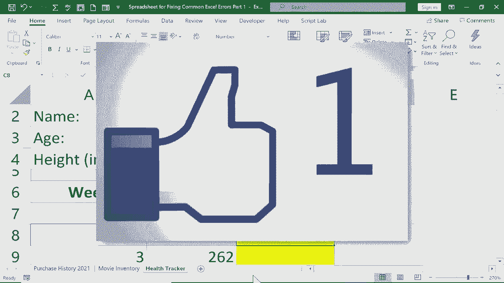

# Excel中级教程！(持续更新中) - P32：32）修复常见错误1 - DIV／0、N／A 和 NAME - ShowMeAI - BV1uL411s7bt

在本教程中，我们将查看如何修复常见的Excel错误。这是一个三部分系列的第一部分。在第一部分中，我们将看一下div0错误、N错误和名称错误。为了帮助解决这个问题，我有一个包含三个不相关电子表格的工作簿。

每一个都是这些错误的好例子。如果你想跟着我一起操作，在这个视频的描述中，我有一个链接可以用来下载这个工作簿，这样跟着做会简单得多。但我们先开始div0错误。

你可以在这里看到我的电子表格正在记录我的一些供应品的购买历史。你可以看到，我在电子表格中出现了几次div 0错误。好吧。这是指除以0。正如你可能知道的，除以0是不可能的。所以当我尝试这样做时，我在Excel中得到了这个错误信息。

那么这里发生了什么呢？好吧，我有一个公式设置。你可以在这里看到，它是将某个项目的总成本除以我购买的数量，从而得出每个项目的总成本。所以这是被这个除的。好的，接下来我们看看下一行。在这里我有nothing0。

基本上是除以0。好吧，这会产生一个错误信息，因为不可能用0去除以0。同样，100也不可能除以0。所以这个错误信息是准确的。它告诉我真相。这里出现了一个错误。问题是，这在我的电子表格中看起来很糟糕，很难看。那么我该如何修复呢？

你可以在这里看到另一个例子。好吧。修复它的一种方法是不除以0。所以如果我出去买一盒马克笔。假设它是6美元。我买了一盒。现在这个单元格里有其他值，而不是0，它更新了，并且没有错误信息。但如果我不想买一盒马克笔或者不需要呢？

好吧，让我们把这些值归零。现在我将更改我的公式。所以我回到单元格F2，点击单元格，然后我将删除公式栏中的内容。当然，我也可以在单元格内做同样的事情。

但有时候使用这个公式栏会更好一些。有时候它看起来更干净。所以我会输入等于号。然后我会开始用一个叫做if error的东西。这是一个有点奇怪的函数，但注意它的描述：如果表达式是错误，则返回值，如果不是，则返回表达式本身的值。所以这基本上有助于防止错误，并在发生错误时生成一些值。

好的，如果错误左括号。我现在输入胶带的总成本。所以 D2。我输入 D2 除以 E2，然后放入一个逗号。在逗号之后，看看它期待什么。它期待的是如果有错误的值。所以，如果在单元格 F2 中基于 60 除以 32 的计算出现错误。

我想在屏幕上打印什么？我可以只放两个引号或一个引号，一个空格，再一个引号，然后关闭括号。其实你中间的空格并不是必须的。现在我只需在键盘上按下回车键。看，那里没有错误。所以它只是产生了 D2 除以 E2 的结果。

现在我会把这个拖到最底部，看看有什么变化。好吧，div0 错误消失了。为什么？因为这个新公式。它在检查是否有错误。如果有错误，我告诉它在单元格中不显示任何内容。我使用了自动填充手柄将其复制到下面。因此，这对整个列都是适用的。这是一种处理方法。

另一种方法是，不是在单元格中什么都不放，我可以给查看电子表格的人写一条消息。我可以输入“没有购买”。这可以解释为什么它是空白的。因为没有购买。所以我按下回车，注意到它更新了整个列。

可能是因为我在一个表格中，所以它这样处理。现在，我得到了这个没有购买的消息，而不是丑陋的错误代码。这就是 Excel 中 div0 错误的简要介绍。接下来我们看看另一个电子表格，看看第二个偶尔出现的错误。这是 N 错误。通常在使用 V 查找或 H 查找，或 Excel 中寻找特定内容的其他函数或工具时，会出现这个错误。

你可以看到这里我有一个电影库存，我正在使用 V 查找告诉我各种电影的信息。所以我可以在这里点击，输入《火星救援》，然后按下键盘的回车键。它告诉我 PG13。这就是使用 V 查找。如果你还没有看过我关于 V 查找的教程，你真的错过了，你需要去看。但是对于本教程的目的。

让我们继续看看当我输入《狮子王》时会发生什么。我按下回车键，得到了 NA 错误。所以你大概能推测出我得到 N 的原因，因为它正在搜索电子表格，搜索我提供的《狮子王》的数据，但并没有找到。现在，如果我把《狮子王》放入这个电子表格，会发生什么呢？

所以是《狮子王》。我将使用 2019 版的。现在我已经输入了这些信息。接下来，我们再回去试一次《狮子王》。我按下回车键，仍然没有成功。我依然得到了 NA 错误。如果你遇到这样的错误，但你很确定要找的词在你所查找的范围内，那可能有几个不同的原因。在这种情况下。

可能是我不小心在单元格中放入了太多空格。例如，这里，狮子王。注意到G后面有一个额外的空格。当我搜索狮子王时，如果没有空格，它不起作用。如果我在G后面加一个空格，这样会有效吗？会修复吗？是的，确实可以。

但与其在这里修复搜索词，不如有一种方法可以修复数据。其他电影标题也可能包含太多空格。因此，我想修复这些数据，以确保没有额外的空格。为此，可能有更好的方法，但这就是我会采用的方式。

我只需在B列右键点击选择插入。这给我一个新列。在这个列中，我会点击B单元格，输入等于号，然后是trim左括号。我将修剪标题《星球大战》，然后我应该放一个右括号。其实不一定非要放。

但养成这个习惯是个好主意。我会按下回车。似乎没有任何变化。没错，确实没有变化。但原因是《星球大战》没有额外的空格，而一些其他标题则有。所以现在完成后，我会使用自动填充手柄，点击并拖动下方以复制该公式。

现在我想用B列的内容替换A列的内容，但关键是B列实际上是由依赖于A列的公式组成的。所以我确实需要小心一点，但我也会称这个为标题。然后我会点击并拖动标题，一直拖到我的数据底部。

然后我会通过右键点击选择复制或者使用控制+C来复制。接着我会点击这里，右键点击。但我不想直接粘贴。如果我粘贴，会出现一些错误。但如果我选择粘贴值，它会将这些公式转换为实际值，这里是电影的标题。

所以现在我不需要这个列了。我可以右键点击B，选择删除。这应该清理掉所有这些标题，应该去掉额外的空格，看看，它成功了。因此现在当我输入狮子王时，它告诉我评分。让我给你展示另一个例子，说明如何在表格中拥有正确的数据。

但它仍然会给你N错误。几年前，一部名为42的电影上映了。我就输入42。我不记得确切的上映年份，但我会填入一些数据。好了，现在输入后，如果我搜索42，就会有效。它找到了。它说是PG-13。但偶尔会出现。

这可能对你不适用。如果不行，可能与数字格式有关。目前，这个单元格中的数字被视为数字，但在某些情况下，它可能被视为文本。42实际上是电影的标题，并不仅仅是一个原始数字。因此，如果你在做V查找时出现NA错误，并且处理的是数字。

你可能需要确保列或行格式正确。在这种情况下，可以是文本或数字。确保这些单元格与这个单元格的格式匹配。现在，与我之前的购买历史示例类似，我可以修复这个。如果我输入一个不在我的收藏中的电影。

我不会得到这个丑陋的错误信息。我修复它的方法是点击该单元格并更改 V lookup 前面的公式。我会在 V 前面点击，输入 if error left print。然后在 Vlookup 信息后，我会放一个逗号，然后在引号中，我只需放入我想发送给这个电子表格用户的信息。

不在库存中。输入引号，放入右括号，然后我按下键盘上的回车键。Starman 不在库存中。那么现在如果我输入 Star Trek，那也不在库存中。但是如果我输入 BfG，它在那里，并且评级为 Pg。所以再一次，这个 if error 函数拯救了我们，并让我们的电子表格在出现这些错误信息时看起来不那么丑陋。

在这个视频中，我们将解决一个额外的错误信息，那就是名称错误。在另一个视频中，我向你展示了如何在 Excel 中命名单元格，而我在这个电子表格中也做到了。这是为杰森·史密斯准备的健康跟踪器，请注意包含他年龄的单元格。单元格 B3 已被重命名，叫做 age。我还重命名了 B4，称之为 height。

现在当我想计算杰森的 BMI（身体质量指数）时，我只需点击这里，输入等于号，然后抓取他的体重。所以 B7 乘以 703，再除以，我可以直接输入单词 height，它应该会抓取在名为 height 的单元格（在这个例子中是 B4）中的数据。但是如果我拼错了 height 呢？如果我输入这样的内容。

然后我继续我的公式，可能看起来像这样。然后我按下键盘上的回车键。看，我得到了一个名称错误。这是告诉我 Excel 认为我可能使用了错误的名称，而我确实是这样，因为我在尝试引用名为 height 的单元格时没有正确拼写 height。

我拼写错误了，因此存在名称问题。这就是为什么我会收到名称错误信息。那么你该如何修复呢？你只需在看到名称错误时小心，它通常意味着你输入了错误的内容，拼写错了。

或者可能没有一个名为这个确切名称的单元格。所以你需要检查确保你使用了正确的单词并且拼写正确。检查命名单元格的一种方法是去左上角，这是名称框。如果你点击这个箭头，它会给你一个在这个工作簿或电子表格中使用的所有名称的列表。

所以你可以看到 height，它是这样拼写的。当我输入时，需要这样拼写。另一个例子是，当你尝试做一个求和或其他任何函数时。假设我想输入 sum，并且想要对整个列进行求和，左括号 B1 到 B59。

我按下回车，这样是可以的。但是如果我不小心把 sum 的 M 去掉，按下回车，会出现问题。没有 M 的 sum 就无法正常工作。所以 Excel 告诉我有一个命名问题。如果你尝试计算平均值，也会遇到同样的问题。但我不打算输入 average。

如果你只输入 A V G，会出现名称错误。还有一点需要注意，当你收到该名称错误信息时，可能的原因是你在公式中使用了引号，而实际上不该使用引号，或者应该使用引号。例如，在这个案例中，我在单词 height 周围添加了引号。

当我按下回车时，我收到一个错误信息。这个错误信息略有不同，但仍然是需要注意的。所以这些是三种常见的 Excel 错误：除以0、N A 和名称错误。在未来的视频中，我会查看其他错误信息，包括 null、nu、ref 和 value。与此同时，我希望你觉得这个教程有帮助。如果你觉得有帮助。

请点击下面的喜欢按钮。
