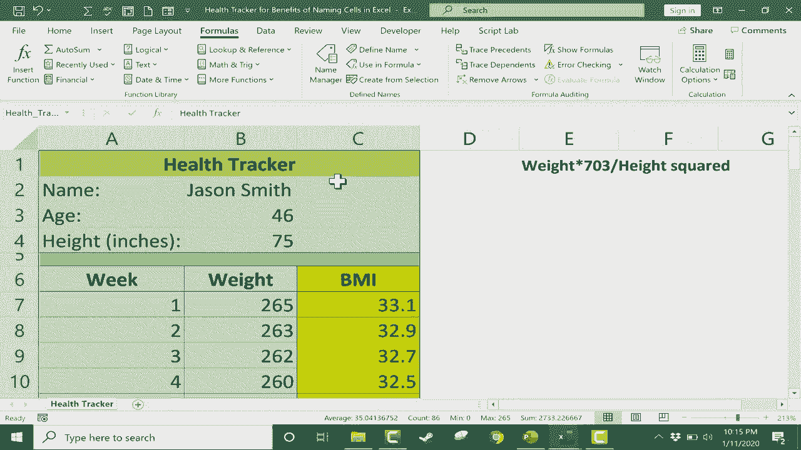

# 【双语字幕+速查表下载】Excel中级教程！(持续更新中) - P33：33）命名单元格的好处 - ShowMeAI - BV1uL411s7bt

在这个教程中，我将向你展示命名单元格在Excel中带来的一些好处。为了展示这一点，我设置了一个简单的健康追踪器，或者说是一个简单的开始。假设我是一名私人教练，我想帮助杰森·史密斯追踪他的健康和进步。所以我在这里写下了杰森的名字、年龄和身高（英寸）。

所以现在我真正需要做的就是在这个单元格中写一个公式，公式将为我完成大部分工作，计算杰森的BMI或体重指数。我这里有一个我们需要在Excel中创建的公式描述。那就是杰森的体重乘以703。至少如果你使用英寸和磅的话。

然后将其除以杰森身高的平方。高度再次是以英寸为单位。所以这就是我们需要在这个特定单元格中重建的内容。那么我们开始吧。步骤1是点击单元格。键盘上按下等号。杰森在这个追踪器第一周的体重将放在这里。所以我就在这里点击。

乘以星号表示乘以703。然后我将把它除以杰森的身高。所以就在这里75。我将在B4单元格点击。然后要输入平方，你需要加上这个小符号。对我来说，是**Shift+6**。如果我按住Shift键并点6。

它就会输入那个符号。然后你输入2代表平方，3代表立方，以此类推。现在，如果我按回车键，它会返回一个数字。现在，让我们放入一个体重值来看看是否成功。假设265。33。1的BMI。我相信这是正确的。但是当我去到第二周时，看看会发生什么。

假设杰森失去了一些体重。我想在单元格右下角使用**自动填充手柄**来复制这个计算BMI的公式。我想把它复制到这里，这样我就不必重新输入。所以我会使用这个自动填充手柄，它复制了公式。但是看，它没有成功。

这样做的原因是，当你使用自动填充手柄时，它会智能地尝试更改你公式中的数字。所以在C7单元格中，请注意公式正在查看B4的高度。但是当我向下拖动时，现在它正在查找B5单元格。这样就给了它一个错误信息，而不是一个数字。

所以，解决所有这些问题会更容易，如果我为某些单元格命名的话。我将在B4中点击75，这是杰森的身高（英寸）。选定后，如果你查看左上角，有一个叫做**名称框**的东西。现在它显示B4作为该单元格的名称。

但我可以高亮显示它，并把它改为高度。现在，当我完成输入高度后，我在键盘上按下回车。这一点非常重要。人们在尝试做这个时常犯的一个常见错误是，他们输入名称后忘记按回车，而只是点击别处。这样就不会记录你希望那个单元格被称为的名称。

这可能会让他们在后面感到困惑。命名单元格的另一种方法是，点击单元格，然后转到公式选项卡，在定义名称组中找到定义名称。我会点击它，它会弹出这个窗口，这和我在左上角所做的事情是一样的。

但这确实给了我一些额外的选择。注意，Excel 自动识别了这代表什么。它代表了杰森·史密斯的年龄。因此它为我填入了“年龄”这个词。接下来，我要讨论的范围是什么？我想为这个工作簿中的每个电子表格创建这个名称，还是仅限于健康追踪表？在这种情况下，无论哪种方式都无所谓，我想我会保持为工作簿，然后在下面。

我可以输入一个注释。所以这是客户的年龄。然后我会点击 O。现在那个单元格也被命名了。所以我有高度和年龄。现在，为了确保这项工作，你可以去左上角的名称框，点击那里出现的箭头。点击后，它会显示你所有命名的单元格。

你也可以再次转到公式选项卡，定义名称组，点击名称管理器，它会显示你在工作簿或工作表中建立的所有名称。现在，当你在 Excel 中命名单元格时，有几个事情需要注意。首先，名称不能以数字或符号开头，必须以字母开头。

所以要注意这一点。另一个需要避免的是在名称中放置空格。所以如果我尝试编辑这个名称，选择年龄，进行编辑。如果我尝试输入“杰森的年龄”。这也不是个好主意，因为我想把这个用于其他正在培训的人。但如果我点击确定，看看，它不允许这样做，因为我在名称中放了空格。

如果你真的想有空格，只需按住 Shift 并点击键盘上的减号，这样会给你一个下划线。但在大多数情况下，其实没那么重要，你可以把它全部当作一个词输入。所以我会点击确定以退出。然后最后一件需要注意的事情是你不能使用字母数字名称。

例如，B3 或 F10。为什么不能这样做，因为已经有一个名为 F10 或 B3 的单元格了。所以这会引起混淆。尽量避免在名称中同时使用字母和数字，不要使用空格，并且名称必须以字母开头。好的，我要关闭它，然后再试一次公式。不过这次，不用 B4。

我将使用B4这个名称，它代表身高。所以我会删除这个空间里已有的内容。点击一下，然后再点击回来。所以这个单元格等于杰森的体重，即这里的值乘以703再除以，然后在这一点上，我可以点击75，如果我想的话，它会填入“身高”这个词。

不过，我会删除这个，以展示这次我们还有其他选项。现在，我不再点击身高单元格，而是直接输入“身高”。当我输入时，我的命名单元格作为一个选项弹出，这正是我想要的。所以我会双击它，然后我还需要输入那个上箭头shift 6。

然后是数字二用于平方。接着我在键盘上按回车。现在我这样做了，用命名单元格。看一下当我使用自动填充手柄时会发生什么。我向下拉，它是有效的。命名单元格有效的原因是因为它们创建了绝对引用。因此，当我使用自动填充手柄并向下拖动时，它会根据单元格进行调整。

当我简单地称呼这个为B4时，它会变成B5，然后在我向下拖动页面时变成B6。不过，如果单元格命名为“身高”，它是无法这样做的。它总是绝对引用这个单元格以及杰森的身高。这解决了我在电子表格中的一个问题。

我可以点击并拖动它一直到最底部。随着时间的推移，杰森每周都会稍微减轻一些体重，我们可以跟踪这一点，这个公式会自动引用命名的单元格。现在，有时人们命名单元格只是为了方便使用和清晰。例如，如果我想将杰森的年龄除以他的身高，我不知道我为什么会这样做。

但我可以直接输入等于号，然后输入数字46除以75，或者我也可以直接点击B3除以B4，而不是使用命名单元格，但因为我已经命名了这些单元格，我只需输入“年龄除以身高”，你可以看到这里建议使用“身高”。还有一件事需要注意的是，如果你在键盘上按F3，会弹出一个包含所有命名单元格的列表，你可以点击你想使用的那个，然后点击确定，但无论如何。

由于这些命名单元格在我脑海中，我在思考实际的内容，我在想这个单元格等于年龄除以身高，而不必考虑B3除以B4。许多人发现这样更容易理解和在Excel中使用。还有一些最终的事项需要注意。

命名单元格时，你也可以命名范围。例如，我可以点击A1，然后拖动到数据的右下角，实际上此时结束于C59。我只需释放鼠标按钮，然后再次上到“表单”选项卡中的“定义名称”组，点击定义名称，我就会称这个为“health tracker”。因此，我在这个电子表格上为我的健康追踪器命名所有重要的内容，我将其命名为“health_tracker”，然后我可以添加一些注释，最后点击确定。现在，这个范围也被命名了，我可以在公式中引用它，如果这样做有意义的话。

一些健康追踪器，然后输入，所以我只是把所有那些没有任何意义的东西加起来，但命名范围是可能的。最后一点有点酷的是，我可以到左上角的名称框，点击箭头，向下选择“health tracker”。

这突出了所有重要的内容。然后假设我想打印这个并把它作为报告交给Jason。我只需去文件，然后打印，看看它试图打印的是什么。它试图打印整个电子表格。

所以相反，我将点击这里，向下选择“打印选择”。因为我已经命名了那个范围，这使得打印准确的选择变得简单。我只需选择“health tracker”，然后一切都是我想打印的内容，然后我去打印。所以我希望你能看到偶尔命名单元格或命名范围的好处。

感谢观看。我希望你觉得这个教程有帮助。
