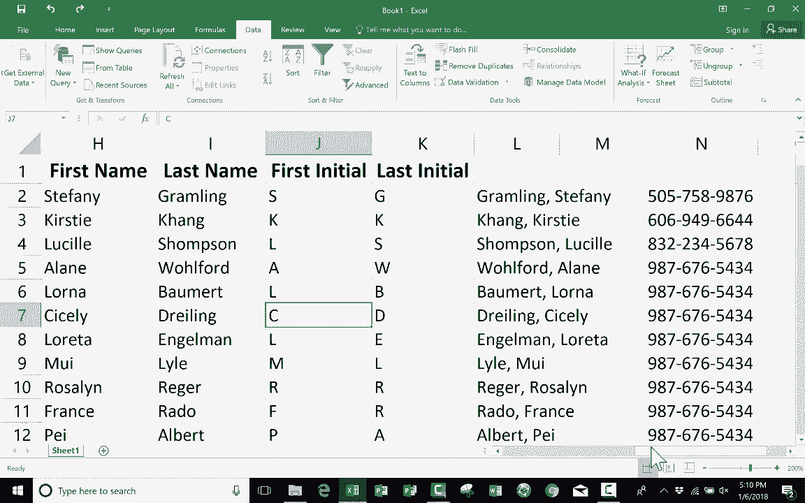

# 【双语字幕+速查表下载】Excel中级教程！(持续更新中) - P34：34）※快速填充教程 - ShowMeAI - BV1uL411s7bt

在本教程中，我将向你展示Excel最新版本中的一个很棒的功能。它叫做快速填充。在很多情况下，这将为你节省大量时间。为了向你展示快速填充是如何工作的，我创建了一个示例电子表格，基本上是100个名字的列表。

在名字的右侧，我有一个列用于名字、姓氏、名字首字母和姓氏首字母。假设我被分配的任务是将这个充满人名的电子表格分离出名字和姓氏，并填写首字母。这可能会是一场巨大的噩梦，一个巨大的头疼，尤其是如果我有1000个名字，甚至10000个或更多。

在之前的视频中，我向你展示了如何分割名字。如果你有兴趣学习如何做到这一点，仍然应该观看那个视频。但今天，我想展示如何使用快速填充选项完成我必须执行的任务。😊 在Excel的最新版本中，我需要做的第一件事是告诉Excel我想要什么信息。因此，我将点击这里，那里写着名字，在这种情况下是H2单元格。

我将点击并输入Stephanie，然后按下键盘上的返回或输入，接下来我只需转到数据选项卡，寻找数据工具组，你会找到快速填充。所以我点击快速填充，看看它做了什么，它根据我已经在H列输入的数据推断出内容。

它推断出我只想要名字，而不是我在这里输入的列标题。实际上是基于我在这里输入的名字Stephanie。Excel推断出了这一点，并将其应用到整个列。现在注意，每当你执行快速填充时，左下角会出现一些评论。因此，在使用快速填充时，请注意左下角。它说快速填充已更改。

单元格，说明有149个。因此，刚才我执行的快速填充影响了149个单元格。好的，现在让我们试试姓氏。在姓氏列中，我将输入grambling。这次注意，如果我上去点击数据，我不能执行快速填充。原因是我正在输入的单元格仍然是活动状态。因此从技术上讲。

在我按下返回或输入之前，那个单元格实际上是空的。现在单元格中有了内容，列中也有数据。所以现在我可以去数据并选择快速填充。现在，我不想让你有这样的印象：你总是必须选择要模仿信息下方的单元格。

不，你不需要。我可以在这里。我可以回到那个数据，但你必须确保你要模仿的数据实际上已经输入到单元格中，而不是正在输入中。因此，为了证明这一点，我将上去点击 grambling。选择它。

我会点击闪填，看看它是否完美地工作到底。我可以检查。假设第 89 个 Delmer quail。好的，它完美工作。我现在要回到上面。我们试试仅用名字首字母，所以是 S。这次我将点击下面的几个单元格，只是想证明你可以选择任何想要闪填的列中的单元格。这次也不点击闪填，我想使用键盘快捷键。

使用控制键加 E。所以你只需按住控制键并点击 E。它的效果和你点击闪填按钮是一样的。看看这个，它工作得很完美，我得到了名字的首字母。现在我们试试姓的首字母，我将基于一个不同的人，而不是基于 Stephanie graling，我想基于 Alberttha Kenny，所以我将点击这里，我会输入她的姓首字母，确保通过按回车键或直接点击其他地方来输入数据。

但我在我想要进行闪填的列中。然后我将按住控制键并点击 E。让我们检查一下它是否有效。确实有效。因此，尽管有其他方法可以做到这一点。例如，使用文本分列，我非常喜欢闪填，并且我倾向于频繁使用它。但有一点要注意。当你使用闪填时，应该基本上只在你要基于的数据非常稳定时使用。

这将保持基本不变。我之所以这么说，是因为这款手表如果我更改 Lucll Suman 的名字。假设她把姓改为 Thompson。我按下回车。请注意，它没有更新闪填的信息。即使我选择表格的一部分，假设我清除了它，清除内容。

让我们看看如果我再次尝试闪填会发生什么。我得到了些有趣的结果。你看到了吗？因此，闪填确实效果最佳。如果你的闪填数据非常稳定。它就是会保持不变，不会改变。好的。我想展示最后一个例子。假设我们不是用首字母或名姓。

如果我只想更改名字，使其以姓开始，然后加逗号和名字，那应该也能工作。所以我将尝试一下，我将去这个单元格，输入 grambling comm Stephanie，然后按回车或返回。接着我会按住控制键，点击 E，它就遵循了这个模式。

现在我想让你知道，尽管我的示例会涉及到名字，快速填充也适用于很多其他内容。它所做的只是寻找一个模式。在这个例子中，它看到有两个单词，然后注意到我这里只输入了第一个单词。因此，当我快速填充时，它只是看到了那个模式并复制了它。

如果它没有完美地遵循这个模式，你可能需要在列中输入两个示例，然后再尝试快速填充，这样它就更有可能识别出模式。但我的观点是，这不仅仅适用于名字。如果有任何模式存在。

它会尝试识别那个模式。理解它，然后模仿它。因此，例如，假设你有一份电话号码列表，想要为这些电话号码添加破折号。你可以做到这一点。只需按照你想要的格式输入，然后按回车键。现在，在我实际执行快速填充之前。

我需要列出其他电话号码。所以请给我一分钟时间添加一些电话号码，然后我会向你展示结果。好的，太好了。所以现在如果我执行快速填充，看看它的效果。它在这种情况下添加了破折号。现在我做完了这一步，我实际上不再需要这个列了。所以我可以右键单击它，删除。

现在我的数据已经按照我想要的格式进行了整理。这应该能帮助你开始在Excel电子表格中使用快速填充。我希望你觉得这个视频有帮助。如果有，请点击下面的点赞按钮。
