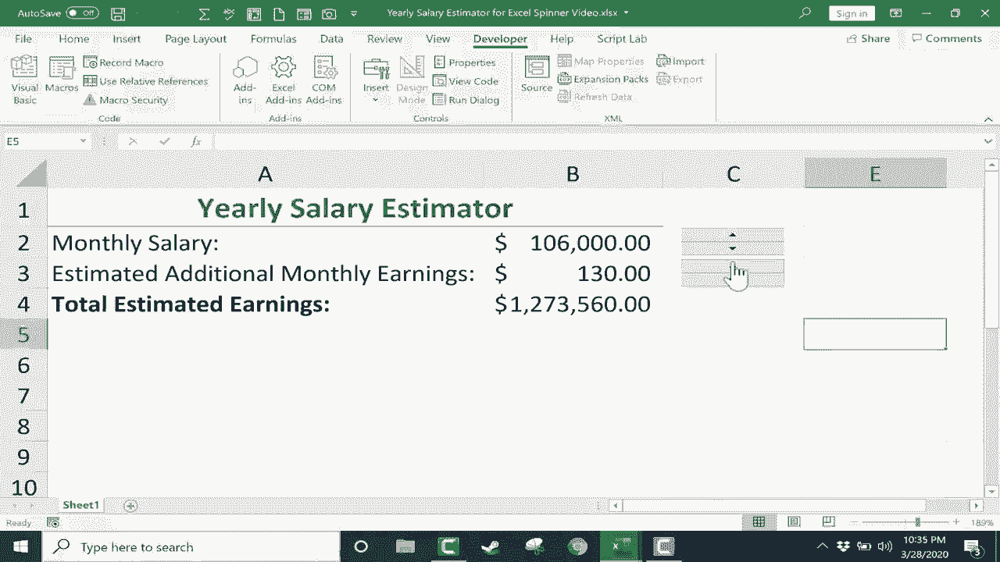

# 【双语字幕+速查表下载】Excel中级教程！(持续更新中) - P41：42）使用旋转按钮 - ShowMeAI - BV1uL411s7bt

In this video， I want to show you another of the Excel form controls。 In a previous video。 I showed you how to insert check boxes into your spreadsheets using this developer tab in the controls group clicking insert and checkbox。 And you should definitely watch that checkbox' video。 But in this video。 we're gonna look at this form control here called spin button in some versions of Excel。

 it's also called a spinner。 So in this video we will look at what it is what it does and how to set it up。 Step 1 is to make sure that you have the developer tab enabled in your version of Excel。 And the way you do that is by going here to file and going down to options I can click And one of the options that appears is to customize the ribbon。 When I click on that， it gives me a list of popular commands that I can add to the ribbon。

 But over here on the right， there are main tabs and developer might not。😊，Be checked。 You might have that unselected。 and I highly recommend that you do check the box to get the developer tab to appear for you on the ribbon。 So I'll click O。 There's my developer tab。 Once you have the developer tab。 you can go here to the controls group。 click insert and choose spin button。

 When you click on spin button。 notice that your mouse pointer changes to a plus sign。 you can then click and drag to draw out a spin button。 I want the button to more or less fit in the cell。 So maybe about that size。 and then I can click on it to drag it where I want it to be。 If I need to adjust the size。

 I can use the handles in the corners to click and drag to make the button bigger or smaller。 But I'm pretty happy with the size of that button。 If you want a little more control as you size the button。 It is possible to hold the control key while clicking and dragging and see what it does。

 it makes the button grow equally above below left and。😊。RightAnd so that can be a nice option to have as you're resizing your spin buttons。 Now that I've got the spin button。 If I want to click on one of the buttons。 notice that nothing is happening in order for these buttons to become clickable。

 I have to first click away from the spin button。 And now clicking back on it noticeice that I can click on the top button or the bottom button。 However， now that I've done that， look， I can't click and drag to move the spin button。 If you want to get back into moving mode， just right click on the spin button。 And now you can left click on it to drag it。 So right clicking on it will re enableable this moving mode。

 Okay， so let's look at how this spin button can help me with this spreadsheet。 I have here。 the beginnings of a yearly salary estimator。 just a very simple spreadsheet with some simple formulas to help someone estimate the salary that they might earn in the coming year。

 And， of course， they could click here to type in a number。 Let's say 500 a month。 I tap enter。And I've set up a simple formula here in this cell cell B4。 If I double click there。 you can see the formula。 And all it does is it multiplies B2 by the number 12 for 12 months。 And then it adds that to the contents of B3。 Let's say there's additional extra monthly earnings。

 maybe from yard sales or from doing extra work on the side or whatever it might be。 And that's multiplied by 12。 And then I put both of those in parentheses。 The parentheses are not necessary， I just included them to look a little more understandable。 I'll tap enter on the keyboard。 You can see if I put in， let's say $10 extra a month。

 It updates the total estimated earnings。 So this is great。 But what if I don't want the person using the spreadsheet to have to type at all。 It would be nice if all they had to do was click on a button。 And the button would adjust the numbers for them。 The way you can set that up is by right clicking on the spin button form control。

 and then just go down to format。😊，Contro when you do that。 you get a pop up with some important options。 There are several tabs worth of options。 but the one that we're gonna to look at exclusively in this video is the control tab。 That's the important one， First off， it wants to know what the current value is Well。

 I would like the current value of this cell to be 0。 So I'll just put 0 in there。 The minimum value is 0。 I don't want them to be able to make negative salary。 Now。 what is the maximum value for this cell， Well， we could say something like。 maybe 25000 could be the maximum value？ Next， what about the incremental change。

 Every time someone clicks this up arrow。 How much do I want the number to go up from from 0 to what do I want it to go from 0 to 100。0 to 1000，0 to 10000。 What's the incremental change。 Well， I would like to change it to be 100。 So it'll go up by 10。at a time。 Now， the final setting that I need to adjust here is the cell link。 And the easiest way to do this is just to click this button。

 And what I'm doing here is I'm linking this form control spin button to a cell。 Which cell。 Well。 this is the one。 So I click on it。 And then to get back into the options。 All I have to do is click this button here。 and it takes me back in。 and it has identified the exact cell that is linked to this form control。 Now I can click O。

 and let's try it out。 just like before， in order for me to click to make this work。 I have to first click away from it。 Those little handles disappear from off the form control。 and now I can click the up arrow and notice that the monthly salary goes up by 100。 click again goes up by 200。 If I click down， it goes down by 100。

 Now watch what happens if I click and hold the button。 It just goes up very rapidly。 Now。 I could set up another form control for the estimated additional monthly earnings。 And if I don't want to go through。Same process of inserting and resizing and all of that。 I could simply right click on the existing form control， copy it and right click paste。

 and then right click on the new form control and go down to format control。 I'll need to change the cell that it's linked to。 I'll change it to this one here。 click this button here。 and I need to think about any possible adjustments to these settings。 For example， when it comes to additional monthly earnings。 It may not be in the hundreds of dollars。

 it may be more like tens of dollars。 So I'm changing that incremental change。 And I should also change the current value down to0。 click okay and after I click away from the spin button Now I can click back on it to add $10 a month $20 a month 30。 I can also subtract just like you would expect。 and it calculates it out。

 So everything seems to be working great， but there is a hidden problem that you need to be aware。Look what happens if I click and hold on the monthly salary spin box and that monthly salary is going up and up。 looking pretty good。 But look what happens when it hits 25000。 It stops。 Now。 if only we all have this problem of making too much money for the spreadsheet。

 But the spin button here has come up against a limit， You may or may not have noticed this。 But I set a limit on the high end for this number。 If I right click on the spin button and go down to format control。 you can see what the limit is maximum value 25000。 Now， what if I set that to be 30000， click O。

 Great， if I click away and then back on the button， it should go up to 30000。 and we're good。 But what if I want to go even higher than that。 How about 40000。 Look what happens if I try to make 40000 the maximum value。 Excel says the scroll value must be between 0 and 30000。 Now。

 even if you don't foresee that being a problem in。particular case。 there are cases when the number that you'll need will be much higher than 30000。 So how do you handle that？ Well， this is a trick that you can do。 You can right click on the format control。 the spin button in this case。

 And I'm going set the current value back to 0。 And this time I'm going say instead of 100 being the incremental change。 I'm going say one is the incremental change。 Now， the trick here is to think of this one not as being the number one。 but as being 1000。 So again， this represents 1000。 And then the other part of the trick is I need to make this linked not directly to this cell。

 but to another cell maybe D2。 So I'll click this button。 link it to D2 click this button to go back and click O So now when I click away from the button and then back on it。 clicking on the top half。 It increases by one at a time， decreases by one at a time。 if I click below。 So if the number。3 represents 1000， or I could have made it 100 either way。

 All I have to do now is click here on B2 and create a formula。 I'll type the equal sign。 So this cell is equal to D3， whatever is in D3 multiplied by 1000 and tap enter。 So now that I've done that I can very easily go above 30000。 See how that works。 but this is a simple trick for how to make it so that a spin button can make a number go above 30000。

 It looks like there's an error code here。 but all I have to do is double click between B and C and it stretches out so that the full number can fit in the space provided。 If I don't want this number here to be confusing。 I can right click on the D and choose hide。

 And now I have a wonderful form control that I can use to quickly estimate my yearly salary。 And it's just too bad that this isn't true。