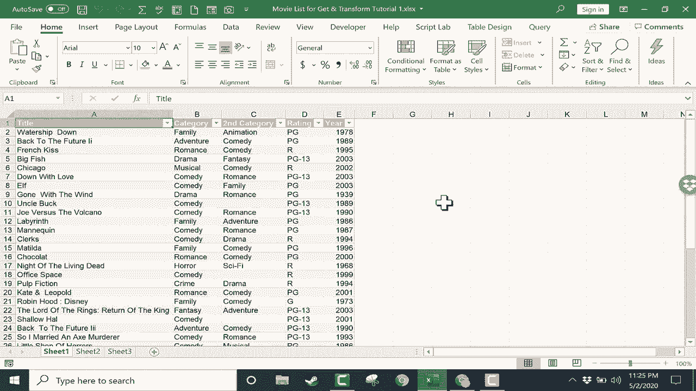

# 【双语字幕+速查表下载】Excel中级教程！(持续更新中) - P46：47）获取和转换／Power Query 1 - ShowMeAI - BV1uL411s7bt

这是Excel的初学者指南，获取和转换，亦称为**Power Query**。在这个视频中，我将向你展示如何使用获取和转换将电子表格中的数据进行转化。清理它，调整它，优化它，让它更易于使用和阅读。那么我们开始学习获取和转换吧。仔细看看这个工作表。

如你所见，这是一个电影列表，以及关于这些电影的其他信息。假设我从其他地方获取了这个电子表格，也许是某个不小心处理文本的人。你可以看到在使用粗体方面存在各种不一致。

我的数据中有一些我不喜欢的多余空格、不同的颜色等等。创建此数据的人一定是从互联网上或电子邮件中复制粘贴了一些信息，因此它没有标准化。这让我感到烦恼。我想获取和转换这些数据。所以第一步就是简单地在数据的某处点击。

所以我这里有几行几列的数据范围。我只需在数据范围内的某个位置点击，然后可以转到数据选项卡，在获取和转换组中查看。我注意到有多个来源可以获取数据。

我可以从文本、网页、表格或范围获取数据。这里有一个按钮，一个下拉按钮，你可以点击查看更多可能的数据来源。因此，再次确保我已点击某个范围，我将点击“从表格范围”。Excel已确定我的数据位置。是的，我的表格有标题。我点击“是”。

注意它所做的，它把我的范围、数据变成了一个表格，并打开了这个新窗口。这就是**Power Query编辑器**。如果你不习惯这个窗口，它可能会让人感到困惑。看起来像是Excel发生了剧烈变化。而其中一个原因是这个窗口占满了我的屏幕。所以我会点击右上角的按钮，把Power Query编辑器稍微缩小一点。

这样你就可以看到我原来的电子表格仍在后台。我的数据仍然完好无损。改变的唯一地方是它被转换成了一个表格，而在我的原始工作表上，我有这个Power Query编辑器。我会再次最大化它。我希望你把这个Power Query编辑器视为一个沙盒，我可以在其中玩耍。

我可以更改数据，可以尝试一些东西，而这些都不会影响或破坏我在电子表格中的原始数据。然后我可以选择将这些数据添加到我的电子表格或不添加。让我们仔细看看这个Power Query编辑器。除了能够在屏幕右侧查看我的电子表格数据。

我有查询设置，并在其中包含了一系列已应用的步骤。它说源。换句话说，我为我的数据建立了一个源。那就是被转换为表格的范围。它说更改类型，这可能是指将我的范围转换为表格，因为我对这些数据进行更多更改。

你会看到这些更改在这里列出。好的，让我们看看如何改进这些数据。你会注意到我的标题列被选中。我可以切换到类别或第二类别或评分，随便我想做什么。但我将从标题开始，选中后，我会去我的标签。注意，默认情况下我在主页选项卡上，这里有一些可以用来转换数据的选项。

但在转换选项卡上还有更多选择，只需点击即可。我可以进入格式，点击，我希望将我的标题列中的所有数据更改为小写。因此，通过点击那个按钮，并切换为小写。看看发生了什么。现在每个电影标题都仅为小写。这就是一个改进。

因为看看原始电子表格中的情况。有些标题是全大写的，有些不是。这真是一团糟。因此，在这个 Power Query 编辑器的沙盒中，我试图标准化内容，使其看起来应该的样子。现在所有内容都是小写的。我可以回到格式按钮，选择每个单词首字母大写。

我认为这是一个改进。接下来，我想修复标题列中所有多余的空格。单词“gone”和“with”之间的空格太多。词“Matilda”前面也有太多空格。要解决这些空格问题，我可以再次去格式按钮。我将尝试修剪多余的空格。当我点击修剪时。

你会注意到，这些单元格中条目的开头和结尾的多余空格已经被清理掉了。多余的空格已被移除。那么，单词之间的空格呢？这有点难处理。可能有更好的方法来做到这一点。但我将去替换值。我会点击，想让 Excel 找到连续三个空格的示例。

所以我连续按了三次空格键。我想将这三个连续的空格替换为一个空格。所以我在第二个框中点击，并再次按空格键。我将点击 O。现在，随着我点击 O，你可以看到这解决了很多空格问题。我再试一次，这次我将去替换值。

也许我将两个空格替换为一个。再次点击 O。这似乎改善了我的数据。现在。让我们看看我的评分列。如果我点击“评分”这个词，它会高亮显示整列。我注意到这一列也有几个问题。有些电影列为。而其他电影则标记为 R 级和 P G13，我认为这也不正确。因此我们将再次使用替换值。

所以要查找的值是R级，咱们将其替换为R。我再做一次。替换值定义P G13，将其替换为Pg-13。点击O，它为我清理了数据。正如我所说，注意右侧，我的已应用步骤。我有我所做的每一步的列表。如果我对其中任何一步后悔，比如我后悔修复R级。

我只需点击这个红色的X。你确定要删除这个步骤吗？这可能会导致一些问题。让我们试一下。我点击删除，它移除了那个步骤，并没有给我带来问题。现在，我有很多其他方法可以转换这些数据。我主要向你展示了这个格式按钮和替换值按钮。

这些是一些最强大的选项。但还有更多。如果你感兴趣，我会制作更多视频展示其他选项。但现在，我还想告诉你，有时候，不仅仅是使用这些变换按钮，右键点击列标题并选择下拉菜单中的选项会更简单。

我将再次替换值，将R级改回R。点击。假设我对这张电子表格所做的转换完全满意，并准备将其应用到我的工作簿中。我只需点击这个主页按钮，然后点击关闭并加载。当我点击关闭并加载时，有时会花一点时间，但它会创建一个新的电子表格。

你会注意到我的原始数据仍然在这里，表格1。是的，它现在是一个表格，但还有一个表格4，里面有我清理过的所有数据。我可以浏览下去查看所有数据都已导入。我现在可以关闭这个面板。如果我真的更喜欢这个数据而不是原始数据，当然。

我可以右键点击原始文件并删除那个电子表格，点击，删除。甚至我可以右键点击，将表格4重命名为我的新表格1。我刚刚使用了获取和转换，之前称为Power Query，来清理和转换杂乱的数据为我准备好的数据。

我可能仍然需要做一些小的更改。但大部分工作已经完成。
