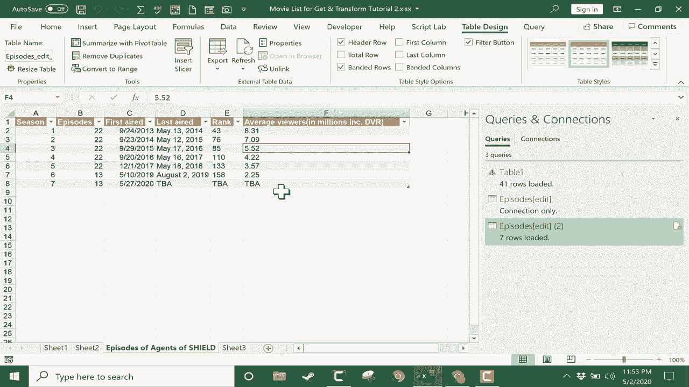

# 【双语字幕+速查表下载】Excel中级教程！(持续更新中) - P47：48）获取和转换／Power Query 2 - ShowMeAI - BV1uL411s7bt

在这本关于Excel获取和转换工具的中级指南中，我将向你展示如何从网络获取数据并在Excel中进行转换。你可以在第3个工作表上看到我有几个网站URL，而你应该可以访问我使用的相同文档。

如果你查看视频下方的描述，会有一个链接。链接会带你到这两个维基百科页面。这两个维基百科文章中都有我想要导入到Excel工作簿中的表格。要做到这一点，我只需点击URL以高亮显示，然后按住控制键并点击C来复制URL。

然后我会跳回Excel，进入数据选项卡，在获取和转换数据组中查看。我会点击“从网页”。这会打开一个新窗口，我可以简单地粘贴我从维基百科复制的URL。我点击“O”，一个窗口会打开。这就是导航器。导航器将帮助我选择维基百科页面的哪一部分我想获取并转换到我的Excel工作簿中。

所以看看它给我的内容。它说有荣誉，评论文档剧集。然后下面有一堆表格。那么，它是从哪里获得这些信息的呢？它是从我提供的URL获取的。如果我回到维基百科，就能更好地看到。如果我下滑到剧集，比如，有一份关于《神盾局特工》每个季节的列表。

播出的剧集数量和收视率。因此，假设这是我想导入的数据。我只需注意该部分剧集的标签，返回到Excel中查找。找到了，我可以点击它，如果它的样子完美无缺。

我可以点击加载，它将被添加到我的工作簿中。但是我想对数据做一些更改。所以我不会点击加载，而是点击转换数据。这会带我进入Power Query编辑器窗口。让我们看看数据。对我来说，数据看起来很好。

但是，有些事情让人感到困惑。例如，这个节目最初播出后，剧集和季节都会重复。如果我回头查看维基百科的文章，就会变得更加清晰。这个最初播出的单元让人困惑，使得季节重复。

剧集可能会重复，排名也可能会重复。那么，让我们看看如何修复它。我实际上不需要第一行数据，因为它是重复的。我不需要这个最初播出的单元，其他内容也确实重复。因此，我将在窗口底部的行1上点击，它列出了所有包含在行1中的内容。

然后我只需在首页选项卡上点击删除行。这里有删除顶部行、底部行或交替行的选项，以及一些其他选项。我将选择删除顶部行。现在我需要指定多少行。就一个顶部行。如果我输入二，它将删除前两行。我只需点击确定。

第一行现在已被删除。现在让我们删除第一列。这也是不必要的数据。因此，我会确保选择了第一列，然后点击删除列。看看，这里还有另一列不必要的列。这是非常常见的，特别是在你从互联网上或其他非原生 Excel 来源提取数据时。

在 Excel 中，从原始数据中引入不必要的数据、重复的数据或其他多余的内容是很常见的。因此，我们正在努力清理这些数据。这是完全不必要的，它只是第二列的重复。因此，再次，删除这些列。它已经消失。让我们看看其余的数据。其他一切看起来都不错。现在。

就像我在我的《Excel 初学者指南》中展示的那样，在右侧获取和转换数据。我有一份我在尝试清理数据时所做的所有应用步骤的列表。如果我对其中任何一步感到后悔，我只需点击该步骤左侧的红色 X，它就会撤消该步骤。在之前的视频中，我还展示了如何通过转到转换选项卡并使用格式等工具，以这些方式改变你所选内容的格式。

或者你也可以使用替换值来帮助清理数据。现在，在我将这些数据添加到工作簿之前，我还有一个更改要进行，那就是这个。看，标题与我想要的并不完全匹配。我希望第一行实际上作为标题。因此，在首页选项卡的主页功能区中，我只需点击使用第一行作为标题。

现在，数据看起来正是我想要的样子，我准备将其添加到我的工作簿中。你可以通过转到首页选项卡并点击这个关闭并加载按钮来做到这一点。现在，点击该按钮的上半部分将几乎立即将来自维基百科的数据添加到我的工作簿中。如果我点击该按钮的下半部分，它会给我一个选项，关闭并以其他方式加载数据。不过现在我只需点击关闭并加载，维基百科中的表格已被转换并加载到我的工作簿中，并作为新的工作表 6 添加。我现在可以右键点击并重命名，可以命名为《神盾局特工的剧集》，按下回车键，这些数据就可以在 Excel 中使用了。

