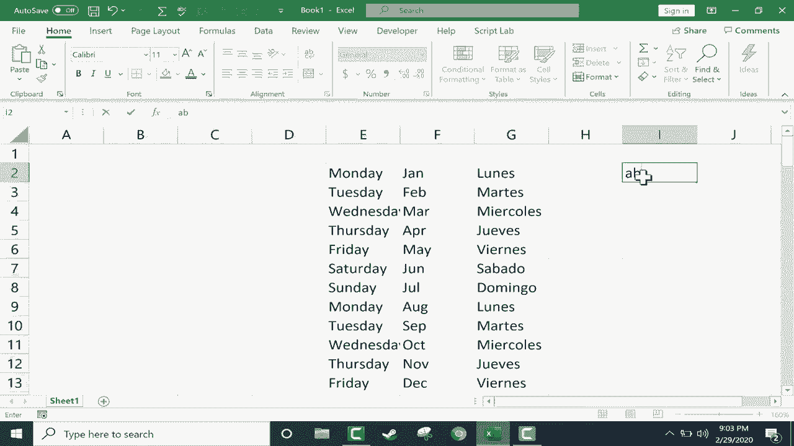

# 【双语字幕+速查表下载】Excel中级教程！(持续更新中) - P48：49）自定义自动填充句柄 - ShowMeAI - BV1uL411s7bt

In this tutorial， I will show you how to change or add to the predefined text series that are in Excel and that work with the autofill handle。 in a previous video that I made called Excel's autofill handle in depth。 I showed you how to type in， let's say Monday， click on Monday and used the autofill handle to click and drag down and notice what happened。 Excel produced a series in the spreadsheet。 Monday through Sunday。 and then it repeated。

 It can work similarly for months and for other things as well。 let's try Jann for January。 But one of my viewers named Paul contacted me and pointed out that there's yet another way that you can use the autofill handle。 If you click on the file tab in the upper left。 you can go down to options and advanced and then go down to the very bottom of the list of options。 And you'll see that there's a general section and one of the things that you can change in the general section。

Is you can edit custom lists。 It says create lists for use in sorts and fill sequences。 So I'll click edit custom list。 and you can see it comes with a few predetermined custom list that will work with the autofill handle。 Well， I would like to create my own new list。 maybe instead of Monday， Tuesday， Wednesday。 etc ceter， I'd like to do that in Spanish。 I should also put in the accents。 Of course。 Okay。

 so there we have the days of the week in Spanish。 So now that I've got that whole list entered。 I can just click okay。 and let's try it out。 I'll click O again。 click on the screen and I'll put luase。 click on it， use the autofill handle。 and I could click and drag and pull it all the way down to use the autofill handle。

 or if there's data already to the left or right of your autofill handle。 you can just double click on the fill handle。 and it will extend it to the same degree to the same length as that data that's just adjacent to it。 jumping back into。The options Once you get into options。 you have to go to advanced and then edit custom list at the bottom of that list of options there。

 I now have a custom list I don't really need that list， so I'll go ahead and delete it。 click O and notice that you can also import items into one of these lists。 For example。 from your spreadsheet so you could type out on your spreadsheet。 a series that you would like to save in custom list and then you could click here to select that。

 click here again and then click import in this case I don't really need to do that。 so I'll delete it out。 So using this method， you could put in just about anything you want into a new list。 a custom list that will work with Excel's autofill handle and just click O click O again and you're good to go to use that custom list。

