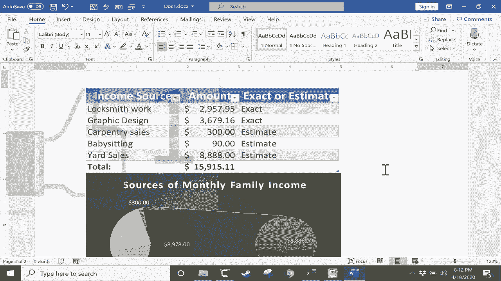

# 【双语字幕+速查表下载】Excel中级教程！(持续更新中) - P49：50）将数据插入 Microsoft Word - ShowMeAI - BV1uL411s7bt

在这个Excel教程中，我们将探讨如何将数据从Excel插入到Microsoft Word。假设我只想复制这里的数据并粘贴到Microsoft Word中。这能行吗？让我们试试看。如果我点击并拖动鼠标选择想要复制的数据，我可以使用控制键+C的快捷键复制那个范围。然后在Microsoft Word中。

我可以按住控制键，点击V进行粘贴。数据粘贴得相当好。如你所见，这些数据是可编辑的。我可以更改这个金额。看看这会怎样。它确实改变了金额，但总计没有调整。因此，它基本上把这当作简单的文本。让我们看看有没有更好的方式将数据插入Microsoft Word。

我们可以尝试通过点击插入，然后点击表格，选择一个普通表格，将这个范围转换成表格。点击O。现在，它已经将其转换为一个表格。现在，如果我点击并拖动选择数据，复制它，然后进入Word并粘贴，结果似乎好一些。但即便如此，如果我更改数字，看看，改变那个数字并没有更新下面的总计。

一定有更好的方法。在我看来，将数据插入Word的最佳方法是首先复制范围，然后进入Microsoft Word，而不是简单地粘贴，去剪贴板组的主页标签。如果你点击粘贴按钮，但粘贴按钮的下半部分，会弹出一些选项。其中一个是特殊粘贴。

这给了我各种特殊的粘贴方式。但最上面的那个是我想要的。Microsoft Excel工作表对象。我选择它，点击O，它会将我的数据作为Excel对象粘贴。现在你可以看到我的图表在右侧，但这没关系。这次。

因为我将这些数据作为Excel对象插入。让我们看看它的行为。我可以更改数字吗？是的，我可以。如果我双击它，我仍然在Microsoft Word中，但我看到一些Microsoft Excel的选项。假设我按下键盘上的回车键，它会调整总计。

它把这当作它实际是的Excel对象。同样，注意我可以访问Excel过滤器并更改其中一些，以过滤掉部分数据。因此在很多方面，这就是从Microsoft Word内访问的Excel。你甚至可以在顶部看到绿色的Excel配色方案。

即使我在Microsoft Word中。当我准备继续撰写我的Word文档时，我可以点击Excel对象外的地方，现在很明显我回到了Microsoft Word。但我的更改仍然有效。所以这很不错，但你需要知道这是一种链接和嵌入。😊

所以这个Word文档中的数据是链接到我的Microsoft Excel文档的。现在我们来看这个图表。我能否将这个图表复制粘贴到Microsoft Word中呢？我将先选择它，使用控制C键盘快捷键，然后在Microsoft Word中，我会按几次回车键，将光标向下移动一点。

我会去粘贴，点击下半部分，就像我之前做的那样，转到特殊粘贴，我将其粘贴为Microsoft Excel图表对象。我点击，这就是我的图表。它稍微有点大，所以我可以点击并拖动角落来缩小它，我也可以点击旁边来这样挤压它。

选中我的饼图时，注意它说双击以编辑Microsoft Excel工作表。所以如果我双击它，类似于我上面展示的，它基本上会尝试在Word中打开Excel，我可以进行一些操作。然后我可以双击，就像在Excel中一样，选择饼图的一部分，然后我可以点击并拖动将其炸开。我可以右键点击饼图的一片或图表本身进行一些更改，就像在Excel中那样。

所以这可以是将你的Excel内容带入Word的一个好方法。现在，有些情况下你可能不想让数据或图表像在这种情况下那样可编辑。如果我将这个Word文档发送给其他人，我不想让他们编辑Excel数据或饼图。在这种情况下。

在Excel中，我会选择数据，然后转到剪贴板组。我会选择不是主按钮复制，而是旁边的箭头。如果你点击箭头，它会显示复制为图片。我可以选择以打印时的样子复制，或者以屏幕上的样子复制。格式可以是图片或位图。所以这些方法都很好。

为了进行调整，我选择屏幕上显示的图片。但在此之前，我想我会取消这个，然后把图表稍微移开一点再试一次。我将选择它，进入复制为图片，点击O。现在数据已作为图片复制。我会进入Word的新页面，然后去粘贴，这次我可以直接点击粘贴的上半部分，我只是将其作为图像粘贴。

我不需要这个文本是可编辑的。所以现在当我双击它时，我没有选项来编辑数据，当然我也可以对我的饼图做同样的事情，选择它，点击复制旁边的箭头按钮，选择复制为图片，点击O，然后在Word中，我可以按控制V粘贴，或者我可以直接去主页标签点击粘贴按钮。

当然，我可以拖动它们以放置在正确的顺序。所以这两种方式都可以将Excel数据带入你的Word文档中。
