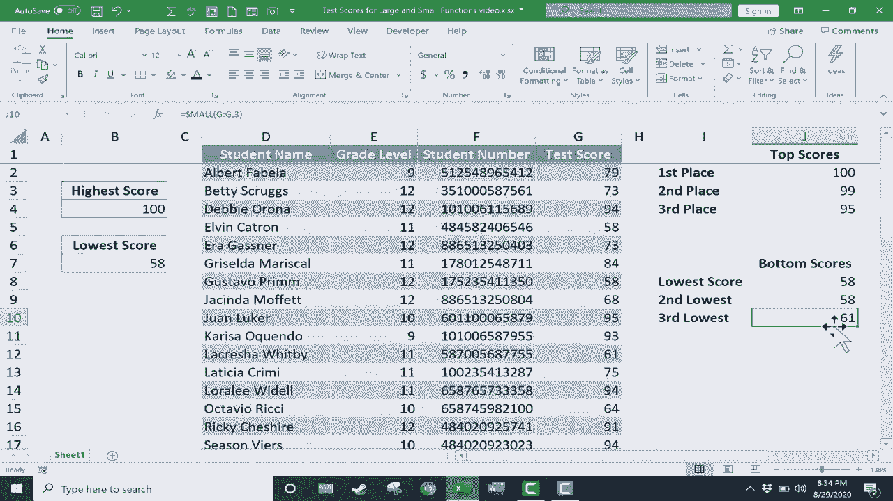

# Excel 中级教程！(持续更新中) - P52：53）LARGE 函数和 SMALL 函数 - ShowMeAI - BV1uL411s7bt

在这个视频中，我将为你强调两个强大的 Excel 函数，它们是 large 函数和 small 函数。出于某种原因，这些函数较少为人所知，尽管它们在某些方面比其他更常用的函数更强大更好。你可以看到这里我将用于这个视频的电子表格是一份学生姓名和考试分数的列表。

这都是假设，不是 REL 学生。所以假设我是一位老师，我想查看这些考试分数。也许我没有这里列出的 20 名学生，而是有 50 名学生或 100 名学生。我想快速扫描并找到最高分和最低分。大多数人，如果你对 Excel 有一些经验，会去你想显示最高数字的单元格，输入等号 max 然后左括号，然后简单地选择你想测试的范围。所以我想测试这个。

看看哪个是最高分。所以我可以点击并拖动来高亮显示它们，甚至只需点击 G 列以选择整列。然后我输入右括号，按下键盘上的回车键。这样返回的最高分是 100。是真的吗？是的。

这位学生得了 100 分。现在我们来看最低分。大多数人会再次输入等号 min 左括号，选择范围右括号，按下回车，最低分是 58。这很好。但如果作为老师，我想突出显示前 3 名分数和底部 3 名分数呢？

好吧，Excel 中有一些功能比 max 和 min 更强大。我们来使用这些功能。所以在这里为了获取最高分，我将使用 large 函数来实现。我只需选择要显示第一名分数的单元格，然后输入等号 large 左括号，然后我将选择。

我要测试的范围。所以我会选择 G 列的所有单元格。但 large 比 max 更强大的地方在于，我可以放一个逗号并输入一个数字，这个数字将决定显示哪个分数。如果我输入数字 1，它将列出第一大数字。如果我输入 2，它将显示第二大数字；3，第三大；5，第五大，依此类推。

所以我将 1 放入最大分数，最高分右括号，然后按下键盘上的回车键，它返回数字 100，这是准确的。与 max 得到的相同。但现在看看我能做什么。我可以再次输入相同的公式，但这次在 J3 单元格中。然后我可以放 a2。最快捷的方式就是简单地将这个公式向下复制。

所以我打算使用自动填充手柄，如果你不熟悉自动填充，你应该看看我关于这个主题的视频。但使用这个手柄，我只需点击并拖动，就复制了这个公式几次。现在我可以双击这个公式，将1改为a2，然后在键盘上按回车键。现在它返回第二高分。我们可以看看这是否正确。

Shan得到了第二高分99分，现在我可以双击更改这个公式。或者有时候选择单元格，然后在公式栏上进行更改会更好。这有时会更安全。所以在这种情况下，我将这个公式中的1改为a3，以显示第三高分。我在键盘上按回车键，这样我们就得到了前三个分数，199和95。

现在我们做同样的事情，但针对J8中的最低分。我输入等号，输入small左括号。接下来，我选择要测试的范围，所以是所有的G，然后放一个逗号。现在我想要第一个最小数字。如果是的话，我放一个1。如果我想要第二个最小的，我放2，第三个最小的3，等等。

所以我只想做一个。我想要最小的数字，写上括号。按回车。我们已经知道这是正确的。58是最小的数字。我会使用自动填充手柄将这个公式向下复制，但在这种情况下我需要将数字从1改为2。在这种情况下改为3。现在，让我们仔细检查一下以确保这个操作成功了。

你可以看到58被显示为最低分和第二低分，这是真的吗？嗯，Gustavo得了58分，而Elvin也得了58分。所以这似乎是正确的。第三低分是61，Lucreettia确实得了61分。如果你喜欢使用最大值和最小值，这两个函数非常有用。但现在你可能会发现自己更频繁地使用large。

和small，因为现在你知道如何正确使用它们。它们确实更好，因为它们可以让你轻松提取出比仅仅是绝对最高和绝对最低更多的信息。
