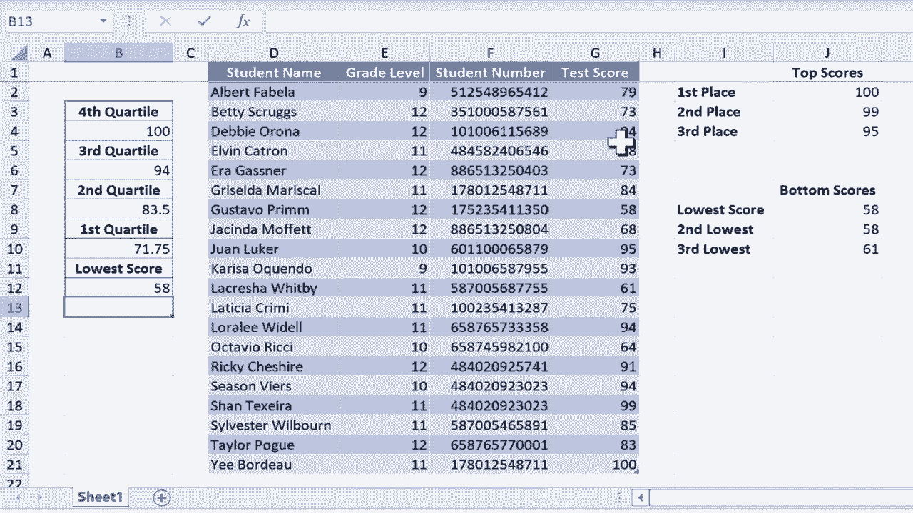

# 【双语字幕+速查表下载】Excel中级教程！(持续更新中) - P55：56）四分位数函数 - ShowMeAI - BV1uL411s7bt

在这个视频中，我将向你展示如何在Excel中使用四分位数函数。我想给出的例子是一个班级和一份测试分数列表。所以假设我刚给这组学生进行了测试，你可以看到我计算了前三个分数、后三个分数、最高分和最低分。如果你想知道我是怎么做到的。

你应该观看我关于Excel中大数和小数函数的教程，但在这个视频中，我们将重点讨论如何从这里的测试分数数据中提取更多信息。我想知道测试结果的第一个四分位数、第二个、第三个和第四个四分位数。这样我就能知道学生们需要获得多少分才能进入第四个四分位数或第三个四分位数等等。

如果没有Excel的四分位数函数，这将相当复杂。让我们看看它是如何工作的。我想从第一个四分位数开始。所以我会点击B10单元格，输入等于。quartile左括号，你可以看到Excel在这里寻找什么。它需要一个数组，然后是一个逗号，然后是quart表示四分位数。

所以数组就是指一系列单元格。我会点击G2并向下拖动以选择所有测试分数。那将是我的数组，接下来我只需输入逗号。然后我需要决定这里我感兴趣的是哪个四分位数。嗯，我对第一个四分位数感兴趣，因为那是我在这个特定单元格中寻找的信息。

所以我只需输入a1，然后按右括号，再按下键盘上的回车键。结果返回数字71。75。知道低分是58，这告诉我们，为了进入分数的第一个四分位数，学生必须得分在58和71。75之间。这意味着这里25%的结果落在58和71。75之间。

71。5，这是低四分位数，第一个四分位数。好的，第二个四分位数呢？我可以点击B8单元格，输入等于，输入quartile，并基本上重复相同的步骤，但实际上复制和粘贴我们已经有的公式要简单得多。因此，我点击B10，按住Ctrl键并按C复制，然后在第二个四分位数的地方粘贴，同时也把它粘贴到第三个四分位数的地方。

当然，它给我的结果仍然是71。75。原因是公式中仍然有数字1。所以要修复这一点，你只需点击这个单元格，在本例中是B8，它会高亮显示单元格，在公式栏中我可以轻松将1改为a2，现在当我按下回车键时，它应该给我第二个四分位数，结果是83。

5 现在。对第三四分位数做同样的操作。在这种情况下，我会点击 B6，去公式栏把一改成 a3，然后按回车。现在我们得到了第三四分位数。我们已经知道最高分是多少。这里列出的最高分是 a00。我是通过使用最大函数和公式算出来的。所以因为这个原因。

我们其实不需要第四四分位数。第四四分位数只会给我们相同的数字，它会给我们最高分，最高的可能数字。因此，即使我们不需要计算第四四分位数，还是让我们来做一下。所以再次，我会把那个公式复制粘贴进去。但是这次我会把一改成四，然后按回车。

它给我相同的结果。但这次我使用了不同的函数。不是最大函数，而是四分位函数。好的，我们得到了所有四个四分位数。作为复习，这些信息的意思是，在所有测试结果数据中，25% 的数据介于 58 和 71.5 之间，25% 介于 71.75 和 83 之间。

525%介于 83.5 和 94 之间，而 25%介于 94 和 100 之间，所以任何得分在 94 到 100 之间的学生都进入了班级的第四四分位数。还有一件你可能想了解的事情关于 Excel 中的四分位函数是，它也可以计算最低分。

现在我已经计算出了最低分。我使用了最小函数和公式来计算这个范围内的最小数字，但我本可以直接使用四分位函数，所以让我们切换成四分位。我可以输入等于四分位，左括号，选择数组或范围，输入逗号，然后问我想放哪个四分位数。

1、2、3 或 4。以上都不是，我会输入零，然后写右括号，按回车。它返回这个列表中的最低数字 58。
