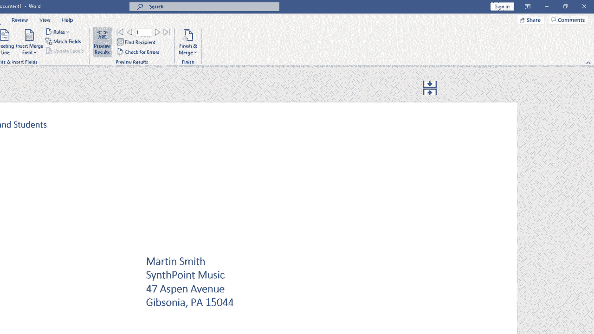

# 【双语字幕+速查表下载】Excel中级教程！(持续更新中) - P56：57）Microsoft Word 中的邮件合并信封 - ShowMeAI - BV1uL411s7bt

In this video， I will show you how to create hundreds or even thousands， potentially of envelopes。 each with its own distinct address to be sent out to hundreds or thousands of different people。 and we're going to do this in Microsoft Word。 If you haven't already watched my tutorial on how to do a mail merge in Microsoft Word also using Microsoft Excel。 you should definitely watch that previous video。 But in this video。

 we're not going to focus on mail mergege documents or letters。 but rather on the envelopes that they go in。 So here I am in Microsoft Word。 And if you did watch that previous video， you know that I've already mail merged the document itself。 but now I need envelopes for those documents to go into。

 And I'm starting just in Microsoft Word with a completely blank page。 but I also do have in Microsoft Excel， a contacts list with information like people's names。 addresses， phone numbers， the city they live in， etc ce。 And you can get a copy of this practice file， if you look in the description below and all of these are fiction。

People and names and addresses。 So let's look at how I could create an envelope for each of these people on this contacts list。 And to begin， I'll just go to Microsoft Word and I'll go to the mailings tab so that I can see the mailings ribbon and here in the start mail merge group that's where I need to do my work。

 Now I know it's tempting to go here to the create group and create an envelope that way。 but this is really just to create one envelope with just one address etc。 So you don't really want to go there instead you go to start mail merge and choose envelopes at that point。 I get a popup with some options for my envelope Now I'm using Microsoft word in 2020。

 If you have an older version of Microsoft Word， this may look slightly different but the idea is the same。 and that's probably true also a future versions of Microsoft Word So the first option I have with envelopes is to change the envelope size Probably the most typical size。

Envelos in the US is size 10， so you can see the dimensions here。 but if you need to or want to。 you can change the size of the envelope。 I'm going to stick with size 10。 Next。 I can change the font type for the delivery address。 So do I want it to be agency FB。 you can see the preview of it here。 Do I want it to be Georgia Pro light。 I could make it bold。

 I could change the size of the font as well or even the color。 In most cases。 you're not going to want to change those at all。 So I'm going cancel that。 but I just want you to see that it is an option。 Next。 we have some positioning options for the envelope。 We have from left and from top。 and by default。

 it should say auto， and in most cases， that's what you want to leave it at。 But once you've done your mail merge for your envelopes。 If you find that the spacing is off a little bit。 This is where you can make some adjustments here in the from the left box。 if I click up it will nudge the delivery address。One way or the other。

 And you can also just type in the exact number。 I'm going to switch back to auto In most cases that will work for you。 Also from top same thing。 we can nudge the delivery address in a different direction。 Next。 we have similar options for the return address here in the upper left of the envelope very much the same as the delivery address options。 Now， next to envelope options， I also have printing options。

 And if your computer is connected to a printer， the default options will probably be the one that you'll want in order to make it work with that printer。 But you can also switch if you need to。 you can try out different orientations，  different options。

 And we also have some feed options here。 we can do a manual feed or a tray feed just lots of different options to try。 I'm going to stick with manual in this case。 and I'll click O。 Now， when I click okay。 this page is going to change its layout and it's going to look more like an envelope。 in order to see that， I'm going to have to zoom out a little bit。But let's first click O。

 I don't know if you notice the subtle changes， But if I zoom out。 you can see that this is now formatted and laid out as if it were an envelope。 Now it's time for me to pull in the information from my Excel spreadsheet。 So here in word。 I'll just click select recipients。 At this point， I could manually type a list of all the recipients。

 But let's assume that I have 1000 people I need to send envelopes to。 That's not gonna be a good option for me。 So instead， I'll click use an existing list。 And then all I have to do is navigate to the folder on my computer。 where my Excel spreadsheet is kept。 Where is the sheet that has all of the recipient names。

 addresses， et cetera。 And I found it， And I double clicked on it。 Now that I've double clicked on it。 I just need to verify a couple of things。 Does my data have a first row that contains column headings。 If I go back to Excel。 You can see that it does。 These are column headings。 So I need to make sure that that's checked。

 And then I need to make sure that the right sheet。Is selected。 In this case。 there's really only one sheet。 So that's an easy decision。 I can click O。 and it seems like nothing happened。 but in reality。 I'm now ready to merge information from Excel to Microsoft Word onto this envelope Before I actually do that。

 though， I could go here to the upper left。 and type in a return address。 So that's the return address name。 And then I can tap enter on the keyboard。 put in a street address， hit enter， put in a city comma state and a zip code。 Now that I've got the return address。 I need to put in the delivery address。

 and it doesn't look like there's anything on the screen here， but there actually is。 there's an invisible text box。 And if I click down here somewhere。 you can see the outlines of the text box。 Next， I can use this address block button and or the insert merge field button to put in the recipient's address。 Let's try address block。 If I click that， it will try to automatically piece together。

 the names and addresses of。😊，The recipients。 But if you look closely， it didn't quite work。 The street address is missing。 And if I go back into Excel。 you can see that there is a street address。 It's just that I called it a business address instead of a street address。 So how would I fix that。 Well， in Microsoft word， I can go in here to the insert address block。

 pop up and choose match fields。 Here it says address 1， not matched。 All I have to do is click this drop down and choose business address。 click O， and look。 that has now fixed the delivery address for Martin Smith。 And I can test it out for the next person as well。 Adrian Thomas It looks good to me。

 And Ellis Arevelo， same thing looks good。 So that is one way to put in the delivery address。 just use this button here。 make sure that it's correct If it's not correct。 Mat fields and then click O。 instead of clicking okay。 I'm going to click cancel just to show you that you can also piece together the address yourself manually by using this insert merge field。

But and I'll click on the bottom part of this and select first name and immediately word inserts a first name placeholder after first name。 I'll need a space so I just type space with the keyboard and then I can go back up to insert mergegefield last name and then at this point。

 I'll tap enter to move down a line go back up insert mergegefield company name that may or may not be necessary。 tap enter insert mergefield business address。 you could put a comma there if you want。 you could put any other adjustments there that you want to make I'll just tap enter again。 insert mergefield city comma， and I'll put a space and then back to insert mergegefield state。

 I'll put a space or two spaces if you want and then insert mergefield zip code So I have piece together my own address block for this entire list of recipients Let's test it out and see if it's going to work。 the way we can test it is by going here on the mailings tab just go to the preview。

group and click preview results。 So there's Ellis。 It looks good。 Look right to me。 There's Douglas。 And I can just click these buttons to jump through all of the names or a few of the names to make sure that it's working properly。 and it looks good to me。 you can also do a search for a certain recipient to test out and you can check for errors。 But at this point， I'm satisfied that this is working and it's going to turn out well。

 And so I'm ready to finish and merge。 Now， before I do that。 I'm just going jump back to the first record by clicking this button。 This is the very first envelope that will be printed， and then I'll click finish and merge。 there's different ways you can do the merge， I'm going to focus just on print documents。 Now。

 at this point， even though I'm confident that things are going well。 If I really was going go ahead and print 100 envelopes or 1000 envelopes。 I would not print all of them the first time。 Instead， I would just print the current record。 In this case， the first envelope just as a test to make。

Make sure that this is really working and that I'm feeding the envelope correctly oriented the right way。 And then if that works。 then I could go back and do this again and print all。 Let's look at what happens when you do a print all。 I click O。 and this pops up with the typical printer options that you're used to seeing。

 I can switch printers with this button here， adjust properties， etc ceter。 Now， if I click O。 it will begin the process of printing all of these envelopes。 So that's how you do a mail merge for envelopes in Microsoft word。 but also using Microsoft Excel。 Now， if you find that to be intimidating。 you can do the same steps by clicking here on start mail merge and choosing step by step mail merge wizard。

 Some people find this a little easier。 Honestly， I don't necessarily find it easier。 but it does walk you through the steps。 So if you're brand new to this idea of doing a mail merge。 You might want to use the wizard。 again， you would use an existing list and then click。And then it gives you some tips on how to proceed， and then you would click next again to preview and next again to complete the merge。

 So it is good to know that that does exist in case you get stuck and need a little guidance。