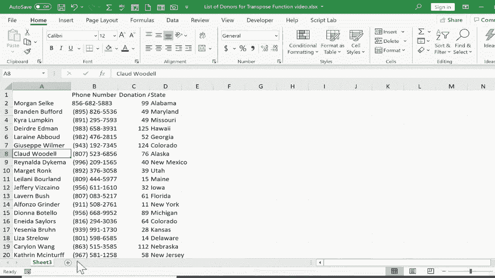

# 【双语字幕+速查表下载】Excel中级教程！(持续更新中) - P57：58）TRANSPOSE 函数 - ShowMeAI - BV1uL411s7bt

在这个简短的Excel视频中，我想向你展示如何使用Excel中的转置函数。我在一个已经开始使用的Excel电子表格中，而我对这个信息的布局有点后悔。我不知道你是否有过这样的经历，当你开始输入数据时，你输入了列标题，输入了行。然后你心里想，等等。

也许在这种情况下，我应该把名字垂直放在A列，而不是水平放在第1行。我知道这种情况对我发生过几次。在其他情况下，我输入数据的方式很好。这是我想要的。但我可能也想以相反的方式显示它，也许在单独的电子表格中。所以我们将看看一个叫转置的Excel函数，它将帮助我们做到这一点。

我将开始点击这个加号以添加sheet 2。我会去我想让新数据出现的左上角。我会点击等号并输入Transpose。你可以看到Excel识别了我想要使用的函数。

它给了我一个描述。它将垂直范围的单元格转换为水平范围，反之亦然。所以现在我会输入左括号，Excel现在期待一个数组。换句话说，一系列信息。所以我将返回到sheet 1，然后简单地点击并拖动以突出显示我想要转置的信息范围。我觉得我全都选中了。现在我将在公式栏中输入右括号。

你可以看到我在sheet 2上开始的那个公式仍然在我的公式栏中。我输入了右括号。通常没有右括号也能正常工作，但我正在努力养成总是输入它的习惯。所以现在我会在键盘上按下回车，我收到一条小消息，说明我的公式溢出，公式返回多个值。

所以我们把它们倒入了邻近的空单元格。明白了。这听起来不错。那么让我们看看这如何运作。正如我所预料的，它提取了sheet1上的数据，顶部是人名，左侧是电话号码、捐赠金额和州。而在sheet 2上。

它翻转了所有这些。这正是我想要的。但为了让我们更好地看到这一点，我将在顶部的列字母A到D之间点击并拖动。然后我会在这两个列之间的任何位置双击。比如说在C和D之间，正好在那条线。

只需双击，就会自动调整列宽，以便列中的信息完美适配。让我们看看这些数据。大多数情况下，似乎运作良好。让我们用Katherine Macinturf测试一下。如果我返回到sheet 1，我可以看到Katherine Macinurf，她的电话号码以58结尾。她捐赠了58美元。

这真是巧合，她来自新泽西。让我们测试一下。凯瑟琳·麦金塔夫 58。58 新泽西。所以看起来信息被准确且安全地转置了。话虽如此，它确实改变了某些数据的显示方式。例如，它在这里增加了一个 0。不幸的是，我不能直接删除那个。现在，原因是即使它显示为 0。

那个单元格里有其他东西。如果我选择它，你可以在公式栏中看到它。这就是我的转置公式所在的位置。所以如果我删除那个单元格并按回车，它会将所有数据从 sheet2 中抹去。数据仍然在 sheet1 中，但不在 sheet2 中。因此，我将按住控制键并点击 Z 进行撤销。所以我需要保留它在那里。

看起来我的电话号码有些混乱，所以我可以点击 B，转到主页选项卡，在数字组中，通过这里更多数字格式来更改数字格式。我可以选择特殊电话号码。现在，这些已经转换为电话号码。我也可以对美元金额做类似的操作。但在大多数情况下。

这次的转置非常成功。现在，重要的是要知道，如果我在 sheet1 中更改信息，比如摩根的捐赠金额，假设他多捐了一些，摩根的信息也会在链接的工作表上改变。转置时，链接保持不变。如果这不是你想要的。

你可能应该使用复制和粘贴特殊来转置数据。如果你想知道怎么做，可以观看我的关于在 Excel 中转置数据的教程。你还可以做的另一件事是，现在你已经转置了数据，可以点击并拖动以突出显示所有数据，然后按住控制键并点击 C 复制数据，然后可以去另一个工作表。

假设在同一个工作表的某个地方，点击你希望显示数据的左上角，然后转到主页选项卡的剪贴板组。我将点击粘贴按钮的下半部分。然后我将选择粘贴值。现在，让我们试试。如果我删除那个 0。

数据仍然存在。为什么呢？因为当我使用粘贴特殊并将数据作为值粘贴时，它将数据从由我编写的转置函数和公式生成的信息转换成了简单的值。因此现在，如果我想，我可以删除 sheet1 和 sheet2，而 sheet3 仍然完好。这是现在独立的数据。

