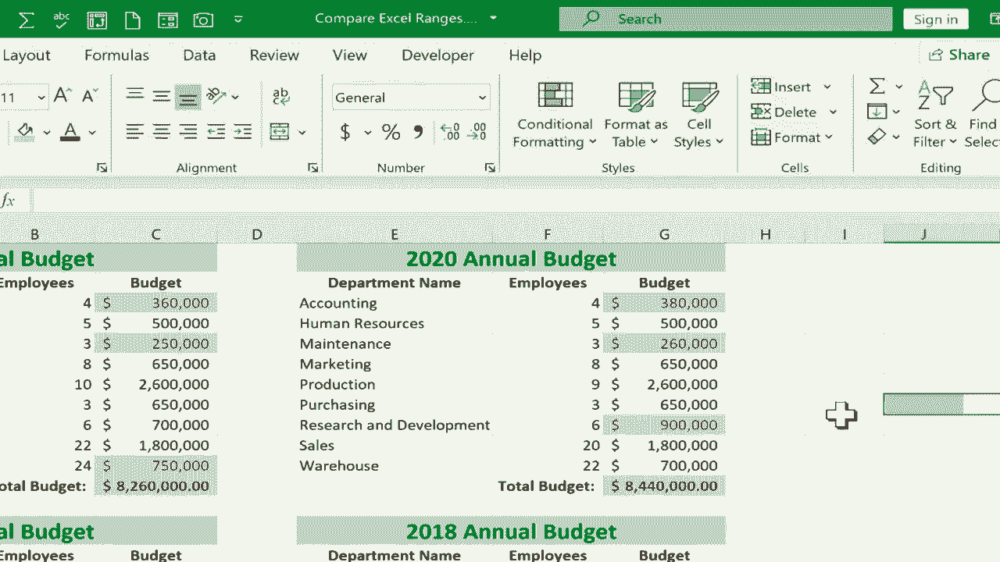

# 【双语字幕+速查表下载】Excel中级教程！(持续更新中) - P58：59）比较和对比 Excel 范围 - ShowMeAI - BV1uL411s7bt

在这个简短的 Excel 教程中，我想向你展示如何比较 Excel 范围并显示差异。我有一个示例文件，你可以在本视频下方的描述中找到，里面有一些简单的年度预算。你可以看到2018年至2021年的每个预算，每个预算都有自己的标签。此外，我还有一个比较标签，可以在同一电子表格中查看所有四个。

如果我想比较这些预算以确定从2020年到2021年发生了什么变化，哪些地方进行了调整。我可以逐一查看这些预算项目和员工人数，也许这些方面有所变化。

我可以凭直觉判断差异。但在 Excel 中有一种更快的方法。我会点击并拖动，突出显示我想要比较的一个范围。在这种情况下，我想将当前年份与前一年进行比较。突出显示第一个范围后，下一步是按住键盘上的控制键，然后点击并拖动以突出显示我想要比较的第二个范围。

所以在选择了这两个后，我现在可以去“主页”选项卡中的“条件格式”组，点击条件格式，出现了许多选项。如果你对条件格式不熟悉，真的需要观看我之前的教程，向你展示如何使用条件格式。

在条件格式中有许多强大而令人兴奋的选项。但就本视频而言，我只需将鼠标悬停在“突出显示单元格规则”上，然后一直向下到“重复值”。这样就突出了所有重复的单元格，这是实现比较的一种方式，毕竟它显示了所有的重复项。

它还显示所有独特的项目。但为了使其更具可读性，我将其从重复切换为唯一，点击，现在在这种情况下，以红色突出显示2020年至2021年的差异。我现在可以点击那些突出显示的范围，你可以看到，是的，标题从2020年变更为2021年，财务和维护的预算发生了变化，研发和仓库的预算也有所不同，这也突出显示了一些其他差异。

在某些情况下，员工人数不同。为了让这更容易阅读并识别变化，我将按住控制键，撤消我的条件格式，这次我将专注于最重要的内容。

显然，我知道日期已经改变，也许员工人数并不重要。如果我只对预算变化感兴趣呢？那么，只需点击并拖动以突出显示预算，按住控制键，然后再次点击并拖动以突出显示2020年的预算范围。同样，条件格式化，突出显示销售规则重复值。从重复切换到唯一。

不过这次，我将把浅红色填充改为深红色文本。我只是想让你看到还有其他选项，你可以使用黄色填充来突出显示典型的黄色高亮颜色中的差异。不管你想怎么做。我会点击 O。现在这样读起来更容易。我觉得它只识别了关键信息，以及不同的地方，变化的地方。

我可以撤销这个。如果我想的话，还可以进行另一个比较，将2021年与2018年或2019年进行比较。因此，我鼓励你下载这个练习文件并试试看。
