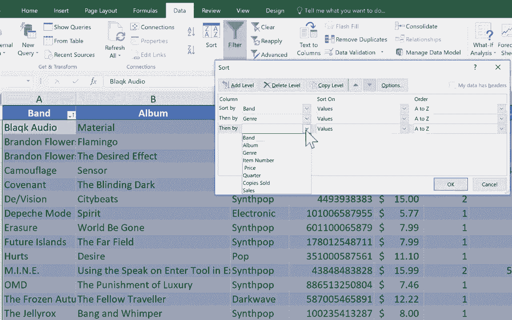

# Excel中级教程！(持续更新中) - P6：6）排序 - ShowMeAI - BV1uL411s7bt

在这个 Excel 教程中，我将更仔细地看看 Excel 中排序功能的工作原理。你可以看到我用于此的电子表格。这是一个合成流行音乐新潮、电子音乐的列表，以及已发行专辑的列表。这些都是合成流行新潮的最新示例等等。无论如何。

这个电子表格是为一个假设的合成流行音乐商店准备的，该商店会以 CD 格式销售这样的音乐。我知道每个人都说 CD 已经不再相关，但我不同意。因此，这个假设的公司想要跟踪他们的库存、销售和每个项目的价格。你会注意到，这里的数据是以表格格式呈现的。

数据已被放入一个表格中。当你进行排序时，这种方式是有帮助的。这不是必要的，也不是必须的，但有时确实能让你省去一些麻烦。所以你可能会不时使用插入表格功能。你可以观看我其他的一些视频来了解相关内容。

Excel 中的表格。但不管你是否使用表格，如果你想要排序，比如按专辑标题，有几种方法可以做到。很多人会在 B 列的字母上点击，然后去右边，点击排序和筛选。但注意，这对我来说并不是一个选项，它是灰色的。

我认为原因是我的数据在一个表格中，如果不在表格中，它就会允许我这样做。但你知道吗，这无论如何都是一个错误，因为它至少会尝试仅对这一列进行排序，而我并不想仅对这一列进行排序。我希望所有数据能够保持在一起。换句话说。

我不希望这段文本在左侧和右侧文本的同时向下移动。好的，所以我建议你不要通过点击列标题来进行排序。相反，你应该在该列的任意位置点击，除了列标题之外。因此，在这个例子中，我不想选择其他任何地方的专辑，我只需在这里点击。

《Blinding Dark》，这是 Covenant 最近发行的专辑之一。现在我选择了它。我可以直接点击排序和筛选，然后选择从 A 到 Z 排序。看，发生了什么？所有数据都根据专辑标题进行了重新排序，并且是按字母顺序排列的。尽管如此，专辑的列标题仍然保持在原位。原因是我没有选择整列。

我在列中点击某个地方。让我们再试一次，这次在乐队列中。如果我想按乐队字母排序，我只需在 A 列的任何位置点击，不包括 A1，然后点击从 A 到 Z 排序，它成功了。现在，假设我有两张由 Brandon F 出售的专辑。

所以我需要在4上右击并点击插入。它给我添加了一行。我将把布兰登·弗拉瓦斯的名字复制下来，并输入他另一张专辑的名字《火烈鸟》。接下来我会把剩下的数据填在这里。那么，现在，看看我能做什么。我可以通过专辑进行排序，如果我点击排序和筛选A到Z，然后我可以按乐队排序。

按乐队排序，A到Z。现在看看它做了什么。是的，它按照乐队的字母顺序对我的数据进行了排序。但请注意，它颠倒了这两张布兰登·弗拉瓦斯专辑的顺序。现在，《火烈鸟》在顶部，《期望效果》在下面。

原因是因为Excel记住了我首先按专辑排序，然后按乐队排序。无论你最近一次的排序是什么，那就是优先排序。因此，这里的优先排序是按乐队的字母顺序排列。但还有一个次要优先级，Excel记住了我也按专辑名称进行了排序。

所以你可以得到一些非常有趣的排序。例如，我可以再进行一次排序，这次按流派排序。所以我点击排序A到Z。当然，除了使用这个主页选项卡的编辑组外，如果你愿意，也可以去数据并点击排序A到Z，这次我就这样做。所以我要按A到Z排序。

现在它按流派排序，这样我可以看到所有列在那里的内容。但我也可以按乐队排序，所以在这种情况下，你可以得到这两种排序的组合，这一次并没有太大的区别，但在更大的电子表格中肯定会有所不同。在结束本教程之前，还有一个你应该知道的功能。

这在数据选项卡的数据功能区的排序和筛选组中，你可以看到有一个排序按钮。如果你点击它，它会给你一些额外的选项。在我点击之前，我想选择我所有的数据。所以我要按住键盘上的控制键并按下A，这样就选择了我所有的数据。如果你想确认选择了所有数据，可以按住控制键并按下句号键。所以我按一下，它会显示左上角。

如果我再次按它，它会显示右上角。如果我再按控制加句号，显示右下角，再次显示左下角。这是一种查看所有内容的方法。并且确认，好的，那就是我所有的数据。一切都在正确的位置，都是选中的。现在我已经准备好了，我将点击这里的更大排序按钮。

它给我提供了一些排序数据的方法。我想先按乐队排序。我想按值排序，换句话说，在这种情况下，就是字母按字母顺序A到Z，如果我想的话，也可以Z到A。你也可以按单元格颜色排序，但我不一定推荐这样做。

但你也可以，还有一些其他方式可以排序。好的。现在我已经设置好了，可以添加第二级排序。首先，我想按乐队排序，然后按类型排序。再次，值从A到Z。然后可能还有第三级排序，或许是按销量从大到小。

所以你点击O，它就会生效。在这种情况下，它对我没有产生重大变化。但在像这种平局的情况下，比如Brandon Flowers，这就是一个平局。它按字母顺序排序，并且是平局。在这种情况下，它通过查看类型来打破平局。它们是相同的。

如果这些数据相等，它会再次打破平局，这次是通过。我想我说的是从大到小的销量。所以如果你真的想让排序更复杂，这就是方法。你选择所有数据，然后点击排序按钮，设置多级排序。感谢观看这个视频。我希望你觉得它有用。如果你觉得。

请点击下面的点赞按钮。
