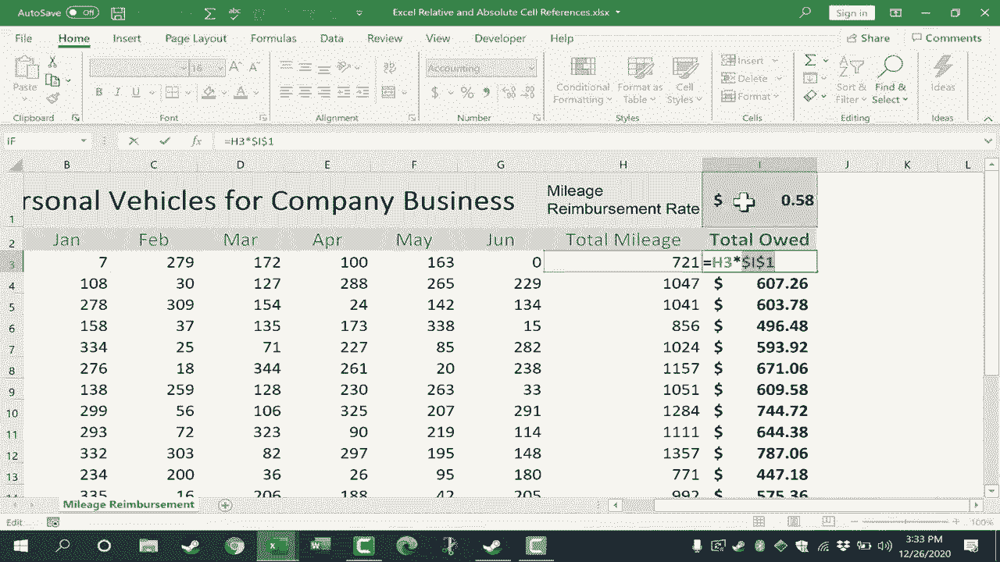

# 【双语字幕+速查表下载】Excel中级教程！(持续更新中) - P62：63）相对与绝对单元格引用 - ShowMeAI - BV1uL411s7bt

在这个视频中，我将解释并演示Excel中相对单元格引用和绝对单元格引用之间的区别。这是使用Excel中的公式和函数时非常重要的概念。你可以看到我在这个视频中使用的电子表格是一个里程报表。它记录了公司的每位员工以及他们在个人汽车上驾驶的里程。

但用于公司的业务。为了公平对待这些员工，公司将报销他们的里程。你可以看到它从一月到六月。好的，首先，让我们看看相对单元格引用。这确实是你需要的最常见类型的单元格引用。

假设公司每年报销两次里程。那么现在正好是年中的时候。我们需要计算上半年总的里程。为了做到这一点，针对Kaina。只需点击她每月里程总数右侧的单元格，然后在键盘上输入等号和一个左括号。

然后我只需描述或点击并拖动以显示我希望相加的范围。我只需点击并拖动以突出显示该范围。我应该输入一个右括号，但在这种情况下不是必要的。然后我将在键盘上按回车，这就是Kaina为公司业务在她自己的私人车辆上驾驶的总里程。如果你看过我其他的Excel视频，你就会知道我不需要为epiphonia或Brook或其他任何人重新创建那个公式。

相反，我只需要点击我的第一个公式。现在看起来我点击了数字721，但这并不是真的。这个单元格不包含数字721。它包含一个公式，你可以在公式栏中看到这个公式，并且该公式返回结果7。

因此，在这种情况下，点击单元格H3，我将转到右下角，点击并按住自动填充手柄，有时也叫填充手柄。它是单元格右下角的小方块。我点击并按住，然后向下拖动以复制整个公式。好了，你可以看到它自动调整了公式。

当我拖动自动填充手柄时，它试图复制这个单元格的内容，并且成功了，但再次强调，这个单元格里没有721。它有这个公式。在列H中复制并粘贴那个公式后，看看Excel做了什么。它自动调整了公式中的B3到G3部分，改成了B4到G4，以及这里的B5到G5。我还可以双击显示B6到G6。所以再一次。

它调整了单元格引用。原始公式是 B3 到 G3，但它将 B3 到 G3 的引用调整为 B8 到 G8 或 B13 到 G13，一直调整到 B22 到 G22。当你使用自动填充手柄时，这就是默认行为，它会自动为你进行这些调整。那么这是怎么做到的呢？

它使用了相对单元格引用。当我点击并拖动自动填充手柄时，Excel 默认表示这个公式是相对的。原始公式是对当前单元格左侧的六个单元格求和。所以 1、2、3、4、5、6 它将这些值相加得出结果。因此，当我使用自动填充手柄复制时，因为这是一个相对单元格引用，粘贴的公式就会说好。

现在我将对当前单元格左侧的六个单元格进行求和 1，2，3，4，5，6。它将这些数值相加，得出了一个与单元格 H3 不同的数字。这就是相对单元格引用的力量和美妙之处。而且你真的不需要做任何特别的事情来指定你想要相对单元格引用。

每当你使用自动填充手柄时，这就是默认情况。这正是我想要的，效果很好。现在我们来看一下绝对单元格引用，以及它们是如何非常重要的。假设我们尝试相同的操作，但针对欠款总额。

假设我是一家公司的会计，我需要计算每位员工驾驶的总里程，以及公司应支付给他们的金额。因此我们首先用相对单元格引用错误地做一下。

所以我将输入等于号，计算公司应付给 Kaina 的金额。我需要将 7.2 乘以 H3，然后我需要将其乘以公司的当前报销率。假设他们每英里报销 58 美分。那么我将输入乘以，也就是星号符号，然后点击报销率，最后按回车，非常好，它计算出了应付 Kaina 的金额。

她驾驶了 721 英里。这计算出来的里程报销为 418.18 美元。现在问题来了。看起来一切都进行得很顺利，但当我点击包含我想要复制到其他员工的公式的单元格，并使用自动填充手柄向下拖动时，看看会发生什么。我放开后，出现了各种错误信息。除了错误信息，我确实得到了一个有效的数字。

不过我有点怀疑公司会报销这个人 435000 美元，仅仅是 1000 英里。那么这里发生了什么？我们来看一下公式。如果我双击这个公式，你可以看到发生了什么。原始公式是将 H3 乘以 I1，而这个是正确的。

现在让我按下Esc键向下展示第二个公式。H4，没错。乘以I2。Excel现在试图乘以单词“总里程”。这又有什么意义呢？为什么它从里程报销金额降到“总里程”呢？答案非常简单。当你使用自动填充手柄时。

Excel默认使用相对单元格引用。所以就像我总里程的例子一样。Excel在之前的公式上加1。所以这里的公式是I1。当我点击并拖动并使用自动填充手柄时。它将I1移到了I2，然后是I3。让我们看看这个公式。这是另一个好的例子。H5。这就是这个单元格。没错。这正是我想要的。

乘以I3。所以I1、I2、I3。哎呀。它将这个人驾驶的里程乘以总里程，这毫无意义。根本不接近正确。我会在键盘上按下Esc键，并按住Ctrl并按Z几次以撤销那个错误。然后再按一次以撤销我的错误公式。尽管它对Kaina有效。

对所有其他员工来说这是一个失败。那么让我们看看正确的计算方法。在这个公式中。我希望总里程的单元格引用是相对的。但是我希望里程报销率的单元格引用是绝对的。

我希望它无论如何都留在那里。那么我该怎么做呢？点击我要放置公式的单元格。所以我输入等于。现在我可以点击这里选择H3。但是有时直接输入更容易。所以我会输入H3。乘以，就是星号。然后我会输入I。接着不是仅仅输入1。

我要输入I美元符号1。如果我不把那个美元符号放进去。它会把这个单元格引用I1当作相对的。然后当我使用自动填充手柄时。它会偏离里程报销率，我需要它保持在那里。因此，每当你需要某个单元格引用无论如何都保持不变，变为绝对引用时，你需要使用星号将单元格引用的那一部分固定下来。

你将它锁定在位置上。所以我锁定了一个的引用。现在我们试一下。我按下键盘上的回车键，它返回相同的结果。但是现在，当我使用自动填充手柄点击并拖动以复制和粘贴公式到所有其他员工时。看，它成功了。我们来检查一下公式。如果我双击，你可以在这里看到它。

你也可以在顶部的公式栏看到它。所以这是我输入的原始公式。让我们看看下一个。H4乘以I1。那这个人呢？H5乘以I1。所以H在变化，H6、H7、H11。但是I列中的单元格引用保持不变，依然是1。

为什么呢？因为我通过使用美元符号将其锁定了。现在，另一种做同样事情的方法是对I和1都使用美元符号。所以我将在这种情况下点击单元格I3，然后上到公式栏。我完全可以在I前面和1前面都加上美元符号，按下回车，如果我现在把它复制到其他员工。

这看起来并没有改变什么，实际上，它并没有改变太多。但是如果你看每一个单独的公式，你会发现前面都有一个美元符号。所以唯一的区别是它锁定了单元格引用。它锁定到了I列和第1行。因此这两个都是固定的。

这样做并不是必要的，因为我并不是从I列拖动这个数字。对吧？我并没有把它拖到J列或H列。所以没有必要使用美元符号将单元格引用锁定到I列，但它仍然产生了良好的结果。因此，结论是，对于我写的这个特定公式，H3是一个相对单元格引用。随着我使用自动填充手柄并将该公式向下复制，它会变化。

H3会变化为H5、H9等。但是I1部分的单元格引用是绝对单元格引用。在这种情况下，我选择将I和1都锁定。这两个都将固定在这里的单元格I上。你使用Excel的越多，就越会看到使用绝对单元格引用的有用或必要的例子。

