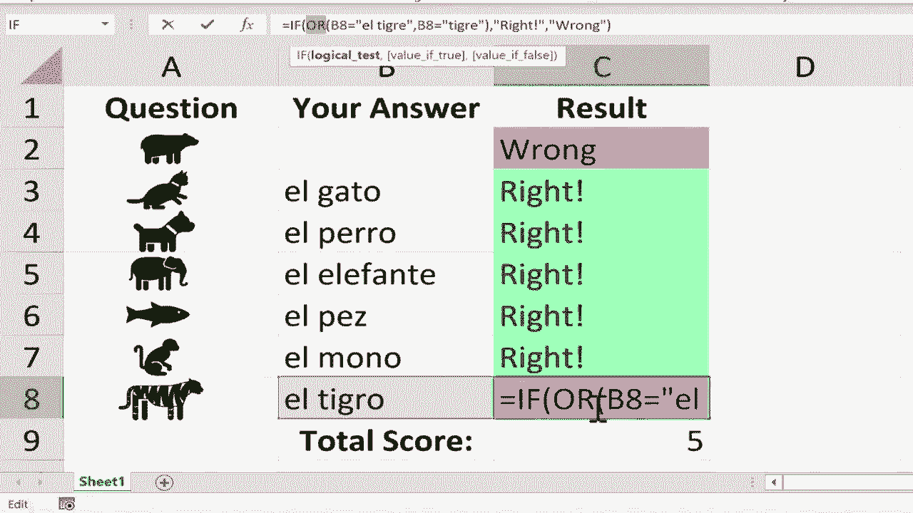

# Excel中级教程！(持续更新中) - P63：64）使用 IF 和 COUNTIF 函数创建交互式工作表 - ShowMeAI - BV1uL411s7bt

在这个视频中，我将向你展示如何在Microsoft Excel中创建互动工作表，它们不仅是互动的，而且还是自评分的。你也可以将这些视为学生可以参加的自评分练习测验，以为考试做好准备。你可以看到我在这里创建了一个电子表格的开头。

你可以在视频下方的描述中获取这部分的副本。我这里有一系列不同动物的图标。我在电子表格中获取这些图标的方法是，去插入插图、图标，然后搜索不同的动物，接着选择我想要的动物。

点击插入，将其缩小并放置在我想要的位置。假设我是一名西班牙语老师，希望我的学生练习他们的西班牙语动物单词。在这个例子中，我选择让问题仅仅是图像或图标，但当然，如果你愿意，也可以在自己的互动工作表或测验中使用文本。

我希望这个功能能够工作，我希望我的学生能够在这里点击并输入每个问题的答案，然后我希望Excel能够基本上给他们的答案评分，以判断它是正确还是错误。那么我该怎么做呢？答案是我需要使用IF函数，让我来演示一下。我将点击C2，输入等号，如果你能看到Excel解释IF函数通常的功能，然后我会输入左括号。Excel现在正在寻找一个逻辑测试，所以我将点击B2，如果B2等于，且在引号内，因为我们处理的是文本，我将输入L Oso，紧接着输入逗号，逗号表示then这个词。所以如果B2等于L Oso，那么我又需要放入引号，我会输入单词right并加上感叹号，然后关闭引号。

另一个逗号，第二个逗号表示如果不是或者else。所以如果B2等于L Oso，那么打印单词right，如果不是则打印单词wrong，关闭右括号。如果我现在在键盘上按回车键，你会看到Excel评估单元格B2的内容，并且Excel发现L Oso确实符合我设定的标准，因此它在C2中打印出单词right。

当然，我希望我的学生能够输入这个，所以我将点击B2，按删除键来去掉它，你会注意到结果变成了wrong。好吧，现在我需要对C3做同样的事情，我需要输入等号IF左括号。

是的，这确实是个好主意，但让我给你展示一个快捷方式。我喜欢用一个节省时间的大方法。我点击C2，然后我会去右下角。那个小绿色方块是填充手柄或自动填充手柄。我将鼠标放在上面，直到鼠标指针变成黑色的加号。然后我只需点击并拖动，将其向下拉。你可以看到发生了什么。自动填充手柄将C2单元格的内容精确复制到C3单元格。有时自动填充手柄会延续或扩展一个模式。但在这种情况下。

它只是简单地复制粘贴。如果你想了解更多关于自动填充手柄的信息，请观看我关于这个主题的其他视频。现在，我说它将C2单元格的内容复制粘贴到C3、C4、C5等。确实如此。但重要的是要注意，Excel自动将B2更改为B3和B4。因此，它调整了相关的行。这在之后会非常有帮助。现在。

你可能注意到了问题。对，西班牙语中“猫”的单词不是“L Oso”，“L Oso”是“熊”的意思。所以我需要调整这个并更改为“el gato”或“猫”。我可以在C3单元格中做到这一点，但在很多情况下，去公式栏更简单、更安全，也更好。是的，我仍然需要点击C3，但然后我去公式栏，我可以将“El Oso”更改为“El gato”，按下回车，它仍然显示错误。

但现在如果我在B3单元格中输入正确的答案，它就会变成“right”。所以我需要对狗和大象做同样的事情，给我一点时间来更改这些单元格中的其余公式，然后我会恢复视频。我已经完成了公式的更新。所以现在，当正确的答案被输入时，文本会变成“right”。在这一点上，如果我想让这个更生动一些，我可以选择整列C，并可以使用一些条件格式来提供额外的反馈给学生。因此，在主页选项卡的“条件”组中，你应该能找到条件。

我想突出基于单元格内文本的单元格规则。所以我将向下移动到包含文本的地方，我会输入单词“right”和一个感叹号，如果学生的答案是正确的，我不想让它变成红色。我希望它变成绿色，填充深绿色的文本，我点击后，这个条件格式已经应用到整个列。如果我想的话，我可以再次点击C，进行另一个条件格式。再次突出单元格规则，将是包含文本，但这次我会输入单词“wrong”，我希望它格式化为浅红色填充和深红色文本。当然，你可以调整这些，如果你想了解更多关于条件格式的信息。

我有几个关于这个主题的视频，你真的应该观看，但我会让它保持红色和深红色点击，这是给学生提供反馈的一个不错的额外方式，因为他们正确或错误地回答问题，颜色确实有帮助。

为了提供一些反馈接下来，我想添加一个收尾的修饰。我希望 Excel 汇总正确答案并给学生一个总分。我可以在 C9 单元格做到这一点。为了使其正常工作，我将使用 count if 函数。所以我会按等号，输入 count if，count if 计算范围内满足给定条件的单元格数量。所以 count if 左括号，我将选择包括所有反馈的范围，无论对错。

所以这是我的范围 C2 到 C8。然后我输入一个逗号，你可以看到 Excel 在这里期待什么。它在寻找我的标准。那么 Excel 在寻找什么以决定是否计数该单元格呢？因为我处理的是文本，我需要将其放在引号中。我希望 Excel 查找带有感叹号的单词 right，我在闭合和右括号后按下回车键，根据 Excel 的说法，我得到了 6。

七个问题中有正确答案。如果你想进一步深入，你可以让学生输入正确答案的变体，仍然得到正确答案。例如，对于单词 L t gray。如果学生只写 T gray，严格来说那可以被视为正确的，而没有前面的 L，但 Excel 却标记为错误。我们该如何解决？好吧，我会点击单元格 C8，这是一种高级技巧，如果你还没有准备好尝试这件事，请不要觉得不好。

但选中单元格 C8。我将去到公式栏，在 B8 前面输入单词或，然后放入左括号，接着我将写 B8 等于 L t gray，然后输入一个逗号，再写 B8 等于，仅输入 t gray 而不在前面加上 L，然后关闭，现在我需要放入一个右括号。你会注意到我有两组括号，一个从这里开始。

并且这里结束，一个从这里开始并结束。现在我可以在键盘上按回车键，看看 Excel 认为单词 tgra 是正确的，还有 L Tgra。但 Ltegra 不算，因为那是另一个单词。如果你想这样做，你可以使用更复杂的公式，使用这个或函数为每个问题创建多个可能的正确答案。

