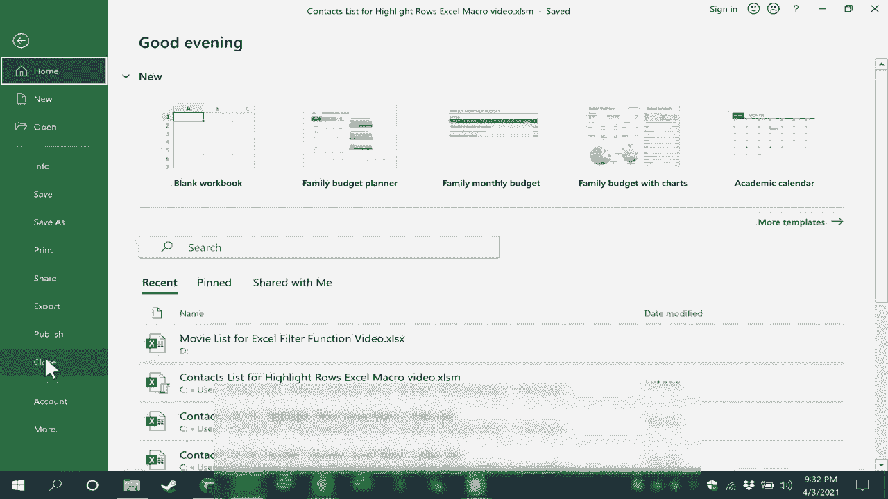

# 【双语字幕+速查表下载】Excel中级教程！(持续更新中) - P67：68）创建突出显示行的 Excel 宏 - ShowMeAI - BV1uL411s7bt

In this Excel video I'm going to show you how to create an Excel macro that will make it so that whatever range you have selected。 every other row in that range will be highlighted in a color of your choice and this video is one in a series on Excel macros。

 please watch the entire series As always when we're creating macros step1 is always to make sure that you have the developer tab on your ribbon If you don't you can go here。 click this quick access toolbar button you can go to more commands switch to customize the ribbon and make sure that that's checked here and then click OK The next step is to go to the visual basic button and click and you can see that visual basic for applications recognizes my spreadsheet It's a contacts list and by the way if you want a copy of this contacts list to practice with look in the description below the video and you'll find a link to that and what I need to do next is decide do I want this macro to reside just on sheet1 or anywhere in the workbook In this case it doesn't really。

I guess I'll choose this workbook so I'll double click on this workbook and I get a white workspace in which to put the code that will make this work that will make every other row highlighted in a color and in this case I'm just going paste in the code into the space rather than typing each word one at a time while you're watching now this is a programming language but please don't be intimidated by that I like to think of code like this code as being kind of like a recipe or a magic spell as long as you know the recipe。

 you're able to create the food that you want to create but now that that code is in place I can simply go up here to the upper right and X out of Microsoft visual basicsic for applications which is built in to modern versions of Excel so I'll X out of that and it looks like nothing happened but if I go to the developer tab in the code group there's macros and I can click and I can see that the macro does exist and I could click run to execute the macro but instead I would like。

To create a button that I can use whenever I need to and that makes it easier to access the macro。 So I'm gonna shorten up some of these columns just by double clicking between the two columns。 it auto sizeizes。 and I think I'll also zoom out a little bit because I want my button to be here and there's a couple of different ways you could create buttons。 you could go to the developer tab insert button and put that in。 and that's a good way to do it。

 or you could insert an illustration let's say a shape。 I'm gonna go with this rectangular shape here。 click and drag on the screen。 there's my button I can choose the style for my button that I want and then double click on it。 I'll call this highlight rows and I can center the text if I want to I can also center it vertically if I want I can make it bigger I can make the text bigger whatever I want to do to customize this button and make it look the way I want it to look。

 So there's my button。 you of course， could design your button however you want to but at this point。To do is right click on the button and choose assign sign macro。 There's the macro that I already created。 I select it。 click OK and then I can click away from the button， and now it's ready to be used。

 but watch what happens if I click the button now if I click it nothing happened why Well the reason why is because the purpose of this macro is to examine whatever is selected and then make every other row highlighted so I need to highlight a range。 you can't just have one cell selected。 now that the range is highlighted。

 I can click highlight rows and you can see the results。 Now that blue is a little intense maybe it's too dark so I could go here to the developer tab go to macros with the macro selected。 I can go to edit and I get back into Microsoft visual basic for applications and I can delete out blue and replace it with another color maybe yellow X out of VB Now this time just for contrast。 I'm gonna click and drag and select only part of the range I'll click highlight。Rose。

 and you can see that works a little better。 So feel free to experiment with the different colors。 Let's try this one。 highlight rows。 That one works pretty well。 Now。 because I've created a macro or used a macro in this spreadsheet。 When I go to save this spreadsheet notice what happens。

 I get a warning saying that the following features。 basically the VBA project cannot be saved in a macrofree workbook。 So I need to convert this workbook into a macro enabled workbook。 It's easy to do。 you just click no， you get this pop up。 and then here where it says save as type。

 just click to change it to an Excel macro enabled workbook。 click save notice that the extension for this file has changed X LSM。 And now when I close the spreadsheet and then open it up again。 notice that I get a security warning about macros。 I have to enable content in order to be able to use the macro button。