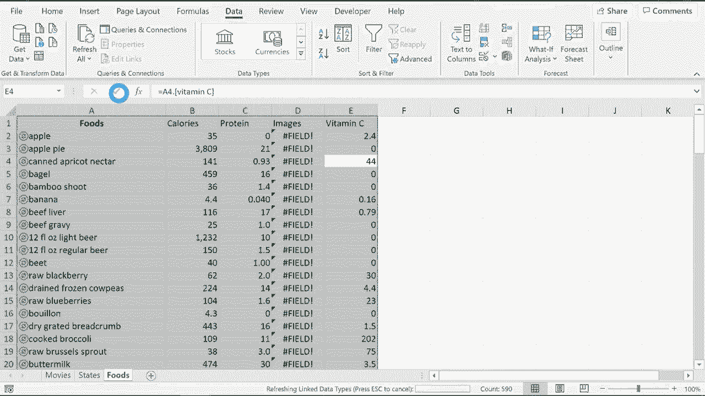

# 【双语字幕+速查表下载】Excel中级教程！(持续更新中) - P68：69）使用链接数据类型 - ShowMeAI - BV1uL411s7bt

In this video I'm going show you how to work with the new linked data types that you can find in Excel。 Now this is for Microsoft 365 versions of Excel， but this also works with Excel for the web So even if you don't have Microsoft 365 you can still give this a try So let's take a look at my workbook you can see that I have three different worksheets the first one has a list of movies just some random movies and let's say I'd like to add some information about those movies。

 maybe the year that they came out maybe how much money each movie made while it was in theaters。 maybe who directed each movie and I can certainly look this information up I can open up Wikipedia or IMDb or some other website and gather that information and put it into this spreadsheet and in the past that's exactly what I would have done but now with a recent Microsoft 365 update look what you can do in Excel。

 I can highlight the range of data and as long as。I'm signedign into my account look what I get on the data tab in the data types group there's a button here for stocks one for currencies and if I click on this button I get even more or this button pops open with the full list of linked data types that I have access to in Excel So basically what this means is that Excel can automatically identify some terms or some of the items that fall into these categories so things related to chemistry things related to plants or animals space so stars planets。

 things like that information related to cities locations and even yoga So let's try it out with our list of movies I'm going to click on movies and at this point it seems like Excel has frozen it doesn't look like much is going on but if you look at the bottom of the screen there is a message saying that it is converting the data into data that's linked it simply means that there is information being linked from the internet into Microsoft。

Excel and much of that information comes from Wolfram。 which is a website that you can go to and this information is updated on a regular basis So when new movies come out。 that information will be added statistics from the cities and information about population and things like that will be updated on a regular basis as well So let's take a look at the results us linked data types in this spreadsheet so you'll notice in my list any movie that has this camera icon next is recognized by Microsoft Excel's one to the future that Excel is not what to do with there's multiple movies with that name the future so this is the one I'm talking about so I click on it click select and now that movie has the movie icon next it what about Gremlins that's the one I'm talking about with Js So this is mostly happening with movies that have sequels Excel is not which of the movies I'm really talking about in。

Of this particular movie， the Sparks Brothers。 This recently came out and it's kind of a smaller movie。 So it's not yet part of the linked data。 And so that one's just not going to work for us。 That's okay。 I'll move on to the birds and in some cases you may need to change the titles。 So I just changed it to birds and then it did recognize it。

 So now all of the movies except for one I recognized by Excel。 Now that that's the case。 check out what I can do。 I can click and drag to highlight the range and then go to this little icon that pops up where it says insert data and I can click and look at all this information that's linked to the text that I've typed into Excel and it's been recognized and linked to this online data。

 So I want to know the genre of each of these movies。 I click genre and it fills it in for me except for Sparks brothers unfortunately at this point I probably should expand column B so I'll just double click between B and C and it expands out let's try this again I'll just highlight the range go back up。

That icon click I would like an image of each of the movies Take a look at that and let's try it again I'd like to know the release date and I'd like to know the director and I'd like to know the international box office total receipts so how much total money did this movie make across the world and so very very quickly thanks to the linked data types I've been able to create a spreadsheet full of information about those movies and very quickly I can format the column headings just the way I want them to be now as you can see there are some parts of this spreadsheet that it didn't work for obviously the Spars Brothers but also there's not information about the box office totals for some of these movies so I can just delete those out and either add in information from another source or just keep it blank Okay let's try it again but this time with a different spreadsheet this one is a list of states in the United States So I'll click and drag to get the range and this time I'm gonna include a1 so I'll go down。

to a21 and let's go back to the data tab there in the data types group we'll go here and choose geography。 Once again， Excel kind of freezes for a second and that can take longer than you would expect especially if you have a lot of data in your spreadsheet so this time all of the states in my spreadsheet a recognized I can tell because there's a little map icon next to each state Excel didn't know what to do with the word states it's the column heading and so it just puts a question mark there that's fine Now I want you to see what if instead of selecting the entire range what if you just pick one of the states and then click this button it brings up a bunch of linked information but this is only going to add this additional information in this case for the state of Alabama so if you want all of it to be brought in you need to select the entire range and then go up and click this icon I would like to know the leaders of those states the largest cities the number of people per household and the housing。

In that state and once again， all of this data is regularly updated。 so this is the information for today， but in six months， some of this information may change。 It's all kept fairly up tod one last example I'm going to go to this foods spreadsheet and let's try it again Now in this case I don't have a list of just 10 or 20 foods I actually have looks like 118 different foods listed here So instead of clicking and dragging I'm just going to go here to the upper left area in the name box and I'll just click and type a2 because I don't really need the headings selected through and you can indicate through with a colon a118 I tap enter and it selects just the range that I want selected。

 I'll go here to the data tab data types group and I'll click to identify this range as foods there I get a little bit of a delay but when Excel is done thinking about this information I will again have linked to data that I'll be able to pull in。To this spreadsheet directly from the Internet。 It looks like it's finished。

 how many of these foods were recognized。 It looks like almost all of them， which is amazing。 It looks like potato chips that was not recognized。 So if I click there I might have to pick a specific kind of potato chip。 I'll just go with this one here， click select and now it's recognized。

 Now if you looked closely some of these foods that I had in the spreadsheet。 they were named a little differently than what Excel was expecting。 but Excel was able to identify them， and it changed the wording to match the linked data。 I'll go here to the name box I'll type in a2 through a118 tap enter it selects the data。

 and then I can use this button here to click I would like to know the total calories of each of these foods I also want to know the cholesterol the total protein。 I'd like to have an image of each that would be good。 and I'd like to know how much vitamin C each of these foods has。 So this information looks like it came in beautiful。😊。

With the exception of image it looks like Excel is having some trouble getting images for most of the foods but I am very excited about this feature in Microsoft 365 versions of Excel and also Excel for the web this will help me tremendously to be able to add in information quickly from the internet and be able to use it right away in my spreadsheets Now because this is all linked data to the internet what if the information changes online and I open my spreadsheet would it have the new information well not necessarily if you want to make sure you have the most recent up-todate information What you would want to do is select the data and then go to the data tab on the data ribbon here in the queries and connections group you can go to refresh all and if you click on the bottom part of that button you have some options refresh what's selected or refresh all either way so I'll just click refresh and this will take some time now to refresh the data but it'll be the most recent information that's available online and itll be。

Pulled into my spreadsheet。