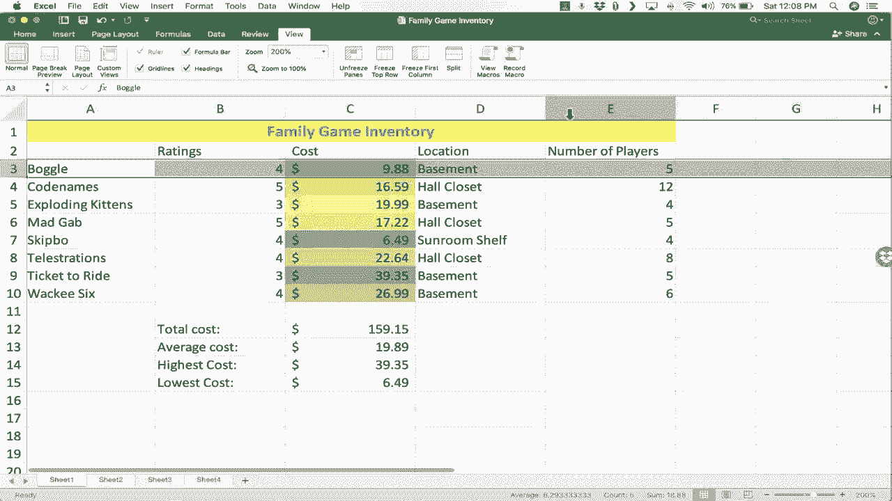

# Excel中级教程！(持续更新中) - P9：9）Excel for Mac 中级技能 - ShowMeAI - BV1uL411s7bt

在这个视频中，你将学习一些中级 Excel for Mac 技能、技巧和窍门。如果你还没有观看我之前的视频，你可能想先看那个。几个月前，我做了一个名为《Excel for Mac 初学者指南》的视频。你可能想先观看那个，然后再观看这个第二个。但在前一个视频中。

我们在我家创建了一个棋盘游戏和纸牌游戏的初步库存。在这个视频中，我们将继续学习一些精彩的额外 Excel 功能和工具。我想首先关注一些更多的格式选项。在前一个视频中，我们查看了如何格式化以合并和居中这些单元格，给这个单元格设置背景颜色并更改文本颜色。

那么我们还有什么其他格式选项呢？首先我想展示的是在左上角，我们有一个非常强大的工具叫做格式刷。它看起来像一把刷子。😊。

rush旁边有个格式这个词。这非常有用。基本上，这个工具是用来复制和粘贴特定单元格或范围的格式，而不是文本。所以例如，假设我喜欢我为这个特定单元格设置的格式。

我希望它也能应用于这些单元格到这一行。我只需点击具有我想要复制格式的单元格，然后点击格式刷，它会突出显示该单元格，然后我接下来点击的任何内容都将以相同的方式格式化。现在你会注意到发生了什么。

它不仅复制了背景颜色和文本颜色，还复制了我应用于家庭游戏库存单元格的合并和居中。所以让我们再试一个例子。假设在 A 列，我对这些优秀的纸牌游戏和棋盘游戏名称应用了一些格式。

高亮该范围，然后我将文本设置为*斜体*大小。也许我将字体类型更改为稍微不同的东西。然后我会双击这里，以确保文本适合提供的列。也许我还会更改文本本身的颜色。好的。

所以我对格式进行了一些调整。我不一定喜欢这样，但请将其视为一个示例。现在如果我想将相同的格式应用于电子表格的另一个部分，我只需点击我想要的一个好示例，点击格式刷，然后点击我希望具有相同格式的单元格。

所以我点击这里，这撤销了合并居中，并使这一整行在这种情况下与左侧的格式匹配。现在，为了明确，你可以仅用一个单元格使用格式刷来使该单元格匹配，你也可以用一个范围使用格式刷。

我将撤销所有这些，以恢复到我原来的电子表格。但格式刷在许多情况下都非常有帮助和实用。我想让你注意的下一个格式化工具是条件格式化。让我们看看它是如何工作的。对于这个例子，我将点击C列。

这突出了整个列。现在我要去顶部的条件格式化。这在主页标签的顶部。然后我点击条件格式化，弹出一堆选项，供我选择如何条件格式化这些信息。现在，他们所说的条件格式化是什么意思呢？Excel意味着它将根据特定条件格式化这些数字。

也许它根据数字的高低改变颜色，或者改变字体类型。你有很多不同的选项。在这个例子中，我只是使用颜色刻度。所以我把鼠标放在那里，有很多小图标可以查看，看看这将如何应用。

你只需看看这个，例如，这个是从深绿色到白色，可能数字越高，显示的绿色就越深。这一个是从顶部的绿色到底部的红色。所以数字越高，可能越多绿色。格式化将会是这样，而数字越低，则越红。

所以有很多不错的选项。我只会选择左上角的这个，从绿色到红色。所以我点击它。立刻，我有数字的单元格根据数字被条件格式化。数字越高，越绿；数字越低，越红。这是一个很好的格式化选项。我可以快速查看这个电子表格。

我可以看到我现在最贵的游戏是《Ticket to Ride》，而最便宜的游戏是《Skip-Bo》，它们之间有很多层次。如果你喜欢这个，我希望你看看其他一些格式化单元格或范围的选项。这里有一些😊，很棒的选择。我还有一个专门讲条件格式化的视频教程，推荐你观看。

我想对这个电子表格进行的下一个格式更改是，你会注意到这个范围涉及到成本，这些都是美元和美分，但它们只显示为小数22.64。并不明显这是一种货币。所以让我们看看如何将其格式化为货币。同样，我可以逐个格式化，但我只需点击C列。

它突出显示整个列，然后在主页标签的顶部这里。如果我来到这个区域，注意到它有一个下拉菜单，显示“常规”。这意味着这一列被格式化为常规信息。它可能是文本，也可能是数字，都是一些常规内容。但如果你想要。

你可以点击这里的下拉箭头，然后将其更改为货币格式，系统会自动添加美元符号。因此，显而易见的是，我们在C列处理中的是金钱。现在，这就是我更喜欢的方式。这是我希望看到的样子，但有些人更喜欢其他的货币格式。

他们喜欢看到会计格式。这种格式的作用是将美元符号移到左边。因此，实际数字会更容易看见，因为美元符号被移到了左侧。但无论如何，它将这些视为美元。现在，注意所有可用的其他格式。

有日期格式，还有多种显示日期的方式，时间格式，百分比，文本，这会强制将所有内容视为文本，即使它是数字。它也会被视为文本。如果你点击那里，你会看到还有更多的数字格式。这些格式化提示将帮助你让电子表格看起来符合你的期望，并突出你想要强调的信息。

接下来，我们将看看另一个中级Excel技巧或窍门，这个技巧非常实用。它被称为自动填充手柄。很多使用Excel很长时间的人甚至不知道这个自动填充手柄的存在。现在，找到这个手柄的位置并不明显。我将点击一个单元格。

自动填充手柄是你在我高亮显示的这个单元格右下角看到的小方块。你可以看到在这种情况下是深绿色方块。如果我将鼠标放在上面，我的鼠标指针会从白色的加号变成黑色的加号。这是因为我正好在自动填充手柄上。那么，自动填充手柄的作用是什么呢？

它的目的是什么？它实际上有两个作用，要么复制信息，要么扩展模式。那么让我们看看一些例子。如果我的鼠标指针正好在那个深绿色方块上。如果我点击并按住，然后向下拖动，它将复制单元格A10的内容。你可以看到，它做到了。疯狂的6，这是一款有趣的好牌游戏。

刚刚被复制粘贴到下一个单元格。现在，这样做的好处是你可以非常快速地复制粘贴，覆盖很多内容。你可以看到我刚刚复制粘贴了20次。我将撤销这个操作。但这就是自动填充手柄的一个例子，它从一个单元格复制信息到下一个单元格。现在，另外一个它可以做的事情是扩展模式。我们试试数字4。

如果我使用自动填充手柄向下拖动，看看，它只是复制了数字。为什么呢？因为数字4没有真正的模式。但如果我选择3和4。那么这里的模式是加1。如果我使用自动填充手柄，点击并按住向下拖动，看看它会怎么做。它对每个数字加1。因此，非常非常快。

我可以有一个数字列表，每次增加一个数字。我将撤销这个。但希望你能看到它是多么有用。😊，现在，如果模式是2，4，6。如果我高亮显示并扩展这个模式，看看，现在每两个数字增加一次。这里你将会有偶数。因此Excel在识别模式方面很擅长。

但只有当你向Excel展示那个模式时，你必须点击并拖动以高亮显示，以演示模式是什么。让我们用“门厅 衣橱 地下室 地下室”来试试。如果我扩展那个模式。看看，它又回到了“门厅 衣橱 地下室 地下室”。所以这些是自动填充手柄可以做的第二件事的例子，即扩展或重复一个模式。现在。

目前我给你的最后一个自动填充手柄的例子是，它在时间方面真的非常有效。因此，例如，假设我想跟踪我在不同项目上工作的时间。我将去第2个表格，稍微放大一下右下角。我将切换到B1。在这里我想跟踪周一的时间。

我希望它在顶部显示整周的星期二、星期三、星期四。然后在左侧的2处，我想开始。假设是早上6点。我喜欢早起。所以我输入了一些与时间相关的内容。让我们看看自动填充手柄如何与时间一起工作。当我选择B1并去到自动填充手柄时。

我点击并拖动，看看它自动知道该怎么做。尽管我没有给它模式，因为周一与时间有关。自动填充手柄似乎理解了，并且它有效，我可以继续到周日。让我们看看早上6点，看看它是怎么运作的。我会点击并拖动，看看它会做什么。

它会自动延长一个小时。现在，如果你想每半小时一次。我相信你能想到该怎么做。你需要向Excel展示模式。所以仅仅有6点是不够的。我还需要输入6:30，点击并拖动以高亮显示两个时间。我在这里向Excel展示并演示我想要的模式。

现在我可以去自动填充手柄，点击并按住然后向下拖动。现在每半小时的时间都粘贴到电子表格上。所以寻找使用自动填充手柄的机会。这是一个很棒的资源，并且它在月份等时间相关的事物上也很有效，或者任何有模式的情况。

或者如果你只是想复制，此时我将跳回到第1个表格。在这里，我们要开始进行你在Excel中可以做的最重要的事情之一。那就是创建公式。到目前为止我们看到的一切都不错，很有用。但我即将展示的，这才是我认为Excel真正存在的原因。

这是为了执行公式和函数。并帮助我们快速而准确地做数学运算，远比我们自己做要好。对于这个例子，假设我想创建我库存中所有游戏的总成本。

收集所有这些游戏要花我多少钱？所以我想把它加总并在这里打印出来。那就是这个单元格左边的总费用。我。😊，写上“总费用”几个字，然后放一个冒号，然后我按下 Tab 键。接下来我们看看如何在 Excel 中做到这一点。

每当你要输入一个公式时，都应该以等号开头。当我第一次学习 Excel 时，我觉得这非常令人困惑。为什么我要输入等号。然后我想起我在学校学过的有限代数。我记得很多公式，比如 x 等于 B 乘以 y 加 15 减 Z。

我可能在这里让自己显得很傻。但我记得这些公式的大致内容。这就是我们要处理的内容。我基本上在这个框中输入一个代数类型的公式。所以每当我在 Excel 中做一个公式时，我喜欢在心里说这个单元格，然后我输入等于。所以这个单元格等于。我们将看看几种方法来加总这些美元金额。

首先我们先来艰难地做一遍。这个单元格等于 26.99，加 39.35，加 22.64。给我几分钟输入其余的数字，然后我们继续视频。好的，花了我一段时间，但我输入了所有这些数字。现在我将按键盘上的回车键，看看发生了什么。首先。

它把我输入的所有带加号的数字都加起来了。这就是总和。效果很好，但请注意它影响了我的条件格式。为什么？因为现在这个数无疑是最高的，变成了绿色。我应该清除规则，然后仅用这个范围重新做一次。好的，那样好一些。但还有。

你知道，那真的太繁琐了。我必须输入每一个数字，甚至是小数点。甚至觉得这太耗时了。必须有更好的方法。确实有。这次我又对自己说，这个单元格。然后我输入等于。接着我将使用一个函数。sum 意思是加总。然后我放一个左括号。

我将输入 C，3，C3 在这里。如果你看过我之前的视频，你知道如何在 Excel 中输入 through 这个词。它是一个冒号。所以 C3 到 C10。请注意它做了什么。它恰好高亮了那个范围。现在，我想展示一个替代的方法，而不是输入数字。

你可以从键盘上抬起手，使用鼠标点击并拖动范围。如果范围比较小，比如这个，那就可以。但想象一下有成千上万的记录，可能有 5000 条。你不想点击并拖动。你想在这里输入单元格引用。所以这两种方法都值得了解。

它们都很好用。现在，在这一点上，我应该在公式末尾加一个右括号。但实际上，你并不需要这样做。所以我不打算加。我在键盘上按下回车键。它给了我相同的结果，但这次更简单、更快。现在，对于这样的求和公式，实际上还有一种更简单、更快的方法。

如果你想要最快的求和方式，有一个叫做自动求和的功能。你可以在右上角的主页标签上找到它。这里有自动求和。我只需点击那个按钮，它会自动尝试加总你所在单元格上方的所有内容。然后只需按回车，效果很好。这是最快的。我会说偶尔。

这个方法让我失望了。所以要小心。你可以看到它是否会根据高亮显示的内容来工作。它们被这条蓝线包围。这就是我想添加的内容，并且它正在工作。另一个要知道的是，你有一些可以帮助你处理公式的公式和函数工具，在左上角是公式栏。有时，当你在单元格中输入公式时，会有点难。

容易犯错误之类的事情。所以有时最好只是点击一个单元格，然后到这里的公式栏。在这里你可以更改你的公式。你可以准确输入你想要的。加总后按回车。所以公式栏是一个替代于直接在单元格中输入的工具。另一个工具就在这个公式栏的左边，我们有这个Fx。

它代表函数插入函数。如果你点击它，它会给你一个等号。然后在右边打开一个公式构建器，你可以在这些公式中搜索。所以比如说，也许我不想加总所有这些数字。我想取平均值。但也许我不知道平均数的函数是什么。所以我可以直接输入平均数。看看。

它显示了所有的平均数选项。而我想要的那个，有点棘手，但就是“平均数”这个词。我将在公式栏中输入这个。所以这个单元格等于这个范围的平均值左括号，这次我只需点击并拖动。我需要确保不包括总计，这样会影响平均值。

然后我就在键盘上按下回车键。这些精彩的桌游的平均成本就出来了。所以我在这里写下“平均数”。现在，你可能不会感到惊讶，但在这个说“自动求和”的地方，如果我点击这个箭头，实际上还有一个自动平均数。此外，还有自动最大值和最小值。但让我们看看最后两个，而不使用自动求和。

这最后两个最大值和最小值。我将在左边输入最高成本和最低成本。所以我想做一个公式来检测价格最高的游戏。我要输入最大值，这是函数。注意我输入时，它给我一些提示。但我只想要这个范围的最大值，按回车。这是最高的。现在我们来做最小值。

所以等于最小左括号相同范围，按回车，那里就是最便宜的。这种公式构建器真的可以帮助你。如果你知道自己想要实现什么，但不知道该使用什么函数，可以搜索， chances are你会找到你想要的。然后你可以点击它。

然后它会给你一个解释、定义，有时还有一个例子。你甚至可以获得更多关于该函数的帮助。好吧，最后在这个视频中，我想给你一个关于三个高级技巧的概览。这些都是快速的。第一个是可以对你的电子表格进行排序。

你会注意到这些游戏几乎是按字母顺序排列的。是的，看来确实如此。但也许你想要反向字母顺序。你只需点击第一个记录的第一个单元格，去首页选项卡，选择排序和过滤。我可以点击它，从Z到A排序。

注意，它不仅排序了A列，还把所有数据一起排序，所以那款奇怪的6仍然显示为四星。我将撤销这一操作。你还可以按数字排序。所以如果我在这里点击，进行从小到大的排序。现在是从最便宜的游戏到最贵的游戏。所以排序太棒了，非常有用。😊

你也可以过滤。过滤的方法是选择你想应用过滤的行或列，然后点击排序和过滤按钮。这次选择过滤，这会在你选择的行或列的单元格中添加这些小箭头。

现在我可以点击这个箭头，对自己说，我不想看到所有这些游戏。我只想看五星游戏。所以我点击五。现在过滤器完成了，看看我的1012款游戏的列表现在变成了两个。现在，如果我有1000款游戏，而不是也许10款的电子表格，那将更有用。

更重要的是，这是一种专注于仅具有共同点记录的方法。当然，你可以说是四星和五星的游戏。所以由你来决定过滤中包含什么，不包含什么。我还可以根据存储地点进行过滤。使用过滤器的一个缺点是，有时你可能会忘记移除过滤器，这样会让你觉得丢失了数据。

所以重要的是要记得把这些恢复。如果你不再需要过滤器，你只需突出显示文本，前往排序和过滤，然后取消过滤。好吧，我最后一个提示与你处理大型电子表格有关。这个电子表格非常小且易于管理，但假设我有一千个游戏。当我浏览页面以添加另一个游戏时。

我会很难记住第C列代表什么，这是什么意思，我在第D列填什么。所以有一个小技巧可以使用，叫做冻结窗格。应用冻结窗格的方法是，你在想要冻结的项目正下方点击行或列。如果我想冻结第1行和第2行，这样无论我在电子表格中向下滚动多远，我都能始终看到它们，因为我想冻结第1行和第2行。

我将去到第3行，点击它以突出显示。然后我会去查看，那里有查看选项卡，还有冻结窗格。所以我点击了它。现在它已经冻结了第1行和第2行。无论我在电子表格中向下滚动多远，我都可以看到第1行和第2行。所以在这个教程中，我们看了一些中级技能、提示和技巧。

包括格式化自动填充手柄的公式和函数。我还添加了一些高级项目，比如排序、过滤和冻结窗格。我希望你觉得这个视频对你有帮助，如果你觉得不错，请点击下面的点赞按钮！
