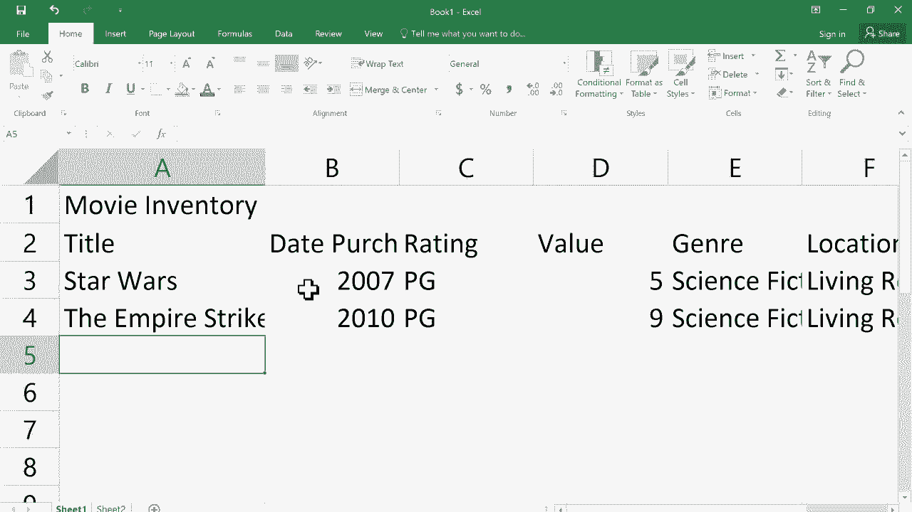
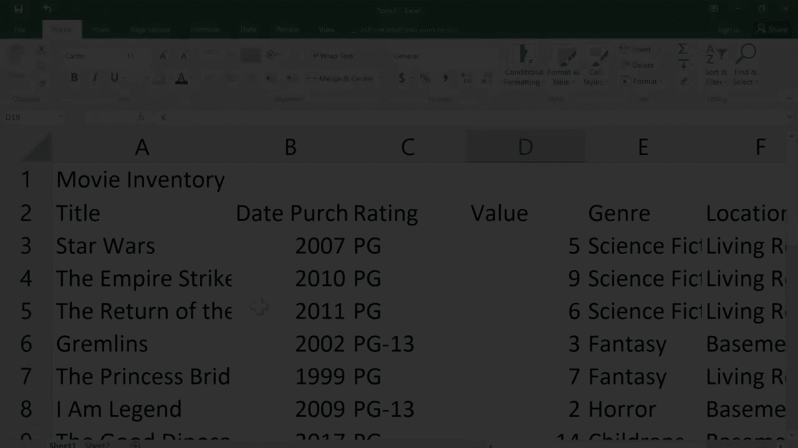
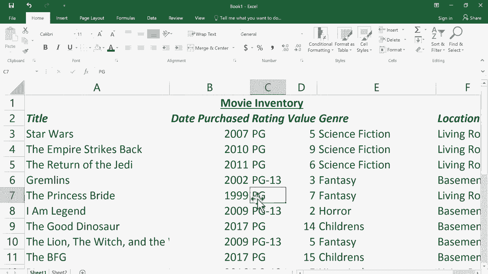

# Excel正确打开方式！提效技巧大合集！(持续更新中) - P1：1）Excel基础教程 - ShowMeAI - BV1Jg411F7cS

欢迎观看这个Excel基础视频教程。在本教程中，我将向您展示开始使用Microsoft Excel所需了解的大部分基础知识。我要使用的Excel版本是Windows上的Excel 2016。也就是说，如果您使用的是不同版本的Excel。

也许是旧版本或更高版本，或者如果您在Mac上使用Excel，可能会有一些细微的差别。但大多数情况下，我会说我在本教程中展示的95%内容都适用于您和您的Excel使用。因此，我只需点击这里的图标开始使用Excel，而Excel现在希望我做出选择。

它想知道我是否想打开一个Excel模板，或者只是打开一个空白工作簿。您可以看到有很多模板可以选择。这是一个Excel欢迎之旅。这是学习Excel一些基础知识的好方法。但这正是您观看我视频的原因。因此，我将跳过这一部分。有一个现金流分析。

😊。

这里有电子邮件洞察、股票符号、销售发票。这里有一个预算。这里是一个家庭预算。您可以打开各种优秀的Excel电子表格，开始更改数据，以此方式使用。因此，我鼓励您浏览并探索这些可用模板，此外还有大约30个模板可供您使用。还有一个选项可以在线搜索模板。所以我将搜索“预算”，您可以看到它会显示更多预算。

您不仅限于一个家庭预算。右侧还有很多您可以选择的内容。有分类可供您筛选，您可以选择特定的预算或电子表格模板。

如果您找到一个想要使用的模板，只需点击它，然后点击创建，它将作为电子表格复制，以便您在Excel中打开和使用。因此，请花些时间探索可用的内容，在许多情况下，很多工作已经为您完成。您可以简单地使用他人的模板并根据您的需求进行调整。现在，模板非常有用。但话虽如此。

我认为为了真正全面且正确地学习如何使用Excel，最好是从一个空白工作簿开始。所以我只需双击它以选择一个空白工作簿并打开它。我们需要做的第一件事是了解Excel 2016中的布局。有一些术语是您需要知道的。首先，在顶部。

我们有一些选项卡。我们有主页选项卡、插入选项卡、页面布局和更多。如你所见，这些选项卡都非常重要。当你点击某个特定选项卡时，它会打开一个功能区。这是主页选项卡的功能区。如果我点击页面布局选项卡，我会看到页面布局功能区。现在，每个功能区被划分为多个组。所以你可以看到。

我有一个主题组，一个页面设置组，还有一个缩放适应组。这些都在页面布局功能区中。我通过点击页面布局选项卡进入这个功能区。所以这些是你需要了解的一些重要术语，功能区组，你会注意到在某些组的角落里，有一个我喜欢称之为启动按钮的东西。因此，缩放适应组的角落里有一个小启动按钮。

工作表选项组的角落里有一个启动按钮。排列组似乎没有一个。那这些启动按钮是什么呢？基本上，你可以点击这些启动按钮来获取更多选项。因此，微软在这里所做的是，他们尝试将所有页面布局选项都放在这个功能区中。但当然，他们的空间有限。

他们的工作空间有限。因此，有时候他们能在那个小组里放下所有内容，有时候又不能。如果放不下，就有一个可以点击的启动按钮来获取更多选项。所以这就是为什么有些有启动按钮，有些没有。好的。

我认为从这些术语开始是重要的，因为我会在整个教程中使用这些术语。好吧，还有一些其他的布局术语，你需要在电子表格中了解。这是电子表格，电子表格由列和行组成。好的。所以你可以看到我们有A列、B列、C列等等。如果我向右浏览。

好吧，你可以看到还有更多的内容。如果需要，它会继续向右添加更多列。好的，一旦到达Z，它会转到AA列、AA。所以这个电子表格里有很多很多列。现在，行呢，我有第一行、第二行、第三行。好的。

电子表格由列和行组成。列和行的交集形成了一个单元格。这就是一个单元格。Excel中的每个单元格都有一个名称。好的，这个特定的单元格被命名为C2，你可以想象我是如何得出这个名字的。这只是列和行的交集。这个特定的单元格被命名为。

它是M9。这是I16。现在，这可能看起来显而易见且不重要，但实际上每个Excel单元格都有一个名称，这一点非常令人兴奋和强大。因为它有一个名称，你可以描述它，并且可以让Excel对每个单元格中的内容执行某些操作。我们稍后会讨论这一点。好吧，现在，除了列、行和单元格之外。

电子表格中还有另一个你需要了解的部分，那就是范围。好吧，现在，范围是一组相邻的单元格。😊，一个范围可以是这个，也可以是这个，或者这个。它可以是任何数量的东西。基本上是一组相邻的单元格。你知道吗。

范围也可以命名，就像单元格一样。所以就像这个命名为L7，我也可以给这个命名。好吧，命名范围的方法是从左上角开始，命名左上角的单元格。所以这是L7，然后你说“到”。所以L7到，然后你说右下角单元格的名称，N12。所以L7到N12。

这就是这个范围的名称。现在，在你脑海中记住这个信息。写这个范围的名称的方法是，你会写L7到，表示“到”的符号是冒号。然后你会写12，这就是你在这里看到的范围名称的写法。好吧，我要按下Escape键退出，因为我并不想在单元格中输入它。

所以这是一些你需要了解的背景信息，以便真正正确地使用Excel。现在我们已经讨论了功能区、标签、分组等的布局，以及包含列、行、单元格和范围的电子表格。实际上，我应该再加几条。你可以看到这一切都在一个工作表上，即工作表1。

我可以添加工作表2、工作表3等。所有这些工作表加在一起构成一本工作簿。所以工作表或电子表格加起来就是一本工作簿。好吧，现在我们有了所有这些作为我们使用Excel的基础。让我们开始实际创建和处理一个Excel电子表格。

现在为了让你更有趣地观看，我要放大一点。所以我将使用右下角的滑块。我会单击并拖动以放大我的电子表格，这样你就能更容易看到。现在我要单击a1。并且。😊。

在这个a1单元格中有一些数据。作为一个例子，假设我想用Excel来创建我的电影收藏的清单。好吧，这可以是任何东西。如果你是一名教师，也许这是你借给学生的用品，或者如果你是一名学校的秘书。假设你负责记录学校的用品。不管是什么。

但假设我想做一个我拥有的电影清单。首先我想做的可能是在里面放一个小标题。所以我会在a1输入“电影清单”。你会注意到我的文本比单元格本身大，超出了右边界。但你知道吗，没关系。

只需在键盘上按 enter 或 return。 我已经成功将我的第一条数据输入到这个电子表格中。 现在，看起来这些字。 电影库存正在从 A1 溢出到 B1。 但实际上，这并不是真的。 这是一种错觉。 这两个词都存储在 A1 中。 如果我点击 B1，我可以在 B1 中输入，然后按 return 或 enter，你会注意到电影库存仍然存储在 A1 中。

好吧，它们并不相互作用，也不干扰。 所以不必担心你的文本太宽，无法适应 A1。 但是这么说，有时候让你的电子表格看起来更美观，实际上会帮助你更好地使用它。 所以我们来讨论一下我可以怎么解决这个。 这并不是真正的问题。

但如果我想让它看起来更好，我该怎么做呢？ 好吧，我可以拉伸任何列，甚至任何行，只需把鼠标放在任意两个列字母之间。 所以这是 A 列，B 列，把我的鼠标放在这两者之间的线附近。 你会注意到我的鼠标光标变成了双向箭头。 这可是个好兆头。

现在我可以点击并拖动，拉伸它以使其更宽。 现在，你可能注意到当我将电影库存输入那个单元格并按 enter 或 return 时，它会自动让我向下移动。 当你按 enter 或 return 时，你会向下移动电子表格。 如果你想向上移动电子表格，可以按住 shift。

然后按 enter 或 return，它会向上移动。 所以 shift enter 或 shift return 向上移动。 enter 或 return 向下移动。 现在，如果你想向右移动怎么办？ 也许我想在 B1 中输入一些内容。 我会做的是按制表键。 制表键让你向右移动。 所以我可以在那儿输入更多文本，然后按制表键，再在那儿输入更多文本。

然后继续按制表键。 如果你想向左移动怎么办？ 我敢打赌你可以猜到。 你需要按住 shift 然后按制表键。 所以 shift 基本上是用来做相反的事情。 所以 enter，return 通常是向下。 但是 shift enter return 是向上。 T 是向右。 shift tab 是向左。 另一种在电子表格中导航的方法是使用键盘上的箭头。

如果你找到上下、左右的箭头，你可以使用它们向上、向下、向左或向右移动。 这比使用 enter 或 shift enter 更笨拙，但这是另一个选择。 当然，你也可以用鼠标点击你想去的地方。 但我告诉你，如果你能学会仅用键盘而不太依赖鼠标来使用 Excel。

这对你来说会好很多。 所以我在里面有我的标题。 现在我要点击 A2。 我要输入单词标题。 这就是我放置电影标题的地方。 现在我会按制表键向右移动。 我会输入日期，购买，再按制表键，评分，再按制表键，值，再按制表键。

类别和标签再次定位。这将为我的电影库存存储相当多的信息。好的，在最后一个输入后，当我按下回车，它让我向下移动并向左移动，期待我输入第一条记录。第一条记录将是第一部电影。所以我们假设我输入《星球大战》。

我可以按Tab键向右移动。我可以说，我在2007年购买了它。它的评级是PG。价值大约5美元，是科幻类，并且位于客厅。好的，这就是数据输入的一个例子。你可以通过点击单元格或以其他方式进入单元格来输入数据，然后按Tab键向右移动或按回车键向下移动。现在，作为另一个例子，我将输入另一个记录。

我会在这里输入一些其他信息。在这一点上，假设我注意到了一个拼写错误。我想修正它。你会注意到我拼错了“帝国”。如果我点击单元格A4来尝试修复它，注意会发生什么。一旦我开始输入，它就会删除原有的内容。

这样做的原因是，当我点击那个单元格时，你点击单元格时，你输入的任何内容都会替换原来的内容。它删除原有内容，然后用你输入的替换。所以我需要告诉你一个区别。站在单元格上和进入单元格之间有区别。

你必须双击它。注意我双击那个单元格时发生了什么。它实际上让我跳进了单元格。现在我有一个闪烁的光标。我可以点击或使用箭头键将光标移动到我想要的位置。所以站在单元格上和进入单元格之间存在很大的区别。在这种情况下。

我不想停留在单元格上。我不想替换该单元格中的所有文本。我想快速双击两下。现在我已经进入了它，我有了光标，可以把它移动到我想要的位置。修复它们。再次按回车。这似乎是一个非常小的、不重要的事情，但Excel就是关注细节。

所有这些小细节真的会增强你对Excel的使用体验。所以请跟着我，注意这些细节。我保证你对Excel的使用将更加令人满意和高效。现在，给我几分钟时间再录入一些记录，然后我会继续教程。

好吧，我已经完成了一些电影的录入，它们被称为记录。每一行都包含一条记录。为了帮助你更好地看到这个，我将稍微缩小一下视图。你可以看到我这里录入了相当多的电影。接下来，我们需要稍微装饰一下，使其看起来更好。

在这一点上，这看起来并不太对我们的眼睛。那么我们可以做些什么来使它看起来更好呢？首先，在顶部，我这个电子表格的标题有点偏向一边，而且没有什么使它突出并看起来不同的东西。

所以我将点击这个单元格。我将点击上面主页选项卡和主页功能区的部分。我可以点击粗体，使其看起来更粗。这样会帮助它脱颖而出。注意，我也可以使用油漆桶工具给这个单元格的背景上色。我可能想，也可能不想这样做。在这种情况下。😊我不一定想要这样。

所以我将点击旁边的箭头。然后我将选择无填充。我也可以改变文本本身的颜色。好的，这也是一个选择。我将返回黑色。在这种情况下。此外，我可以使用斜体或下划线。这些都是不错的选择。但这会帮助文本稍微突出一点。

另一个我可以做的是点击单元格 A1 并拖动。我仍然按住鼠标点击。我将拖动，直到覆盖我电子表格的所有内容。所以电子表格的内容结束于 F 列。我在那之后没有任何东西。所以我只是点击并拖动到最右边。现在。

看我在主页选项卡的主页功能区上能做什么。这里有一个在对齐组中叫做合并和居中的按钮。如果我点击它，看看它做了什么，它合并了所有这些单元格。所以现在这是一个大单元格。并且它居中了。所以合并和居中非常有助于我刚才所做的，基本上打破这些单元格之间的墙，使其成为一个大单元格，然后居中。看起来好多了。其他事情，正如我之前所说。

文本不完全适合单元格有点困扰我。所以我可以像之前展示的那样，上面点击并拖动以确保一切适合。但是我想让你看到一个快捷方式。做这个有一个快捷方式。你只需在上面，任何两个列字母之间双击。

如果你这样做，看看会发生什么。它会自动完美地调整列的大小，以便所有文本都适合。我也可以为购买日期和评分这样做。现在，注意在这种情况下，评分列实际上变窄了。因为它不需要比现在更长。所以我可以对值等等这样做。现在让我给你展示另一个省时的小技巧。

而不是在列之间双击。每一列一次一个地查看我能做什么。点击并拖动列字母一直到我的数据末尾，然后在任何两个字母之间双击。这没有关系，双击哪个都行。现在注意，它自动调整了每一列的大小。我所选择的每一列都受到这个双击的影响。

现在的大小刚好适合那些单元格中的内容。如果我使用这个滑块向左浏览，你可以看到一切都被完美调整了。所以我用了一句话，我说每一个被选中的内容，所有被选中的列都受到我在Excel中所做的操作的影响。

这句很不错，值得思考一下，选择以产生效果。如果你想要产生效果，首先必须选择它。再来一个小技巧，当你点击并拖动那些列标题时。是的，调整大小的最快方法是双击任意两个列字母之间。

你也可以选择点击并拖动，看看会发生什么。我将调整这一列的大小，放开，看看每一列都受到了影响，因为我已选择每一列。它们都受到了影响，宽度完全相同。所以希望这些小技巧能帮助你以对你最有意义的方式调整列大小。

目的是让你的数据看起来不错，因为看起来好时，通常更容易阅读、理解和领会。现在，有时确实有充分理由保持列狭窄，即使所有文本无法完全显示。因此，你不必总是确保所有内容始终可见。

但我希望你在需要时能做到这一点。好吧，接下来。我想在电影库存上点击并下划线，将其作为标题区分开。然后在这里，我想让所有这些列名称不同。所以我会高亮它们，然后上去把它们设置为**粗体**，并且让我们说*斜体*。现在。

我做到这一点的速度很快，你可能没有注意到。我只是点击了行号，整个行被高亮显示到右侧。因此，它被选中了。然后为了产生效果，我选择了**粗体**和*斜体*。这影响了所有被选中的内容。所以到目前为止，我希望你已经熟悉Excel中不同布局的名称。

我们知道如何称呼不同的元素，比如标签、组、功能区等。我们也了解列、行、单元格、范围、工作表和工作簿。我们知道如何输入数据，然后选择它以产生效果，改变其在屏幕上的显示方式。我们还知道如何调整列宽。我并没有明确展示这一点。

所以让我快速演示一下。注意你也可以影响行。因此，我可以让行比原本更高。我可以在它们之间双击来完美调整大小。我可以通过选择多个行来一次性影响多个行。

所以我之前展示的关于列的所有技术也可以用于行。在我看来，这一切都给你提供了良好的基础。它帮助你理解使用Excel的基础知识。在未来的视频中，我将向你展示一些中级的Excel技巧和窍门。

在构建电子表格时，有一些方法可以节省时间和精力。我们还会深入讨论公式和函数，这实际上是Excel强大之处所在。我还会分享一些高级Excel技巧和窍门。请期待那个未来的视频。感谢观看这个Excel基础视频。

我希望你喜欢它。请考虑订阅我的YouTube频道，以获取更多关于教师和学生技术的视频，并每周一至少观看一个新视频。😊。
