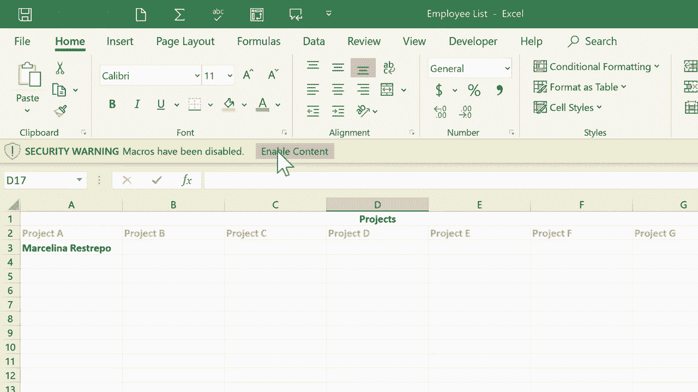

# 【双语字幕+速查表下载】Excel正确打开方式！提效技巧大合集！(持续更新中) - P11：11）创建 Excel 快捷方式 - ShowMeAI - BV1Jg411F7cS

这是 Excel 宏的初学者指南。如何使用宏为你在 Excel 中需要完成的任务创建快捷方式。我将用来作为这个示例的电子表格是一个员工列表。你可以看到这里有几个假设小企业的员工列表。

这包含了一些关于他们的信息，比如他们的入职日期、员工 ID 和他们所在的团队。在这个项目标签页上，我有一个我希望分配给这些员工的一些项目列表，以便他们可以进行工作。因此，我将来回切换第一个标签页和第二个标签页。当然，我可以通过点击标签页在这里轻松做到这一点。

但我们来创建一个宏，让这变得稍微简单方便一些。我希望最终得到的是一个按钮，可能就在这里，当我点击这个按钮时，它会带我到第二个标签页。这个工作簿中的第二个表格。那么，我该怎么做呢？我只需去开发者标签页。如果你没有看到开发者标签页。

你可能需要在功能区上右键点击并选择自定义功能区，确保开发者选项被包含在这里。不过，我还是会去开发者标签页并点击它，功能区会随之改变以匹配。左侧有一些与宏相关的选项。在这个初学者指南中。

我们基本上会坚持使用记录宏和这个宏按钮。所以在这种情况下，我将点击记录宏。它会打开一个小向导，我可以用来创建这个宏。默认情况下，它将这个宏命名为宏 5，因为在过去，我在这个电子表格中创建了一些其他宏。所以我将重命名它。

我将这个按钮命名为“项目标签”。接下来，我需要为这个宏建立一个快捷键，一个键盘快捷键。现在，如果你考虑一下，你会发现这里需要小心。因为已经有 R 的键盘快捷键。我们有控制 X、控制 Z 和控制 C。这些已经是键盘快捷键。因此，我不想在这里放控制 C。

这样做会是个错误，因为控制 C 已经是复制的功能。所以实际上在这个框中放两个键是个好主意。所以我将按住 Shift 并敲击 A。因此控制 Shift A 现在是我为这个即将创建的宏预留的键盘快捷键。它将存储在这个工作簿中。

这意味着我在这里拥有的电子表格集合。现在，只有两个电子表格，但我可以添加另一个、再一个。它们都是同一个工作簿的一部分。我想把这个宏存储在这个工作簿中。还有其他选项，但我们就坚持这个。接下来。

如果我想，我可以描述这个宏。我想我会这样做。所以给我一分钟来输入描述，然后我会继续录制。那是我非常详细的描述，我点击确定。然后我收到了一个错误消息。我想让你看到这个，以便你知道宏标题中不能有空格。

现在，当我点击确定时，它应该会接受它。它确实接受了。现在，注意左上角。现在它说停止录制。它并没有说录制宏。所以它当前正在录制我在 Excel 中所做的事情，但重要的是要意识到它并没有记录时间的流逝。因此，我可以在这里思考我将如何处理这个宏。我正在录制。

我可以思考 10 分钟、1 小时、10 天，无论我想做什么。没关系，因为这不是录制时间。它也没有记录我鼠标指针的位置。我可以随意移动鼠标。这些都不会被记录。记录的只有我点击的位置、选项、设置以及我在 Excel 中更改的内容。

好的，我想要它记录什么呢。我想要它记录我从员工电子表格切换到项目电子表格的过程。所以我只需点击项目。这就是我想要记录的全部内容。所以我点击停止录制。那个宏已经成功录制了。现在，我要跳回到员工电子表格，看看我创建的宏。

如果我在宏上点击，这应该会列出此工作簿中所有的宏。按钮位于项目选项卡。既然我在这里，我想让你注意我刚才选择的宏选项。它确实让你删除不想使用的宏，还有一些其他选项。好吧，我现在就取消这个。现在是我创建按钮并将其链接到那个宏的时候了。

所以在开发者选项卡上，我将下拉到插入，然后点击。这将弹出一些表单控件。在之前的教程中，我展示了如何在 Excel 中创建滚动条并使用它。如果你还没看过那个视频，我希望你能回去看看。在这个教程中。

我们将使用另一个表单控件，那就是按钮。所以我将点击按钮选项。注意我的鼠标指针发生了什么。😊，它变成了十字准星，基本上变成了一个加号。这是一个可以在屏幕上绘制某些东西的标志。因此，我将点击并拖动来绘制一个按钮，我可以将其做得尽可能大或尽可能小，尺寸和一切都由我决定。

我想我会选择大约那个大小。当我松开鼠标按钮时，它弹出这个窗口让我选择要链接到我创建的按钮的宏。目前，实际上只有一个选项。所以我点击项目选项卡的按钮，点击确定。我的按钮已经创建。如果我双击按钮的文本。

有时候只需点击一次。我可以更改按钮上的文本。所以我会输入项目。好的，现在我点击按钮测试一下。我会右键单击按钮。看看它做了什么。它立即执行了我使用录制宏创建的宏。

它存储在宏列表中。😊当我点击按钮时，它把我带到了这里。现在我在这里，我可以给一个项目添加某个人。我的好朋友Marcellina Resrepo怎么样？我把她放在项目A上。现在我强烈建议，如果你要创建这样的按钮，从一个电子表格转到另一个电子表格，最好在第二个电子表格上创建一个按钮，带你返回第一个电子表格。

所以很快，我要这样做，我会点击开发者录制宏。我会叫它返回员工表。我会给它一个快捷键。这次我跳过描述。我点击O，宏现在已经命名，准备录制了。这次我会点击员工。我录制完成了。我点击停止。

然后我回到项目表创建我的表单控制按钮。😊接着在这个弹出窗口中，我需要确保选择正确的，返回员工表，点击O。也许点击并拖动以突出button1。我就叫它返回。现在，当你在按钮上工作时，如果你点击按钮外面，下次再点击它。

它就会工作。它会执行它应该做的事情。那么我该如何编辑这个按钮呢？如果我对它的形状或位置感到后悔呢？我不能点击并拖动。所以诀窍是右键单击按钮。如果你右键单击它，它会被选中。然后你可以点击其他地方，再点击按钮来移动它或调整其大小。如果你想的话。

你可以剪切或执行其他操作。所以到目前为止，我有两个按钮，一个带我去我的项目列表，另一个让我返回员工列表。现在，这只是一个宏。如果你想想，我还可以录制其他几个步骤。

你可以创建多个动作的宏，当你执行宏时这些动作会发生。但我选择从这些简单的按钮开始，它们只是从一个工作表切换到下一个。让我们再看一个例子。假设我是这家公司的老板，是时候对所有员工进行绩效评估了。

也许我想跟踪我已经进行评估的人员和下一个待评估的人员。在工作表中展示这一点的一种方法是使用颜色。假设我和老朋友M Rerepo进行了评估。我可以点击并拖动以突出整个行，或者如果我更喜欢，只突出她的名字。然后在主页选项卡上，我可以更改文本颜色或设置背景颜色。

也许我会说蓝色表示我们已经进行了审查。这是一个方法。但现在，让我向你展示如何将其做成宏。这样我可以点击某个人的名字，点击一个按钮，自动为那个人的名字应用正确的颜色。为此，我会创建一个宏。首先，我想做的是点击空白的电子表格部分。

然后我会去开发者选项卡，点击录制宏。我将为此命名，标记为已审阅。快捷键，我将设置为控制加shift加C，然后我点击，哦，正在录制。现在，你会认为我想点击这里选择Gina Pullulin或Regia Loftus，或者其他这些优秀的人。但是相反，我故意保持这个单元格的选中状态。

我只是要去“主页”选项卡，主页功能区。然后我选择这个蓝色背景色。它只是给那个单元格上了色。现在我回到开发者选项卡，点击停止录制。为什么我保持这个单元格选中状态呢？原因是，如果我点击选择Gina Pullulin或Regia Loftus或任何其他人。然后每次执行宏时，那特定的单元格，假设在这种情况下是单元格A6。

本来应该变成蓝色，但只有这个单元格。原因是，在开始录制宏后我会点击它。但我实际做的方式是，我先点击了这里，然后我录制了宏，没有点击其他任何东西。因此，Excel的解释是，哦。

他没有点击任何东西。因此，所选的内容将变成蓝色，而不是任何特定的单元格。现在，有时你会希望它是一个特定的单元格。在这种情况下，录制宏后，点击你想要变蓝的内容，或者宏所做的任何事情。哦，让我们创建一个按钮，看看是否有效。因此，我将去开发者选项卡插入一个表单控件按钮。

我会点击并拖动以在屏幕上绘制它。我只需点击“标记为已审阅”，点击“哦”，这是我的按钮。在我忘记它的含义之前，我最好在按钮本身上更改名称。我将点击按钮外的地方。假设Jimmy Kinslow和我有一个很好的审查，我可以点击。名字点击已审阅。

它立刻将他的名字高亮为我想要的确切蓝色。所以我不需要猜测并尝试记住这些是哪个。我可以简单地点击选择，然后点击已审阅，它就会改变颜色。现在，如果我想让整行变成蓝色。比如，假设这是Salw Cordew。

我可以点击并拖动以突出显示整行，然后点击已审阅。现在，整个内容都变成蓝色。当然，在这一点上，我可以创建另一个宏，如果下一个需要审查的人的名字或任何其他选定的内容变成黄色。所以我希望这些例子能给你一些关于如何使用宏的想法。

你可以为许多不同的事情制作宏，然后创建一个链接到宏的表单控件按钮，这确实可以节省你很多时间和精力。它可以帮助你轻松快速地在工作表之间跳转。当然，在这个特定的工作簿中，只有两个工作表，想象一下如果我有10个或20个工作表，会很难准确点击我需要去的标签。因此，拥有一个按钮将你带到一个特别重要的标签或工作表，确实可以为你节省时间。假设此时。

我在这个Excel电子表格中创建宏已经完成。在将宏构建到电子表格中时，你必须采取一个重要步骤，那就是去左上角的文件，点击并选择另存为，因为这个电子表格中有宏。

非常重要的是，我需要去这里，点击这个下拉箭头，并将其从仅Excel工作簿更改为Excel启用宏的工作簿。如果不这样做，将来是无法使用的。所以我会点击保存。那么现在让我们试一下，看它是否有效。假设明天。

我需要再次处理那个电子表格，我可以直接打开。

在我最近使用的电子表格列表中，那里有一个。注意后缀以M结尾。通常在Microsoft Excel中，后缀以S或X结尾。但在这种情况下，它是X，L S M，表示启用宏。现在，看看我双击打开它时发生了什么，因为这个电子表格中有宏。

至少在你第一次打开时，可能会收到安全警告。宏已被禁用。因此，为了使用它们，我必须点击启用内容。现在，我的宏应该可以工作，而它确实可以。

感谢观看。我希望你发现这个教程对你有帮助。如果你觉得有用，请点击下面的点赞按钮。
