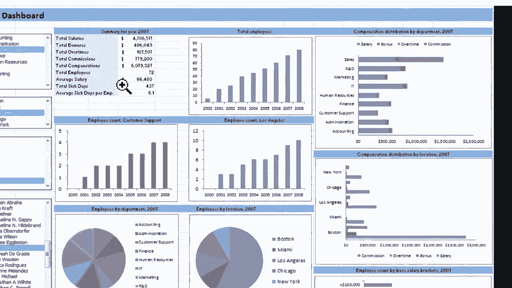
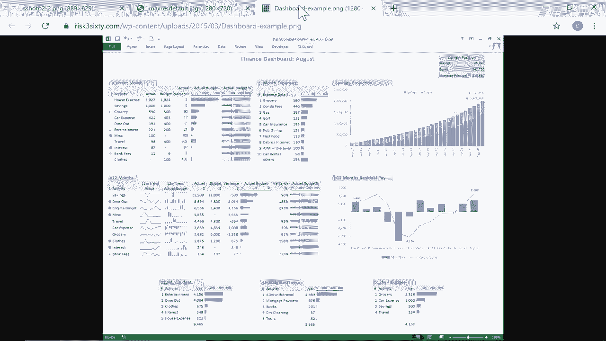

# 【双语字幕+速查表下载】Excel正确打开方式！提效技巧大合集！(持续更新中) - P12：12）仪表板初学者指南 - ShowMeAI - BV1Jg411F7cS

这是为你的 Excel 工作簿创建仪表板的初学者指南。什么是仪表板？我可以给你几个例子。这里是一个仪表板的例子。现在，这是一个漂亮而复杂的仪表板。这不是我在这个视频中要展示的内容。

我们将从基础开始，如何开始创建仪表板。但你可以看到这里有一年的总结。这是在仪表板上显示的数据，但这些数据实际上来自另一个电子表格，或者在某些情况下，来自另一个工作簿。

这里是一个图表，一个饼图，还有一些图形等。同样，这个仪表板中显示的所有数据都来自一个电子表格。一般来说，电子表格看起来复杂得多。数据杂乱无章，但仪表板让你专注于特定的数据和指标。

你想看看这里的另一个例子。这一个显示各州的销售总额和趋势。当然，在 Excel 中，你可以创建这样的东西。只需在常规电子表格上书写。但有了仪表板，它看起来更美观，可以将图表、图形和最重要的数据从你通常使用的常规电子表格中提取出来，单独放在一个电子表格上。

这是第三个例子。因此，这些都是非常高级、复杂的例子。但现在，让我们看看开始创建你自己的 Excel 仪表板的基础。在这里，我有一个复杂的大型财务数据电子表格。这里有成百上千行的数据，成百上千的记录，还有很多很多的信息。

还注意到右侧列出了过去几年的数据。所以我们有2018、2019和2020年。

所以这是一堆信息。我怎么知道我在看什么？我怎么知道什么是重要的？好吧，如果我知道如何创建电子表格，知道如何阅读电子表格，我当然可以通过关注我所看到的来获取这些信息。但有时我们需要简化事情。所以在左下角这里。

我想在这种情况下设置一个第四个电子表格，一个新的工作表。所以我会点击加号，它自动叫它sheet4。但我将双击该名称并将其更改为dashboard。现在，如果你愿意，可以叫它其他名字。我会在键盘上按下回车键，这就是我的第四个电子表格。我将它移到前面。

这将是我的仪表板。现在，创建仪表板时，最好规划一下您将要在仪表板上显示的内容。也许在左上角，我想要一份年度总销售额的清单。也许在这里，我想显示平均价格或其他什么。所以规划一下是个好主意。

有时在纸上做图是有帮助的，或者您可以节省一些时间，直接在Excel中完成。这就是我在这个教程中要做的。所以我想要做的是上去插入。而设置仪表板的最简单方法之一就是使用一些简单的形状。对我来说，形状隐藏在插图下。所以对您来说。

只需查找您的插图组。您应该能看到它。然后我会进入形状部分。这里有很多我可以使用的形状。😊我会使用矩形，但可能是那种带有圆角的形状。所以我就点击并拖动来设置一个形状。好的，我想要我的当前耳朵。

假设2020年的总销售额出现在这里。我希望它在这个蓝色框中出现。现在我可以点击这个框，我可以输入。我可以输入文本。我可以输入数字。我可以搞清楚2020年的总销售额是多少，然后直接输入进去。但这并没有什么特别的，对吧。

随着更多项目的销售，它不会自动更新。所以让我们看看如何让它自动更新并与实际数据同步。所以我会删除我放在那里的数字。这个技巧是点击形状，使其出现在这里，然后将形状链接到相关数据。您只需选择形状，然后在公式栏中输入等号。

所以这个形状等于。然后点击2020。我想要总销售额。所以我会一直向下滚动到底部，数据量相当大。所以让我快速给你演示一个技巧。如果我在总销售额这里点击，甚至在标题上我可以按住控制键，然后按下箭头。

这应该让我直接到达电子表格的底部。好的，看看这里有总计。所以我可以点击我想使用的确切单元格。然后在这里，看看我的光标在闪烁。这就是我现在正在处理的内容。所以我在键盘上按下回车，看看，它已经将这个形状与这个电子表格上的数据链接起来。

好的，所以你可以看到它以598.5598.5结束。现在回到仪表板上。我可以通过点击它来让它看起来更好，我可以调整字体大小，把它变大。也许这太大了。好吧，我可以决定是否要居中，这样做是我想要的。我可以水平和垂直居中。我觉得这样看起来好多了。

我还可以到字体颜色这里，选择黑色以外的颜色。 我可以选择白色。 我觉得那看起来不错。 也可以选择黄色。 任何这些颜色都可以让它看起来更好一些。 让它更醒目，这样人们喜欢看它。 你还可以更改形状的背景色或填充色。

所以调整字体和形状填充颜色，以找到最适合你的样子。 现在。 你可能会想这只是外观上的修饰。 这没那么重要。 你可能是对的。 但实际上，这就是仪表板的整个意义，让它看起来漂亮，吸引人，并便于人们访问和阅读他们所寻找的信息。 好吧，现在我有了这个形状，并且它与这个电子表格上的数据相链接。 现在。

让我们看看如果数据在下方表格中发生变化会怎样。 这里我们有5061。 如果那变成25065呢？ 当我输入该数据时，它会改变这里的总数。 仪表板是否会更新？ 是的，会。 仪表板应该始终与其链接的数据相匹配。 现在，我确实有一个小问题。 那就是我不太确定这个数字是什么意思。

我可以用几种方式来解决这个问题。 我可以去插入并添加一个文本框。 所以我可以点击这里的文本框，然后点击并输入总毛销售额。 我可以点击并拖动，把它放在同一个框里，然后加粗字体，可能还要增大字体大小。 而且，当谈到仪表板时。

我们所做的很多事情都是让外观更好看。 我觉得这看起来真的很不错。 现在，如果我决定稍后把它移到其他地方呢？ 我可以点击并拖动来移动它。 但看看，这两个项目，文本框和带数字的形状，并没有真正连接在一起。 它们并没有真正链接在一起，这可能会是个问题。

你可以尝试点击形状，按住控制键并点击文本框来解决这个问题。 现在它们都被选中了，然后去页面布局选项卡中的排列组。 有一个选项可以对对象进行分组。 我只需点击那个分组。 现在它们就像一个对象一样运作。

现在我可以很轻松地移动仪表板上的元素，并将它们放在我想要的位置。 这只是创建仪表板开端的一种方式。 还有许多其他选项可以选择。 而不是把它的标题放在框内，我可以插入另一个形状，让它出现在这里。 所以也许我在上面有另一个矩形。

这就是我放文本的地方。 然后我可以把它们组合在一起。 但现在，我将坚持这个。 这只是一个基本的Excel仪表板。 现在，对于我的仪表板的下一个元素，假设我想追踪售出商品的总数。 但这次我想节省一点时间。 所以我该怎么做呢？

我会右键点击我已经创建的仪表板元素，然后选择复制，然后右键点击粘贴。所以现在我有两个了。它没有复制标题，不幸的是，仍然是总销售额。所以我还是想要那个。我只需选择它，控制C控制V复制粘贴，然后拖到这里。

现在我可以双击它来高亮整个文本，然后我可以输入销售总数。所以这里左边是美元，这里只是销售的商品总数。显然，我这里的数据链接不正确。它与我刚输入的文本不匹配。所以我需要更改这个形状链接到的内容，但这并不难。我只需点击它。

然后我到这里的公式栏去看看有什么。然后我会进入2020年的电子表格，找到销售的单位。所以这里它来了。按住控制键并点击向下箭头。它将我带到电子表格的最底部。你会注意到我确实作弊了一点。我在总数下添加了平均值。

但现在我仍在处理总数。所以我会点击销售的商品总数。你可以看到，上面已经输入到公式栏了。我按下回车键回到这个屏幕。你会看到它链接得很好，806806。现在，不幸的是，它改变了格式，但没关系。

我可以点击其他地方然后再点击回来。我可以上去做之前的那些调整。再一次，如果我想将这两个东西链接起来，我应该在按住控制键的同时点击它们，然后转到页面布局和分组。给我一分钟时间再添加一个元素到这个仪表板。

这将是销售商品的平均价格。所以我需要获取这些平均数中的一个。我认为是这个。关于仪表板，有一点很重要。你必须非常小心，确保获取正确的源数据。如果不这样做。

这可能会是一个巨大的错误，并给人们造成很多问题。所以给我一点时间来设置第三个仪表板元素。这与我刚刚做的两次非常相似。然后我会继续这个视频。这是这个工作簿仪表板的一个很好的开端。

我基本上会在这里结束这个初学者指南。但在结束这个视频之前，我需要做几件小的整理工作。第一，这是一笔钱。这应该附有一个美元符号，以便我理解我在看什么。这一项没问题，像这样。

应该有一个美元符号。此外，这些数字中出现的118没有什么意义。我想修改这些数字，使它们更易读和理解。但请注意，如果我点击这里然后转到主页选项卡，通常我可以使用这些工具来更改数字的显示方式。

看起来它们是灰色的。我不能这样做。所以这里是窍门。我需要去源数据。因此，在2020年的电子表格中。这是第一条信息。我需要点击它，然后在这里更改格式。所以我将其更改为货币。注意，这也解决了感知问题。

现在，如果我回到仪表板，看看，它显示为美元和分。现在这个数字太大了，我需要做一些更改才能使其适合。实际上，我可能需要拉伸这个矩形。我觉得这样看起来不错。但至少这是可以阅读的。哇，看看这个。我希望这是我的公司。现在。

让我们尝试对平均值做同样的事情。价格，所以我会在这里进入。这里是平均销售价格。注意我可以直接去首页选项卡，使用这些工具来增加或减少小数位。因此，我可以把小数位减少到只有两个数字。如果你回到仪表板，看看它解决了这个问题的一部分。但实际上，这个数字是货币。

所以我真正需要做的就是把它切换到货币，这也会解决问题。好了，这就是你开始创建自己Excel仪表板所需了解的内容。还有一些其他中级技能你可能想要学习，以及一些高级技能。如果这个视频和这个主题引起了很多兴趣。

我会考虑创建一个Excel仪表板的中级指南，然后可能再做一个高级指南。与此同时，希望你发现这个教程对你有帮助。如果你觉得有用，请点击下面的点赞按钮！
